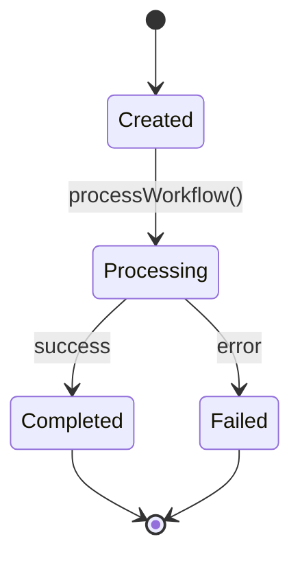
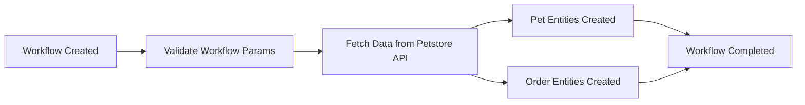
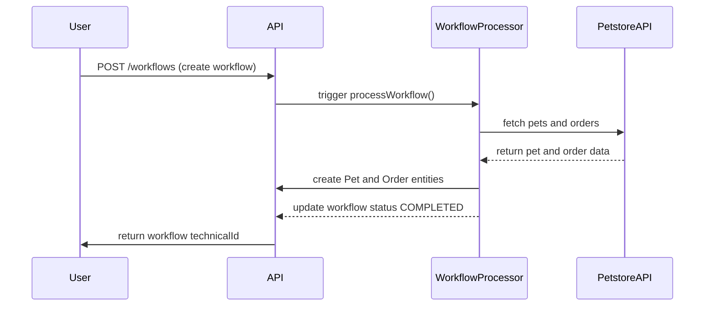

### 1. Entity Definitions

``` 
Workflow: 
- name: String (Name of the workflow instance, e.g. "Pet Data Ingestion")
- status: String (Workflow status, e.g. PENDING, PROCESSING, COMPLETED, FAILED)
- createdAt: String (Timestamp of creation)
- petStoreApiUrl: String (Base URL for Petstore API ingestion)
- parameters: String (Optional JSON string for workflow parameters)

Pet: 
- petId: Long (Pet identifier from Petstore)
- name: String (Pet name)
- category: String (Pet category, e.g. Dog, Cat)
- status: String (Pet availability status, e.g. available, pending, sold)
- photoUrls: String (Comma-separated URLs of pet photos)
- tags: String (Comma-separated pet tags)
- createdAt: String (Timestamp when pet was ingested)

Order: 
- orderId: Long (Order identifier)
- petId: Long (Associated pet identifier)
- quantity: Integer (Number of pets ordered)
- shipDate: String (Expected shipping date)
- status: String (Order status, e.g. placed, approved, delivered)
- complete: Boolean (Order completion flag)
- createdAt: String (Timestamp when order was placed)
```

---

### 2. Process Method Flows

```
processWorkflow() Flow:
1. Initial State: Workflow created with PENDING status
2. Validation: Validate workflow parameters and Petstore API connectivity
3. Processing: Trigger ingestion of pets and orders from Petstore API
4. Completion: Update workflow status to COMPLETED or FAILED based on ingestion results
5. Notification: Log completion status or trigger downstream events if needed

processPet() Flow:
1. Initial State: Pet entity created when new pet data is ingested
2. Validation: Validate pet data fields (name, category, status)
3. Processing: Save pet data immutably; enrich or tag pet if needed
4. Completion: Mark pet ingestion as successful

processOrder() Flow:
1. Initial State: Order entity created when new order data is ingested or placed
2. Validation: Validate order fields and pet availability
3. Processing: Save order immutably; check stock or order rules
4. Completion: Mark order status accordingly (placed, approved, delivered)
```

---

### 3. API Endpoints Design

| HTTP Method | Endpoint               | Description                                  | Request Body            | Response                 |
|-------------|------------------------|----------------------------------------------|-------------------------|--------------------------|
| POST        | `/workflows`           | Create a new Workflow entity (triggers processWorkflow event) | `{ "name": "", "petStoreApiUrl": "", "parameters": "" }` | `{ "technicalId": "uuid" }` |
| GET         | `/workflows/{technicalId}` | Retrieve workflow status and details         | N/A                     | Workflow JSON entity     |
| POST        | `/pets`                | Create new Pet entity (usually internal)     | `{ pet fields... }`      | `{ "technicalId": "uuid" }` |
| GET         | `/pets/{technicalId}`  | Retrieve pet by technicalId                   | N/A                     | Pet JSON entity          |
| POST        | `/orders`              | Create new Order entity                        | `{ order fields... }`    | `{ "technicalId": "uuid" }` |
| GET         | `/orders/{technicalId}`| Retrieve order by technicalId                  | N/A                     | Order JSON entity        |

- Note: No update/delete endpoints for entities; new states are created via POST if needed.

---

### 4. Request/Response Formats

**Create Workflow (POST /workflows)**

Request:
```json
{
  "name": "Pet Data Ingestion",
  "petStoreApiUrl": "https://petstore.swagger.io/v2",
  "parameters": "{}"
}
```

Response:
```json
{
  "technicalId": "uuid-1234-5678"
}
```

---

**Get Workflow (GET /workflows/{technicalId})**

Response:
```json
{
  "name": "Pet Data Ingestion",
  "status": "COMPLETED",
  "createdAt": "2024-06-01T12:00:00Z",
  "petStoreApiUrl": "https://petstore.swagger.io/v2",
  "parameters": "{}"
}
```

---

**Create Pet (POST /pets)**

Request:
```json
{
  "petId": 101,
  "name": "Fluffy",
  "category": "Cat",
  "status": "available",
  "photoUrls": "http://example.com/photo1.jpg",
  "tags": "cute,indoor",
  "createdAt": "2024-06-01T12:00:00Z"
}
```

Response:
```json
{
  "technicalId": "uuid-8765-4321"
}
```

---

**Get Pet (GET /pets/{technicalId})**

Response:
```json
{
  "petId": 101,
  "name": "Fluffy",
  "category": "Cat",
  "status": "available",
  "photoUrls": "http://example.com/photo1.jpg",
  "tags": "cute,indoor",
  "createdAt": "2024-06-01T12:00:00Z"
}
```

---

### 5. Visual Representations

**Entity Lifecycle State Diagram for Workflow**


```mermaid
stateDiagram-v2
    [*] --> Created
    Created --> Processing : processWorkflow()
    Processing --> Completed : success
    Processing --> Failed : error
    Completed --> [*]
    Failed --> [*]
```

---

**Event-Driven Processing Chain**


```mermaid
graph LR
    WorkflowCreated["Workflow Created"]
    ValidateWorkflow["Validate Workflow Params"]
    PetstoreDataFetch["Fetch Data from Petstore API"]
    PetsCreated["Pet Entities Created"]
    OrdersCreated["Order Entities Created"]
    WorkflowCompleted["Workflow Completed"]

    WorkflowCreated --> ValidateWorkflow --> PetstoreDataFetch
    PetstoreDataFetch --> PetsCreated
    PetstoreDataFetch --> OrdersCreated
    PetsCreated --> WorkflowCompleted
    OrdersCreated --> WorkflowCompleted
```

---

**User Interaction Sequence Flow**


```mermaid
sequenceDiagram
    participant User
    participant API
    participant WorkflowProcessor
    participant PetstoreAPI

    User->>API: POST /workflows (create workflow)
    API->>WorkflowProcessor: trigger processWorkflow()
    WorkflowProcessor->>PetstoreAPI: fetch pets and orders
    PetstoreAPI-->>WorkflowProcessor: return pet and order data
    WorkflowProcessor->>API: create Pet and Order entities
    WorkflowProcessor-->>API: update workflow status COMPLETED
    API->>User: return workflow technicalId
```
