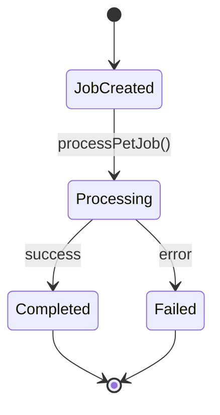
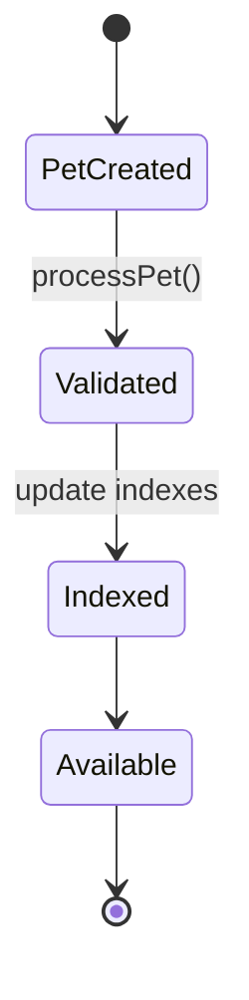
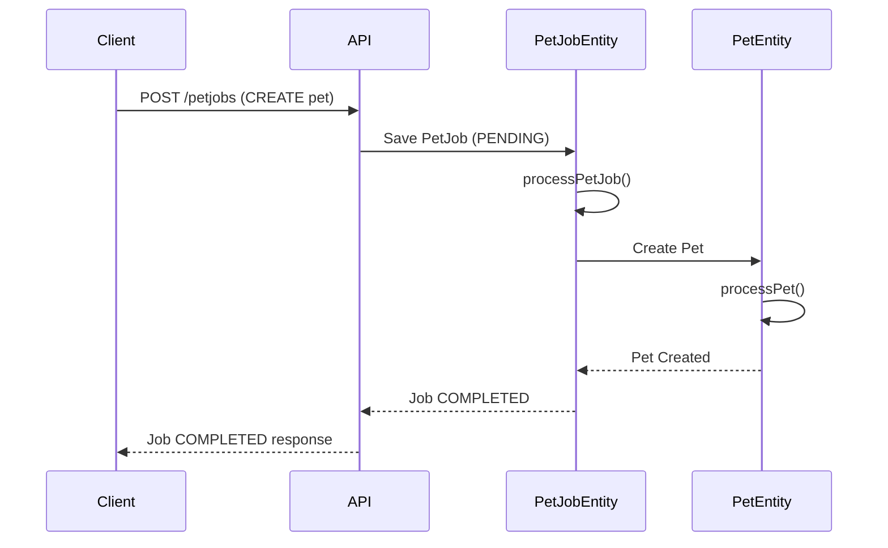

Certainly! Here is the well-formatted final version of your functional requirements for the 'Purrfect Pets' API app using Event-Driven Architecture on Cyoda platform:

---

### 1. Entity Definitions

``` 
PetJob:  # Orchestration entity managing pet data ingestion and updates
- jobId: String (unique identifier for the job)
- action: String (CREATE, UPDATE, DELETE)
- petId: Long (target pet identifier)
- status: StatusEnum (PENDING, PROCESSING, COMPLETED, FAILED)

Pet:  # Business domain entity representing pet information
- petId: Long (unique pet identifier)
- name: String (pet's name)
- category: String (type of pet, e.g., cat, dog)
- photoUrls: List<String> (links to pet photos)
- tags: List<String> (labels/tags for pets)
- status: StatusEnum (AVAILABLE, PENDING, SOLD)
```

---

### 2. Process Method Flows

```
processPetJob() Flow:
1. Initial State: PetJob created with PENDING status
2. Validation: Verify action validity and petId consistency
3. Processing: Perform create/update/delete on Pet entity based on action
4. Completion: Update PetJob status to COMPLETED or FAILED
5. Notification: Optionally trigger events or notify downstream systems
```

```
processPet() Flow:
1. Initial State: Pet entity saved/updated with new data
2. Validation: Check required fields (name, category)
3. Indexing: Update search indexes or caches (optional)
4. Completion: Confirm Pet data availability for retrieval
```

---

### 3. API Endpoints & JSON Formats

- **POST /petjobs**  
  Request (create job):  
  ```json
  {
    "action": "CREATE",
    "petId": 123
  }
  ```  
  Response:  
  ```json
  {
    "jobId": "job-001",
    "status": "PENDING"
  }
  ```

- **POST /pets**  
  Request (create/update pet):  
  ```json
  {
    "petId": 123,
    "name": "Whiskers",
    "category": "cat",
    "photoUrls": ["http://example.com/cat1.jpg"],
    "tags": ["cute", "small"],
    "status": "AVAILABLE"
  }
  ```  
  Response:  
  ```json
  {
    "petId": 123,
    "status": "AVAILABLE"
  }
  ```

- **GET /pets/{petId}**  
  Response:  
  ```json
  {
    "petId": 123,
    "name": "Whiskers",
    "category": "cat",
    "photoUrls": ["http://example.com/cat1.jpg"],
    "tags": ["cute", "small"],
    "status": "AVAILABLE"
  }
  ```

---

### 4. Mermaid Diagrams

**PetJob Lifecycle State Diagram**


```mermaid
stateDiagram-v2
    [*] --> JobCreated
    JobCreated --> Processing : processPetJob()
    Processing --> Completed : success
    Processing --> Failed : error
    Completed --> [*]
    Failed --> [*]
```

**Pet Lifecycle State Diagram**


```mermaid
stateDiagram-v2
    [*] --> PetCreated
    PetCreated --> Validated : processPet()
    Validated --> Indexed : update indexes
    Indexed --> Available
    Available --> [*]
```

**Event-Driven Processing Chain**


```mermaid
sequenceDiagram
    participant Client
    participant API
    participant PetJobEntity
    participant PetEntity

    Client->>API: POST /petjobs (CREATE pet)
    API->>PetJobEntity: Save PetJob (PENDING)
    PetJobEntity->>PetJobEntity: processPetJob()
    PetJobEntity->>PetEntity: Create Pet
    PetEntity->>PetEntity: processPet()
    PetEntity-->>PetJobEntity: Pet Created
    PetJobEntity-->>API: Job COMPLETED
    API-->>Client: Job COMPLETED response
```

---

If you need further refinement or additions, feel free to ask. Otherwise, I am ready to help you start implementation!