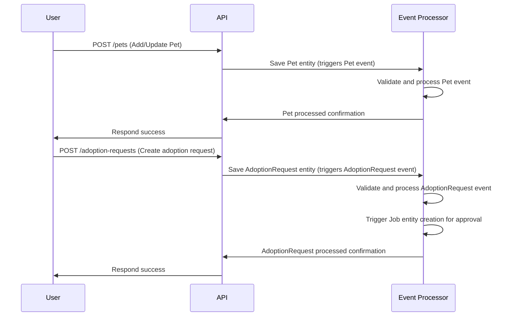
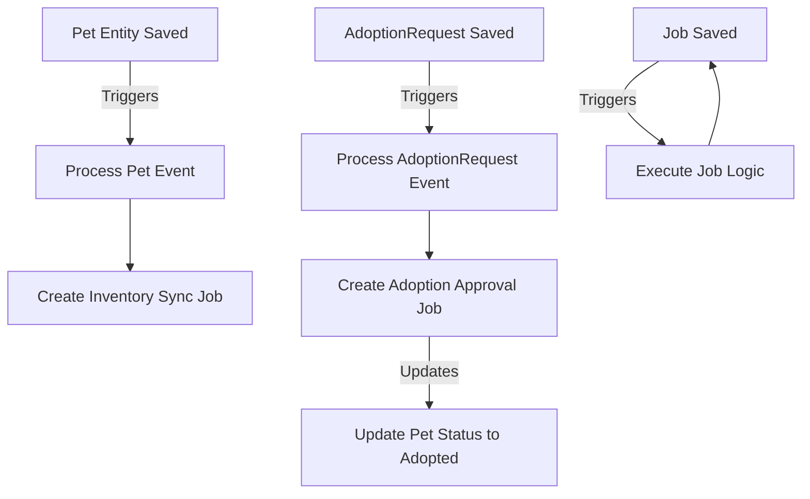

# Purrfect Pets API - Functional Requirements (Event-Driven Architecture)

## 1. Business Entities

- **Job**  
  Orchestration entity representing a background process, e.g., pet adoption processing or inventory sync.

- **Pet**  
  Business domain entity representing a pet with attributes like id, name, type, status.

- **AdoptionRequest**  
  Business domain entity capturing a user request to adopt a pet, triggering adoption workflows.

---

## 2. API Endpoints

| Method | Endpoint            | Description                              | Request Body (JSON)                                                  | Response Body (JSON)                       |
|--------|---------------------|----------------------------------------|----------------------------------------------------------------------|-------------------------------------------|
| POST   | /pets               | Add or update a pet (triggers Pet event) | `{ "id": "string", "name": "string", "type": "string", "status": "available|adopted" }` | `{ "success": true, "petId": "string" }` |
| POST   | /adoption-requests   | Create or update an adoption request (triggers AdoptionRequest event) | `{ "id": "string", "petId": "string", "userId": "string", "status": "pending|approved|rejected" }` | `{ "success": true, "requestId": "string" }` |
| POST   | /jobs               | Create or update a job (triggers Job event) | `{ "id": "string", "type": "string", "status": "pending|completed|failed" }` | `{ "success": true, "jobId": "string" }` |
| GET    | /pets               | Retrieve list of pets                   | -                                                                    | `[ { "id": "string", "name": "string", "type": "string", "status": "string" }, ... ]` |
| GET    | /adoption-requests   | Retrieve adoption requests              | -                                                                    | `[ { "id": "string", "petId": "string", "userId": "string", "status": "string" }, ... ]` |
| GET    | /jobs               | Retrieve jobs                          | -                                                                    | `[ { "id": "string", "type": "string", "status": "string" }, ... ]` |

---

## 3. Event Processing Workflows

- **Pet Save Event**  
  - Validate pet data  
  - Update pet availability status  
  - Trigger job for inventory sync or notifications

- **AdoptionRequest Save Event**  
  - Validate request and pet availability  
  - Trigger job for adoption approval workflow  
  - Update pet status to "adopted" upon approval

- **Job Save Event**  
  - Execute job logic depending on job type (e.g., adoption approval, notifications)  
  - Update job status after completion

---

## 4. Request / Response Formats

### Example: Add/Update Pet (POST /pets)

Request:
```json
{
  "id": "pet123",
  "name": "Whiskers",
  "type": "cat",
  "status": "available"
}
```

Response:
```json
{
  "success": true,
  "petId": "pet123"
}
```

### Example: Retrieve Pets (GET /pets)

Response:
```json
[
  {
    "id": "pet123",
    "name": "Whiskers",
    "type": "cat",
    "status": "available"
  },
  {
    "id": "pet456",
    "name": "Fido",
    "type": "dog",
    "status": "adopted"
  }
]
```

---

## Mermaid Diagrams

### User Interaction and Entity Creation Flow


```mermaid
sequenceDiagram
    participant User
    participant API
    participant Cyoda as Event Processor

    User->>API: POST /pets (Add/Update Pet)
    API->>Cyoda: Save Pet entity (triggers Pet event)
    Cyoda->>Cyoda: Validate and process Pet event
    Cyoda->>API: Pet processed confirmation
    API->>User: Respond success

    User->>API: POST /adoption-requests (Create adoption request)
    API->>Cyoda: Save AdoptionRequest entity (triggers AdoptionRequest event)
    Cyoda->>Cyoda: Validate and process AdoptionRequest event
    Cyoda->>Cyoda: Trigger Job entity creation for approval
    Cyoda->>API: AdoptionRequest processed confirmation
    API->>User: Respond success
```

### Event-Driven Processing Chain


```mermaid
flowchart TD
    Pet[Pet Entity Saved] -->|Triggers| PetEvent[Process Pet Event]
    PetEvent --> InventoryJob[Create Inventory Sync Job]
    AdoptionRequest[AdoptionRequest Saved] -->|Triggers| AdoptionEvent[Process AdoptionRequest Event]
    AdoptionEvent --> ApprovalJob[Create Adoption Approval Job]
    ApprovalJob -->|Updates| PetStatus[Update Pet Status to Adopted]
    JobEntity[Job Saved] -->|Triggers| ProcessJob[Execute Job Logic]
    ProcessJob --> JobEntity
```

---

If you'd like me to proceed with implementation details or any adjustments, feel free to ask!