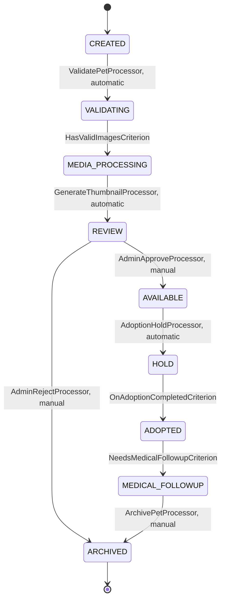
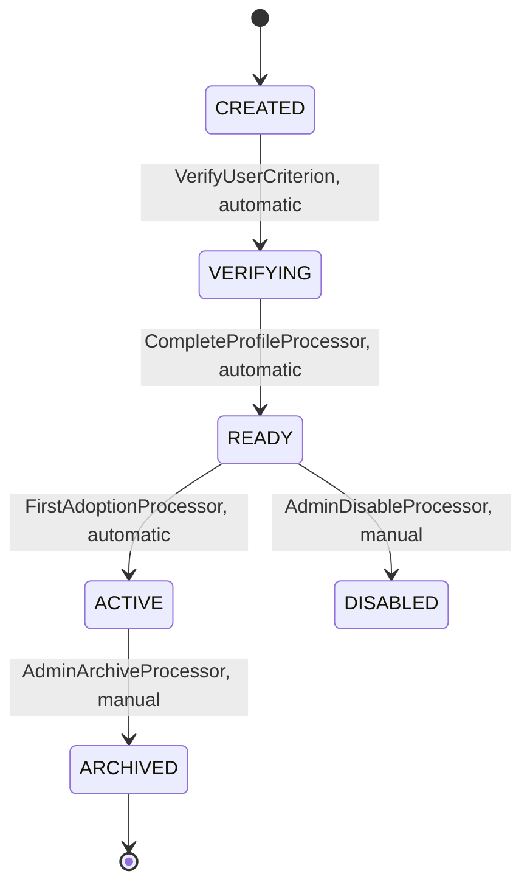
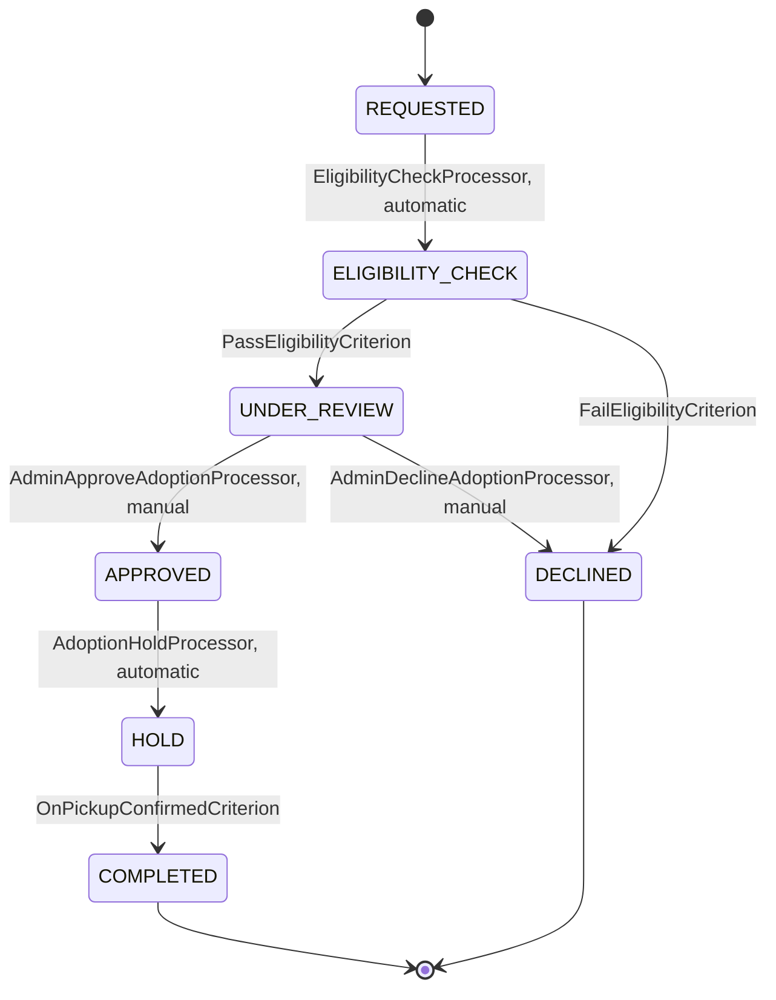

### 1. Entity Definitions

```
Pet:
- id: String (business id, human-readable)
- name: String (pet name)
- species: String (dog/cat/etc)
- breed: String (breed description)
- ageMonths: Integer (age in months)
- sex: String (M/F/Unknown)
- status: String (available/pending/adopted/archived)
- images: List<String> (image URLs)
- location: String (store or foster location)
- vaccinationSummary: String (short text)
- medicalNotes: String (freeform medical details)
- addedAt: String (ISO datetime)

User:
- id: String (business id)
- fullName: String
- email: String
- phone: String
- address: String
- preferences: List<String> (species/breed/age preferences)
- adoptionHistory: List<String> (pet ids adopted)
- createdAt: String (ISO datetime)

AdoptionOrder:
- id: String (business id)
- petId: String (ref Pet.id)
- userId: String (ref User.id)
- status: String (requested/approved/declined/completed/cancelled)
- requestedDate: String (ISO datetime)
- approvedDate: String (ISO datetime)
- completedDate: String (ISO datetime)
- notes: String (applicant notes or admin notes)
- pickupMethod: String (inStore/homeDelivery)
```

### 2. Entity workflows

Note: Each POST (entity creation) is an event. When Cyoda persists an entity, Cyoda starts the corresponding entity workflow automatically.

Pet workflow:
1. Initial State: Pet created (CREATED) - event after POST /pets.
2. Validation: Auto-check fields and images.
3. Media processing: Generate thumbnails and ensure images accessible.
4. Review: Manual admin review for listing approval.
5. Publish: Auto-publish as AVAILABLE if passes review.
6. Hold for Adoption: When an AdoptionOrder approved, Pet moves to PENDING/HOLD.
7. Adopted: On completed adoption, Pet becomes ADOPTED and may trigger medical followup.
8. Archive: Admin can archive old records.


```mermaid
stateDiagram-v2
    [*] --> CREATED
    CREATED --> VALIDATING : ValidatePetProcessor, automatic
    VALIDATING --> MEDIA_PROCESSING : HasValidImagesCriterion
    MEDIA_PROCESSING --> REVIEW : GenerateThumbnailProcessor, automatic
    REVIEW --> AVAILABLE : AdminApproveProcessor, manual
    REVIEW --> ARCHIVED : AdminRejectProcessor, manual
    AVAILABLE --> HOLD : AdoptionHoldProcessor, automatic
    HOLD --> ADOPTED : OnAdoptionCompletedCriterion
    ADOPTED --> MEDICAL_FOLLOWUP : NeedsMedicalFollowupCriterion
    MEDICAL_FOLLOWUP --> ARCHIVED : ArchivePetProcessor, manual
    ARCHIVED --> [*]
```

Pet workflow processors and criteria:
- Processors: ValidatePetProcessor, GenerateThumbnailProcessor, AdminApproveProcessor, AdoptionHoldProcessor, ArchivePetProcessor
- Criteria: HasValidImagesCriterion, OnAdoptionCompletedCriterion, NeedsMedicalFollowupCriterion

User workflow:
1. Initial State: User created (CREATED) via POST /users.
2. Verification: Auto-check email/phone format and duplicate accounts.
3. Profile Complete: If profile has required fields, mark READY.
4. Active: After first successful adoption or manual activation.
5. Disabled/Archived: Admin may disable.


```mermaid
stateDiagram-v2
    [*] --> CREATED
    CREATED --> VERIFYING : VerifyUserCriterion, automatic
    VERIFYING --> READY : CompleteProfileProcessor, automatic
    READY --> ACTIVE : FirstAdoptionProcessor, automatic
    READY --> DISABLED : AdminDisableProcessor, manual
    ACTIVE --> ARCHIVED : AdminArchiveProcessor, manual
    ARCHIVED --> [*]
```

User workflow processors and criteria:
- Processors: VerifyContactProcessor, CompleteProfileProcessor, FirstAdoptionProcessor, AdminDisableProcessor
- Criteria: VerifyUserCriterion, IsProfileCompleteCriterion

AdoptionOrder workflow (orchestration/business mix):
1. Initial State: Order created (REQUESTED) via POST /adoptions — triggers vetting.
2. Eligibility Check: Auto-check user & pet status (pet available, user verified).
3. Admin Review: Manual decision to approve or decline.
4. Approved: On approval, Pet status -> HOLD (automatic) and user notified.
5. Completion: After pickup/delivery, mark COMPLETED and Pet -> ADOPTED; update user.adoptionHistory.
6. Cancel/Decline: Order moves to CANCELLED or DECLINED and Pet -> AVAILABLE (if was held).


```mermaid
stateDiagram-v2
    [*] --> REQUESTED
    REQUESTED --> ELIGIBILITY_CHECK : EligibilityCheckProcessor, automatic
    ELIGIBILITY_CHECK --> UNDER_REVIEW : PassEligibilityCriterion
    ELIGIBILITY_CHECK --> DECLINED : FailEligibilityCriterion
    UNDER_REVIEW --> APPROVED : AdminApproveAdoptionProcessor, manual
    UNDER_REVIEW --> DECLINED : AdminDeclineAdoptionProcessor, manual
    APPROVED --> HOLD : AdoptionHoldProcessor, automatic
    HOLD --> COMPLETED : OnPickupConfirmedCriterion
    COMPLETED --> [*]
    DECLINED --> [*]
```

AdoptionOrder processors and criteria:
- Processors: EligibilityCheckProcessor, AdminApproveAdoptionProcessor, AdminDeclineAdoptionProcessor, AdoptionHoldProcessor, NotifyUserProcessor
- Criteria: PassEligibilityCriterion, FailEligibilityCriterion, OnPickupConfirmedCriterion

### 3. Pseudo code for processor classes

(3–4 concise examples; each processor runs when Cyoda invokes process method for the persisted entity.)

ValidatePetProcessor
```
class ValidatePetProcessor {
  void process(Pet pet) {
    if (pet.name empty or pet.species empty) throw ValidationError
    if (pet.images present) check image URLs reachable
    pet.addTag(validation=passed)
  }
}
```

GenerateThumbnailProcessor
```
class GenerateThumbnailProcessor {
  void process(Pet pet) {
    for url in pet.images:
      create thumbnail and store url
    pet.imagesThumbs = thumbnails
  }
}
```

EligibilityCheckProcessor
```
class EligibilityCheckProcessor {
  void process(AdoptionOrder order) {
    pet = fetchPet(order.petId)
    user = fetchUser(order.userId)
    if pet.status != "available" set order.status = "declined"
    if user.verified == false set order.status = "under_review" and notify admin
  }
}
```

AdminApproveAdoptionProcessor
```
class AdminApproveAdoptionProcessor {
  void process(AdoptionOrder order) {
    order.approvedDate = now
    order.status = "approved"
    updatePetStatus(order.petId,"pending")
    NotifyUserProcessor.process(order)
  }
}
```

NotifyUserProcessor
```
class NotifyUserProcessor {
  void process(Entity e) {
    build notification payload
    send email/sms (business action)
  }
}
```

(Other processors follow similar patterns: fetch relevant entities, mutate states, emit notifications. Criteria are small boolean checks returning true/false used by Cyoda to route transitions.)

### 4. API Endpoints Design Rules

General rules:
- POST endpoints create entity (trigger Cyoda event) and must return only technicalId.
- GET by technicalId must exist for each POST-ed entity.
- GET all lists are optional and read-only.

Endpoints and JSON shapes

POST /pets
- Request body (Pet object without technicalId)
```json
{
  "id":"pet-123",
  "name":"Mittens",
  "species":"Cat",
  "breed":"Tabby",
  "ageMonths":12,
  "sex":"F",
  "images":["https://.../1.jpg"],
  "location":"Store A",
  "vaccinationSummary":"Rabies up to date",
  "medicalNotes":"",
  "addedAt":"2025-08-22T10:00:00Z"
}
```
- Response (only technicalId)
```json
{
  "technicalId":"tech-pet-0001"
}
```

GET /pets/{technicalId}
- Response: stored pet + technicalId
```json
{
  "technicalId":"tech-pet-0001",
  "entity": { /* same fields as stored Pet */ }
}
```

POST /users
```json
{
  "id":"user-55",
  "fullName":"Alex Doe",
  "email":"alex@example.com",
  "phone":"555-0100",
  "address":"123 Main St",
  "preferences":["cat","small"],
  "createdAt":"2025-08-22T10:05:00Z"
}
```
Response:
```json
{"technicalId":"tech-user-0001"}
```

GET /users/{technicalId}
```json
{
  "technicalId":"tech-user-0001",
  "entity": { /* user fields */ }
}
```

POST /adoptions
```json
{
  "id":"order-900",
  "petId":"pet-123",
  "userId":"user-55",
  "status":"requested",
  "requestedDate":"2025-08-22T11:00:00Z",
  "notes":"Would prefer home delivery",
  "pickupMethod":"homeDelivery"
}
```
Response:
```json
{"technicalId":"tech-adopt-0001"}
```

GET /adoptions/{technicalId}
```json
{
  "technicalId":"tech-adopt-0001",
  "entity": { /* adoption order fields */ }
}
```

Optional read endpoints:
- GET /pets (list)
- GET /users (list)
- GET /adoptions (list)

Behavior note:
- On each POST Cyoda starts the entity workflow automatically (validation, processors, criteria). Admin/manual steps remain explicit transitions in workflows.
- POST responses must be only technicalId as required.

If you'd like, I can expand to include VetRecord or StoreLocation entities (up to 10) or add conditional GET endpoints (search by species/location). Which additions do you want?