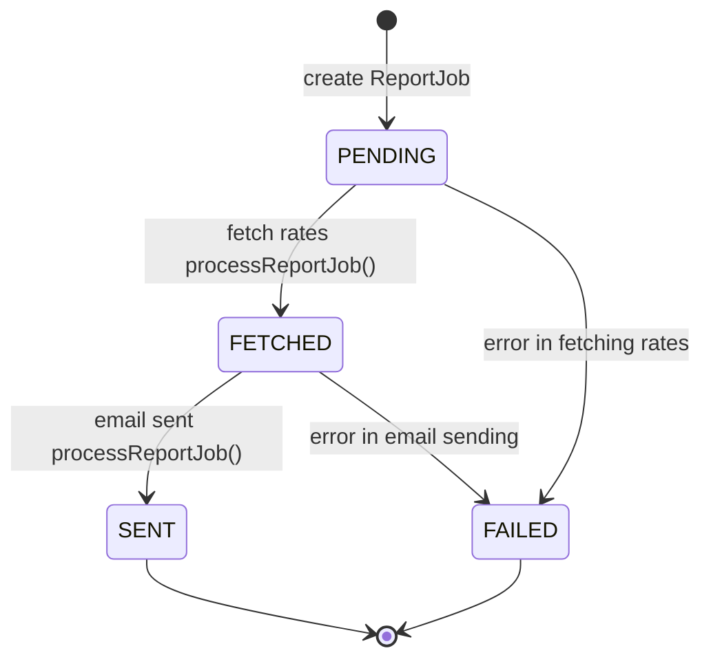
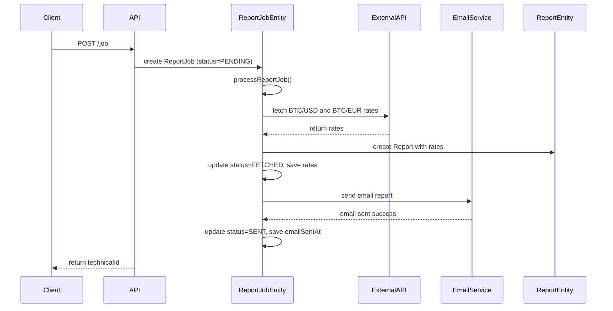
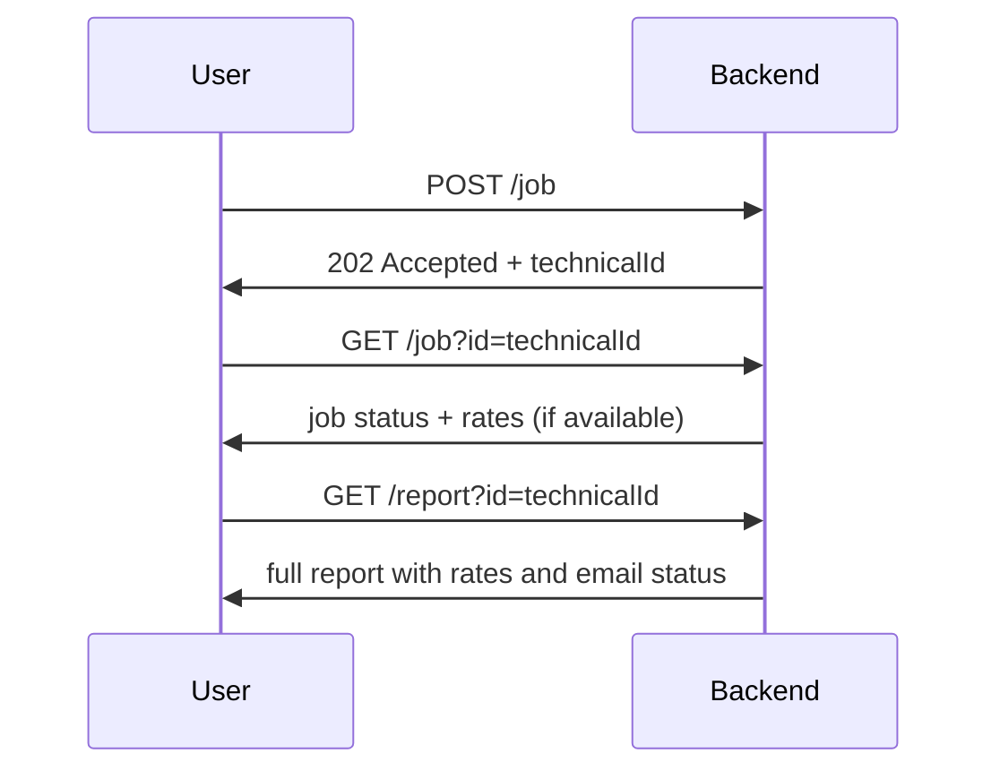

### 1. Entity Definitions
``` 
ReportJob:
- requestedAt: DateTime (timestamp when job was requested)
- status: String (job lifecycle status, e.g., PENDING, FETCHED, SENT, FAILED)
- btcUsdRate: Double (Bitcoin to USD rate, nullable until fetched)
- btcEurRate: Double (Bitcoin to EUR rate, nullable until fetched)
- emailSentAt: DateTime (timestamp when email was sent, nullable until sent)

Report:
- jobTechnicalId: String (reference to ReportJob technicalId)
- generatedAt: DateTime (timestamp when rates were fetched)
- btcUsdRate: Double (Bitcoin to USD rate)
- btcEurRate: Double (Bitcoin to EUR rate)
- emailSent: Boolean (flag indicating if email was sent successfully)
```

### 2. Process Method Flows

```
processReportJob() Flow:
1. Initial State: ReportJob created with status = PENDING and requestedAt timestamp.
2. Fetch Rates: Call external API to retrieve BTC/USD and BTC/EUR rates.
3. Save Report: Create a Report entity with fetched rates and generatedAt timestamp.
4. Update ReportJob: Set status = FETCHED, save btcUsdRate and btcEurRate in ReportJob.
5. Send Email: Send an email report containing BTC rates.
6. Update ReportJob: On success, set status = SENT and emailSentAt timestamp.
7. Error Handling: On any failure, set status = FAILED with relevant error logs.
```

### 3. API Endpoints

| Method | Path        | Description                         | Request Body | Response Body          |
|--------|-------------|-----------------------------------|--------------|-----------------------|
| POST   | `/job`      | Create new ReportJob (triggers fetching and emailing) | None         | `{ "technicalId": "string-uuid" }` |
| GET    | `/report?id={technicalId}` | Retrieve Report by jobTechnicalId | None         | `{ "jobTechnicalId": "string-uuid", "generatedAt": "ISO-8601", "btcUsdRate": number, "btcEurRate": number, "emailSent": boolean }` |
| GET    | `/job?id={technicalId}`    | Retrieve ReportJob status and details | None         | `{ "technicalId": "string-uuid", "requestedAt": "ISO-8601", "status": "string", "btcUsdRate": number|null, "btcEurRate": number|null, "emailSentAt": "ISO-8601|null" }` |

### 4. Request/Response Formats

**POST /job**  
Request: No body  
Response:
```json
{
  "technicalId": "string-uuid"
}
```

**GET /report?id={technicalId}**  
Response:
```json
{
  "jobTechnicalId": "string-uuid",
  "generatedAt": "2024-06-01T12:00:00Z",
  "btcUsdRate": 30000.5,
  "btcEurRate": 27000.3,
  "emailSent": true
}
```

**GET /job?id={technicalId}**  
Response:
```json
{
  "technicalId": "string-uuid",
  "requestedAt": "2024-06-01T11:59:00Z",
  "status": "SENT",
  "btcUsdRate": 30000.5,
  "btcEurRate": 27000.3,
  "emailSentAt": "2024-06-01T12:01:00Z"
}
```

---

### Mermaid Diagrams

**ReportJob Lifecycle State Diagram**

```mermaid
stateDiagram-v2
    [*] --> PENDING : create ReportJob
    PENDING --> FETCHED : fetch rates processReportJob()
    FETCHED --> SENT : email sent processReportJob()
    FETCHED --> FAILED : error in email sending
    PENDING --> FAILED : error in fetching rates
    SENT --> [*]
    FAILED --> [*]
```

**Event-Driven Processing Chain**

```mermaid
sequenceDiagram
    participant Client
    participant API
    participant ReportJobEntity
    participant ExternalAPI
    participant EmailService
    participant ReportEntity

    Client->>API: POST /job
    API->>ReportJobEntity: create ReportJob (status=PENDING)
    ReportJobEntity->>ReportJobEntity: processReportJob()
    ReportJobEntity->>ExternalAPI: fetch BTC/USD and BTC/EUR rates
    ExternalAPI-->>ReportJobEntity: return rates
    ReportJobEntity->>ReportEntity: create Report with rates
    ReportJobEntity->>ReportJobEntity: update status=FETCHED, save rates
    ReportJobEntity->>EmailService: send email report
    EmailService-->>ReportJobEntity: email sent success
    ReportJobEntity->>ReportJobEntity: update status=SENT, save emailSentAt
    API-->>Client: return technicalId
```

**User Interaction Sequence Flow**

```mermaid
sequenceDiagram
    participant User
    participant Backend

    User->>Backend: POST /job
    Backend->>User: 202 Accepted + technicalId
    User->>Backend: GET /job?id=technicalId
    Backend->>User: job status + rates (if available)
    User->>Backend: GET /report?id=technicalId
    Backend->>User: full report with rates and email status
```

---

Please let me know if you need any further refinements or additions!