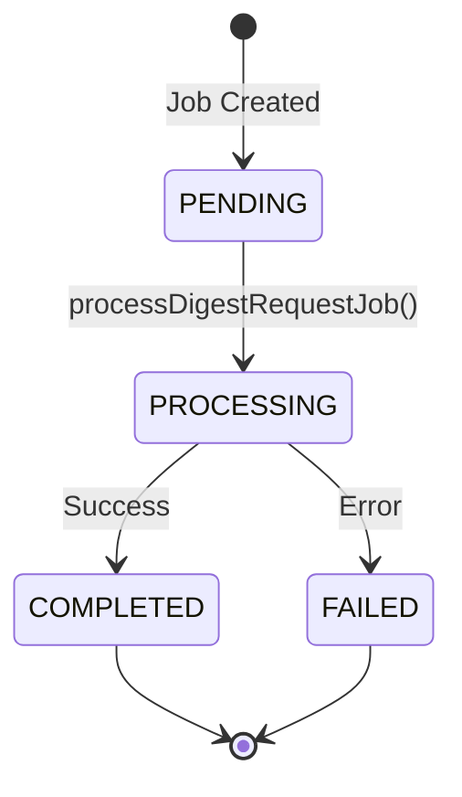
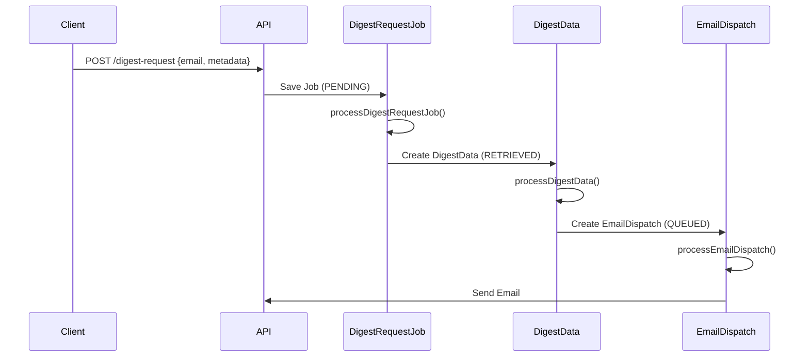
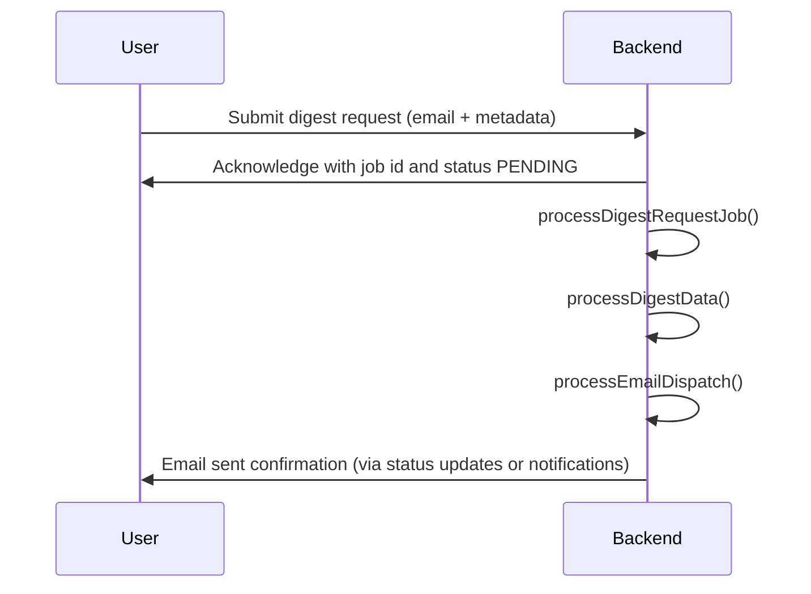

### 1. Entity Definitions

``` 
DigestRequestJob:
- id: UUID (unique identifier for the job)
- email: String (recipient email address)
- metadata: Map<String, String> (optional parameters influencing data retrieval)
- status: StatusEnum (PENDING, PROCESSING, COMPLETED, FAILED)

DigestData:
- id: UUID (unique identifier)
- jobId: UUID (reference to DigestRequestJob)
- data: String (retrieved raw or processed data from external API)
- status: StatusEnum (RETRIEVED, PROCESSED)

EmailDispatch:
- id: UUID (unique identifier)
- jobId: UUID (reference to DigestRequestJob)
- emailFormat: EmailFormatEnum (PLAIN_TEXT, HTML, ATTACHMENT)
- status: StatusEnum (QUEUED, SENT, FAILED)
```

---

### 2. Process Method Flows

```
processDigestRequestJob() Flow:
1. Initial State: DigestRequestJob created with PENDING status.
2. Registration: Log the event and update status to PROCESSING.
3. Data Retrieval: Trigger creation of DigestData entity by calling external petstore API based on metadata or defaults.
4. Completion: Update DigestRequestJob status to COMPLETED or FAILED depending on downstream results.
```

```
processDigestData() Flow:
1. Initial State: DigestData created with RETRIEVED status.
2. Processing: Format or transform the raw data into the required digest format.
3. Trigger EmailDispatch creation with formatted data.
4. Update DigestData status to PROCESSED.
```

```
processEmailDispatch() Flow:
1. Initial State: EmailDispatch created with QUEUED status.
2. Sending: Send compiled digest to the email address, using specified format.
3. Completion: Update EmailDispatch status to SENT or FAILED.
```

---

### 3. API Endpoints and Request/Response Formats

| Method | Endpoint              | Description                               | Request JSON                                                 | Response JSON                           |
|--------|-----------------------|-------------------------------------------|--------------------------------------------------------------|----------------------------------------|
| POST   | /digest-request       | Create a new digest request (triggers job) | `{ "email": "user@example.com", "metadata": {...} }`          | `{ "id": "job-uuid", "status": "PENDING" }` |
| GET    | /digest-request/{id}  | Retrieve digest job status and info       | N/A                                                          | `{ "id": "job-uuid", "email": "...", "status": "...", "metadata": {...} }` |
| GET    | /email-dispatch/{id}  | Retrieve email dispatch status             | N/A                                                          | `{ "id": "dispatch-uuid", "status": "...", "emailFormat": "HTML" }` |

---

### 4. Visual Representations

#### DigestRequestJob Lifecycle


```mermaid
stateDiagram-v2
    [*] --> PENDING : Job Created
    PENDING --> PROCESSING : processDigestRequestJob()
    PROCESSING --> COMPLETED : Success
    PROCESSING --> FAILED : Error
    COMPLETED --> [*]
    FAILED --> [*]
```

#### Event-Driven Processing Chain


```mermaid
sequenceDiagram
    participant Client
    participant API
    participant DigestRequestJob
    participant DigestData
    participant EmailDispatch

    Client->>API: POST /digest-request {email, metadata}
    API->>DigestRequestJob: Save Job (PENDING)
    DigestRequestJob->>DigestRequestJob: processDigestRequestJob()
    DigestRequestJob->>DigestData: Create DigestData (RETRIEVED)
    DigestData->>DigestData: processDigestData()
    DigestData->>EmailDispatch: Create EmailDispatch (QUEUED)
    EmailDispatch->>EmailDispatch: processEmailDispatch()
    EmailDispatch->>API: Send Email
```

#### User Interaction Sequence


```mermaid
sequenceDiagram
    participant User
    participant Backend

    User->>Backend: Submit digest request (email + metadata)
    Backend->>User: Acknowledge with job id and status PENDING
    Backend->>Backend: processDigestRequestJob()
    Backend->>Backend: processDigestData()
    Backend->>Backend: processEmailDispatch()
    Backend->>User: Email sent confirmation (via status updates or notifications)
```

---

If you need any further refinement or additional details, please let me know!