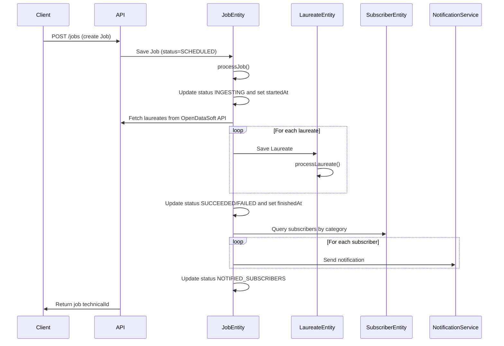
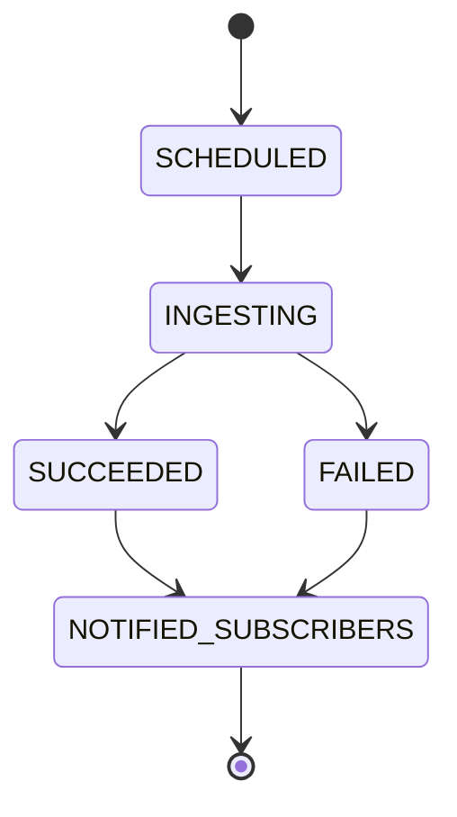

# Functional Requirements

---

## 1. Entity Definitions

```
Job:
- jobName: String (Name of the ingestion job)
- status: String (Job state: SCHEDULED, INGESTING, SUCCEEDED, FAILED, NOTIFIED_SUBSCRIBERS)
- scheduledAt: String (Timestamp when the job is scheduled)
- startedAt: String (Timestamp when ingestion started)
- finishedAt: String (Timestamp when ingestion finished)
- errorMessage: String (Error details if job failed)

Laureate:
- laureateId: Integer (ID from source data)
- firstname: String (Laureate first name)
- surname: String (Laureate surname)
- gender: String (Laureate gender)
- born: String (Birth date)
- died: String (Death date or null)
- borncountry: String (Country of birth)
- borncountrycode: String (Country code of birth)
- borncity: String (City of birth)
- year: String (Award year)
- category: String (Prize category)
- motivation: String (Reason for award)
- affiliationName: String (Affiliation institution name)
- affiliationCity: String (Affiliation city)
- affiliationCountry: String (Affiliation country)

Subscriber:
- subscriberName: String (Subscriber's name)
- contactEmail: String (Email address for notifications)
- contactWebhook: String (Webhook URL for notifications, optional)
- subscribedCategories: String (Comma-separated prize categories the subscriber wants updates for)
```

---

## 2. Process Method Flows

```
processJob() Flow:
1. Initial State: Job created with status = SCHEDULED
2. Validation: Verify jobName and scheduledAt are present
3. Processing:
   - Update Job status to INGESTING and set startedAt timestamp
   - Fetch laureates data from OpenDataSoft API
   - For each laureate record, save a new Laureate entity (triggers processLaureate())
4. Completion:
   - On successful ingestion of all laureates, update Job status to SUCCEEDED and set finishedAt timestamp
   - On failure, update Job status to FAILED with errorMessage and set finishedAt timestamp
5. Notification:
   - Query Subscribers interested in the categories of the ingested laureates
   - Create notification events to Subscribers based on subscribedCategories
   - Update Job status to NOTIFIED_SUBSCRIBERS after notifications are sent
```

```
processLaureate() Flow:
1. Validation: Check mandatory fields (laureateId, firstname, surname, year, category)
2. Enrichment: Normalize country codes, calculate additional metadata if needed (optional)
3. Storage: Persist Laureate entity immutably
4. Trigger downstream events if applicable (e.g., prepare notification)
```

```
processSubscriber() Flow:
1. Validation: Check contactEmail or contactWebhook is present
2. Subscription: Validate subscribedCategories format
3. Storage: Save subscriber entity immutably
4. Ready to receive notifications on Job completion events
```

---

## 3. API Endpoints

**Job**

- `POST /jobs`  
  - Request:  
    ```json
    {
      "jobName": "string",
      "scheduledAt": "ISO8601 timestamp"
    }
    ```
  - Response:  
    ```json
    {
      "technicalId": "string"
    }
    ```

- `GET /jobs/{technicalId}`  
  - Response:  
    ```json
    {
      "jobName": "string",
      "status": "string",
      "scheduledAt": "string",
      "startedAt": "string",
      "finishedAt": "string",
      "errorMessage": "string"
    }
    ```

**Laureate**

- No POST endpoint (created via processJob  processLaureate event)  
- `GET /laureates/{technicalId}`  
  - Response:  
    ```json
    {
      "laureateId": 123,
      "firstname": "string",
      "surname": "string",
      "gender": "string",
      "born": "string",
      "died": "string",
      "borncountry": "string",
      "borncountrycode": "string",
      "borncity": "string",
      "year": "string",
      "category": "string",
      "motivation": "string",
      "affiliationName": "string",
      "affiliationCity": "string",
      "affiliationCountry": "string"
    }
    ```

- Optional: `GET /laureates?category=Physics` (only if explicitly requested)

**Subscriber**

- `POST /subscribers`  
  - Request:  
    ```json
    {
      "subscriberName": "string",
      "contactEmail": "string",
      "contactWebhook": "string (optional)",
      "subscribedCategories": "string"
    }
    ```
  - Response:  
    ```json
    {
      "technicalId": "string"
    }
    ```

- `GET /subscribers/{technicalId}`  
  - Response:  
    ```json
    {
      "subscriberName": "string",
      "contactEmail": "string",
      "contactWebhook": "string",
      "subscribedCategories": "string"
    }
    ```

---

## 4. Mermaid Diagrams


```mermaid
sequenceDiagram
    participant Client
    participant API
    participant JobEntity
    participant LaureateEntity
    participant SubscriberEntity
    participant NotificationService

    Client->>API: POST /jobs (create Job)
    API->>JobEntity: Save Job (status=SCHEDULED)
    JobEntity->>JobEntity: processJob()
    JobEntity->>JobEntity: Update status INGESTING and set startedAt
    JobEntity->>API: Fetch laureates from OpenDataSoft API
    loop For each laureate
        JobEntity->>LaureateEntity: Save Laureate
        LaureateEntity->>LaureateEntity: processLaureate()
    end
    JobEntity->>JobEntity: Update status SUCCEEDED/FAILED and set finishedAt
    JobEntity->>SubscriberEntity: Query subscribers by category
    loop For each subscriber
        JobEntity->>NotificationService: Send notification
    end
    JobEntity->>JobEntity: Update status NOTIFIED_SUBSCRIBERS
    API->>Client: Return job technicalId
```


```mermaid
stateDiagram-v2
    [*] --> SCHEDULED
    SCHEDULED --> INGESTING
    INGESTING --> SUCCEEDED
    INGESTING --> FAILED
    SUCCEEDED --> NOTIFIED_SUBSCRIBERS
    FAILED --> NOTIFIED_SUBSCRIBERS
    NOTIFIED_SUBSCRIBERS --> [*]
```
