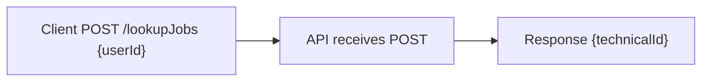

# Functional Requirements — Event-Driven Architecture (Final)

I will model this as an Event-Driven design using 3 entities (default). If you want more entities (up to 10) tell me and I will expand. Below are entities, workflows, processors/criteria and API rules (no implementation details, only Cyoda behavior).

### 1. Entity Definitions
```
LookupJob:
- userId: Integer (requested ReqRes user id)
- status: String (PENDING | VALIDATING | IN_PROGRESS | SUCCESS | NOT_FOUND | INVALID_INPUT | ERROR | COMPLETED) (workflow state)
- attempts: Integer (retry count)
- createdAt: String (ISO8601 timestamp)
- startedAt: String (ISO8601)
- completedAt: String (ISO8601)
- resultRef: String (technicalId of persisted User or ErrorEvent)

User:
- id: Integer (id returned by ReqRes)
- email: String (user email)
- first_name: String (user first name)
- last_name: String (user last name)
- avatar: String (avatar URL)
- retrievedAt: String (ISO8601 timestamp)

ErrorEvent:
- code: Integer (HTTP or app error code)
- message: String (user friendly message)
- details: String (optional debug/info)
- occurredAt: String (ISO8601)
- relatedJobId: String (LookupJob technicalId)
```

### 2. Entity workflows

LookupJob workflow:
1. Initial State: Job created with PENDING
2. Validation (automatic): Validate input format and range
3. If invalid -> mark INVALID_INPUT, persist ErrorEvent (automatic) -> COMPLETED
4. If valid -> IN_PROGRESS (automatic), call external ReqRes via FetchUserProcessor
5. Fetch result:
   - If user returned -> persist User (PersistUserProcessor), set status SUCCESS -> COMPLETED
   - If 404 -> persist ErrorEvent with code 404, set status NOT_FOUND -> COMPLETED
   - If transient error -> increment attempts, if attempts < max -> schedule retry (automatic) -> IN_PROGRESS; else persist ErrorEvent and set ERROR -> COMPLETED
6. Completion: job ends in COMPLETED state with resultRef pointing to created entity

Entity state diagrams

```mermaid
stateDiagram-v2
    [*] --> "PENDING"
    "PENDING" --> "VALIDATING" : ValidateInputCriterion, automatic
    "VALIDATING" --> "INVALID_INPUT" : if input invalid
    "VALIDATING" --> "IN_PROGRESS" : if input valid
    "IN_PROGRESS" --> "SUCCESS" : FetchUserProcessor returns 200
    "IN_PROGRESS" --> "NOT_FOUND" : FetchUserProcessor returns 404
    "IN_PROGRESS" --> "ERROR" : FetchUserProcessor returns 5xx or timeout
    "ERROR" --> "IN_PROGRESS" : RetrySchedulerProcessor, automatic
    "SUCCESS" --> "COMPLETED" : PersistUserProcessor, automatic
    "NOT_FOUND" --> "COMPLETED" : PersistErrorProcessor, automatic
    "INVALID_INPUT" --> "COMPLETED" : PersistErrorProcessor, automatic
    "COMPLETED" --> [*]
```

User workflow (created by LookupJob process):
1. Initial State: created (automatic) -> STORED
2. Optional manual review (manual) -> VERIFIED or REJECTED (not required for basic flow)

```mermaid
stateDiagram-v2
    [*] --> "STORED"
    "STORED" --> "VERIFIED" : ManualReviewProcessor, manual
    "STORED" --> "REJECTED" : ManualReviewProcessor, manual
    "VERIFIED" --> [*]
    "REJECTED" --> [*]
```

ErrorEvent workflow:
1. Created by job on error conditions -> STORED
2. Manual investigation allowed -> RESOLVED (manual)

```mermaid
stateDiagram-v2
    [*] --> "STORED"
    "STORED" --> "RESOLVED" : ManualInvestigateProcessor, manual
    "RESOLVED" --> [*]
```

Processors and Criteria needed (per LookupJob):
- Criteria:
  - ValidateInputCriterion (checks numeric and positive)
  - MaxRetryCriterion (checks attempts < maxAttempts)
- Processors:
  - FetchUserProcessor (calls ReqRes and interprets response)
  - PersistUserProcessor (persists User entity and returns technicalId)
  - PersistErrorProcessor (persists ErrorEvent and returns technicalId)
  - RetrySchedulerProcessor (schedules retry attempts and increments attempts)

### 3. Pseudo code for processor classes

FetchUserProcessor
```
input: LookupJob job
output: response object
process:
  call external GET /users/{job.userId}
  if 200 -> return {status:200, body: userJson}
  if 404 -> return {status:404}
  else -> return {status:500, details: error}
```

PersistUserProcessor
```
input: userJson, job
process:
  create User entity from userJson with retrievedAt = now
  save User -> returns technicalId userTechId
  update job.resultRef = userTechId
  update job.status = SUCCESS
  update job.completedAt = now
```

PersistErrorProcessor
```
input: code, message, details, job
process:
  create ErrorEvent with relatedJobId = job.technicalId
  save ErrorEvent -> returns technicalId errorTechId
  update job.resultRef = errorTechId
  set job.status = NOT_FOUND or ERROR or INVALID_INPUT
  set job.completedAt = now
```

RetrySchedulerProcessor
```
input: job
process:
  if attempts < MAX_ATTEMPTS:
    schedule re-run of job.process after backoff
    increment job.attempts
  else:
    call PersistErrorProcessor with timeout/error info
```

Criteria pseudo
- ValidateInputCriterion: return false if userId null or not positive integer
- MaxRetryCriterion: return true if job.attempts < MAX

### 4. API Endpoints Design Rules

Rules applied: Only LookupJob has POST (orchestration). POST returns only technicalId. GET by technicalId for LookupJob returns job state and, when completed, includes dereferenced result (User or ErrorEvent). No other POST endpoints.

1) Create LookupJob
- POST /lookupJobs
Request JSON:
{
  "userId": 2
}
Response JSON (only technicalId):
{
  "technicalId": "lkj_3a1f..."
}

Mermaid visualization of request/response:

```mermaid
flowchart LR
  A["Client POST /lookupJobs {userId}"] --> B["API receives POST"]
  B --> C["Response {technicalId}"]
```

2) Get LookupJob by technicalId
- GET /lookupJobs/{technicalId}
Response JSON (example success)
{
  "technicalId": "lkj_3a1f...",
  "userId": 2,
  "status": "COMPLETED",
  "createdAt": "2025-08-19T12:00:00Z",
  "startedAt": "2025-08-19T12:00:01Z",
  "completedAt": "2025-08-19T12:00:02Z",
  "resultRef": "usr_ab12...",
  "result": {
    "type": "User",
    "payload": {
      "id": 2,
      "email": "janet.weaver@reqres.in",
      "first_name": "Janet",
      "last_name": "Weaver",
      "avatar": "https://..."
    }
  }
}

Mermaid visualization of GET response:

```mermaid
flowchart LR
  G["Client GET /lookupJobs/{technicalId}"] --> H["API returns LookupJob JSON with result when available"]
```

Notes and business rules:
- Creating LookupJob triggers Cyoda job workflow automatically (entity persistence -> process method).
- All entity persistence events (User, ErrorEvent) are produced by processors during the LookupJob workflow.
- POST returns only technicalId as required; clients poll GET by technicalId to retrieve results.
- Retries and backoff are handled automatically by RetrySchedulerProcessor and MaxRetryCriterion.

If you'd like:
- I can expand to include optional GET endpoints for retrieving stored Users by their domain id or list all jobs.
- Or expand entities up to 10 (for auditing, metrics, notifications). Which would you prefer?