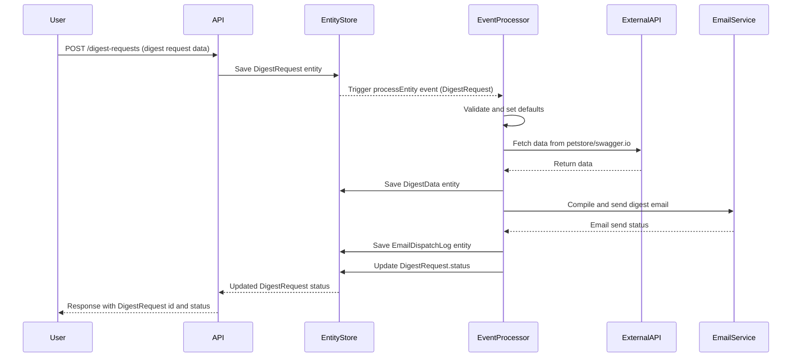

# Functional Requirements for Digest Processing System (Event-Driven Architecture)

## 1. Business Entities

- **DigestRequest**  
  Fields:  
  - `id` (UUID)  
  - `email` (String)  
  - `metadata` (Map<String, String>)  
  - `requestedEndpoint` (String, optional)  
  - `requestedParameters` (Map<String, String>, optional)  
  - `digestFormat` (Enum: PLAIN_TEXT, HTML, ATTACHMENT)  
  - `status` (Enum: RECEIVED, PROCESSING, SENT, FAILED)  
  - `createdAt` (Timestamp)  
  - `updatedAt` (Timestamp)  

- **DigestData** (optional for caching or history)  
  Fields:  
  - `id` (UUID)  
  - `digestRequestId` (UUID)  
  - `retrievedData` (JSON or String)  
  - `createdAt` (Timestamp)  

- **EmailDispatchLog**  
  Fields:  
  - `id` (UUID)  
  - `digestRequestId` (UUID)  
  - `email` (String)  
  - `dispatchStatus` (Enum: PENDING, SUCCESS, FAILED)  
  - `sentAt` (Timestamp, optional)  
  - `errorMessage` (String, optional)  

## 2. API Endpoints

### POST /digest-requests  
- Purpose: Create or update a `DigestRequest` entity (triggers event processing)  
- Request:  
```json
{
  "email": "user@example.com",
  "metadata": { "key1": "value1", "key2": "value2" },
  "requestedEndpoint": "/pet/findByStatus",
  "requestedParameters": { "status": "available" },
  "digestFormat": "HTML"
}
```  
- Response:  
```json
{
  "id": "uuid",
  "status": "RECEIVED"
}
```

### GET /digest-requests/{id}  
- Purpose: Retrieve status and info of a digest request  
- Response:  
```json
{
  "id": "uuid",
  "email": "user@example.com",
  "status": "SENT",
  "digestFormat": "HTML",
  "createdAt": "timestamp",
  "updatedAt": "timestamp"
}
```

### GET /digest-requests/{id}/digest-data  
- Purpose: Retrieve the compiled digest content (if stored)  
- Response:  
```json
{
  "retrievedData": "{...json or html content...}"
}
```

## 3. Event Processing Workflows

- **On DigestRequest entity save (creation or update):**  
  1. Log event reception.  
  2. Validate request fields and set default endpoint/parameters if missing.  
  3. Trigger external API call to petstore.swagger.io using requested or default endpoint.  
  4. Store retrieved data in `DigestData` entity.  
  5. Compile data into requested digest format.  
  6. Send email to the specified email address.  
  7. Create `EmailDispatchLog` with status and timestamps.  
  8. Update `DigestRequest.status` accordingly (PROCESSING → SENT/FAILED).  

## 4. Request/Response Formats

- JSON format for all POST and GET endpoints as shown above.  
- Digest data can be stored as JSON, HTML string, or base64-encoded attachment depending on format.

---

## Mermaid Diagram: User-App Interaction and Event-Driven Workflow


```mermaid
sequenceDiagram
    participant User
    participant API
    participant EntityStore
    participant EventProcessor
    participant ExternalAPI
    participant EmailService

    User->>API: POST /digest-requests (digest request data)
    API->>EntityStore: Save DigestRequest entity
    EntityStore-->>EventProcessor: Trigger processEntity event (DigestRequest)
    EventProcessor->>EventProcessor: Validate and set defaults
    EventProcessor->>ExternalAPI: Fetch data from petstore/swagger.io
    ExternalAPI-->>EventProcessor: Return data
    EventProcessor->>EntityStore: Save DigestData entity
    EventProcessor->>EmailService: Compile and send digest email
    EmailService-->>EventProcessor: Email send status
    EventProcessor->>EntityStore: Save EmailDispatchLog entity
    EventProcessor->>EntityStore: Update DigestRequest.status
    EntityStore-->>API: Updated DigestRequest status
    API-->>User: Response with DigestRequest id and status
```