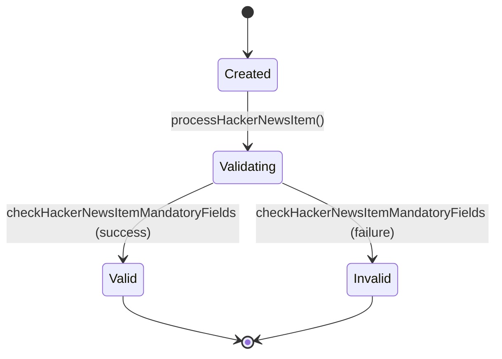
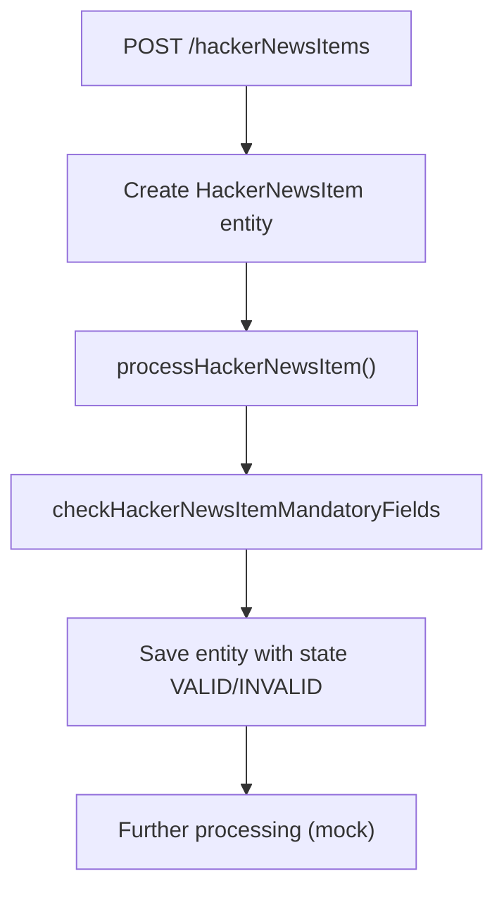
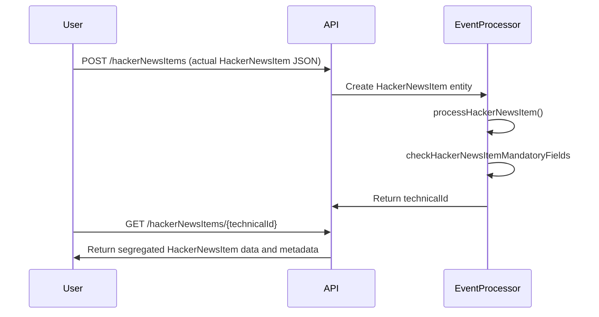

### 1. Entity Definitions

``` 
HackerNewsItem:
- rawJson: String (the full raw JSON of the Hacker News item as received)
- id: String (the unique Hacker News item identifier extracted from the entity)
- type: String (the type of the Hacker News item extracted from the entity)
- state: String (validation state, e.g., VALID or INVALID)
- createdAt: String (timestamp of entity creation)
```

### 2. Process Method Flows

```
processHackerNewsItem() Flow:
1. Initial State: HackerNewsItem entity created with rawJson, id, type, and initial state UNKNOWN
2. Validation: Invoke checkHackerNewsItemMandatoryFields
   - If mandatory fields missing → set state to INVALID
   - Else → set state to VALID
3. Persistence: Save entity with current state (immutable, new entity per save)
4. Further Processing: (left blank as a mock for now)
```

### 3. API Endpoints Design

- **POST /hackerNewsItems**
  - Input: Actual HackerNewsItem JSON as request body (no wrapping field)
  - Action: Creates new `HackerNewsItem` entity with rawJson constructed from the received JSON, triggering `processHackerNewsItem()`
  - Response: `{ "technicalId": "<generated-uuid>" }`

- **GET /hackerNewsItems/{technicalId}**
  - Action: Retrieves the stored HackerNewsItem entity by `technicalId`
  - Response: Segregates Hacker News item data from metadata, including an overall `state` field

### 4. Request/Response Formats

**POST /hackerNewsItems Request:**

```json
{
  "id": "8863",
  "type": "story",
  "by": "dhouston",
  "time": 1175714200,
  "text": "My YC app: Dropbox - Throw away your USB drive",
  "url": "http://www.getdropbox.com/u/2/screencast.html"
}
```

**POST /hackerNewsItems Response:**

```json
{
  "technicalId": "123e4567-e89b-12d3-a456-426614174000"
}
```

**GET /hackerNewsItems/{technicalId} Response:**

```json
{
  "item": {
    "id": "8863",
    "type": "story",
    "state": "VALID",
    "createdAt": "2024-06-01T12:00:00Z",
    "rawJson": "{\"id\": 8863, \"type\": \"story\", \"by\": \"dhouston\", ...}"
  },
  "technicalId": "123e4567-e89b-12d3-a456-426614174000",
  "state": "VALID"
}
```

---

### 5. Visual Representations

#### Entity Lifecycle State Diagram


```mermaid
stateDiagram-v2
    [*] --> Created
    Created --> Validating : processHackerNewsItem()
    Validating --> Valid : checkHackerNewsItemMandatoryFields (success)
    Validating --> Invalid : checkHackerNewsItemMandatoryFields (failure)
    Valid --> [*]
    Invalid --> [*]
```

#### Event-Driven Processing Chain


```mermaid
graph TD
    POST_HackerNewsItem["POST /hackerNewsItems"]
    Create_Entity["Create HackerNewsItem entity"]
    Process_Event["processHackerNewsItem()"]
    Validation_Check["checkHackerNewsItemMandatoryFields"]
    Save_Entity["Save entity with state VALID/INVALID"]
    Further_Processing["Further processing (mock)"]

    POST_HackerNewsItem --> Create_Entity --> Process_Event
    Process_Event --> Validation_Check
    Validation_Check --> Save_Entity --> Further_Processing
```

#### User Interaction Sequence Flow


```mermaid
sequenceDiagram
    participant User
    participant API
    participant EventProcessor

    User->>API: POST /hackerNewsItems (actual HackerNewsItem JSON)
    API->>EventProcessor: Create HackerNewsItem entity
    EventProcessor->>EventProcessor: processHackerNewsItem()
    EventProcessor->>EventProcessor: checkHackerNewsItemMandatoryFields
    EventProcessor->>API: Return technicalId
    User->>API: GET /hackerNewsItems/{technicalId}
    API->>User: Return segregated HackerNewsItem data and metadata
```

---

If you have no further questions or adjustments, I will now finish the discussion.