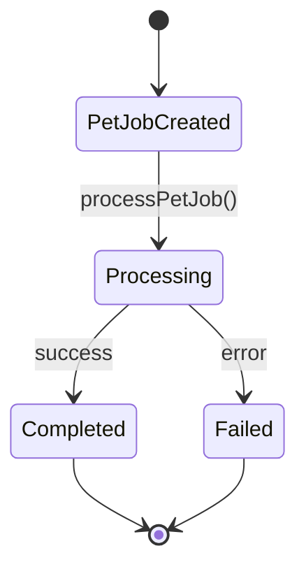
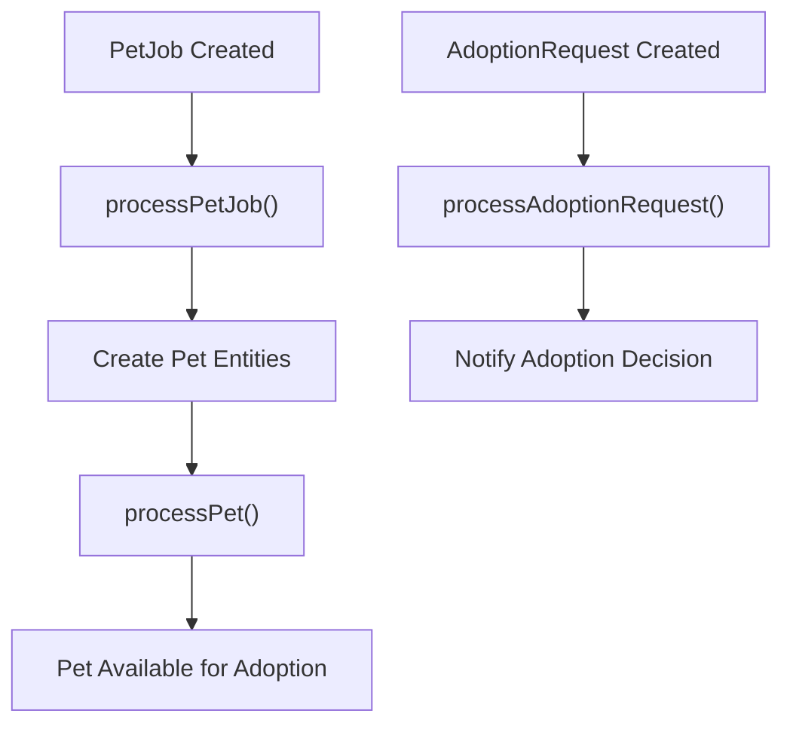
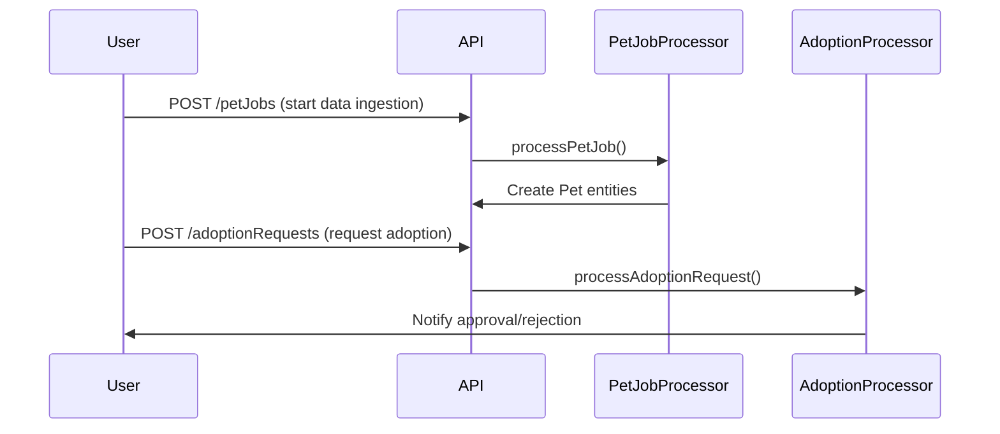

Certainly! Here is the well-formatted final version of the functional requirements for your "Purrfect Pets" API app using Event-Driven Architecture:

---

### 1. Entity Definitions

``` 
PetJob: 
- jobId: UUID (unique identifier for the pet data ingestion job)
- createdAt: DateTime (job creation timestamp)
- sourceUrl: String (external Petstore API endpoint)
- status: StatusEnum (PENDING, PROCESSING, COMPLETED, FAILED)

Pet:
- petId: UUID (unique identifier for a pet)
- name: String (pet's name)
- species: String (type of pet, e.g., cat, dog)
- breed: String (pet breed)
- age: Integer (pet age in years)
- status: StatusEnum (NEW, AVAILABLE, ADOPTED)

AdoptionRequest:
- requestId: UUID (unique identifier for adoption request)
- petId: UUID (linked pet to be adopted)
- requesterName: String (person requesting adoption)
- requestDate: DateTime (when request was made)
- status: StatusEnum (PENDING, APPROVED, REJECTED)
```

---

### 2. Process Method Flows

``` 
processPetJob() Flow:
1. Initial State: PetJob created with PENDING status
2. Validation: Verify sourceUrl and job parameters
3. Processing: Fetch pet data from Petstore API, create immutable Pet entities for each pet
4. Completion: Update PetJob status to COMPLETED or FAILED depending on success
5. Notification: Log job result and optionally notify systems/users

processPet() Flow:
1. Initial State: Pet created with NEW or AVAILABLE status
2. Validation: Basic data validation (e.g., mandatory fields)
3. Processing: Could trigger events like notifying availability or indexing for search
4. Completion: Status remains or updates as per business logic (immutability favored by creating new states)

processAdoptionRequest() Flow:
1. Initial State: AdoptionRequest created with PENDING status
2. Validation: Verify pet availability and request data
3. Processing: Evaluate request, possibly trigger approval workflow
4. Completion: Update status to APPROVED or REJECTED (new entity creation preferred over update)
5. Notification: Inform requester of decision
```

---

### 3. API Endpoints and JSON Formats

**POST /petJobs**  
_Request:_  
```json
{
  "sourceUrl": "https://petstore.example/api/pets"
}
```

_Response:_  
```json
{
  "jobId": "uuid",
  "status": "PENDING",
  "createdAt": "2024-06-01T10:00:00Z"
}
```

---

**POST /pets**  
_Request:_  
```json
{
  "name": "Whiskers",
  "species": "Cat",
  "breed": "Siamese",
  "age": 2
}
```

_Response:_  
```json
{
  "petId": "uuid",
  "status": "NEW"
}
```

---

**POST /adoptionRequests**  
_Request:_  
```json
{
  "petId": "uuid",
  "requesterName": "Alice"
}
```

_Response:_  
```json
{
  "requestId": "uuid",
  "status": "PENDING",
  "requestDate": "2024-06-01T11:00:00Z"
}
```

---

**GET endpoints** (examples):

- GET /pets — list all pets  
- GET /adoptionRequests/{requestId} — retrieve adoption request details  
- GET /petJobs/{jobId} — retrieve job status and results  

---

### 4. Visual Representations

**PetJob Lifecycle State Diagram**


```mermaid
stateDiagram-v2
    [*] --> PetJobCreated
    PetJobCreated --> Processing : processPetJob()
    Processing --> Completed : success
    Processing --> Failed : error
    Completed --> [*]
    Failed --> [*]
```

---

**Event-Driven Processing Chain**


```mermaid
flowchart TD
    PetJobCreated["PetJob Created"] --> processPetJob["processPetJob()"]
    processPetJob --> CreatePets["Create Pet Entities"]
    CreatePets --> processPet["processPet()"]
    processPet --> PetAvailable["Pet Available for Adoption"]
    AdoptionRequestCreated["AdoptionRequest Created"] --> processAdoptionRequest["processAdoptionRequest()"]
    processAdoptionRequest --> NotifyRequester["Notify Adoption Decision"]
```

---

**User Interaction Sequence Flow**


```mermaid
sequenceDiagram
    participant User
    participant API
    participant PetJobProcessor
    participant AdoptionProcessor

    User->>API: POST /petJobs (start data ingestion)
    API->>PetJobProcessor: processPetJob()
    PetJobProcessor->>API: Create Pet entities
    User->>API: POST /adoptionRequests (request adoption)
    API->>AdoptionProcessor: processAdoptionRequest()
    AdoptionProcessor->>User: Notify approval/rejection
```

---

If you need any further adjustments or additions, just let me know!