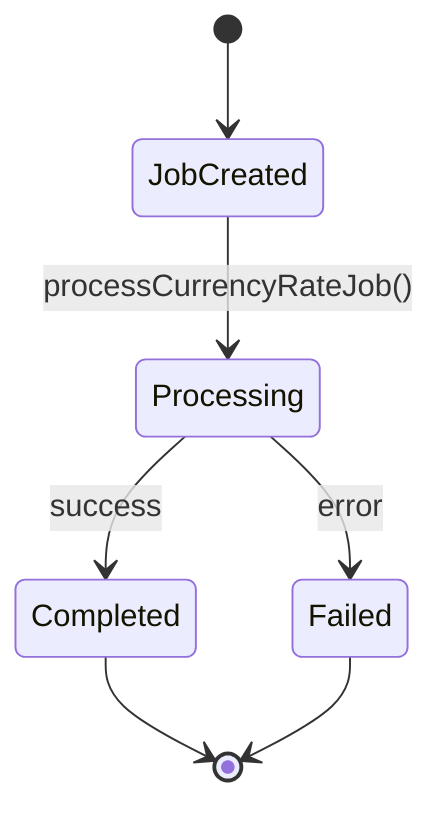
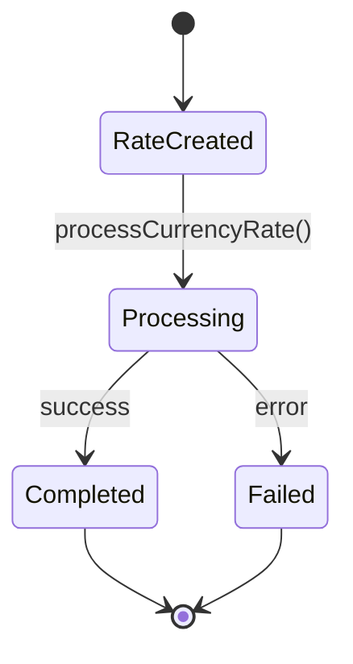
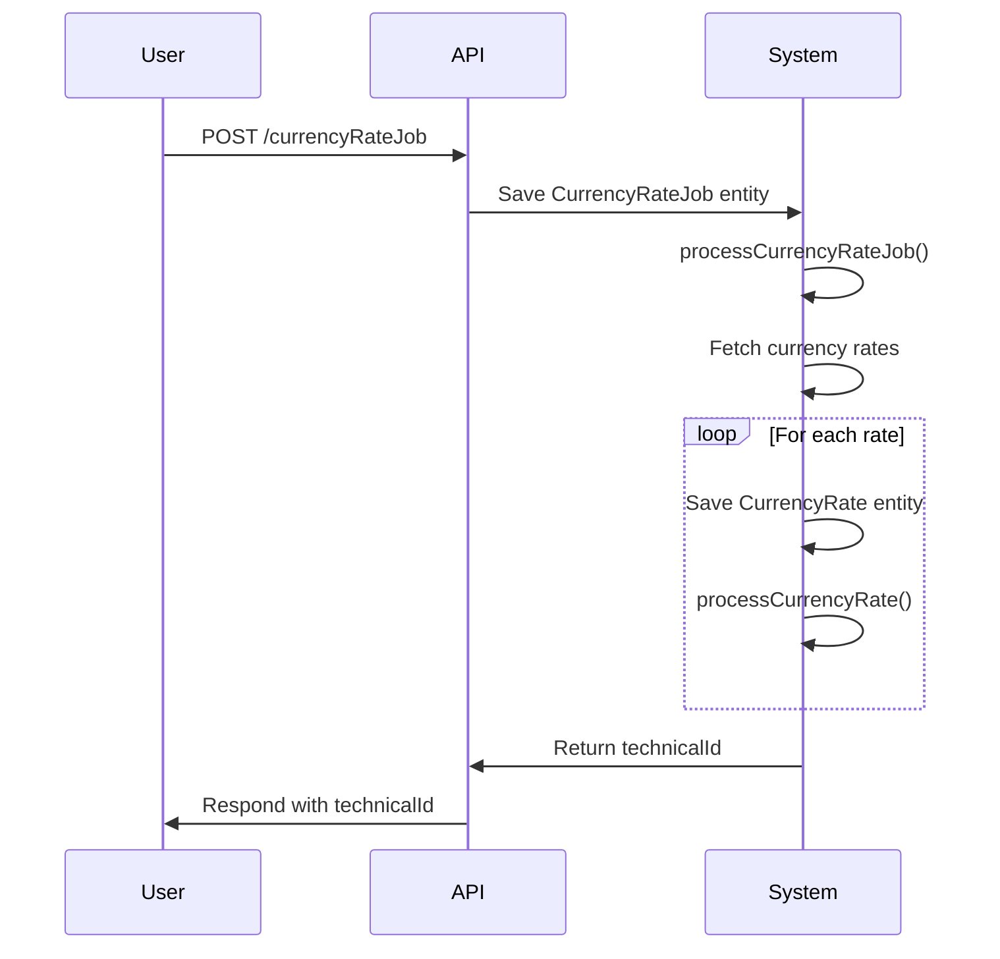

### 1. Entity Definitions

``` 
CurrencyRateJob:
- source: String (data provider or API source for currency rates)
- requestedAt: String (ISO timestamp when job was created)
- status: String (job status: PENDING, PROCESSING, COMPLETED, FAILED)
- details: String (optional additional info or error messages)

CurrencyRate:
- currencyFrom: String (currency code, e.g. USD)
- currencyTo: String (currency code, e.g. EUR)
- rate: Float (exchange rate value)
- timestamp: String (ISO timestamp when rate was valid)
- jobId: String (reference to CurrencyRateJob that triggered this rate creation)
```

---

### 2. Process Method Flows

```
processCurrencyRateJob() Flow:
1. Initial State: CurrencyRateJob created with status = PENDING
2. Validation: Check source and requestedAt for correctness
3. Processing: Fetch latest currency rates from the specified source
4. For each fetched rate:
   - Create new immutable CurrencyRate entity (triggers processCurrencyRate event)
5. Update CurrencyRateJob status to COMPLETED or FAILED based on fetch result
6. Notification: Optionally send job completion notification or logs

processCurrencyRate() Flow:
1. Initial State: CurrencyRate created
2. Validation: Check rate value is positive and currency codes are valid strings
3. Processing: Store the currency rate data for retrieval
4. Completion: Mark processing as done (internal state or logs)
```

---

### 3. API Endpoints Design

- **POST /currencyRateJob**  
  - Creates a new CurrencyRateJob entity  
  - Triggers `processCurrencyRateJob()` event  
  - Response: `{ "technicalId": "<generated_id>" }`

- **GET /currencyRateJob/{technicalId}**  
  - Retrieves CurrencyRateJob by technicalId

- **GET /currencyRate/{technicalId}**  
  - Retrieves CurrencyRate by technicalId

- Optional (if explicitly requested):  
  - **GET /currencyRate?currencyFrom=USD&currencyTo=EUR**  
    - Retrieves currency rates filtered by currencyFrom and currencyTo

---

### 4. Request/Response Formats

**POST /currencyRateJob** Request Example:

```json
{
  "source": "OpenExchangeAPI",
  "requestedAt": "2024-06-01T10:00:00Z",
  "details": "Daily update"
}
```

Response:

```json
{
  "technicalId": "job-123456"
}
```

**GET /currencyRateJob/{technicalId}** Response Example:

```json
{
  "source": "OpenExchangeAPI",
  "requestedAt": "2024-06-01T10:00:00Z",
  "status": "COMPLETED",
  "details": ""
}
```

**GET /currencyRate/{technicalId}** Response Example:

```json
{
  "currencyFrom": "USD",
  "currencyTo": "EUR",
  "rate": 0.92,
  "timestamp": "2024-06-01T09:59:00Z",
  "jobId": "job-123456"
}
```

---

### Mermaid Diagrams

**Entity Lifecycle State Diagram for CurrencyRateJob**


```mermaid
stateDiagram-v2
    [*] --> JobCreated
    JobCreated --> Processing : processCurrencyRateJob()
    Processing --> Completed : success
    Processing --> Failed : error
    Completed --> [*]
    Failed --> [*]
```

**Entity Lifecycle State Diagram for CurrencyRate**


```mermaid
stateDiagram-v2
    [*] --> RateCreated
    RateCreated --> Processing : processCurrencyRate()
    Processing --> Completed : success
    Processing --> Failed : error
    Completed --> [*]
    Failed --> [*]
```

**Event-Driven Processing Chain**

```mermaid
graph TD
    A[POST /currencyRateJob] --> B[Create CurrencyRateJob entity]
    B --> C[processCurrencyRateJob()]
    C --> D[Fetch currency rates]
    D --> E{For each rate}
    E --> F[Create CurrencyRate entity]
    F --> G[processCurrencyRate()]
    G --> H[Store rate]
    C --> I[Update job status]
```

**User Interaction Sequence Flow**


```mermaid
sequenceDiagram
    participant User
    participant API
    participant System

    User->>API: POST /currencyRateJob
    API->>System: Save CurrencyRateJob entity
    System->>System: processCurrencyRateJob()
    System->>System: Fetch currency rates
    loop For each rate
        System->>System: Save CurrencyRate entity
        System->>System: processCurrencyRate()
    end
    System->>API: Return technicalId
    API->>User: Respond with technicalId
```

---

This defines the functional requirements for your currency rate reporter application on Cyoda with Event-Driven Architecture principles. If you need any extensions or adjustments, please let me know!