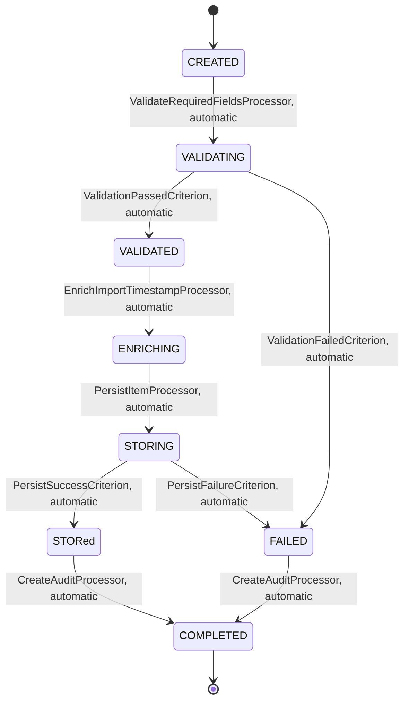
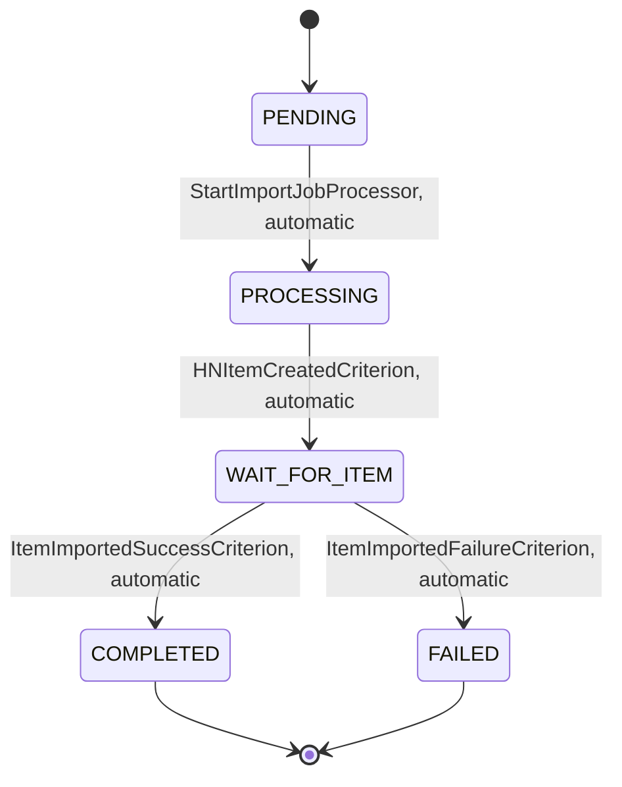
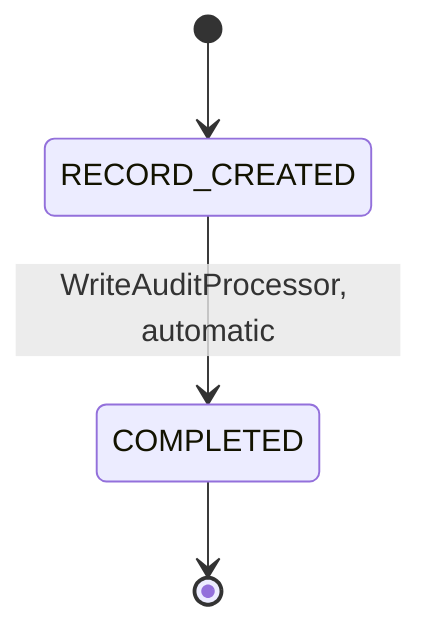

### 1. Entity Definitions
```
HNItem:
- id: Number (Hacker News item id present in original JSON, required)
- type: String (Hacker News item type present in original JSON, required)
- originalJson: Object (the exact JSON payload received from client)
- importTimestamp: String (ISO 8601 UTC when the item was enriched and stored)
- status: String (processing state: CREATED, VALIDATED, STORED, FAILED)
```

```
ImportJob:
- jobId: String (human/job identifier submitted in request payload)
- itemJson: Object (the HN JSON to import; POSTing an ImportJob triggers processing)
- createdAt: String (ISO 8601 UTC when job was created)
- status: String (PENDING, PROCESSING, COMPLETED, FAILED)
- processedItemId: Number (hn id if import succeeded, optional)
```

```
ImportAudit:
- auditId: String (unique audit entry id)
- hnId: Number (the Hacker News id related to this audit)
- jobId: String (ImportJob that triggered this audit)
- outcome: String (SUCCESS or FAILURE)
- details: Object (validation errors or extra metadata)
- timestamp: String (ISO 8601 UTC)
```

Note: 3 entities used as default.

---

### 2. Entity workflows

HNItem workflow:
1. Initial State: CREATED when entity persisted (this persistence is an event that Cyoda picks up)
2. Validation: automatic validation of presence of id and type
3. Enrichment: add importTimestamp
4. Persist original JSON atomically and set status STORED
5. Completion: emit ImportCompleted event and create ImportAudit; or FAILED on validation/persistence error

Mermaid state diagram for HNItem:

```mermaid
stateDiagram-v2
    [*] --> CREATED
    CREATED --> VALIDATING : ValidateRequiredFieldsProcessor, automatic
    VALIDATING --> VALIDATED : ValidationPassedCriterion, automatic
    VALIDATING --> FAILED : ValidationFailedCriterion, automatic
    VALIDATED --> ENRICHING : EnrichImportTimestampProcessor, automatic
    ENRICHING --> STORING : PersistItemProcessor, automatic
    STORING --> STORed : PersistSuccessCriterion, automatic
    STORING --> FAILED : PersistFailureCriterion, automatic
    STORed --> COMPLETED : CreateAuditProcessor, automatic
    FAILED --> COMPLETED : CreateAuditProcessor, automatic
    COMPLETED --> [*]
```

Processors and criteria needed for HNItem:
- Processors:
  - ValidateRequiredFieldsProcessor (checks id and type)
  - EnrichImportTimestampProcessor (adds importTimestamp)
  - PersistItemProcessor (persists originalJson and status)
  - CreateAuditProcessor (writes ImportAudit entry and emits completion event)
- Criteria:
  - ValidationPassedCriterion
  - ValidationFailedCriterion
  - PersistSuccessCriterion
  - PersistFailureCriterion

ImportJob workflow:
1. Initial State: PENDING when POST /import-jobs creates the job (returns technicalId)
2. Processing: system reads itemJson and creates HNItem entity (persist event triggers HNItem workflow)
3. Wait for item processing: monitor HNItem completion
4. Completion: update job status COMPLETED or FAILED and attach processedItemId

Mermaid state diagram for ImportJob:

```mermaid
stateDiagram-v2
    [*] --> PENDING
    PENDING --> PROCESSING : StartImportJobProcessor, automatic
    PROCESSING --> WAIT_FOR_ITEM : HNItemCreatedCriterion, automatic
    WAIT_FOR_ITEM --> COMPLETED : ItemImportedSuccessCriterion, automatic
    WAIT_FOR_ITEM --> FAILED : ItemImportedFailureCriterion, automatic
    COMPLETED --> [*]
    FAILED --> [*]
```

Processors and criteria for ImportJob:
- Processors:
  - StartImportJobProcessor (creates HNItem from job.itemJson)
  - MonitorItemProcessor (queries HNItem status and updates job)
  - FinalizeJobProcessor (marks job COMPLETED/FAILED and records processedItemId)
- Criteria:
  - HNItemCreatedCriterion
  - ItemImportedSuccessCriterion
  - ItemImportedFailureCriterion

ImportAudit workflow:
1. Initial State: RECORD_CREATED when processor records audit
2. Final State: COMPLETED (audits are append-only)

Mermaid state diagram for ImportAudit:

```mermaid
stateDiagram-v2
    [*] --> RECORD_CREATED
    RECORD_CREATED --> COMPLETED : WriteAuditProcessor, automatic
    COMPLETED --> [*]
```

Processors for ImportAudit:
- WriteAuditProcessor

---

### 3. Pseudo code for processor classes (illustrative, not implementation details)

ValidateRequiredFieldsProcessor
```
class ValidateRequiredFieldsProcessor {
  process(entity) {
    if entity.originalJson missing id or type:
      entity.status = FAILED
      entity.validationErrors = list of missing fields
      emit ValidationFailed
    else:
      emit ValidationPassed
  }
}
```

EnrichImportTimestampProcessor
```
class EnrichImportTimestampProcessor {
  process(entity) {
    entity.importTimestamp = nowUtcIso()
    emit Enriched
  }
}
```

PersistItemProcessor
```
class PersistItemProcessor {
  process(entity) {
    // persist originalJson and importTimestamp atomically
    saveToStore(entity.id, entity.originalJson, entity.importTimestamp)
    entity.status = STORED
    emit PersistSuccess
  }
}
```

StartImportJobProcessor
```
class StartImportJobProcessor {
  process(job) {
    // create HNItem entity using job.itemJson -> persistence triggers HNItem workflow
    persistHNItem(job.itemJson)
    job.status = PROCESSING
    emit HNItemCreated
  }
}
```

MonitorItemProcessor / FinalizeJobProcessor
```
class MonitorItemProcessor {
  process(job) {
    item = findHNItemById(job.itemJson.id)
    if item.status == STORED:
      job.processedItemId = item.id
      job.status = COMPLETED
    else if item.status == FAILED:
      job.status = FAILED
  }
}
```

CreateAuditProcessor
```
class CreateAuditProcessor {
  process(entity, jobContext) {
    createAuditEntry(hnId=entity.id, jobId=jobContext.jobId, outcome=entity.status, details=entity.validationErrors)
  }
}
```

---

### 4. API Endpoints Design Rules

POST endpoints:
- POST /import-jobs
  - Purpose: create ImportJob (triggers import of provided itemJson). Returns only technicalId (a platform-generated id).
  - Request:
```json
{
  "jobId": "optional-client-id",
  "itemJson": { /* Hacker News JSON per Firebase HN shape */ }
}
```
  - Response (must contain only technicalId):
```json
{ "technicalId": "importJob-abc123" }
```

GET endpoints:
- GET /import-jobs/{technicalId}
  - Purpose: retrieve ImportJob result/status (by technicalId)
  - Response:
```json
{
  "technicalId": "importJob-abc123",
  "jobId": "optional-client-id",
  "createdAt": "2025-08-26T12:00:00Z",
  "status": "COMPLETED",
  "processedItemId": 12345
}
```

- GET /items/{id}
  - Purpose: retrieve stored HN item by HN id (returns original JSON exactly as stored)
  - Response when found:
```json
{
  "id": 12345,
  "type": "story",
  "by": "alice",
  "time": 1590000000,
  "...": "...",
  "importTimestamp": "2025-08-26T12:00:00Z"
}
```
  - Response when not found:
```json
{ "error": "notFound" }
```

Notes on behavior (functional rules):
- Creating an ImportJob (POST) triggers event-driven processing: it causes a HNItem persistence event which runs its workflow (validation, enrichment, persist, audit).
- POST /import-jobs returns only technicalId per rules.
- HNItem originalJson is stored and returned exactly (importTimestamp may be included alongside original fields).
- Duplicate HN id policy: choose whether overwrite or reject. Default behavior assumed: incoming import of existing id will overwrite existing stored originalJson and update importTimestamp; if you prefer reject, indicate and workflows will adjust to set FAILED and create audit with duplicate detail.
- All processors and criteria will be executed by Cyoda after entity persistence events.

If you'd like, confirm:
1) Duplicate id policy: overwrite (default) or reject?
2) Timestamp format: current spec uses ISO 8601 UTC.
3) Want bulk import (batch of itemJsons) via a single ImportJob?