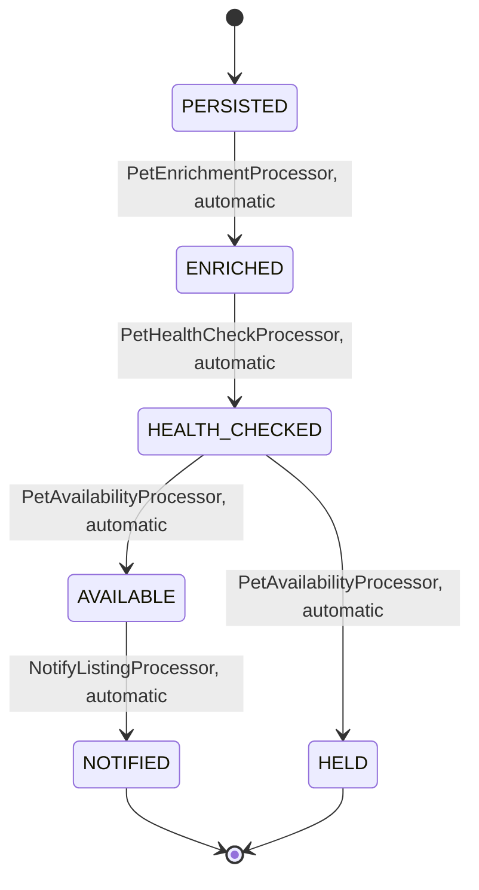
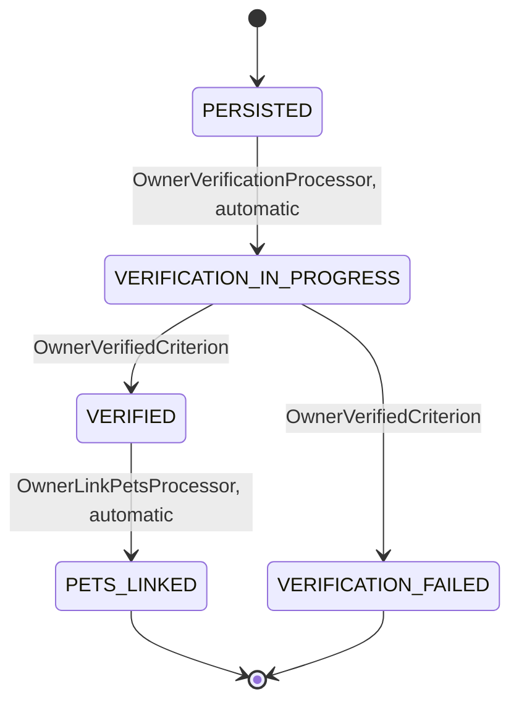
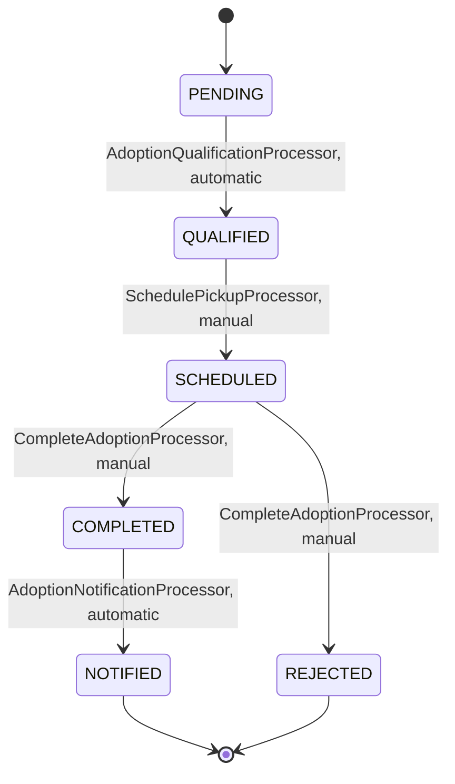

### 1. Entity Definitions
```
Pet:
- petId: String (source Petstore ID or SKU)
- name: String (pet name)
- species: String (cat, dog, etc.)
- breed: String (breed description)
- ageMonths: Integer (age in months)
- healthStatus: String (health notes)
- adoptionStatus: String (AVAILABLE/HELD/ADOPTED)
- sourceData: Object (raw Petstore payload for traceability)

Owner:
- ownerId: String (external owner identifier)
- fullName: String (owner name)
- contactEmail: String (email)
- contactPhone: String (phone)
- address: String (postal address)
- verified: Boolean (identity/phone verified)
- ownedPetIds: List(String) (linked Pet.petId)

AdoptionRequest:
- requestReference: String (business ref)
- petId: String (Pet.petId requested)
- ownerId: String (Owner.ownerId requesting adoption)
- requestedAt: String (ISO timestamp)
- status: String (PENDING/QUALIFIED/SCHEDULED/COMPLETED/REJECTED)
- pickupWindow: String (optional scheduled window)
- notes: String (optional)
```

### 2. Entity workflows

Pet workflow:
1. Initial State: PERSISTED (created via POST → event)
2. Enrichment: Enrich with Petstore details and normalize fields (automatic)
3. Health Check: Basic vetting of healthStatus (automatic)
4. Availability Update: if enriched and healthy → AVAILABLE; otherwise → HELD/UNAVAILABLE
5. Notification: Notify Adoption system or sync to storefront (automatic)


```mermaid
stateDiagram-v2
    [*] --> PERSISTED
    PERSISTED --> ENRICHED : PetEnrichmentProcessor, automatic
    ENRICHED --> HEALTH_CHECKED : PetHealthCheckProcessor, automatic
    HEALTH_CHECKED --> AVAILABLE : PetAvailabilityProcessor, automatic
    HEALTH_CHECKED --> HELD : PetAvailabilityProcessor, automatic
    AVAILABLE --> NOTIFIED : NotifyListingProcessor, automatic
    NOTIFIED --> [*]
    HELD --> [*]
```

Pet processors and criteria:
- Processors: PetEnrichmentProcessor, PetHealthCheckProcessor, PetAvailabilityProcessor, NotifyListingProcessor
- Criteria: PetDataCompleteCriterion (checks required fields after enrichment)

Owner workflow:
1. Initial State: PERSISTED (created via POST → event)
2. Verification: Verify email/phone/identity (manual or automated)
3. LinkPets: Link existing Pet records if provided (automatic)
4. Verified: set verified=true (manual if human confirms)
5. Ready: Owner can submit AdoptionRequest


```mermaid
stateDiagram-v2
    [*] --> PERSISTED
    PERSISTED --> VERIFICATION_IN_PROGRESS : OwnerVerificationProcessor, automatic
    VERIFICATION_IN_PROGRESS --> VERIFIED : OwnerVerifiedCriterion
    VERIFICATION_IN_PROGRESS --> VERIFICATION_FAILED : OwnerVerifiedCriterion
    VERIFIED --> PETS_LINKED : OwnerLinkPetsProcessor, automatic
    PETS_LINKED --> [*]
    VERIFICATION_FAILED --> [*]
```

Owner processors and criteria:
- Processors: OwnerVerificationProcessor, OwnerLinkPetsProcessor
- Criteria: OwnerVerifiedCriterion (checks verification status)

AdoptionRequest workflow:
1. Initial State: PENDING (created via POST → event)
2. Qualification: Check pet availability and owner verification (automatic)
3. Scheduling: If qualified, schedule pickup (manual or automatic)
4. Completion: Mark COMPLETED when pet handed over or REJECTED if fails
5. Notification: Notify owner and update Pet.adoptionStatus (automatic)


```mermaid
stateDiagram-v2
    [*] --> PENDING
    PENDING --> QUALIFIED : AdoptionQualificationProcessor, automatic
    QUALIFIED --> SCHEDULED : SchedulePickupProcessor, manual
    SCHEDULED --> COMPLETED : CompleteAdoptionProcessor, manual
    SCHEDULED --> REJECTED : CompleteAdoptionProcessor, manual
    COMPLETED --> NOTIFIED : AdoptionNotificationProcessor, automatic
    NOTIFIED --> [*]
    REJECTED --> [*]
```

AdoptionRequest processors and criteria:
- Processors: AdoptionQualificationProcessor, SchedulePickupProcessor, CompleteAdoptionProcessor, AdoptionNotificationProcessor
- Criteria: AdoptionEligibleCriterion (checks Owner.verified and Pet.adoptionStatus == AVAILABLE)

### 3. Pseudo code for processor classes
```
// PetEnrichmentProcessor
process(entity Pet):
  fetch missing fields from sourceData or Petstore snapshot
  normalize breed/species values
  mark entity.enriched = true

// PetHealthCheckProcessor
process(entity Pet):
  if healthStatus indicates clearance -> entity.healthCleared = true
  else entity.healthCleared = false

// PetAvailabilityProcessor
process(entity Pet):
  if entity.enriched and entity.healthCleared then
    entity.adoptionStatus = AVAILABLE
  else
    entity.adoptionStatus = HELD

// OwnerVerificationProcessor
process(entity Owner):
  send verification token to contactEmail/contactPhone
  set verificationAttemptedAt

// AdoptionQualificationProcessor
process(entity AdoptionRequest):
  load Pet by petId
  load Owner by ownerId
  if OwnerVerifiedCriterion satisfied and Pet.adoptionStatus == AVAILABLE:
    set request.status = QUALIFIED
  else
    set request.status = REJECTED

// SchedulePickupProcessor
process(entity AdoptionRequest):
  propose pickup windows and set pickupWindow (manual confirmation may follow)

// CompleteAdoptionProcessor
process(entity AdoptionRequest):
  set Pet.adoptionStatus = ADOPTED
  set request.status = COMPLETED
  link Pet.petId to Owner.ownedPetIds
```

### 4. API Endpoints Design Rules

Rules recap:
- POST endpoints create entity events and must return only technicalId.
- GET by technicalId to retrieve full stored result for each entity created by POST.
- GET all is optional; provided for Pet list.

Endpoints and request/response formats:

1) Create Pet
POST /pets
Request:
```json
{
  "petId": "PS-1234",
  "name": "Whiskers",
  "species": "cat",
  "breed": "Siamese",
  "ageMonths": 14,
  "healthStatus": "unknown",
  "sourceData": { "raw": "..." }
}
```
Response (must return only technicalId):
```json
{ "technicalId": "tech-pet-0001" }
```
GET pet by technicalId:
GET /pets/{technicalId}
Response:
```json
{
  "technicalId": "tech-pet-0001",
  "petId": "PS-1234",
  "name": "Whiskers",
  "species": "cat",
  "breed": "Siamese",
  "ageMonths": 14,
  "healthStatus": "unknown",
  "adoptionStatus": "AVAILABLE",
  "sourceData": { "raw": "..." }
}
```

2) Create Owner
POST /owners
Request:
```json
{
  "ownerId": "O-567",
  "fullName": "Ava Smith",
  "contactEmail": "ava@example.com",
  "contactPhone": "+15551234567",
  "address": "123 Cat St"
}
```
Response:
```json
{ "technicalId": "tech-owner-0001" }
```
GET owner by technicalId:
GET /owners/{technicalId}
Response:
```json
{
  "technicalId": "tech-owner-0001",
  "ownerId": "O-567",
  "fullName": "Ava Smith",
  "contactEmail": "ava@example.com",
  "contactPhone": "+15551234567",
  "address": "123 Cat St",
  "verified": false,
  "ownedPetIds": []
}
```

3) Create AdoptionRequest (orchestration entity)
POST /adoption-requests
Request:
```json
{
  "requestReference": "AR-2025-001",
  "petId": "PS-1234",
  "ownerId": "O-567",
  "requestedAt": "2025-09-03T12:00:00Z",
  "notes": "First-time adopter"
}
```
Response:
```json
{ "technicalId": "tech-req-0001" }
```
GET adoption request by technicalId:
GET /adoption-requests/{technicalId}
Response:
```json
{
  "technicalId": "tech-req-0001",
  "requestReference": "AR-2025-001",
  "petId": "PS-1234",
  "ownerId": "O-567",
  "requestedAt": "2025-09-03T12:00:00Z",
  "status": "QUALIFIED",
  "pickupWindow": null,
  "notes": "First-time adopter"
}
```

Next steps / question:
Would you like me to (A) add a Petstore sync Job orchestration entity to ingest/update many pets, (B) add GET-by-condition endpoints (e.g., search pets by breed/status), or (C) keep this model and I generate Cyoda workflow definitions next?