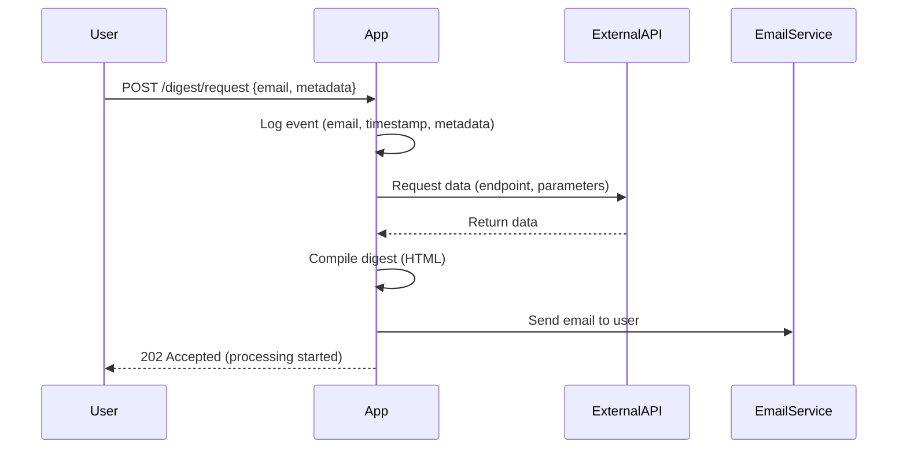

# Functional Requirements and API Design

## API Endpoints

### 1. POST /digest/request  
**Purpose:** Accept and log a digest request event, trigger data retrieval from the external API, compile the digest, and send the email.  
**Request Body:**  
```json
{
  "email": "user@example.com",
  "metadata": {
    "endpoint": "/pet/findByStatus",   // optional, defaults to `/pet/findByStatus`
    "parameters": {                    // optional query parameters for external API
      "status": "available"
    }
  }
}
```  
**Response:**  
```json
{
  "status": "accepted",
  "message": "Digest request received and processing started"
}
```

### 2. GET /digest/status/{requestId}  
**Purpose:** Retrieve the status and results of a previously submitted digest request.  
**Response:**  
```json
{
  "requestId": "abc123",
  "status": "completed",
  "email": "user@example.com",
  "sentAt": "2024-04-27T10:00:00Z",
  "digestSummary": "<html>...</html>"   // optional preview or summary of the sent digest
}
```

---

# Sequence Diagram of User Interaction


```mermaid
sequenceDiagram
    participant User
    participant App
    participant ExternalAPI
    participant EmailService

    User->>App: POST /digest/request {email, metadata}
    App->>App: Log event (email, timestamp, metadata)
    App->>ExternalAPI: Request data (endpoint, parameters)
    ExternalAPI-->>App: Return data
    App->>App: Compile digest (HTML)
    App->>EmailService: Send email to user
    App-->>User: 202 Accepted (processing started)
```

---

# Digest Request Processing Workflow

```mermaid
flowchart TD
    A[Receive Digest Request Event] --> B[Log Event (email, timestamp, metadata)]
    B --> C{Is endpoint specified?}
    C -- Yes --> D[Use specified endpoint & parameters]
    C -- No --> E[Use default endpoint `/pet/findByStatus`]
    D --> F[Call External API]
    E --> F
    F --> G[Compile Digest Email (HTML)]
    G --> H[Send Email to User]
    H --> I[Mark request as completed]
```

---

Example response you can copy-paste if no additions needed:

```
1. POST /digest/request accepts email and optional metadata including endpoint and parameters, logs event, fetches data from specified or default endpoint, compiles HTML digest, sends email, and returns accepted status.
2. GET /digest/status/{requestId} returns status and summary of sent digest.
3. Default digest format is HTML.
```