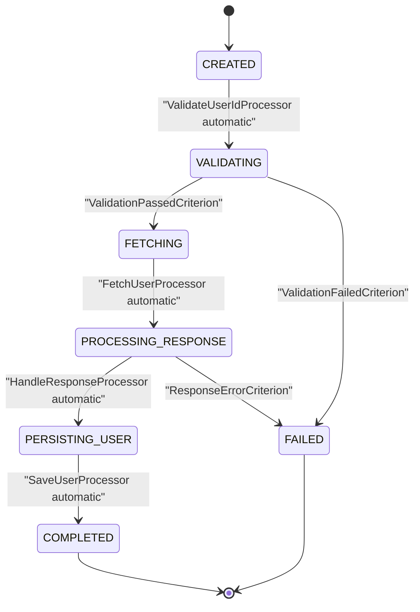
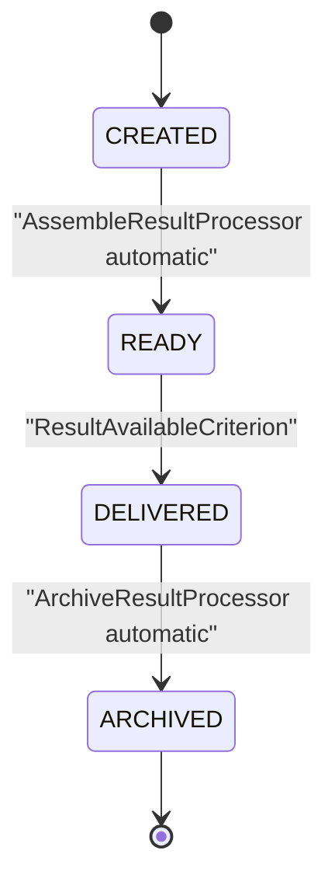
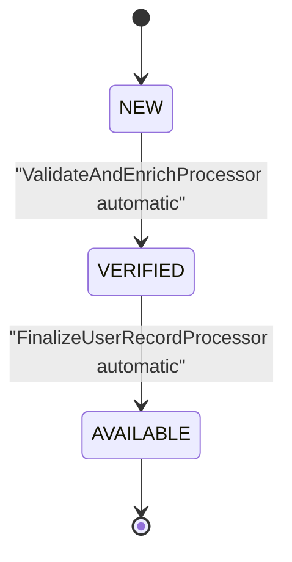

### 1. Entity Definitions
```
User:
- id: Integer (business identifier returned by ReqRes)
- email: String (user email)
- first_name: String (first name)
- last_name: String (last name)
- avatar: String (avatar URL)
- retrieved_at: String (ISO timestamp when record was fetched)
- source: String (source system, e.g. ReqRes)

GetUserJob:
- request_user_id: String (user id provided by caller)
- status: String (current processing state e.g. CREATED VALIDATING FETCHING COMPLETED FAILED)
- created_at: String (ISO timestamp job created)
- started_at: String (ISO timestamp processing started)
- completed_at: String (ISO timestamp processing finished)
- error_message: String (error details if any)
- response_code: Integer (HTTP response code received from external service if applicable)

GetUserResult:
- job_reference: String (reference to GetUserJob)
- status: String (SUCCESS NOT_FOUND INVALID_INPUT ERROR)
- user: User (present if status == SUCCESS)
- error_message: String (present if status != SUCCESS)
- retrieved_at: String (ISO timestamp when result was produced)
```

### 2. Entity workflows

GetUserJob workflow:
1. Initial State: CREATED — POST /jobs/get-user persists GetUserJob and triggers processing (event).
2. Validation: automatic ValidateUserIdProcessor checks request_user_id format.
3. Fetching: automatic FetchUserProcessor calls external /users/{id}.
4. Response Processing: automatic HandleResponseProcessor interprets HTTP response.
5. Persisting: automatic SaveUserProcessor persists User if found and creates GetUserResult.
6. Completion: status -> COMPLETED or FAILED. Result available via GET by technicalId.

Mermaid state diagram for GetUserJob:

```mermaid
stateDiagram-v2
    [*] --> CREATED
    CREATED --> VALIDATING : "ValidateUserIdProcessor automatic"
    VALIDATING --> FETCHING : "ValidationPassedCriterion"
    VALIDATING --> FAILED : "ValidationFailedCriterion"
    FETCHING --> PROCESSING_RESPONSE : "FetchUserProcessor automatic"
    PROCESSING_RESPONSE --> PERSISTING_USER : "HandleResponseProcessor automatic"
    PROCESSING_RESPONSE --> FAILED : "ResponseErrorCriterion"
    PERSISTING_USER --> COMPLETED : "SaveUserProcessor automatic"
    COMPLETED --> [*]
    FAILED --> [*]
```

Processors and criteria for GetUserJob:
- Processors (3-5): ValidateUserIdProcessor, FetchUserProcessor, HandleResponseProcessor, SaveUserProcessor.
- Criteria (1-3): ValidationPassedCriterion, ValidationFailedCriterion, ResponseErrorCriterion.

GetUserResult workflow:
1. Initial State: CREATED (result object produced by HandleResponseProcessor).
2. Ready: READY when payload assembled (user or error).
3. Delivery: DELIVERED when job GET returns the result to caller.
4. Archived: ARCHIVED for housekeeping (optional, manual or scheduled).

Mermaid state diagram for GetUserResult:

```mermaid
stateDiagram-v2
    [*] --> CREATED
    CREATED --> READY : "AssembleResultProcessor automatic"
    READY --> DELIVERED : "ResultAvailableCriterion"
    DELIVERED --> ARCHIVED : "ArchiveResultProcessor automatic"
    ARCHIVED --> [*]
```

Processors and criteria for GetUserResult:
- Processors: AssembleResultProcessor, ArchiveResultProcessor, NotifyConsumerProcessor (optional).
- Criteria: ResultAvailableCriterion.

User workflow:
1. Initial State: NEW (created when SaveUserProcessor persists user).
2. Verified: VERIFIED after basic data checks/enrichment (automatic).
3. AVAILABLE: AVAILABLE when ready to be served by queries.

Mermaid state diagram for User:

```mermaid
stateDiagram-v2
    [*] --> NEW
    NEW --> VERIFIED : "ValidateAndEnrichProcessor automatic"
    VERIFIED --> AVAILABLE : "FinalizeUserRecordProcessor automatic"
    AVAILABLE --> [*]
```

Processors and criteria for User:
- Processors: ValidateAndEnrichProcessor, FinalizeUserRecordProcessor, (optional) NotifyOnNewUserProcessor.
- Criteria: EnrichmentSuccessCriterion.

### 3. Pseudo code for processor classes
```java
// ValidateUserIdProcessor
class ValidateUserIdProcessor {
    void process(GetUserJob job) {
        if (job.request_user_id == null || job.request_user_id.trim().isEmpty()) {
            job.status = "FAILED";
            job.error_message = "User ID is required";
            // set ValidationFailedCriterion outcome
            return;
        }
        // check numeric positive
        try {
            int id = Integer.parseInt(job.request_user_id);
            if (id <= 0) throw new NumberFormatException();
        } catch (Exception e) {
            job.status = "FAILED";
            job.error_message = "User ID must be a positive integer";
            return;
        }
        // Validation passed: continue to fetching
        job.status = "FETCHING";
    }
}

// FetchUserProcessor
class FetchUserProcessor {
    void process(GetUserJob job, Context ctx) {
        job.started_at = now();
        // perform external GET /users/{id}
        ExternalResponse resp = callExternalUsersEndpoint(job.request_user_id);
        job.response_code = resp.code;
        ctx.rawResponse = resp.body;
        // move to response processing
        job.status = "PROCESSING_RESPONSE";
    }
}

// HandleResponseProcessor
class HandleResponseProcessor {
    void process(GetUserJob job, Context ctx) {
        if (job.response_code == 200) {
            User user = parseUserFrom(ctx.rawResponse);
            job.error_message = null;
            // create GetUserResult with SUCCESS and attach user
            persistUserAndResult(job, user, "SUCCESS");
            job.status = "COMPLETED";
            job.completed_at = now();
        } else if (job.response_code == 404) {
            persistResultWithError(job, "NOT_FOUND", "User not found");
            job.status = "COMPLETED";
            job.completed_at = now();
        } else {
            persistResultWithError(job, "ERROR", "Upstream returned code " + job.response_code);
            job.status = "FAILED";
            job.completed_at = now();
        }
    }
}

// SaveUserProcessor (called by HandleResponseProcessor or separate)
class SaveUserProcessor {
    void process(User user) {
        user.retrieved_at = now();
        user.source = "ReqRes";
        persist(user);
    }
}
```

Notes: processors interact via job context and persistent entities. Criteria are evaluated by processors or by lightweight criterion classes that inspect job fields (e.g., ValidationPassedCriterion checks job.status or validation flags).

### 4. API Endpoints Design Rules

- POST endpoint (create orchestration job)
  - POST /jobs/get-user
  - Purpose: create GetUserJob (triggers EDA processing). Must return only technicalId.

Request example:
```json
{
  "userId": "2"
}
```

Response example (only technicalId):
```json
{
  "technicalId": "job-123e4567"
}
```

- GET endpoint (retrieve job/result by technicalId)
  - GET /jobs/{technicalId}
  - Purpose: retrieve stored job status and result (GetUserJob + GetUserResult + User if available).

Response example (successful retrieval):
```json
{
  "technicalId": "job-123e4567",
  "request_user_id": "2",
  "status": "COMPLETED",
  "created_at": "2025-08-27T10:00:00Z",
  "started_at": "2025-08-27T10:00:01Z",
  "completed_at": "2025-08-27T10:00:02Z",
  "response_code": 200,
  "result": {
    "job_reference": "job-123e4567",
    "status": "SUCCESS",
    "retrieved_at": "2025-08-27T10:00:02Z",
    "user": {
      "id": 2,
      "email": "janet.weaver@reqres.in",
      "first_name": "Janet",
      "last_name": "Weaver",
      "avatar": "https://reqres.in/img/faces/2-image.jpg",
      "retrieved_at": "2025-08-27T10:00:02Z",
      "source": "ReqRes"
    }
  }
}
```

Response example (not found):
```json
{
  "technicalId": "job-123e4567",
  "request_user_id": "23",
  "status": "COMPLETED",
  "response_code": 404,
  "result": {
    "job_reference": "job-123e4567",
    "status": "NOT_FOUND",
    "error_message": "User not found",
    "retrieved_at": "2025-08-27T10:00:02Z"
  }
}
```

Design rules applied:
- Only the orchestration entity (GetUserJob) has POST endpoint; POST returns only technicalId.
- GET by technicalId exists for the job to fetch processing status and eventual user data.
- Business entity User is created by the job processing (no POST). Its persisted data is returned embedded in the job GET result.
- GET by non-technicalId fields was not explicitly requested, so not provided.

If you want, I can:
- produce a Cyoda model (entities + workflows + processors/criteria) ready for import, or
- adjust entities (add retries, timeouts, or add GET /users/{userId} cached retrieval) — tell me which.