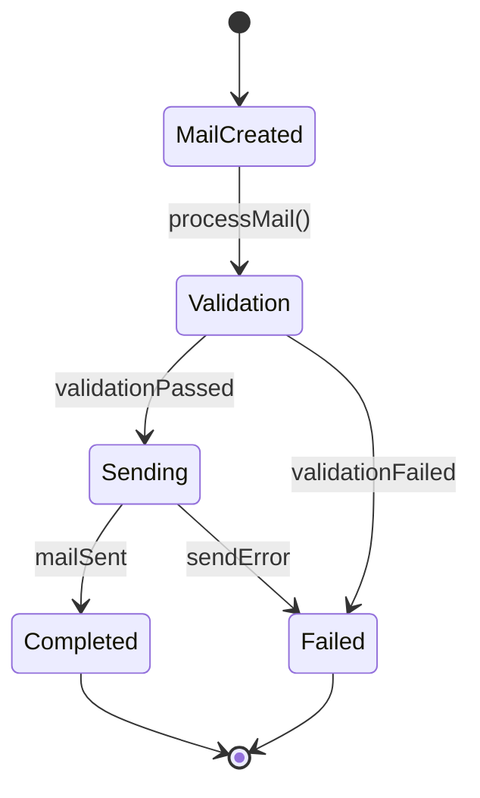
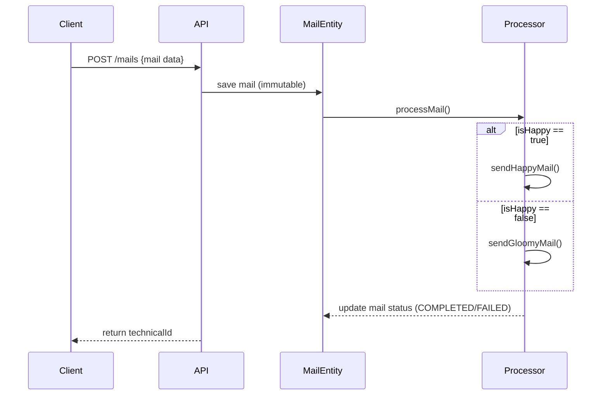

### 1. Entity Definitions

``` 
Mail:
- isHappy: Boolean (Indicates if the mail is happy or gloomy)
- mailList: List<String> (List of recipient email addresses)
- subject: String (Subject line of the mail)
- content: String (The body/content of the mail to be sent)
```

### 2. Process Method Flows

``` 
processMail() Flow:
1. Initial State: Mail entity is created with immutable data (isHappy, mailList, subject, content).
2. Validation: Trigger corresponding `checkMailHappy()` or `checkMailGloomy()` criteria based on `isHappy` flag.
3. Processing:
   - If `isHappy == true`, invoke `sendHappyMail` processor to send happy mail.
   - If `isHappy == false`, invoke `sendGloomyMail` processor to send gloomy mail.
4. Completion: Mark mail as processed (internally tracked for event history).
5. Notification: Log sending result and optionally notify downstream systems.
```

### 3. API Endpoints Design

| Method | Endpoint           | Purpose                                  | Request Body                           | Response               |
|--------|--------------------|------------------------------------------|---------------------------------------|------------------------|
| POST   | /mails             | Create a new Mail entity (triggers event) | `{ isHappy, mailList, subject, content }` | `{ technicalId: String }` |
| GET    | /mails/{technicalId} | Retrieve stored mail processing result by technicalId | N/A                                   | Mail entity + status    |

- No update/delete endpoints to maintain immutable event history.
- No GET by condition or GET all endpoints unless explicitly requested.
- Creation of mail triggers `processMail()` event automatically.

### 4. Request/Response Formats

**POST /mails**

Request:
```json
{
  "isHappy": true,
  "mailList": ["user1@example.com", "user2@example.com"],
  "subject": "Have a great day!",
  "content": "Wishing you happiness and success."
}
```

Response:
```json
{
  "technicalId": "abc123xyz"
}
```

**GET /mails/{technicalId}**

Response:
```json
{
  "technicalId": "abc123xyz",
  "isHappy": true,
  "mailList": ["user1@example.com", "user2@example.com"],
  "subject": "Have a great day!",
  "content": "Wishing you happiness and success.",
  "status": "COMPLETED",
  "sentAt": "2024-06-01T12:34:56Z"
}
```

---

### Visual Representations

**Entity Lifecycle State Diagram**


```mermaid
stateDiagram-v2
    [*] --> MailCreated
    MailCreated --> Validation : processMail()
    Validation --> Sending : validationPassed
    Validation --> Failed : validationFailed
    Sending --> Completed : mailSent
    Sending --> Failed : sendError
    Completed --> [*]
    Failed --> [*]
```

**Event-Driven Processing Chain**


```mermaid
sequenceDiagram
    participant Client
    participant API
    participant MailEntity
    participant Processor

    Client->>API: POST /mails {mail data}
    API->>MailEntity: save mail (immutable)
    MailEntity->>Processor: processMail()
    alt isHappy == true
        Processor->>Processor: sendHappyMail()
    else isHappy == false
        Processor->>Processor: sendGloomyMail()
    end
    Processor-->>MailEntity: update mail status (COMPLETED/FAILED)
    API-->>Client: return technicalId
```

---

This completes the functional requirements for your Happy Mail Sender app based on Event-Driven Architecture principles. If you need further adjustments or additional entities/endpoints, please let me know!