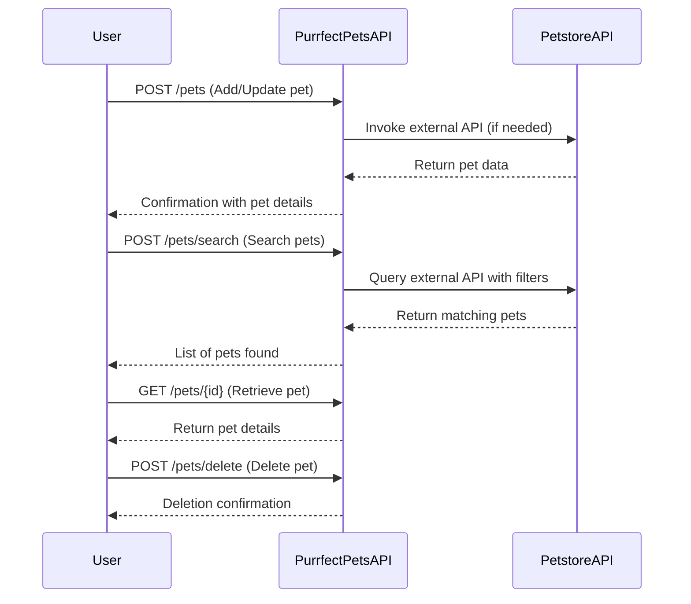

# Purrfect Pets API - Functional Requirements

## API Endpoints

### 1. Add or Update Pet Data (POST /pets)
- **Description:** Create a new pet entry or update existing pet information by invoking Petstore external API and enriching data.
- **Request:**
```json
{
  "id": "string (optional for new pet)",
  "name": "string",
  "category": "string",
  "status": "string",
  "tags": ["string"],
  "photoUrls": ["string"]
}
```
- **Response:**
```json
{
  "success": true,
  "pet": {
    "id": "string",
    "name": "string",
    "category": "string",
    "status": "string",
    "tags": ["string"],
    "photoUrls": ["string"]
  }
}
```

---

### 2. Retrieve Pet Details (GET /pets/{id})
- **Description:** Fetch pet details from the local app database.
- **Response:**
```json
{
  "id": "string",
  "name": "string",
  "category": "string",
  "status": "string",
  "tags": ["string"],
  "photoUrls": ["string"]
}
```

---

### 3. Search Pets (POST /pets/search)
- **Description:** Search for pets by parameters (name, status, category) invoking Petstore external API, possibly combining results with local data.
- **Request:**
```json
{
  "name": "string (optional)",
  "status": "string (optional)",
  "category": "string (optional)"
}
```
- **Response:**
```json
[
  {
    "id": "string",
    "name": "string",
    "category": "string",
    "status": "string",
    "tags": ["string"],
    "photoUrls": ["string"]
  },
  ...
]
```

---

### 4. Delete Pet (POST /pets/delete)
- **Description:** Delete pet entry by ID from local app database.
- **Request:**
```json
{
  "id": "string"
}
```
- **Response:**
```json
{
  "success": true,
  "message": "Pet deleted successfully"
}
```

---

## User-App Interaction Sequence Diagram


```mermaid
sequenceDiagram
    participant User
    participant PurrfectPetsAPI
    participant PetstoreAPI

    User->>PurrfectPetsAPI: POST /pets (Add/Update pet)
    PurrfectPetsAPI->>PetstoreAPI: Invoke external API (if needed)
    PetstoreAPI-->>PurrfectPetsAPI: Return pet data
    PurrfectPetsAPI-->>User: Confirmation with pet details

    User->>PurrfectPetsAPI: POST /pets/search (Search pets)
    PurrfectPetsAPI->>PetstoreAPI: Query external API with filters
    PetstoreAPI-->>PurrfectPetsAPI: Return matching pets
    PurrfectPetsAPI-->>User: List of pets found

    User->>PurrfectPetsAPI: GET /pets/{id} (Retrieve pet)
    PurrfectPetsAPI-->>User: Return pet details

    User->>PurrfectPetsAPI: POST /pets/delete (Delete pet)
    PurrfectPetsAPI-->>User: Deletion confirmation
```