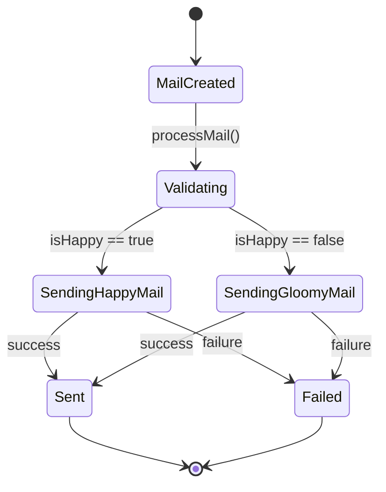
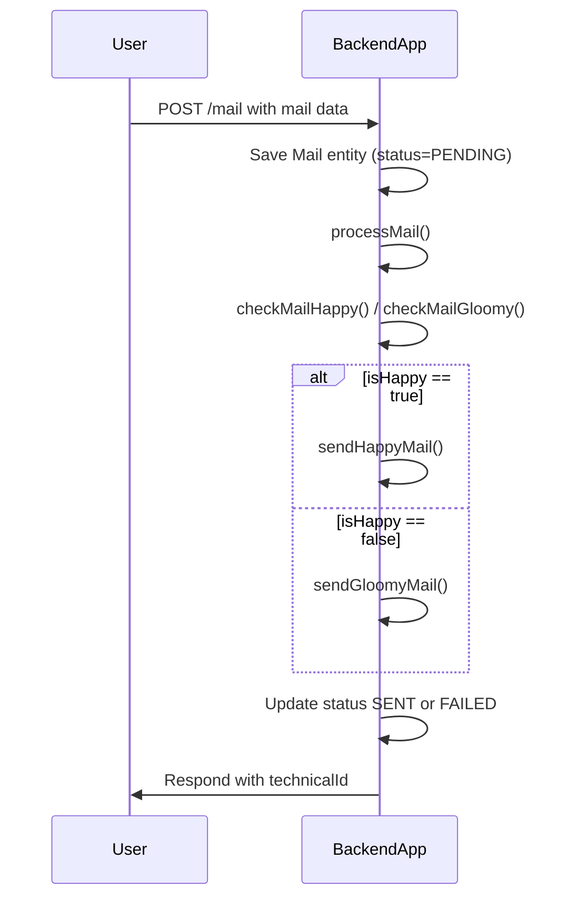

### 1. Entity Definitions

```
Mail:
- isHappy: Boolean (Indicates if the mail is happy (true) or gloomy (false))
- mailList: List<String> (List of recipient email addresses)
- subject: String (Subject line of the mail)
- content: String (The body/content of the mail)
- status: String (Current mail processing status: e.g., PENDING, SENT, FAILED)
```

---

### 2. Process Method Flows

```
processMail() Flow:
1. Initial State: Mail entity created with status = PENDING
2. Validation: Validate mail fields and apply criteria checks:
   - checkMailHappy(): isHappy == true
   - checkMailGloomy(): isHappy == false
3. Processing: Depending on isHappy value:
   - If true, send happy mail via sendHappyMail processor
   - If false, send gloomy mail via sendGloomyMail processor
4. Completion:
   - On success, update status = SENT
   - On failure, update status = FAILED
5. Notification: (Optional) Emit events or logs about mail delivery outcome
```

---

### 3. API Endpoints Design

| Endpoint                   | Description                                   | Request Body Example                      | Response Example                    |
|----------------------------|-----------------------------------------------|------------------------------------------|------------------------------------|
| POST /mail                 | Create a new Mail entity (triggers event)     | `{ "isHappy": true, "mailList": ["a@b.com"], "subject": "Hi", "content": "Hello!" }` | `{ "technicalId": "uuid-string" }` |
| GET /mail/{technicalId}    | Retrieve Mail entity by technicalId            | N/A                                      | `{ "isHappy": true, "mailList": ["a@b.com"], "subject": "Hi", "content": "Hello!", "status": "SENT" }` |

---

### 4. Request/Response Formats

**POST /mail Request JSON**

```json
{
  "isHappy": true,
  "mailList": ["recipient1@example.com", "recipient2@example.com"],
  "subject": "Greetings!",
  "content": "Wishing you a wonderful day!"
}
```

**POST /mail Response JSON**

```json
{
  "technicalId": "123e4567-e89b-12d3-a456-426614174000"
}
```

**GET /mail/{technicalId} Response JSON**

```json
{
  "isHappy": true,
  "mailList": ["recipient1@example.com", "recipient2@example.com"],
  "subject": "Greetings!",
  "content": "Wishing you a wonderful day!",
  "status": "SENT"
}
```

---

### 5. Mermaid Diagrams

**Mail Entity Lifecycle State Diagram**


```mermaid
stateDiagram-v2
    [*] --> MailCreated
    MailCreated --> Validating : processMail()
    Validating --> SendingHappyMail : isHappy == true
    Validating --> SendingGloomyMail : isHappy == false
    SendingHappyMail --> Sent : success
    SendingHappyMail --> Failed : failure
    SendingGloomyMail --> Sent : success
    SendingGloomyMail --> Failed : failure
    Sent --> [*]
    Failed --> [*]
```

---

**Event-Driven Processing Chain**

```mermaid
graph LR
    CreateMail[Create Mail Entity]
    ValidateMail[Validate Mail (checkMailHappy/checkMailGloomy)]
    SendHappy[sendHappyMail Processor]
    SendGloomy[sendGloomyMail Processor]
    UpdateStatusSent[Update Status to SENT]
    UpdateStatusFailed[Update Status to FAILED]

    CreateMail --> ValidateMail
    ValidateMail -->|isHappy = true| SendHappy
    ValidateMail -->|isHappy = false| SendGloomy
    SendHappy -->|Success| UpdateStatusSent
    SendHappy -->|Failure| UpdateStatusFailed
    SendGloomy -->|Success| UpdateStatusSent
    SendGloomy -->|Failure| UpdateStatusFailed
```

---

**User Interaction Sequence Flow**


```mermaid
sequenceDiagram
    participant User
    participant BackendApp

    User->>BackendApp: POST /mail with mail data
    BackendApp->>BackendApp: Save Mail entity (status=PENDING)
    BackendApp->>BackendApp: processMail()
    BackendApp->>BackendApp: checkMailHappy() / checkMailGloomy()
    alt isHappy == true
        BackendApp->>BackendApp: sendHappyMail()
    else isHappy == false
        BackendApp->>BackendApp: sendGloomyMail()
    end
    BackendApp->>BackendApp: Update status SENT or FAILED
    BackendApp->>User: Respond with technicalId
```

---

### Summary Confirmation (copy-paste if needed)

```markdown
- One entity: Mail with fields isHappy, mailList, subject, content, status
- Use processMail() to handle sending logic based on isHappy criteria
- POST /mail endpoint creates Mail entity and triggers sending
- GET /mail/{technicalId} to retrieve mail status and details
- Favor immutable creation, no updates or deletes
```

Thank you!