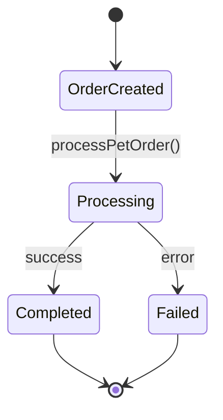
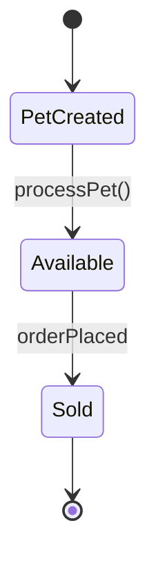
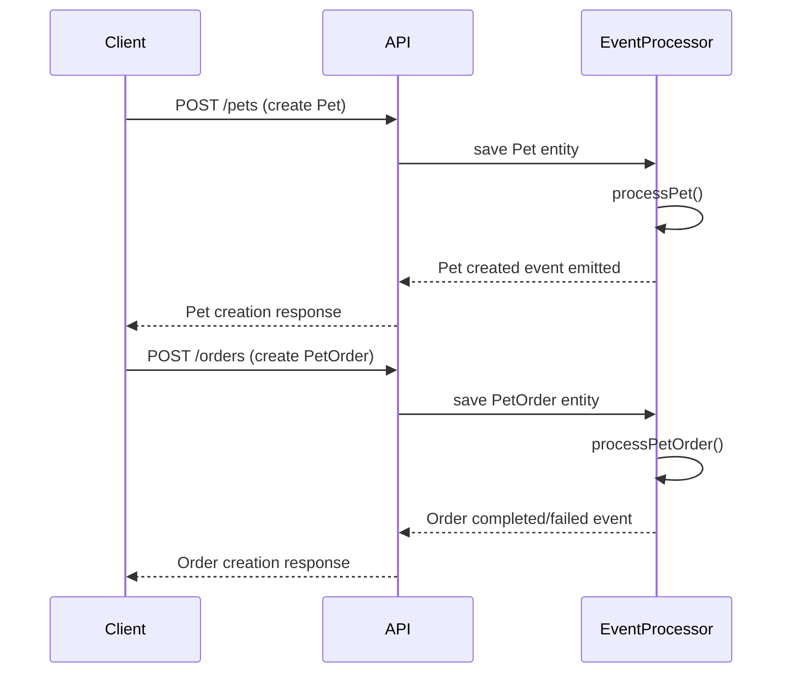

### 1. Entity Definitions
``` 
PetOrder: 
- orderId: String (unique identifier for the order) 
- petId: String (reference to the pet being ordered) 
- customerName: String (name of the customer placing the order) 
- quantity: Integer (number of pets ordered) 
- status: StatusEnum (PENDING, PROCESSING, COMPLETED, FAILED) 

Pet: 
- petId: String (unique identifier for the pet) 
- name: String (pet's name) 
- type: String (animal type, e.g., Cat, Dog, Bird) 
- status: StatusEnum (AVAILABLE, SOLD) 
```

### 2. Process Method Flows

``` 
processPetOrder() Flow: 
1. Initial State: PetOrder created with PENDING status 
2. Validation: Check pet availability and order data correctness 
3. Processing: Reserve pets, update pet status to SOLD 
4. Completion: Update order status to COMPLETED or FAILED 
5. Notification: Emit event confirming order placement or failure 

processPet() Flow: 
1. Initial State: Pet created with AVAILABLE status 
2. Validation: Verify pet data completeness 
3. Processing: Save pet data into the system 
4. Completion: Status remains AVAILABLE, ready for order 
5. Notification: Event emitted for new pet availability 
```

### 3. API Endpoints Design

- **POST /pets**  
  - Creates a new Pet (triggers `processPet()`)  
  - Request JSON example:  
  ```json
  {
    "petId": "p123",
    "name": "Whiskers",
    "type": "Cat"
  }
  ```  
  - Response: Confirmation with Pet data and status

- **POST /orders**  
  - Creates a new PetOrder (triggers `processPetOrder()`)  
  - Request JSON example:  
  ```json
  {
    "orderId": "o456",
    "petId": "p123",
    "customerName": "Alice",
    "quantity": 1
  }
  ```  
  - Response: Confirmation with Order data and status

- **GET /pets/{petId}**  
  - Retrieves Pet details by ID

- **GET /orders/{orderId}**  
  - Retrieves PetOrder details by ID

### 4. Request/Response Formats

- **Pet Creation Request**  
```json
{
  "petId": "string",
  "name": "string",
  "type": "string"
}
```

- **Pet Creation Response**  
```json
{
  "petId": "string",
  "name": "string",
  "type": "string",
  "status": "AVAILABLE"
}
```

- **PetOrder Creation Request**  
```json
{
  "orderId": "string",
  "petId": "string",
  "customerName": "string",
  "quantity": integer
}
```

- **PetOrder Creation Response**  
```json
{
  "orderId": "string",
  "petId": "string",
  "customerName": "string",
  "quantity": integer,
  "status": "PENDING"
}
```

---

### Visual Representations

**PetOrder Lifecycle State Diagram**

```mermaid
stateDiagram-v2
    [*] --> OrderCreated
    OrderCreated --> Processing : processPetOrder()
    Processing --> Completed : success
    Processing --> Failed : error
    Completed --> [*]
    Failed --> [*]
```

**Pet Lifecycle State Diagram**

```mermaid
stateDiagram-v2
    [*] --> PetCreated
    PetCreated --> Available : processPet()
    Available --> Sold : orderPlaced
    Sold --> [*]
```

**Event-Driven Processing Chain**

```mermaid
sequenceDiagram
    participant Client
    participant API
    participant EventProcessor

    Client->>API: POST /pets (create Pet)
    API->>EventProcessor: save Pet entity
    EventProcessor->>EventProcessor: processPet()
    EventProcessor-->>API: Pet created event emitted
    API-->>Client: Pet creation response

    Client->>API: POST /orders (create PetOrder)
    API->>EventProcessor: save PetOrder entity
    EventProcessor->>EventProcessor: processPetOrder()
    EventProcessor-->>API: Order completed/failed event
    API-->>Client: Order creation response
```

---

If you need any further adjustments, please let me know!