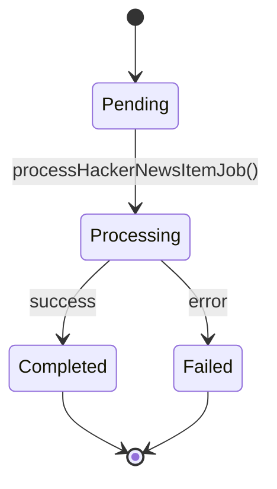
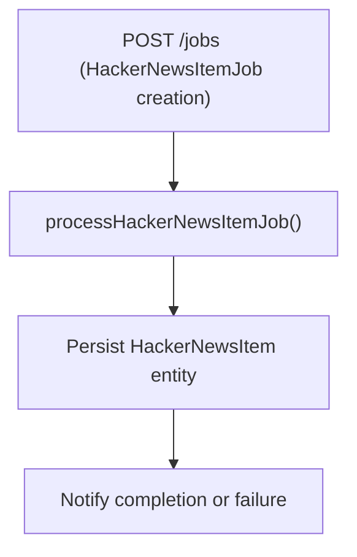
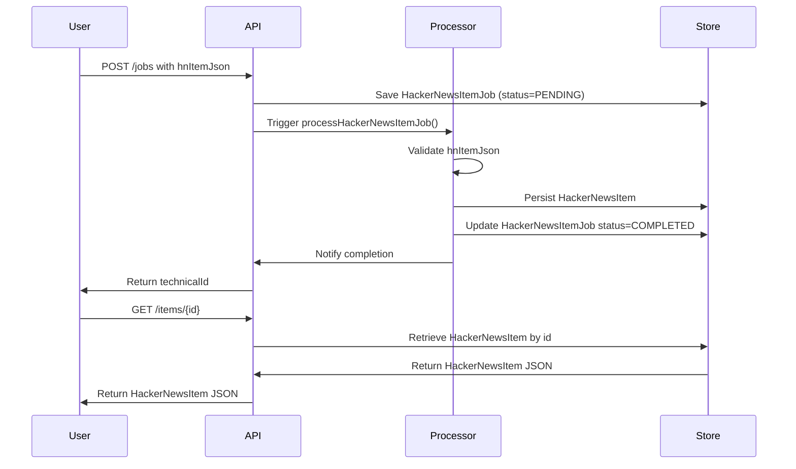

### 1. Entity Definitions

``` 
HackerNewsItemJob:
- technicalId: String (Datastore-generated unique identifier, not part of entity JSON)
- hnItemJson: String (Raw JSON string of the Hacker News item in Firebase HN API format)
- status: String (Processing status: PENDING, PROCESSING, COMPLETED, FAILED)
- createdAt: Long (Epoch timestamp of job creation)
- completedAt: Long (Epoch timestamp of job completion, optional)

HackerNewsItem:
- id: Long (Hacker News item unique identifier from JSON)
- by: String (Author username)
- descendants: Integer (Number of comments)
- kids: List<Long> (IDs of child comments)
- score: Integer (Score of the item)
- time: Long (Unix timestamp of submission)
- title: String (Title of the story/comment)
- type: String (Item type: story, comment, etc.)
- url: String (URL of the story)
- rawJson: String (Full original JSON string stored as-is)
```

### 2. Process Method Flows

```
processHackerNewsItemJob() Flow:
1. Initial State: HackerNewsItemJob created with status = PENDING
2. Validation: Validate the hnItemJson is valid JSON and conforms to Firebase HN item structure
3. Processing:
   - Parse hnItemJson to extract HackerNewsItem fields
   - Persist HackerNewsItem entity immutably
4. Completion:
   - Update HackerNewsItemJob status to COMPLETED and set completedAt timestamp
5. Notification:
   - (Optional) Log or notify downstream systems of successful storage
6. Failure Handling:
   - If validation or processing fails, update status to FAILED and record error details (logging)
```

### 3. API Endpoints

| Endpoint            | Method | Description                                  | Request Body                 | Response               |
|---------------------|--------|----------------------------------------------|-----------------------------|------------------------|
| `/jobs`             | POST   | Create a new HackerNewsItemJob to save an item JSON | `{ "hnItemJson": "{...}" }` | `{ "technicalId": "uuid" }` |
| `/jobs/{technicalId}` | GET    | Get job processing status and metadata       | N/A                         | Job entity JSON        |
| `/items/{id}`       | GET    | Retrieve stored HackerNewsItem by HN item ID | N/A                         | Stored HackerNewsItem JSON |

- POST `/jobs` triggers creation of a `HackerNewsItemJob` entity, which triggers `processHackerNewsItemJob()`.
- No update/delete endpoints to maintain immutable event history.
- GET endpoints retrieve current stored data by unique IDs.

### 4. Request/Response Formats

**POST /jobs**

Request:

```json
{
  "hnItemJson": "{\"by\":\"author\",\"id\":123,\"title\":\"Sample\",\"type\":\"story\",...}"
}
```

Response:

```json
{
  "technicalId": "a1b2c3d4-e5f6-7890-1234-56789abcdef0"
}
```

**GET /jobs/{technicalId}**

Response:

```json
{
  "technicalId": "a1b2c3d4-e5f6-7890-1234-56789abcdef0",
  "hnItemJson": "{\"by\":\"author\",\"id\":123,\"title\":\"Sample\",\"type\":\"story\",...}",
  "status": "COMPLETED",
  "createdAt": 1685000000000,
  "completedAt": 1685000100000
}
```

**GET /items/{id}**

Response:

```json
{
  "id": 123,
  "by": "author",
  "descendants": 10,
  "kids": [124,125,126],
  "score": 100,
  "time": 1684999999,
  "title": "Sample",
  "type": "story",
  "url": "https://example.com/story",
  "rawJson": "{\"by\":\"author\",\"id\":123,\"title\":\"Sample\",\"type\":\"story\",...}"
}
```

---

### Mermaid Diagrams

**Entity Lifecycle State Diagram for HackerNewsItemJob**


```mermaid
stateDiagram-v2
    [*] --> Pending
    Pending --> Processing : processHackerNewsItemJob()
    Processing --> Completed : success
    Processing --> Failed : error
    Completed --> [*]
    Failed --> [*]
```

**Event-Driven Processing Chain**


```mermaid
graph TD
    POST_jobs["POST /jobs (HackerNewsItemJob creation)"]
    processJob["processHackerNewsItemJob()"]
    saveItem["Persist HackerNewsItem entity"]
    notify["Notify completion or failure"]

    POST_jobs --> processJob --> saveItem --> notify
```

**User Interaction Sequence Flow**


```mermaid
sequenceDiagram
    participant User
    participant API
    participant Processor
    participant Store

    User->>API: POST /jobs with hnItemJson
    API->>Store: Save HackerNewsItemJob (status=PENDING)
    API->>Processor: Trigger processHackerNewsItemJob()
    Processor->>Processor: Validate hnItemJson
    Processor->>Store: Persist HackerNewsItem
    Processor->>Store: Update HackerNewsItemJob status=COMPLETED
    Processor->>API: Notify completion
    API->>User: Return technicalId
    User->>API: GET /items/{id}
    API->>Store: Retrieve HackerNewsItem by id
    Store->>API: Return HackerNewsItem JSON
    API->>User: Return HackerNewsItem JSON
```

---

This completes the functional requirements for the Hacker News item storage service using an Event-Driven Architecture approach on the Cyoda platform.