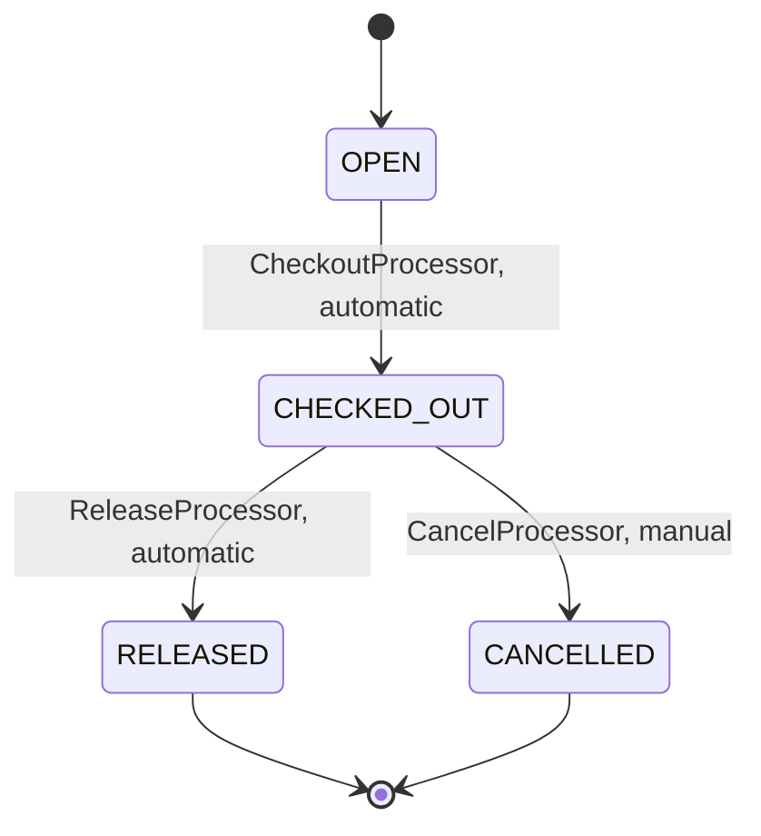
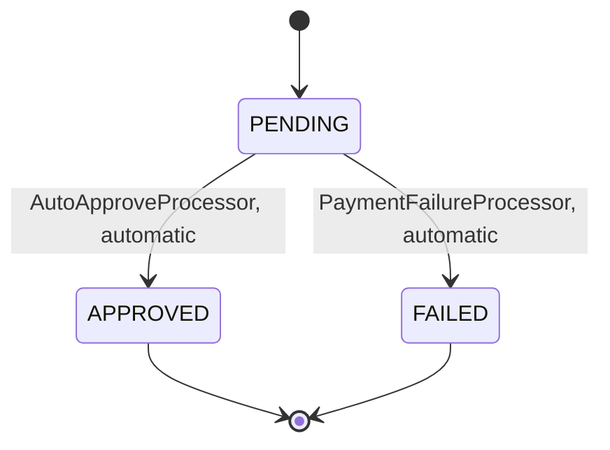
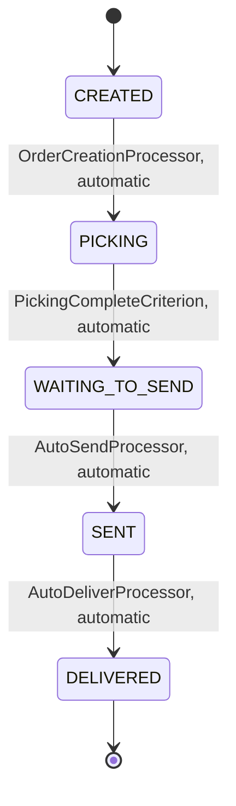
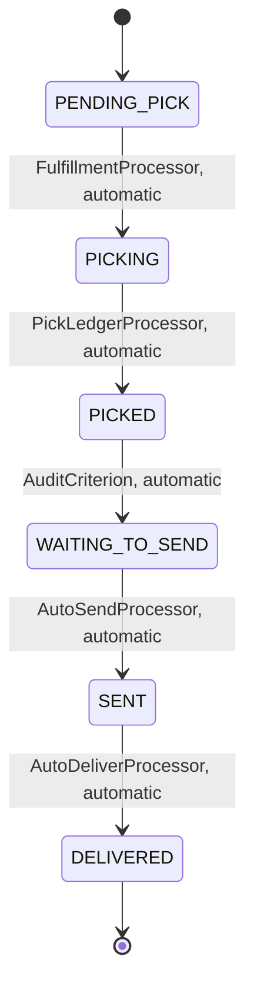
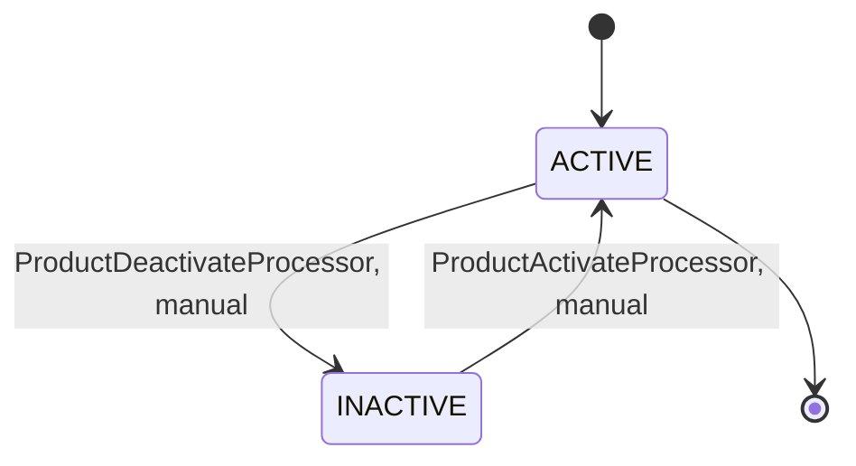
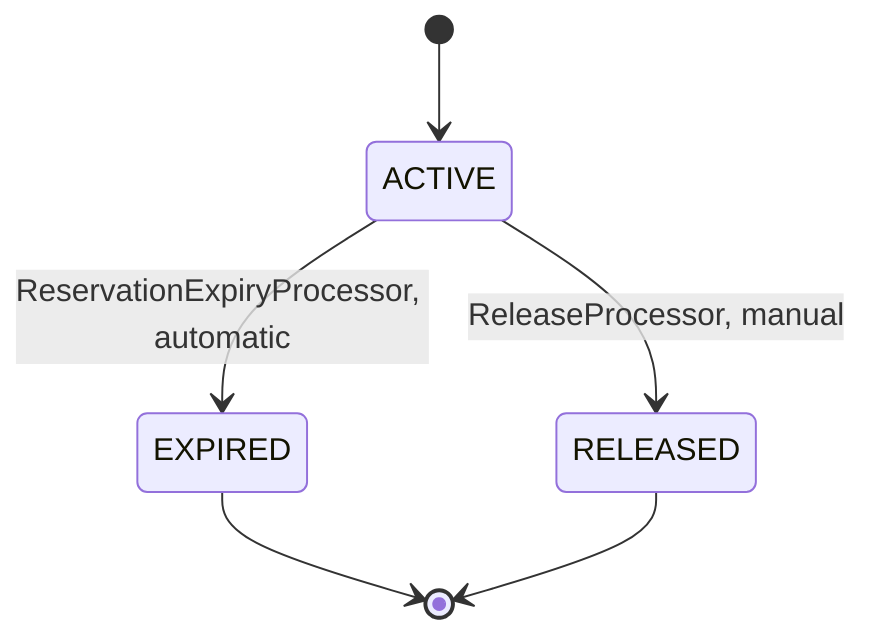
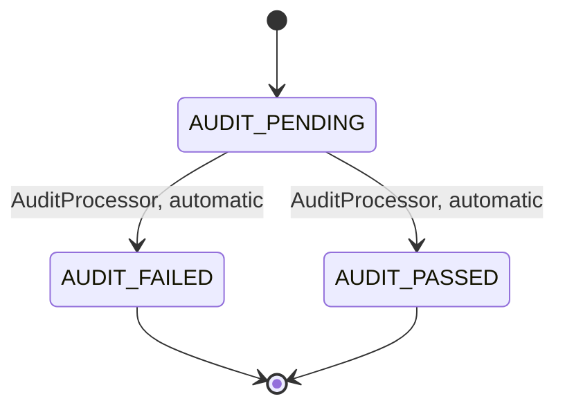

### 1. Entity Definitions
(Using only the 8 entities you specified)

```
Product:
- id: String (natural id)
- sku: String (catalog SKU)
- name: String (display name)
- description: String (product details)
- price: Number (unit price)
- availableQuantity: Number (current inventory)
- warehouseId: String (primary warehouse)

Cart:
- id: String (natural id)
- userId: String (owner)
- items: Array of { productId: String, qty: Number, priceSnapshot: Number }
- status: String (OPEN, CHECKED_OUT, RELEASED, CANCELLED)
- lastUpdated: String (timestamp)

User:
- id: String
- name: String
- email: String
- primaryAddress: Object { line1, line2, city, postal, country }
- phone: String
- profileUpdatedAt: String

Reservation:
- id: String
- cartId: String
- productId: String
- qty: Number
- warehouseId: String
- status: String (ACTIVE, EXPIRED, RELEASED)
- createdAt: String
- expiresAt: String

Payment:
- id: String
- orderId: String (nullable until created)
- cartId: String
- userId: String
- amount: Number
- status: String (PENDING, APPROVED, FAILED, REFUNDED)
- createdAt: String
- approvedAt: String

Order:
- id: String
- orderNumber: String (ULID)
- cartId: String
- userSnapshot: Object { name, email, address }
- items: Array of { productId: String, qtyOrdered: Number, qtyFulfilled: Number, price: Number }
- totalAmount: Number
- status: String (CREATED, PICKING, WAITING_TO_SEND, SENT, DELIVERED, CANCELLED)
- createdAt: String

Shipment:
- id: String
- orderId: String
- shipmentNumber: String
- warehouseId: String
- items: Array of { productId: String, qty: Number }
- status: String (PENDING_PICK, PICKING, PICKED, WAITING_TO_SEND, SENT, DELIVERED)
- trackingInfo: Object
- createdAt: String

PickLedger:
- id: String
- shipmentId: String
- orderId: String
- productId: String
- qtyRequested: Number
- qtyPicked: Number
- auditorId: String
- auditStatus: String (AUDIT_PENDING, AUDIT_PASSED, AUDIT_FAILED)
- timestamp: String
```

### 2. Entity workflows

Cart workflow:
1. Event: Cart created/updated (persist) → Reservation creation/update per item per warehouse.
2. Guard: On CHECKOUT: Cart.items must not be empty and all referenced Reservations must be ACTIVE.
3. If guard passes → create Payment (PENDING) for available items only.
4. If guard fails → block checkout and surface UI message.

mermaid

```mermaid
stateDiagram-v2
    [*] --> OPEN
    OPEN --> CHECKED_OUT : CheckoutProcessor, automatic
    CHECKED_OUT --> RELEASED : ReleaseProcessor, automatic
    CHECKED_OUT --> CANCELLED : CancelProcessor, manual
    RELEASED --> [*]
    CANCELLED --> [*]
```

Cart processors/criteria:
- CartProcessor (create/update Reservations)
- CheckoutGuardCriterion (ensures non-empty and Reservations ACTIVE)
- ReleaseProcessor (releases reservations on cancel/expiry)

Payment workflow:
1. Event: Payment created (PENDING) at checkout.
2. Automatic: Background auto-approve after 3s → APPROVED.
3. On APPROVED → emit event to create Order (with ULID orderNumber).
4. On FAILED → notify and release Reservations.

mermaid

```mermaid
stateDiagram-v2
    [*] --> PENDING
    PENDING --> APPROVED : AutoApproveProcessor, automatic
    PENDING --> FAILED : PaymentFailureProcessor, automatic
    APPROVED --> [*]
    FAILED --> [*]
```

Payment processors/criteria:
- PaymentAutoApproveProcessor (3s timer)
- PaymentAmountCriterion (verify amount matches cart snapshot)
- PaymentFailureProcessor

Order workflow:
1. Event: Payment.APPROVED → create Order with userSnapshot (address) and items = only available items.
2. Auto-split Order → create Shipments per warehouse.
3. Set Order → PICKING.
4. Track Order → aggregate shipment states to advance Order to WAITING_TO_SEND, SENT, DELIVERED.

mermaid

```mermaid
stateDiagram-v2
    [*] --> CREATED
    CREATED --> PICKING : OrderCreationProcessor, automatic
    PICKING --> WAITING_TO_SEND : PickingCompleteCriterion, automatic
    WAITING_TO_SEND --> SENT : AutoSendProcessor, automatic
    SENT --> DELIVERED : AutoDeliverProcessor, automatic
    DELIVERED --> [*]
```

Order processors/criteria:
- OrderCreationProcessor (ULID generation, snapshot, split to Shipments)
- PickingCompleteCriterion (all shipments picked & audits passed)
- AutoSendProcessor (3s timer after WAITING_TO_SEND)

Shipment workflow:
1. Event: Shipment created by Order split → PENDING_PICK.
2. Picking occurs → create PickLedger entries.
3. Random-sample audit (10%) marks picks as AUDIT_PASSED or AUDIT_FAILED.
4. On success → Shipment → WAITING_TO_SEND → after 3s -> SENT -> after 5s -> DELIVERED.

mermaid

```mermaid
stateDiagram-v2
    [*] --> PENDING_PICK
    PENDING_PICK --> PICKING : FulfillmentProcessor, automatic
    PICKING --> PICKED : PickLedgerProcessor, automatic
    PICKED --> WAITING_TO_SEND : AuditCriterion, automatic
    WAITING_TO_SEND --> SENT : AutoSendProcessor, automatic
    SENT --> DELIVERED : AutoDeliverProcessor, automatic
    DELIVERED --> [*]
```

Shipment processors/criteria:
- FulfillmentProcessor (perform picks, create PickLedger)
- PickLedgerProcessor (record qtyPicked)
- AuditCriterion (random sample 10%)
- AutoSendProcessor (3s)
- AutoDeliverProcessor (5s)

Product workflow (catalog):
1. Product created/updated → available for browsing.
2. Inventory updates emitted → influences Reservation creation/checkout.

mermaid

```mermaid
stateDiagram-v2
    [*] --> ACTIVE
    ACTIVE --> INACTIVE : ProductDeactivateProcessor, manual
    INACTIVE --> ACTIVE : ProductActivateProcessor, manual
    ACTIVE --> [*]
```

Reservation workflow:
1. Event: Reservation created/updated when Cart items change → ACTIVE.
2. Automatic expire after 30s → EXPIRED → inventory released.
3. Manual release on cart cancel → RELEASED.

mermaid

```mermaid
stateDiagram-v2
    [*] --> ACTIVE
    ACTIVE --> EXPIRED : ReservationExpiryProcessor, automatic
    ACTIVE --> RELEASED : ReleaseProcessor, manual
    EXPIRED --> [*]
    RELEASED --> [*]
```

PickLedger workflow:
1. Event: PickLedger created as pick happens → AUDIT_PENDING.
2. AuditCriterion (10% sampling) → marked AUDIT_PASSED or AUDIT_FAILED.
3. AUDIT_FAILED → rework/manual correction.

mermaid

```mermaid
stateDiagram-v2
    [*] --> AUDIT_PENDING
    AUDIT_PENDING --> AUDIT_PASSED : AuditProcessor, automatic
    AUDIT_PENDING --> AUDIT_FAILED : AuditProcessor, automatic
    AUDIT_FAILED --> [*]
    AUDIT_PASSED --> [*]
```

User workflow:
1. User creation/update → profile available for inline edit at checkout.
2. On checkout userSnapshot copied into Order.

mermaid

```mermaid
stateDiagram-v2
    [*] --> ACTIVE
    ACTIVE --> UPDATED : UserUpdateProcessor, manual
    UPDATED --> [*]
```

### 3. Pseudo code for processor classes (concise)

CartProcessor
```
process(cart):
  for item in cart.items:
    alloc = allocateFromWarehouses(item.productId, item.qty)
    persist Reservation(cartId, productId, alloc.qty, alloc.warehouseId, ACTIVE, now, now+30s)
  return
```

CheckoutGuardCriterion
```
test(cart):
  if cart.items empty => fail
  for r in reservations for cart:
    if r.status != ACTIVE => fail
  return pass
```

PaymentAutoApproveProcessor
```
process(payment):
  wait 3 seconds
  payment.status = APPROVED
  payment.approvedAt = now
  persist payment
  emit PaymentApprovedEvent(payment.id)
```

OrderCreationProcessor
```
process(payment):
  if payment.status != APPROVED: return
  cart = loadCart(payment.cartId)
  user = loadUser(cart.userId)
  items = filterAvailable(cart.items)
  orderNumber = generateULID()
  create Order(..., orderNumber, userSnapshot, items, status=CREATED)
  split into Shipments per warehouse from Reservations
```

FulfillmentProcessor
```
process(shipment):
  for each item in shipment.items:
    pk = pickQty(item)
    create PickLedger(shipmentId, item.productId, item.qty, pk, AUDIT_PENDING)
  run audit sampling 10% -> mark pick ledgers
  if all picks ok -> mark shipment PICKED
```

Background processors: ReservationExpiryProcessor (expire after 30s), AutoSendProcessor (3s), AutoDeliverProcessor (5s).

### 4. API Endpoints Design Rules & JSON examples

Rules:
- POST endpoints create entities (events). POST must return only technicalId.
- GET by technicalId returns stored entity.
- Use POST for Cart, User, Payment, Product (admin). Order and Shipments are created by processing but GET by technicalId available.

Examples:

POST /entity/Cart
Request:
```json
{
  "userId":"u-123",
  "items":[ {"productId":"p-1","qty":2} ]
}
```
Response:
```json
{ "technicalId": "tx-abc-123" }
```

GET /entity/Cart/{technicalId}
Response:
```json
{
  "id":"cart-1",
  "userId":"u-123",
  "items":[{"productId":"p-1","qty":2,"priceSnapshot":9.99}],
  "status":"OPEN",
  "lastUpdated":"2025-08-28T12:00:00Z"
}
```

POST /entity/Payment
Request:
```json
{
  "cartId":"cart-1",
  "userId":"u-123",
  "amount":19.98
}
```
Response:
```json
{ "technicalId": "tx-pay-1" }
```

GET /entity/Order/{technicalId}
Response:
```json
{
  "id":"order-1",
  "orderNumber":"01FZ...ULID",
  "cartId":"cart-1",
  "userSnapshot":{ "name":"Jane","email":"j@example.com", "address":{...} },
  "items":[{"productId":"p-1","qtyOrdered":2,"qtyFulfilled":2,"price":9.99}],
  "totalAmount":19.98,
  "status":"PICKING",
  "createdAt":"2025-08-28T12:00:10Z"
}
```

Notes / constraints
- Each POST triggers Cyoda workflow processing for that entity (entity persistence = event).
- POST must return only technicalId; clients poll GET by technicalId for full state/results.
- Reservation creation is initiated by CartProcessor when Cart is persisted.
- Order.orderNumber must be ULID (generated by OrderCreationProcessor).
- Timers: reservation TTL 30s; payment auto-approve 3s; WAITING_TO_SEND -> SENT after 3s; SENT -> DELIVERED after 5s.
- Audit sampling = 10% (AuditProcessor).

If you want, I can now produce:
- A compact checklist mapping each POST → expected technicalId → subsequent event-driven chain, or
- A minimal sequence diagram (event timeline) showing timings (3s/30s/5s). Which would you prefer?