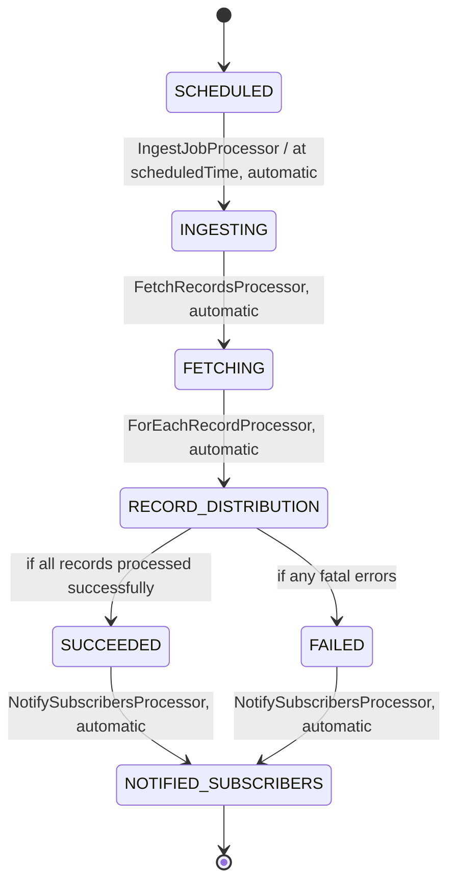
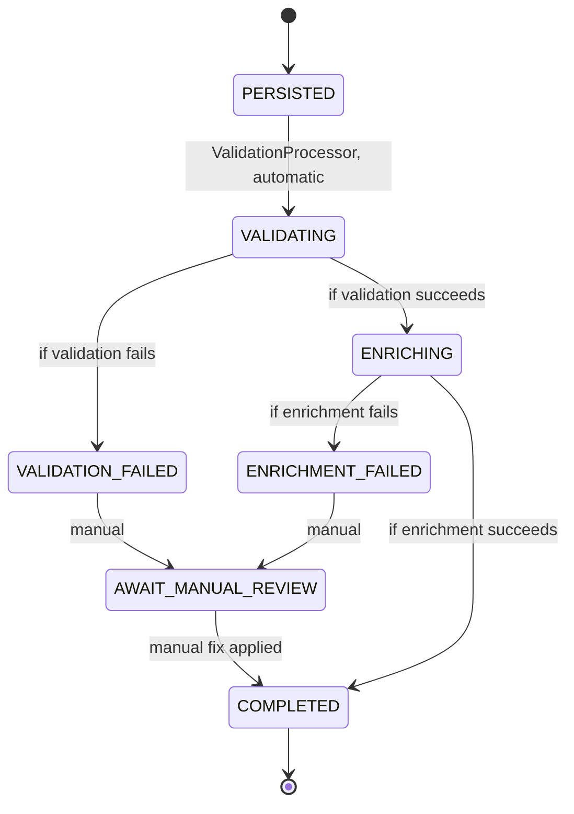
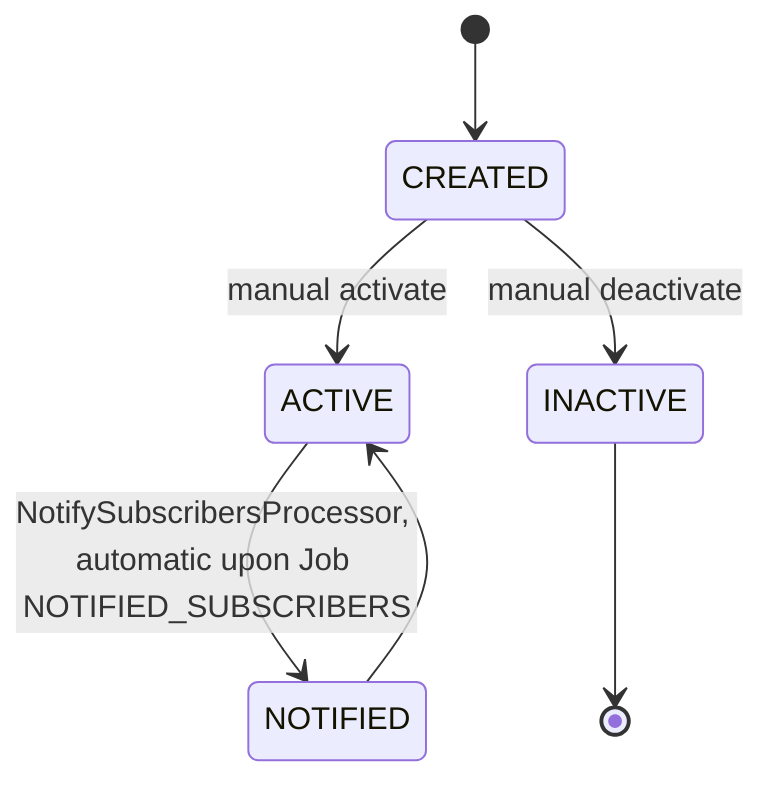
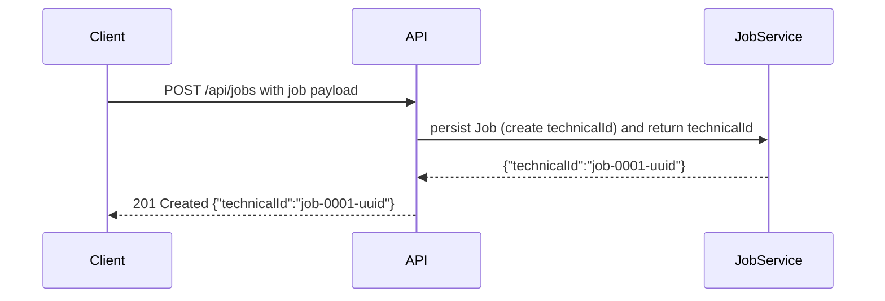
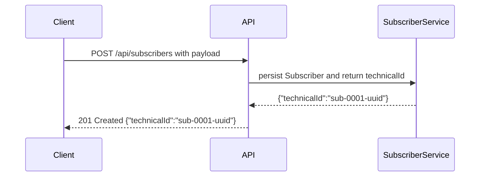
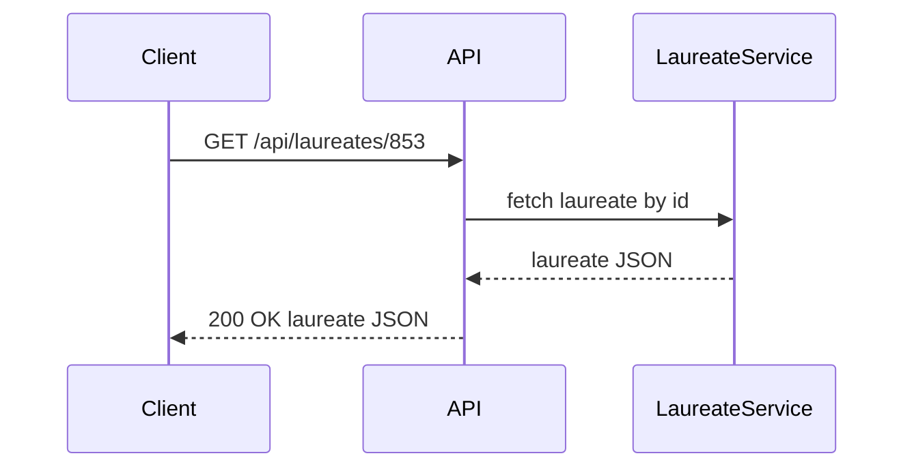

Note: You specified 3 core entities (Job, Laureate, Subscriber). I will define exactly those 3 entities and their workflows. I will not add additional entities.

# Functional Requirements — Nobel Laureates Data Ingestion (Final)

## 1. Entity Definitions
```
Job:
- id: Long (business id from system or source if applicable)
- technicalId: String (datastore-imitation technical identifier returned by POST endpoints)
- sourceUrl: String (API or data source, e.g., https://public.opendatasoft.com/api/explore/v2.1/catalog/datasets/nobel-prize-laureates/records?limit=1)
- scheduledTime: String (ISO-8601 datetime when job is scheduled)
- startTime: String (ISO-8601 datetime when ingestion started)
- endTime: String (ISO-8601 datetime when ingestion finished)
- status: String (current lifecycle state e.g., SCHEDULED, INGESTING, SUCCEEDED, FAILED, NOTIFIED_SUBSCRIBERS)
- fetchedRecordCount: Integer (number of laureate records fetched)
- succeededCount: Integer (number of records successfully processed)
- failedCount: Integer (number of records failed during processing)
- errorDetails: String (detailed error / stacktrace if failure)
- config: String (JSON blob with job-specific configuration like limit, filters)

Laureate:
- id: Integer (business id from OpenDataSoft record id field)
- firstname: String (laureate given name)
- surname: String (laureate family name)
- gender: String (gender from source)
- born: String (ISO-8601 date of birth)
- died: String (ISO-8601 date of death or null)
- borncountry: String (country name of birth)
- borncountrycode: String (country code of birth)
- borncity: String (birth city)
- year: String (award year)
- category: String (award category, e.g., Chemistry)
- motivation: String (motivation text)
- affiliationName: String (affiliation name from source, mapped from name)
- affiliationCity: String (affiliation city)
- affiliationCountry: String (affiliation country)
- ageAtAward: Integer (enrichment: calculated age at award if born/year available)
- normalizedCountryCode: String (enrichment: standardized country code)
- dataValidated: Boolean (true if Validation Processor passed)
- dataEnriched: Boolean (true if Enrichment Processor succeeded)
- sourceJobTechnicalId: String (technicalId of Job that created/updated this laureate)

Subscriber:
- id: Long (business id)
- technicalId: String (datastore-imitation technical identifier returned by POST endpoints)
- contactType: String (email, webhook, etc.)
- contactDetails: String (email address or webhook URL or other contact payload)
- active: Boolean (is subscriber active)
- preferences: String (JSON blob with subscriber preferences e.g., notifyOnSuccess, notifyOnFailure, filters)
- lastNotifiedAt: String (ISO-8601 datetime)
```

---

## 2. Entity workflows

Important EDA concept applied: Each entity ADD (persistence) is an EVENT that triggers automatic processing. When Job is persisted Cyoda starts the Job workflow. When Laureate is persisted (via Job processing) Cyoda starts Laureate workflow (validation, enrichment). Subscriber persistence does not start orchestration but persistence allows notifications.

### Job workflow:
1. Initial State: Job created with SCHEDULED status (automatic on POST)  
2. Start/Ingesting: System triggers ingestion from sourceUrl at scheduledTime or immediately (automatic)  
3. Fetching: Retrieve JSON from OpenDataSoft endpoint (automatic)  
4. RecordDistribution: For each laureate record fetched, persist Laureate entity (each persistence is an EVENT) and increment counters (automatic)  
5. Post-Processing: After processing records, update counts and set SUCCEEDED or FAILED (automatic)  
6. Notification: Transition to NOTIFIED_SUBSCRIBERS and trigger NotifySubscribersProcessor to send notifications to active Subscribers (automatic)  
7. Final: Job lifecycle ends after NOTIFIED_SUBSCRIBERS


```mermaid
stateDiagram-v2
    [*] --> SCHEDULED
    SCHEDULED --> INGESTING : IngestJobProcessor / at scheduledTime, automatic
    INGESTING --> FETCHING : FetchRecordsProcessor, automatic
    FETCHING --> RECORD_DISTRIBUTION : ForEachRecordProcessor, automatic
    RECORD_DISTRIBUTION --> SUCCEEDED : if all records processed successfully
    RECORD_DISTRIBUTION --> FAILED : if any fatal errors
    SUCCEEDED --> NOTIFIED_SUBSCRIBERS : NotifySubscribersProcessor, automatic
    FAILED --> NOTIFIED_SUBSCRIBERS : NotifySubscribersProcessor, automatic
    NOTIFIED_SUBSCRIBERS --> [*]
```

Processors and Criteria needed for Job:
- IngestJobProcessor (Java class) — fetches data from sourceUrl and emits/persists Laureate entities.
  Pseudo-code:
  ```
  class IngestJobProcessor {
      void process(Job job) {
          try {
              job.startTime = now()
              response = httpGet(job.sourceUrl) // uses Jackson or Gson to parse
              records = parseJson(response)
              for (record in records) {
                  persist Laureate (map record fields)
              }
              job.succeededCount = countSuccessful
              job.failedCount = countFailed
              job.status = SUCCEEDED
          } catch (Exception e) {
              job.status = FAILED
              job.errorDetails = e.stackTrace
          } finally {
              job.endTime = now()
              persist job
          }
      }
  }
  ```
- FetchRecordsProcessor (could be part of IngestJobProcessor or separate)  
- ForEachRecordProcessor — iterates records and persists Laureate  
- JobCompleteCriterion — checks if job processing finished (counts match)  
- NotifySubscribersProcessor — triggers notifications (email/webhook) to active subscribers  
  Pseudo-code:
  ```
  class NotifySubscribersProcessor {
      void process(Job job) {
          subscribers = query active subscribers with preferences matching job
          for (s in subscribers) {
              if (s.contactType == "email") sendEmail(s.contactDetails, buildPayload(job))
              if (s.contactType == "webhook") httpPost(s.contactDetails, buildPayload(job))
              s.lastNotifiedAt = now()
              persist s
          }
          job.status = NOTIFIED_SUBSCRIBERS
          persist job
      }
  }
  ```

---

### Laureate workflow:
1. Initial State: Laureate persisted by Job processing (automatic on persist event)  
2. Validation: Run Validation Processor to verify required fields and formats (automatic)  
3. Enrichment: If validation passes, run Enrichment Processor to compute ageAtAward, normalize country codes (automatic)  
4. Persist Enriched Data: Update dataValidated/dataEnriched flags (automatic)  
5. Final: If enrichment fails, mark record as failed and log error; otherwise remain stored for retrieval (automatic/manual remediation possible)


```mermaid
stateDiagram-v2
    [*] --> PERSISTED
    PERSISTED --> VALIDATING : ValidationProcessor, automatic
    VALIDATING --> VALIDATION_FAILED : if validation fails
    VALIDATING --> ENRICHING : if validation succeeds
    ENRICHING --> ENRICHMENT_FAILED : if enrichment fails
    ENRICHING --> COMPLETED : if enrichment succeeds
    VALIDATION_FAILED --> AWAIT_MANUAL_REVIEW : manual
    ENRICHMENT_FAILED --> AWAIT_MANUAL_REVIEW : manual
    AWAIT_MANUAL_REVIEW --> COMPLETED : manual fix applied
    COMPLETED --> [*]
```

Processors and Criteria needed for Laureate:
- ValidationProcessor  
  Pseudo-code:
  ```
  class ValidationProcessor {
      ValidationResult validate(Laureate l) {
          if (l.id == null) return fail("id missing")
          if (l.firstname == null && l.surname == null) return fail("name missing")
          if (l.year == null) return fail("year missing")
          // date format checks for born/died
          return success()
      }
      void process(Laureate l) {
          result = validate(l)
          if (!result.success) {
              l.dataValidated = false
              persist l with errorDetails
              return
          }
          l.dataValidated = true
          persist l
      }
  }
  ```
- EnrichmentProcessor  
  Pseudo-code:
  ```
  class EnrichmentProcessor {
      void process(Laureate l) {
          if (!l.dataValidated) return
          try {
              l.ageAtAward = computeAgeAtAward(l.born, l.year)
              l.normalizedCountryCode = normalizeCountry(l.borncountrycode)
              l.dataEnriched = true
          } catch (Exception e) {
              l.dataEnriched = false
              // attach enrichment error details
          } finally {
              persist l
          }
      }
  }
  ```
- ValidationCriterion (used to decide whether to run enrichment)  
- EnrichmentCriterion (e.g., only enrich if born and year present)

---

### Subscriber workflow:
1. Initial State: Subscriber persisted via POST (manual creation by user)  
2. Activation: Subscriber can be active or inactive (manual)  
3. Notification: When Job reaches SUCCEEDED or FAILED and NOTIFIED_SUBSCRIBERS is triggered, subscribers that are active and match preferences receive notifications (automatic)  
4. Deactivation: Manual deactivation triggers stop of further notifications (manual)


```mermaid
stateDiagram-v2
    [*] --> CREATED
    CREATED --> ACTIVE : manual activate
    CREATED --> INACTIVE : manual deactivate
    ACTIVE --> NOTIFIED : NotifySubscribersProcessor, automatic upon Job NOTIFIED_SUBSCRIBERS
    NOTIFIED --> ACTIVE
    INACTIVE --> [*]
```

Processors/Criterion for Subscriber:
- NotifySubscribersProcessor (described under Job)  
- SubscriberPreferenceCriterion (decides which subscribers get a particular job notification based on preferences)  
- DeliveryProcessor (per-subscriber delivery adapter supporting email and webhook)  
  Pseudo-code:
  ```
  class DeliveryProcessor {
      void deliver(Subscriber s, Job job, Optional<List<Laureate>> payload) {
          if (s.contactType == "email") EmailClient.send(s.contactDetails, buildEmail(job, payload))
          if (s.contactType == "webhook") HttpClient.post(s.contactDetails, buildJson(job, payload))
      }
  }
  ```

---

### Criteria & Processor summary (classes to implement)
- IngestJobProcessor  
- FetchRecordsProcessor (optional split)  
- ForEachRecordProcessor  
- JobCompleteCriterion  
- NotifySubscribersProcessor  
- ValidationProcessor  
- EnrichmentProcessor  
- ValidationCriterion  
- EnrichmentCriterion  
- SubscriberPreferenceCriterion  
- DeliveryProcessor

Note: Use Jackson or Gson for JSON parsing/serialization. Use asynchronous processing and scheduling via Quartz or Spring Scheduler. Use OpenDataSoft API endpoint: https://public.opendatasoft.com/api/explore/v2.1/catalog/datasets/nobel-prize-laureates/records?limit=1 for testing; full ingestion may hit https://public.opendatasoft.com/api/explore/v2.1/catalog/datasets/nobel-prize-laureates/records.

---

## 3. API Endpoints (design rules applied)

Rules applied:
- POST endpoints trigger events. POST returns only technicalId in response.  
- GET endpoints only for retrieving stored results.  
- GET by technicalId present for entities created via POST.  
- GET by condition not included (user did not explicitly request such endpoints).  
- GET all optional (I include GET all for Laureate as useful, but you can remove it).  

### 1) Job endpoints (orchestration entity)
- POST /api/jobs
  - Request JSON:
    ```
    {
      "sourceUrl": "https://public.opendatasoft.com/api/explore/v2.1/catalog/datasets/nobel-prize-laureates/records?limit=1",
      "scheduledTime": "2025-08-20T10:00:00Z",
      "config": "{ \"limit\": 100 }"
    }
    ```
  - Response JSON (must contain only technicalId):
    ```
    {
      "technicalId": "job-0001-uuid"
    }
    ```
- GET /api/jobs/{technicalId}
  - Response JSON (stored Job result):
    ```
    {
      "technicalId": "job-0001-uuid",
      "sourceUrl": "...",
      "scheduledTime": "2025-08-20T10:00:00Z",
      "startTime": "2025-08-20T10:00:05Z",
      "endTime": "2025-08-20T10:01:30Z",
      "status": "NOTIFIED_SUBSCRIBERS",
      "fetchedRecordCount": 10,
      "succeededCount": 10,
      "failedCount": 0,
      "errorDetails": null,
      "config": "{ \"limit\": 100 }"
    }
    ```

Mermaid visualization for Job POST flow:

```mermaid
sequenceDiagram
    participant Client
    participant API
    participant JobService
    Client->>API: POST /api/jobs with job payload
    API->>JobService: persist Job (create technicalId) and return technicalId
    JobService-->>API: {"technicalId":"job-0001-uuid"}
    API-->>Client: 201 Created {"technicalId":"job-0001-uuid"}
```

---

### 2) Subscriber endpoints (business entity created via POST)
- POST /api/subscribers
  - Request JSON:
    ```
    {
      "contactType": "webhook",
      "contactDetails": "https://example.com/webhook",
      "preferences": "{ \"notifyOnSuccess\": true, \"notifyOnFailure\": true }"
    }
    ```
  - Response JSON:
    ```
    {
      "technicalId": "sub-0001-uuid"
    }
    ```
- GET /api/subscribers/{technicalId}
  - Response JSON:
    ```
    {
      "technicalId": "sub-0001-uuid",
      "contactType": "webhook",
      "contactDetails": "https://example.com/webhook",
      "active": true,
      "preferences": "{ \"notifyOnSuccess\": true, \"notifyOnFailure\": true }",
      "lastNotifiedAt": "2025-08-20T10:02:00Z"
    }
    ```

Mermaid visualization for Subscriber POST flow:

```mermaid
sequenceDiagram
    participant Client
    participant API
    participant SubscriberService
    Client->>API: POST /api/subscribers with payload
    API->>SubscriberService: persist Subscriber and return technicalId
    SubscriberService-->>API: {"technicalId":"sub-0001-uuid"}
    API-->>Client: 201 Created {"technicalId":"sub-0001-uuid"}
```

---

### 3) Laureate endpoints (business entity created via Job processing — no POST endpoint recommended)
- GET /api/laureates/{id}
  - Response JSON:
    ```
    {
      "id": 853,
      "firstname": "Akira",
      "surname": "Suzuki",
      "gender": "male",
      "born": "1930-09-12",
      "died": null,
      "borncountry": "Japan",
      "borncountrycode": "JP",
      "borncity": "Mukawa",
      "year": "2010",
      "category": "Chemistry",
      "motivation": "for palladium-catalyzed cross couplings in organic synthesis",
      "affiliationName": "Hokkaido University",
      "affiliationCity": "Sapporo",
      "affiliationCountry": "Japan",
      "ageAtAward": 80,
      "normalizedCountryCode": "JP",
      "dataValidated": true,
      "dataEnriched": true,
      "sourceJobTechnicalId": "job-0001-uuid"
    }
    ```
- GET /api/laureates (optional GET all)
  - Response: array of laureate JSON objects as above.

Mermaid visualization for Laureate GET flow:

```mermaid
sequenceDiagram
    participant Client
    participant API
    participant LaureateService
    Client->>API: GET /api/laureates/853
    API->>LaureateService: fetch laureate by id
    LaureateService-->>API: laureate JSON
    API-->>Client: 200 OK laureate JSON
```

Notes on POST behavior and technicalId:
- All POST endpoints (Jobs, Subscribers) must return only {"technicalId":"..."} in the response body.  
- The POST itself persists the entity and triggers the corresponding workflows automatically via Cyoda EDA semantics (persistence -> process method).  
- Laureate entities are created by Job processing (IngestJobProcessor) and therefore do not have a POST endpoint; they are retrievable via GET endpoints.

---

## Additional preserved implementation notes
- Use asynchronous processing for ingestion and notification.  
- Provide error handling/logging per state transition.  
- Prefer JSON parsing libraries like Jackson or Gson for processing responses.  
- Configure job scheduling using libraries like Quartz or Spring Scheduler.  
- Data source: OpenDataSoft API endpoint https://public.opendatasoft.com/api/explore/v2.1/catalog/datasets/nobel-prize-laureates/records

---

## Questions (from original confirmation)
1. Should Subscribers support both email and webhook out of the box, or only webhooks?  
2. For Laureate primary key, do you want to rely on OpenDataSoft record id as Laureate.id, or generate an internal id?  
3. Do you want Job to support incremental runs (store last processed offset) or only full fetch per scheduled run?

---

Please review the generated entities and workflows. If you need any changes, please let me know. Feel free to click Approve if this requirement meets your expectations or if you are ready to proceed.