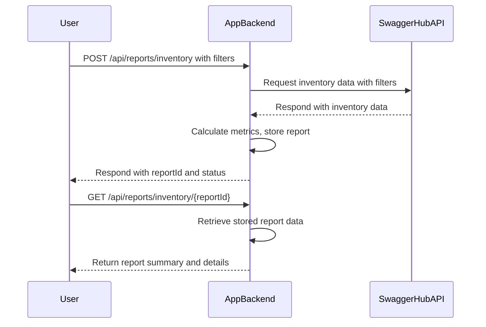
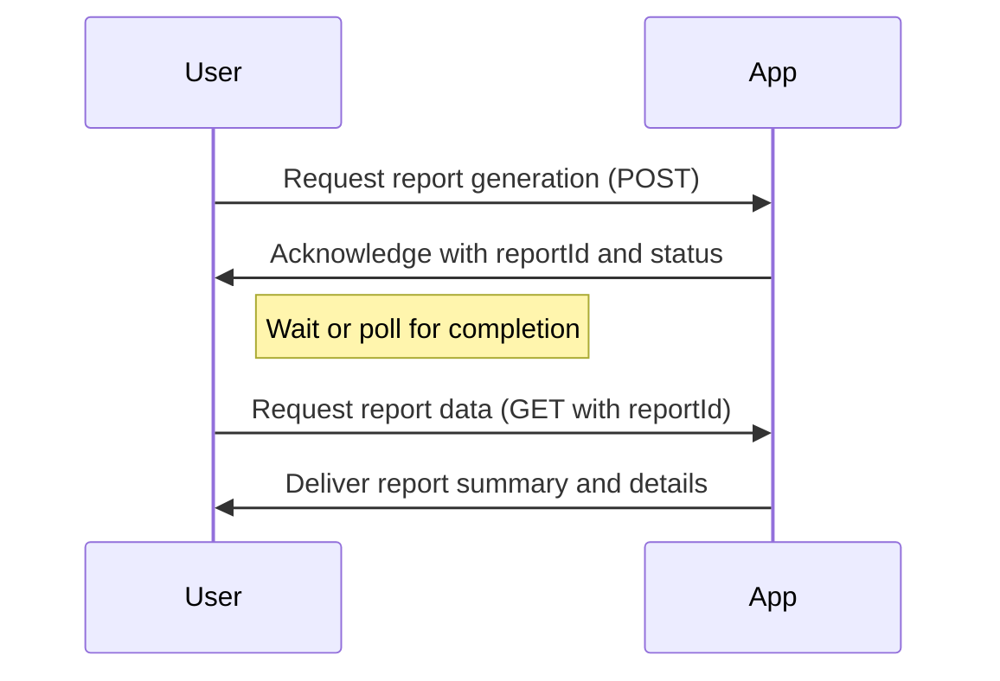

# Functional Requirements and API Design for Inventory Reporting Application

## API Endpoints

### 1. Generate Inventory Report  
**Endpoint:** `POST /api/reports/inventory`  
**Description:**  
Triggers the retrieval of inventory data from the external SwaggerHub API, applies optional filtering, computes key metrics (total items, average price, total value, etc.), and stores the report result for later retrieval.  

**Request Body (JSON):**  
```json
{
  "filters": {
    "category": "string",          // optional
    "minPrice": "number",          // optional
    "maxPrice": "number",          // optional
    "dateFrom": "string (ISO8601)", // optional
    "dateTo": "string (ISO8601)"    // optional
  }
}
```

**Response (JSON):**  
```json
{
  "reportId": "string",           // unique identifier for the generated report
  "status": "string"              // e.g. "processing", "completed", "failed"
}
```

---

### 2. Retrieve Report Summary  
**Endpoint:** `GET /api/reports/inventory/{reportId}`  
**Description:**  
Returns the summarized report data for a previously generated report, including key metrics and detailed data for display.

**Response (JSON):**  
```json
{
  "reportId": "string",
  "generatedAt": "string (ISO8601)",
  "metrics": {
    "totalItems": "number",
    "averagePrice": "number",
    "totalValue": "number"
  },
  "data": [
    {
      "itemId": "string",
      "name": "string",
      "category": "string",
      "price": "number",
      "quantity": "number"
    }
  ]
}
```

---

## Business Logic Overview  
- The `POST /api/reports/inventory` endpoint will:  
  - Accept filter parameters.  
  - Call the external SwaggerHub API to fetch matching inventory data.  
  - Calculate metrics based on retrieved data.  
  - Store the report and return a report ID with status.  

- The `GET /api/reports/inventory/{reportId}` endpoint will:  
  - Retrieve stored report data by ID.  
  - Return the summary and detailed data ready for frontend presentation.

---

## User-App Interaction Sequence Diagram


```mermaid
sequenceDiagram
    participant User
    participant AppBackend
    participant SwaggerHubAPI
    
    User->>AppBackend: POST /api/reports/inventory with filters
    AppBackend->>SwaggerHubAPI: Request inventory data with filters
    SwaggerHubAPI-->>AppBackend: Respond with inventory data
    AppBackend->>AppBackend: Calculate metrics, store report
    AppBackend-->>User: Respond with reportId and status
    
    User->>AppBackend: GET /api/reports/inventory/{reportId}
    AppBackend->>AppBackend: Retrieve stored report data
    AppBackend-->>User: Return report summary and details
```

---

## User Journey Diagram


```mermaid
sequenceDiagram
    participant User
    participant App
    
    User->>App: Request report generation (POST)
    App->>User: Acknowledge with reportId and status
    
    Note right of User: Wait or poll for completion
    
    User->>App: Request report data (GET with reportId)
    App->>User: Deliver report summary and details
```