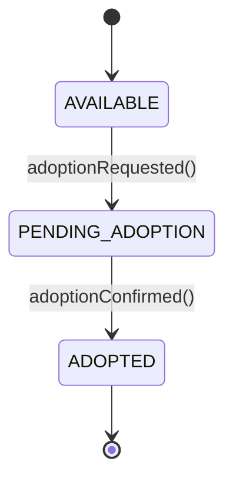
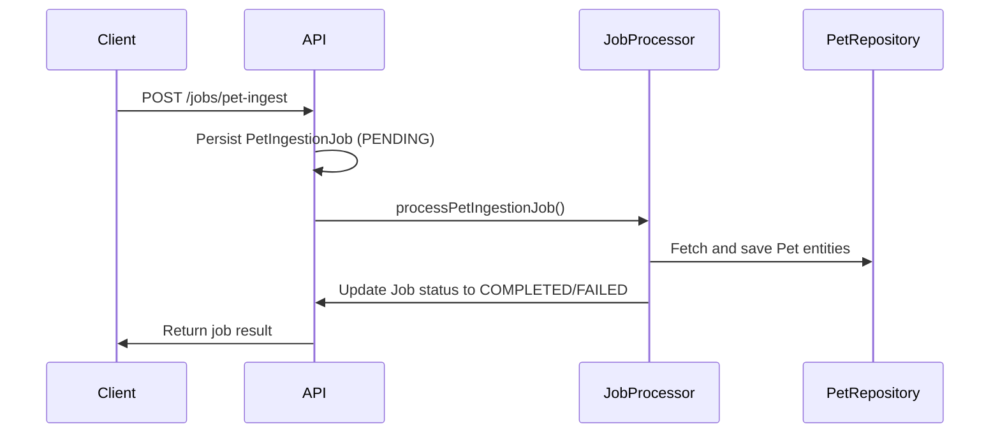

Certainly! Here is the well-formatted final version of the functional requirements for your 'Purrfect Pets' API app using Event-Driven Architecture:

---

### 1. Entity Definitions

``` 
PetIngestionJob:
- id: UUID (unique job identifier)
- createdAt: DateTime (job creation timestamp)
- sourceUrl: String (URL of Petstore API or data source)
- status: JobStatusEnum (PENDING, PROCESSING, COMPLETED, FAILED)

Pet:
- id: UUID (unique pet identifier)
- name: String (pet name)
- category: String (pet category, e.g., cat, dog)
- photoUrls: List<String> (images of the pet)
- tags: List<String> (descriptive tags)
- status: PetStatusEnum (AVAILABLE, PENDING_ADOPTION, ADOPTED)
```

---

### 2. Process Method Flows

```
processPetIngestionJob() Flow:
1. Initial State: PetIngestionJob created with PENDING status
2. Validation: Verify sourceUrl is reachable and valid
3. Processing: Fetch pet data from Petstore API, transform & persist Pet entities
4. Completion: Update PetIngestionJob status to COMPLETED or FAILED
5. Notification: (Optional) Log job result or notify downstream systems

processPet() Flow:
1. Initial State: Pet created with status AVAILABLE
2. Validation: Check pet data integrity (e.g., name not empty)
3. Processing: No heavy processing needed; ready for API retrieval
4. Completion: Status remains unless updated by new immutable event (e.g., adoption)
```

---

### 3. API Endpoints Design

| Method | Endpoint           | Purpose                                  | Request Body Example                   | Response Example                        |
|--------|--------------------|------------------------------------------|--------------------------------------|----------------------------------------|
| POST   | /jobs/pet-ingest   | Create PetIngestionJob (triggers ingestion) | `{ "sourceUrl": "https://petstore.swagger.io/v2/pet" }` | `{ "id": "...", "status": "PENDING" }` |
| POST   | /pets               | Create Pet entity (immutable)              | `{ "name": "Whiskers", "category": "cat", "photoUrls": [], "tags": [] }` | `{ "id": "...", "status": "AVAILABLE" }` |
| GET    | /pets/{id}          | Retrieve pet details                        | N/A                                  | `{ "id": "...", "name": "...", "status": "AVAILABLE" }` |
| GET    | /jobs/{id}          | Retrieve job status and results             | N/A                                  | `{ "id": "...", "status": "COMPLETED" }` |

---

### 4. Request/Response JSON Formats

**POST /jobs/pet-ingest Request**
```json
{
  "sourceUrl": "https://petstore.swagger.io/v2/pet"
}
```

**POST /jobs/pet-ingest Response**
```json
{
  "id": "uuid-string",
  "status": "PENDING"
}
```

**POST /pets Request**
```json
{
  "name": "Whiskers",
  "category": "cat",
  "photoUrls": ["http://example.com/cat.jpg"],
  "tags": ["cute", "fluffy"]
}
```

**POST /pets Response**
```json
{
  "id": "uuid-string",
  "status": "AVAILABLE"
}
```

**GET /pets/{id} Response**
```json
{
  "id": "uuid-string",
  "name": "Whiskers",
  "category": "cat",
  "photoUrls": ["http://example.com/cat.jpg"],
  "tags": ["cute", "fluffy"],
  "status": "AVAILABLE"
}
```

---

### Mermaid Diagrams

**PetIngestionJob Lifecycle**


```mermaid
stateDiagram-v2
    [*] --> PENDING
    PENDING --> PROCESSING : processPetIngestionJob()
    PROCESSING --> COMPLETED : success
    PROCESSING --> FAILED : error
    COMPLETED --> [*]
    FAILED --> [*]
```

**Pet Lifecycle**


```mermaid
stateDiagram-v2
    [*] --> AVAILABLE
    AVAILABLE --> PENDING_ADOPTION : adoptionRequested()
    PENDING_ADOPTION --> ADOPTED : adoptionConfirmed()
    ADOPTED --> [*]
```

**Event-Driven Processing Chain**


```mermaid
sequenceDiagram
    participant Client
    participant API
    participant JobProcessor
    participant PetRepository

    Client->>API: POST /jobs/pet-ingest
    API->>API: Persist PetIngestionJob (PENDING)
    API->>JobProcessor: processPetIngestionJob()
    JobProcessor->>PetRepository: Fetch and save Pet entities
    JobProcessor->>API: Update Job status to COMPLETED/FAILED
    API->>Client: Return job result
```

---

If you have no further changes, I can proceed to implementation based on these requirements. Please let me know!