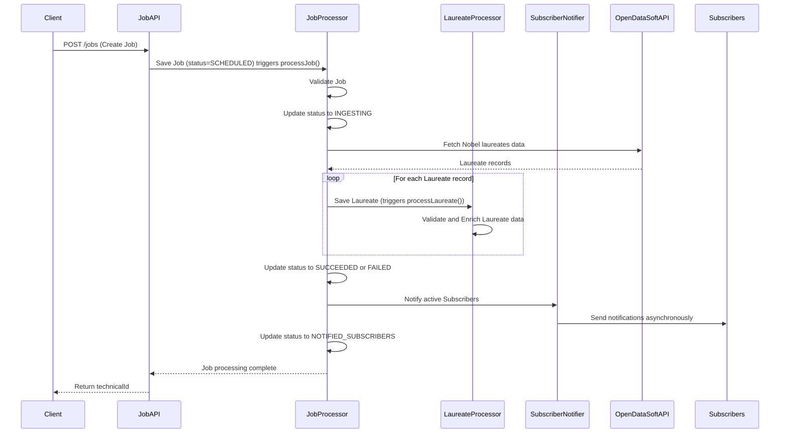
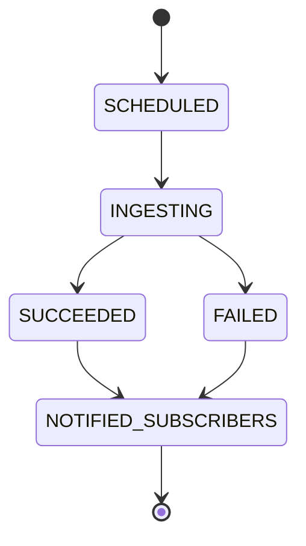

### 1. Entity Definitions

```
Job:
- jobName: String (Name/identifier of the ingestion job)
- status: String (Current job status: SCHEDULED, INGESTING, SUCCEEDED, FAILED, NOTIFIED_SUBSCRIBERS)
- triggerTime: String (Timestamp when the job was scheduled)
- ingestionResult: String (Summary or metadata of ingestion outcome)

Laureate:
- laureateId: Integer (Unique identifier from source)
- firstname: String (First name of laureate)
- surname: String (Surname of laureate)
- born: String (Date of birth)
- died: String (Date of death, nullable)
- borncountry: String (Country of birth)
- borncountrycode: String (Country code of birth)
- borncity: String (City of birth)
- gender: String (Gender)
- year: String (Year awarded)
- category: String (Nobel Prize category)
- motivation: String (Award motivation)
- affiliationName: String (Affiliated institution name)
- affiliationCity: String (Affiliated institution city)
- affiliationCountry: String (Affiliated institution country)

Subscriber:
- subscriberId: String (Unique subscriber identifier)
- contactEmail: String (Subscriber email address for notifications)
- active: Boolean (Indicates if subscriber is active and should receive notifications)
```

---

### 2. Process Method Flows

```
processJob() Flow:
1. Initial State: Job entity created with status = SCHEDULED
2. Validation: Validate job parameters and scheduling constraints if any
3. Processing: 
   - Change status to INGESTING
   - Fetch Nobel laureates data asynchronously from OpenDataSoft API
   - For each laureate record, save a new Laureate entity (triggers processLaureate())
4. Completion: 
   - If ingestion successful, update Job status to SUCCEEDED
   - Otherwise, update Job status to FAILED
5. Notification:
   - Trigger notification to all active Subscribers
   - Update Job status to NOTIFIED_SUBSCRIBERS
```

```
processLaureate() Flow:
1. Validation: Check required laureate data fields are present and valid
2. Enrichment: Normalize fields (e.g., country codes), calculate derived attributes if needed
3. Persistence: Save laureate data as immutable entity record
4. No further processing unless explicitly triggered
```

```
processSubscriber() Flow:
1. Validation: Verify contact email is valid and subscriber is active
2. Persistence: Save subscriber entity
3. No further processing unless explicit notification or subscription management is requested
```

---

### 3. API Endpoints Design

#### Job Endpoints
- **POST /jobs**  
  - Creates a new Job entity (immutable creation, triggers processJob)  
  - Request JSON:  
    ```json
    {
      "jobName": "Ingest Nobel Laureates Data",
      "triggerTime": "2024-07-01T09:00:00Z"
    }
    ```  
  - Response JSON:  
    ```json
    {
      "technicalId": "generated-job-uuid"
    }
    ```

- **GET /jobs/{technicalId}**  
  - Retrieves Job entity by technicalId  
  - Response JSON example:  
    ```json
    {
      "jobName": "Ingest Nobel Laureates Data",
      "status": "NOTIFIED_SUBSCRIBERS",
      "triggerTime": "2024-07-01T09:00:00Z",
      "ingestionResult": "150 laureates ingested successfully"
    }
    ```

#### Laureate Endpoints
- **GET /laureates/{technicalId}**  
  - Retrieve stored laureate data by technicalId  
  - Response JSON example:  
    ```json
    {
      "laureateId": 853,
      "firstname": "Akira",
      "surname": "Suzuki",
      "born": "1930-09-12",
      "died": null,
      "borncountry": "Japan",
      "borncountrycode": "JP",
      "borncity": "Mukawa",
      "gender": "male",
      "year": "2010",
      "category": "Chemistry",
      "motivation": "\"for palladium-catalyzed cross couplings in organic synthesis\"",
      "affiliationName": "Hokkaido University",
      "affiliationCity": "Sapporo",
      "affiliationCountry": "Japan"
    }
    ```

#### Subscriber Endpoints
- **POST /subscribers**  
  - Creates a new Subscriber entity (immutable creation, triggers processSubscriber)  
  - Request JSON:  
    ```json
    {
      "contactEmail": "subscriber@example.com",
      "active": true
    }
    ```  
  - Response JSON:  
    ```json
    {
      "technicalId": "generated-subscriber-uuid"
    }
    ```

- **GET /subscribers/{technicalId}**  
  - Retrieves Subscriber entity by technicalId  
  - Response JSON example:  
    ```json
    {
      "subscriberId": "generated-subscriber-uuid",
      "contactEmail": "subscriber@example.com",
      "active": true
    }
    ```

---

### 4. Mermaid Diagrams


```mermaid
sequenceDiagram
    participant Client
    participant JobAPI
    participant JobProcessor
    participant LaureateProcessor
    participant SubscriberNotifier

    Client->>JobAPI: POST /jobs (Create Job)
    JobAPI->>JobProcessor: Save Job (status=SCHEDULED) triggers processJob()
    JobProcessor->>JobProcessor: Validate Job
    JobProcessor->>JobProcessor: Update status to INGESTING
    JobProcessor->>OpenDataSoftAPI: Fetch Nobel laureates data
    OpenDataSoftAPI-->>JobProcessor: Laureate records
    loop For each Laureate record
        JobProcessor->>LaureateProcessor: Save Laureate (triggers processLaureate())
        LaureateProcessor->>LaureateProcessor: Validate and Enrich Laureate data
    end
    JobProcessor->>JobProcessor: Update status to SUCCEEDED or FAILED
    JobProcessor->>SubscriberNotifier: Notify active Subscribers
    SubscriberNotifier->>Subscribers: Send notifications asynchronously
    JobProcessor->>JobProcessor: Update status to NOTIFIED_SUBSCRIBERS
    JobProcessor-->>JobAPI: Job processing complete
    JobAPI-->>Client: Return technicalId
```


```mermaid
stateDiagram-v2
    [*] --> SCHEDULED
    SCHEDULED --> INGESTING
    INGESTING --> SUCCEEDED
    INGESTING --> FAILED
    SUCCEEDED --> NOTIFIED_SUBSCRIBERS
    FAILED --> NOTIFIED_SUBSCRIBERS
    NOTIFIED_SUBSCRIBERS --> [*]
```