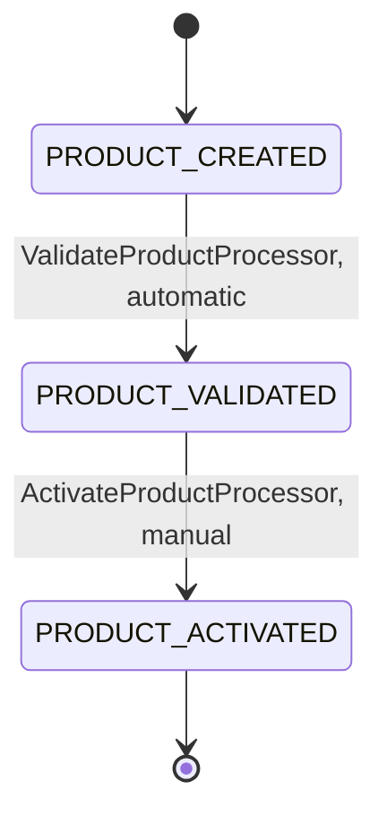
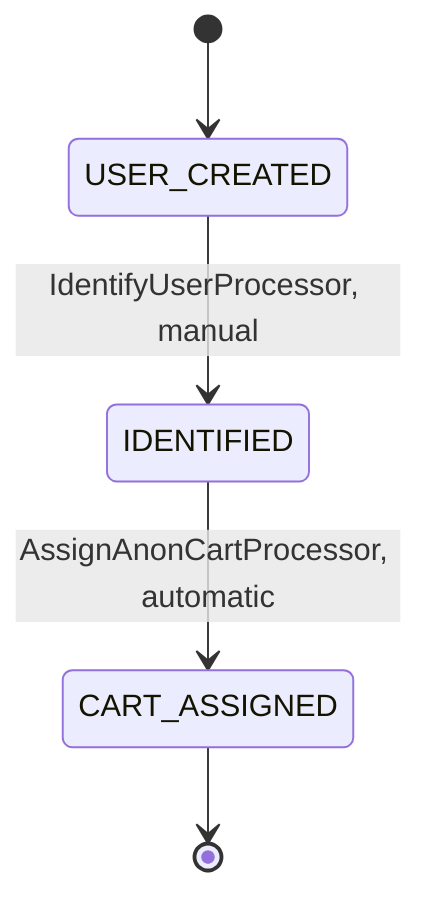
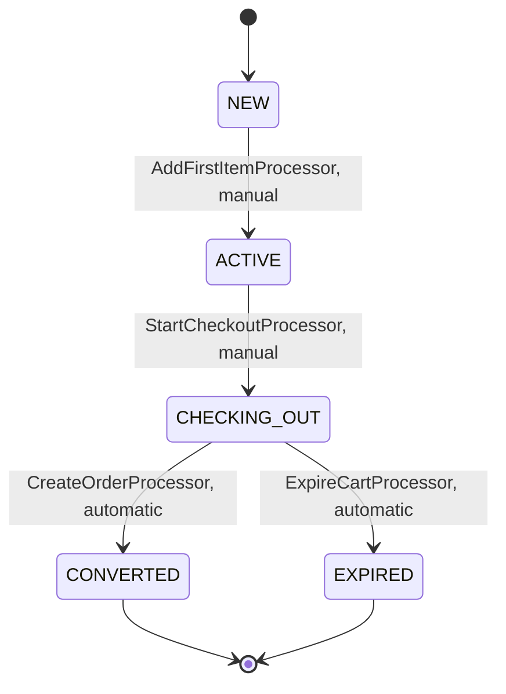
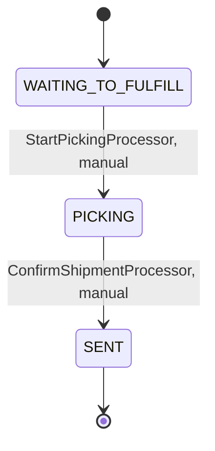
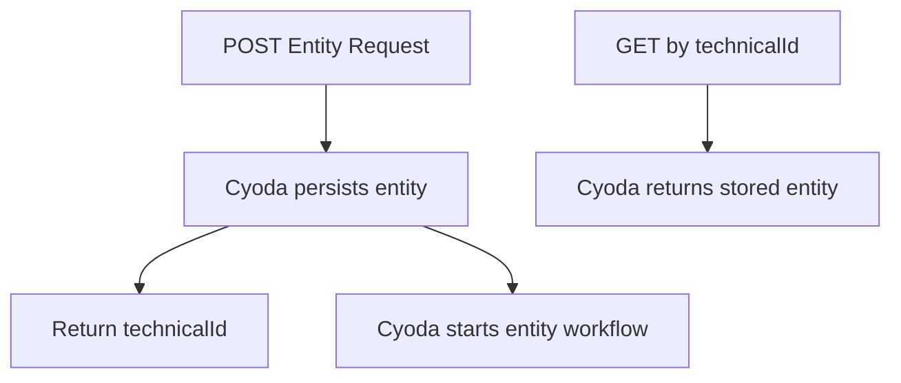

### 1. Entity Definitions
(Using only the 5 entities you specified: Product, Cart, Order, User, Address)

```
Product:
- sku: string (key)
- name: string
- description: string
- price: number
- quantityAvailable: number
- category: string (optional)
- imageUrl: string (optional)
- active: boolean
- created_at: string
- updated_at: string

User:
- userId: string (key)
- name: string
- email: string
- phone: string
- identity_state: string (allowed values ANON IDENTIFIED)
- created_at: string
- updated_at: string

Address:
- addressId: string (key)
- userId: string
- line1: string
- city: string
- postcode: string
- country: string
- created_at: string
- updated_at: string

Cart:
- cartId: string (key)
- userId: string (nullable)
- lines: array of { sku:string, name:string, price:number, qty:number, lineTotal:number }
- totalItems: number
- grandTotal: number
- status: string (allowed values NEW ACTIVE CHECKING_OUT CONVERTED)
- last_activity_at: string
- expires_at: string
- created_at: string
- updated_at: string

Order:
- orderId: string (key)
- orderNumber: string (sequential numeric)
- userId: string
- shippingAddressId: string
- lines: array of { sku:string, name:string, unitPrice:number, qty:number, lineTotal:number }
- totals: { items:number, grand:number }
- status: string (allowed values WAITING_TO_FULFILL PICKING SENT)
- createdAt: string
- updated_at: string
- state_transitions: array of { from:string, to:string, actor:string, timestamp:string, note:string }
```

### 2. Entity workflows

Product workflow:
1. Initial: Product created (persist event)
2. Validation: Validate price and quantity
3. Activation: set active true/false
4. Completion: Product ready for sale


```mermaid
stateDiagram-v2
    [*] --> PRODUCT_CREATED
    PRODUCT_CREATED --> PRODUCT_VALIDATED : ValidateProductProcessor, automatic
    PRODUCT_VALIDATED --> PRODUCT_ACTIVATED : ActivateProductProcessor, manual
    PRODUCT_ACTIVATED --> [*]
```

Processors/criteria: ValidateProductProcessor, ActivateProductProcessor. Criteria: PriceValidCriterion, QuantityNonNegativeCriterion.

User workflow:
1. Initial: User created (ANON or IDENTIFIED)
2. Identification: If ANON -> IDENTIFIED on identification event
3. Cart assignment: assign ANON cart to user


```mermaid
stateDiagram-v2
    [*] --> USER_CREATED
    USER_CREATED --> IDENTIFIED : IdentifyUserProcessor, manual
    IDENTIFIED --> CART_ASSIGNED : AssignAnonCartProcessor, automatic
    CART_ASSIGNED --> [*]
```

Processors/criteria: IdentifyUserProcessor, AssignAnonCartProcessor. Criteria: HasAnonCartCriterion.

Cart workflow:
1. Initial: NEW on create
2. ACTIVE: item added
3. CHECKING_OUT: user begins checkout (requires address)
4. CONVERTED: Order created (decrement inventory)
5. Expiry: system deletes cart after 24h inactivity


```mermaid
stateDiagram-v2
    [*] --> NEW
    NEW --> ACTIVE : AddFirstItemProcessor, manual
    ACTIVE --> CHECKING_OUT : StartCheckoutProcessor, manual
    CHECKING_OUT --> CONVERTED : CreateOrderProcessor, automatic
    CHECKING_OUT --> EXPIRED : ExpireCartProcessor, automatic
    CONVERTED --> [*]
    EXPIRED --> [*]
```

Processors/criteria: AddFirstItemProcessor, StartCheckoutProcessor, CreateOrderProcessor, ExpireCartProcessor.
Criteria: AddressPresentCriterion, SufficientInventoryCriterion.

Order workflow:
1. Initial: WAITING_TO_FULFILL (created from Cart)
2. PICKING: fulfillment starts (manual)
3. SENT: shipment confirmed (manual/automatic)


```mermaid
stateDiagram-v2
    [*] --> WAITING_TO_FULFILL
    WAITING_TO_FULFILL --> PICKING : StartPickingProcessor, manual
    PICKING --> SENT : ConfirmShipmentProcessor, manual
    SENT --> [*]
```

Processors/criteria: StartPickingProcessor, ConfirmShipmentProcessor, DecrementInventoryProcessor (invoked at order creation). Criteria: InventoryReservedCriterion (final check at creation).

### 3. Pseudo code for processor classes (concise)

ValidateProductProcessor
```
process(Product p) {
  if p.price <= 0 throw ValidationError
  if p.quantityAvailable < 0 throw ValidationError
  mark p validated
}
```

AssignAnonCartProcessor
```
process(User u) {
  cart = findCartByAnonSession(u.session)
  if cart exists {
    cart.userId = u.userId
    save cart
  }
}
```

CreateOrderProcessor
```
process(Cart c) {
  if not AddressPresentCriterion(c) reject
  if not SufficientInventoryCriterion(c) reject
  order = buildOrderFromCart(c)
  save order
  call DecrementInventoryProcessor(order)
  set cart.status = CONVERTED
  save cart
}
```

ExpireCartProcessor
```
process(Cart c) {
  if now > c.expires_at delete c
}
```

DecrementInventoryProcessor
```
process(Order o) {
  for line in o.lines {
    p = loadProduct(line.sku)
    if p.quantityAvailable < line.qty throw InventoryError
    p.quantityAvailable -= line.qty
    save p
  }
}
```

### 4. API Endpoints Design Rules & JSON formats

Rules:
- POST endpoints create entities and trigger Cyoda workflows. POST must return only technicalId.
- GET endpoints retrieve by technicalId.
- No additional POST endpoints for business processing; creation triggers processing.

Example endpoints and JSON:

POST /products
Request:
{
  "sku":"P001","name":"Tshirt","description":"cotton","price":19.99,"quantityAvailable":100
}
Response:
{
  "technicalId":"tech-abc-123"
}

POST /carts
Request:
{
  "cartId":"C001","userId":null,"lines":[],"totalItems":0,"grandTotal":0,"status":"NEW"
}
Response:
{
  "technicalId":"tech-cart-001"
}

GET /entities/{technicalId}
Response:
{
  "technicalId":"tech-cart-001","entity":{ ... persisted entity ... }
}

Mermaid request/response flow

```mermaid
graph TD
    A["POST Entity Request"] --> B["Cyoda persists entity"]
    B --> C["Return technicalId"]
    B --> D["Cyoda starts entity workflow"]
    E["GET by technicalId"] --> F["Cyoda returns stored entity"]
```

If you want, I can also produce a compact Cyoda import sheet (entities + processors + criteria names) ready for handoff. Which format would you prefer next?