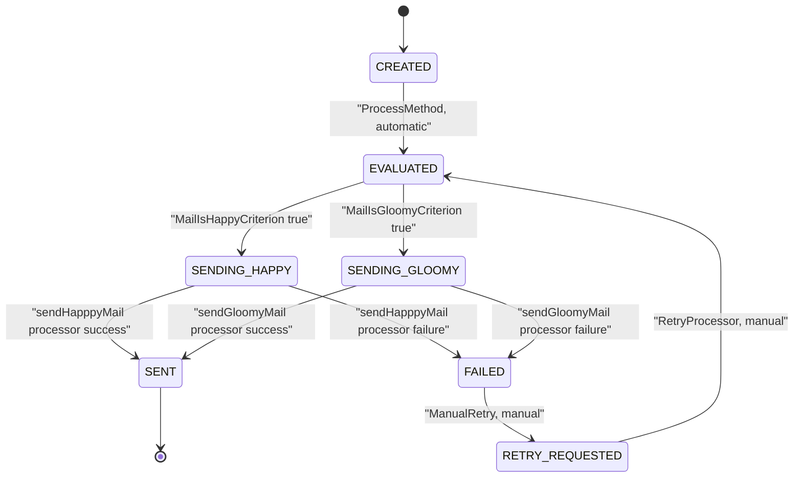

### 1. Entity Definitions
```
Mail:
- isHappy: boolean (true = happy template, false = gloomy template)
- mailList: list<string> (recipient email addresses)
```

> Note: You specified only one entity (Mail). I will use only that entity and not add others.

### 2. Entity workflows
Basic flow (EDA): persisting a Mail entity is the EVENT. Once persisted Cyoda starts the Mail workflow (process method) which evaluates criteria and routes to the appropriate processor. Include automatic processing on create; failures move to a FAILED state and a manual retry can be requested.

Mail workflow:
1. Initial State: Mail persisted (CREATED)
2. Evaluation: System runs criteria to classify happy vs gloomy
3. Sending: System invokes the matching processor (sendHapppyMail or sendGloomyMail)
4. Outcome: on success -> SENT; on failure -> FAILED
5. Manual recovery: a user may request RETRY which re-triggers evaluation/sending

Mermaid state diagram


```mermaid
stateDiagram-v2
    [*] --> CREATED
    CREATED --> EVALUATED : "ProcessMethod, automatic"
    EVALUATED --> SENDING_HAPPY : "MailIsHappyCriterion true"
    EVALUATED --> SENDING_GLOOMY : "MailIsGloomyCriterion true"
    SENDING_HAPPY --> SENT : "sendHapppyMail processor success"
    SENDING_HAPPY --> FAILED : "sendHapppyMail processor failure"
    SENDING_GLOOMY --> SENT : "sendGloomyMail processor success"
    SENDING_GLOOMY --> FAILED : "sendGloomyMail processor failure"
    FAILED --> RETRY_REQUESTED : "ManualRetry, manual"
    RETRY_REQUESTED --> EVALUATED : "RetryProcessor, manual"
    SENT --> [*]
```

Processors and criteria needed
- Criteria
  - MailIsHappyCriterion — returns true when Mail.isHappy == true
  - MailIsGloomyCriterion — returns true when Mail.isHappy == false
- Processors
  - sendHapppyMail — sends happy template to Mail.mailList
  - sendGloomyMail — sends gloomy template to Mail.mailList
- Optional helper (logical): RetryProcessor — invoked on manual retry to re-enqueue evaluation

### 3. Pseudo code for processor classes
```text
MailIsHappyCriterion:
  evaluate(mail):
    return mail.isHappy == true

MailIsGloomyCriterion:
  evaluate(mail):
    return mail.isHappy == false

sendHapppyMail (processor):
  process(mail):
    for each recipient in mail.mailList:
      send happy template to recipient
    if all deliveries successful:
      mark mail status = SENT
    else:
      mark mail status = FAILED and record failure reason

sendGloomyMail (processor):
  process(mail):
    for each recipient in mail.mailList:
      send gloomy template to recipient
    if all deliveries successful:
      mark mail status = SENT
    else:
      mark mail status = FAILED and record failure reason

RetryProcessor (manual):
  processRetry(technicalId):
    load mail by technicalId
    set status = RETRY_REQUESTED
    trigger ProcessMethod for mail (re-evaluation)
```

### 4. API Endpoints Design Rules
- POST /mails
  - Purpose: create Mail entity (triggers Cyoda event/workflow). Returns only technicalId.
  - Request:
```json
{
  "isHappy": true,
  "mailList": ["alice@example.com","bob@example.com"]
}
```
  - Response:
```json
{
  "technicalId": "generated-uuid-or-id"
}
```

- GET /mails/{technicalId}
  - Purpose: retrieve stored Mail processing result/status by technicalId
  - Response example:
```json
{
  "technicalId": "generated-uuid-or-id",
  "isHappy": true,
  "mailList": ["alice@example.com","bob@example.com"],
  "status": "SENT",
  "lastUpdated": "2025-08-26T12:00:00Z",
  "notes": "All deliveries successful"
}
```

- POST /mails/{technicalId}/retry
  - Purpose: manual retry (triggers RETRY_REQUESTED then re-evaluation). Returns only technicalId.
  - Request: empty or minimal
  - Response:
```json
{
  "technicalId": "generated-uuid-or-id"
}
```

Notes and assumptions
- Persistence of Mail triggers Cyoda process method automatically.
- Criteria evaluate Mail.isHappy to route to the correct processor.
- Processors change persistent Mail status to SENT or FAILED (and may store notes).
- GET by condition or GET all not added (only provided endpoints above). If you want search by status or other fields, I can add GET by condition endpoints.