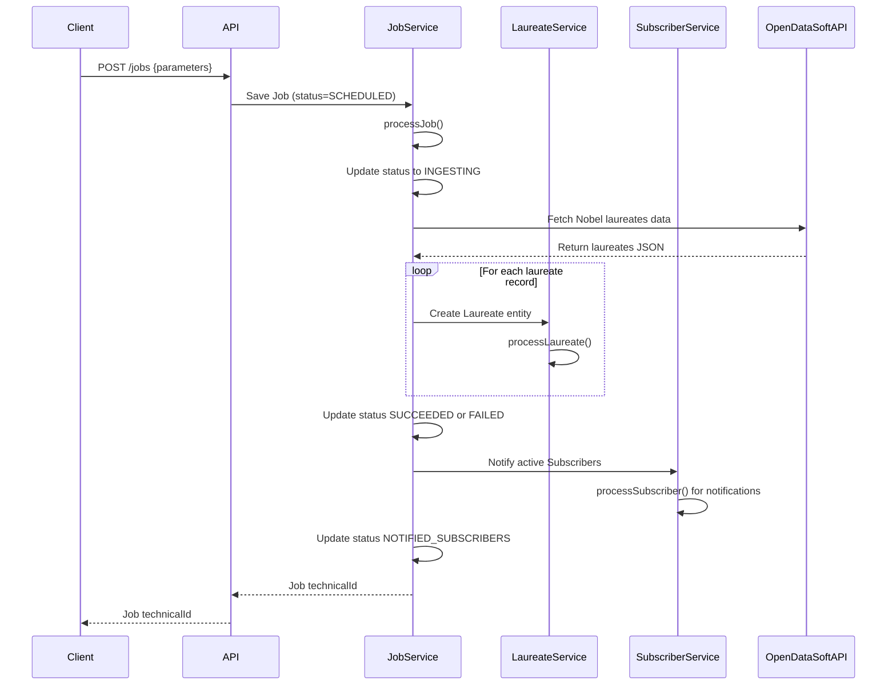
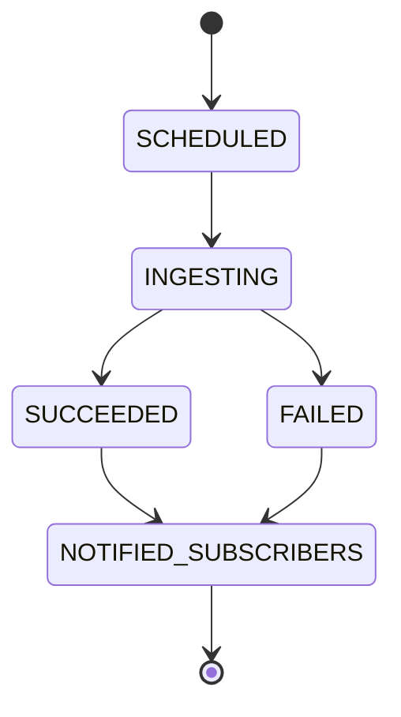

### 1. Entity Definitions

```
Job:
- jobId: String (unique identifier for the job, immutable)
- status: String (job lifecycle status, e.g., SCHEDULED, INGESTING, SUCCEEDED, FAILED, NOTIFIED_SUBSCRIBERS)
- createdAt: DateTime (timestamp when job was created)
- completedAt: DateTime (timestamp when job finished)
- parameters: String (JSON string containing any parameters for ingestion)
- resultSummary: String (summary or brief message about job outcome)

Laureate:
- laureateId: String (unique identifier for laureate, immutable)
- firstname: String (first name of laureate)
- surname: String (surname of laureate)
- born: String (birth date in ISO format)
- died: String (death date in ISO format or null)
- borncountry: String (country of birth)
- borncountrycode: String (ISO code of birth country)
- borncity: String (city of birth)
- gender: String (gender of laureate)
- year: String (year Nobel Prize awarded)
- category: String (category of Nobel Prize)
- motivation: String (award motivation text)
- name: String (affiliation name)
- city: String (affiliation city)
- country: String (affiliation country)

Subscriber:
- subscriberId: String (unique identifier for subscriber, immutable)
- contactType: String (type of contact, e.g., email, webhook)
- contactDetail: String (email address or webhook URL)
- subscribedAt: DateTime (timestamp when subscriber was added)
- active: Boolean (whether subscriber is active and should be notified)
```

---

### 2. Process Method Flows

```
processJob() Flow:
1. Initial State: Job entity is created with status = "SCHEDULED".
2. Validation: Optional explicit validation checks can be invoked if requested.
3. Processing: 
   - Transition status to "INGESTING".
   - Fetch Nobel laureates data from OpenDataSoft API based on job parameters.
   - For each laureate record, create a new immutable Laureate entity.
   - Trigger processLaureate() implicitly for each Laureate entity.
4. Completion:
   - If all laureate data ingested successfully, update job status to "SUCCEEDED".
   - If any failure occurs, update job status to "FAILED".
5. Notification:
   - Trigger notification to all active Subscribers.
   - Update job status to "NOTIFIED_SUBSCRIBERS".
```

```
processLaureate() Flow:
1. Initial State: Laureate entity is created (immutable).
2. Validation: If requested, run explicit checkLaureate{CriteriaName} validations.
3. Enrichment: Normalize data fields (e.g., standardize country codes).
4. Completion: Mark laureate as processed (optional internal flag).
```

```
processSubscriber() Flow:
1. Initial State: Subscriber entity is created.
2. Validation: Check that contact details are valid (email format, URL format).
3. Completion: Subscriber is marked active and ready to receive notifications.
```

---

### 3. API Endpoints

#### Job Endpoints

- **POST /jobs**  
  Request Body:  
  ```json
  {
    "parameters": "{ \"source\": \"OpenDataSoft\", \"dataset\": \"nobel-prize-laureates\" }"
  }
  ```  
  Response Body:  
  ```json
  {
    "technicalId": "string"
  }
  ```

- **GET /jobs/{technicalId}**  
  Response Body:  
  ```json
  {
    "jobId": "string",
    "status": "string",
    "createdAt": "string",
    "completedAt": "string",
    "parameters": "string",
    "resultSummary": "string"
  }
  ```

#### Laureate Endpoints

- No POST endpoints (created immutably via Job processing).  
- **GET /laureates/{technicalId}**  
  Response Body:  
  ```json
  {
    "laureateId": "string",
    "firstname": "string",
    "surname": "string",
    "born": "string",
    "died": "string",
    "borncountry": "string",
    "borncountrycode": "string",
    "borncity": "string",
    "gender": "string",
    "year": "string",
    "category": "string",
    "motivation": "string",
    "name": "string",
    "city": "string",
    "country": "string"
  }
  ```

#### Subscriber Endpoints

- **POST /subscribers**  
  Request Body:  
  ```json
  {
    "contactType": "string",
    "contactDetail": "string"
  }
  ```  
  Response Body:  
  ```json
  {
    "technicalId": "string"
  }
  ```

- **GET /subscribers/{technicalId}**  
  Response Body:  
  ```json
  {
    "subscriberId": "string",
    "contactType": "string",
    "contactDetail": "string",
    "subscribedAt": "string",
    "active": true
  }
  ```

---

### 4. Mermaid Diagrams


```mermaid
sequenceDiagram
    participant Client
    participant API
    participant JobService
    participant LaureateService
    participant SubscriberService

    Client->>API: POST /jobs {parameters}
    API->>JobService: Save Job (status=SCHEDULED)
    JobService->>JobService: processJob()
    JobService->>JobService: Update status to INGESTING
    JobService->>OpenDataSoftAPI: Fetch Nobel laureates data
    OpenDataSoftAPI-->>JobService: Return laureates JSON
    loop For each laureate record
        JobService->>LaureateService: Create Laureate entity
        LaureateService->>LaureateService: processLaureate()
    end
    JobService->>JobService: Update status SUCCEEDED or FAILED
    JobService->>SubscriberService: Notify active Subscribers
    SubscriberService->>SubscriberService: processSubscriber() for notifications
    JobService->>JobService: Update status NOTIFIED_SUBSCRIBERS
    JobService-->>API: Job technicalId
    API-->>Client: Job technicalId
```


```mermaid
stateDiagram-v2
    [*] --> SCHEDULED
    SCHEDULED --> INGESTING
    INGESTING --> SUCCEEDED
    INGESTING --> FAILED
    SUCCEEDED --> NOTIFIED_SUBSCRIBERS
    FAILED --> NOTIFIED_SUBSCRIBERS
    NOTIFIED_SUBSCRIBERS --> [*]
```