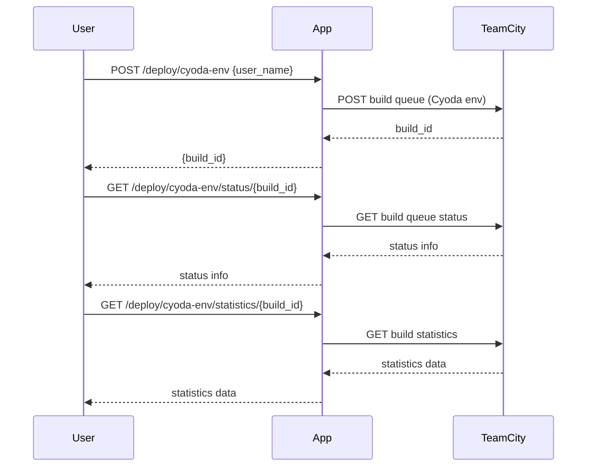
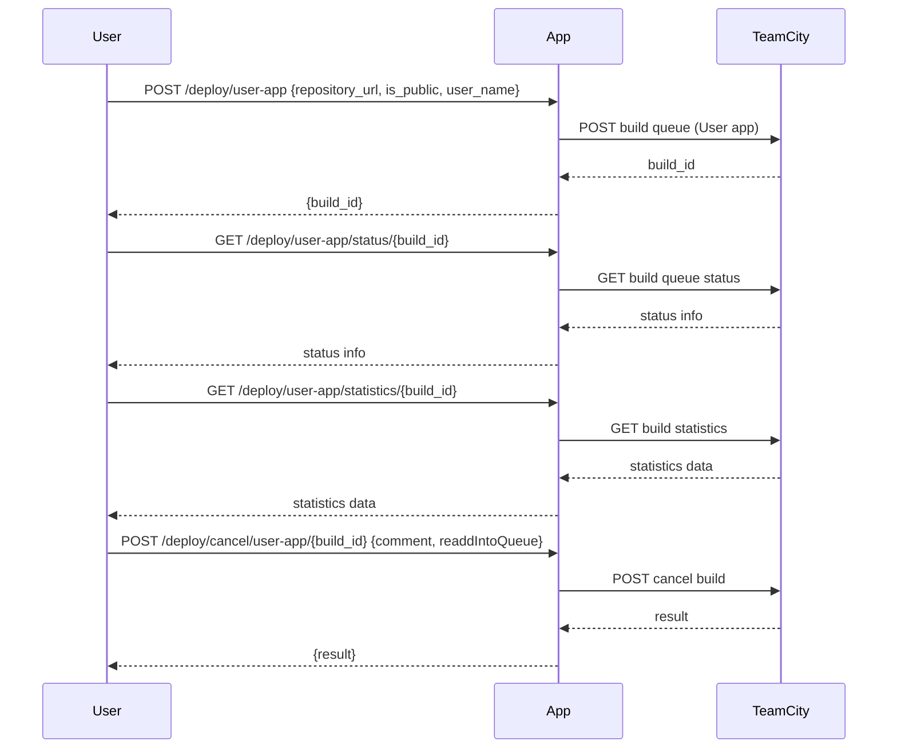

# Functional Requirements and API Design for Deployment and Environment Configuration Application

## API Endpoints

### 1. Deploy Cyoda Environment  
**POST /deploy/cyoda-env**  
- **Request:**  
```json
{
  "user_name": "string"
}
```  
- **Action:**  
  Triggers TeamCity build queue with `KubernetesPipeline_CyodaSaas` build type and properties for `user_defined_keyspace` and `user_defined_namespace` set to `user_name`.  
- **Response:**  
```json
{
  "build_id": "string"
}
```  

---

### 2. Deploy User Application  
**POST /deploy/user-app**  
- **Request:**  
```json
{
  "repository_url": "string",
  "is_public": "boolean",
  "user_name": "string"
}
```  
- **Action:**  
  Triggers TeamCity build queue with `KubernetesPipeline_CyodaSaasUserEnv` build type and properties `repository_url` and `user_defined_namespace` set accordingly.  
- **Response:**  
```json
{
  "build_id": "string"
}
```  

---

### 3. Get Cyoda Environment Deployment Status  
**GET /deploy/cyoda-env/status/{build_id}**  
- **Response:**  
  Returns build queue status fetched from TeamCity for the given `build_id`.  
```json
{
  "status": "string",
  "build_id": "string",
  "details": {}
}
```  

---

### 4. Get Cyoda Environment Deployment Statistics  
**GET /deploy/cyoda-env/statistics/{build_id}**  
- **Response:**  
  Returns build statistics fetched from TeamCity for the given `build_id`.  
```json
{
  "statistics": {}
}
```  

---

### 5. Get User Application Deployment Status  
**GET /deploy/user-app/status/{build_id}**  
- **Response:**  
  Returns build queue status fetched from TeamCity for the given `build_id`.  
```json
{
  "status": "string",
  "build_id": "string",
  "details": {}
}
```  

---

### 6. Get User Application Deployment Statistics  
**GET /deploy/user-app/statistics/{build_id}**  
- **Response:**  
  Returns build statistics fetched from TeamCity for the given `build_id`.  
```json
{
  "statistics": {}
}
```  

---

### 7. Cancel User Application Deployment  
**POST /deploy/cancel/user-app/{build_id}**  
- **Request:**  
```json
{
  "comment": "Canceling a queued build",
  "readdIntoQueue": false
}
```  
- **Action:**  
  Sends cancellation request to TeamCity for the specified build.  
- **Response:**  
```json
{
  "result": "success"
}
```  

---

## Notes on API Design  
- POST endpoints are used for any interaction which triggers external calls or changes state.  
- GET endpoints are strictly for retrieving results or statuses from our application without side effects.  
- Authentication via Bearer token is required for all endpoints (token supplied by client).

---

## Mermaid Sequence Diagram: User Deployment Flow


```mermaid
sequenceDiagram
    participant User
    participant App
    participant TeamCity

    User->>App: POST /deploy/cyoda-env {user_name}
    App->>TeamCity: POST build queue (Cyoda env)
    TeamCity-->>App: build_id
    App-->>User: {build_id}

    User->>App: GET /deploy/cyoda-env/status/{build_id}
    App->>TeamCity: GET build queue status
    TeamCity-->>App: status info
    App-->>User: status info

    User->>App: GET /deploy/cyoda-env/statistics/{build_id}
    App->>TeamCity: GET build statistics
    TeamCity-->>App: statistics data
    App-->>User: statistics data
```

---

## Mermaid Sequence Diagram: User Application Deployment Flow


```mermaid
sequenceDiagram
    participant User
    participant App
    participant TeamCity

    User->>App: POST /deploy/user-app {repository_url, is_public, user_name}
    App->>TeamCity: POST build queue (User app)
    TeamCity-->>App: build_id
    App-->>User: {build_id}

    User->>App: GET /deploy/user-app/status/{build_id}
    App->>TeamCity: GET build queue status
    TeamCity-->>App: status info
    App-->>User: status info

    User->>App: GET /deploy/user-app/statistics/{build_id}
    App->>TeamCity: GET build statistics
    TeamCity-->>App: statistics data
    App-->>User: statistics data

    User->>App: POST /deploy/cancel/user-app/{build_id} {comment, readdIntoQueue}
    App->>TeamCity: POST cancel build
    TeamCity-->>App: result
    App-->>User: {result}
```