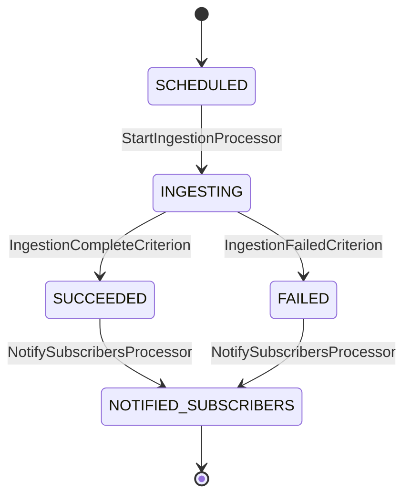
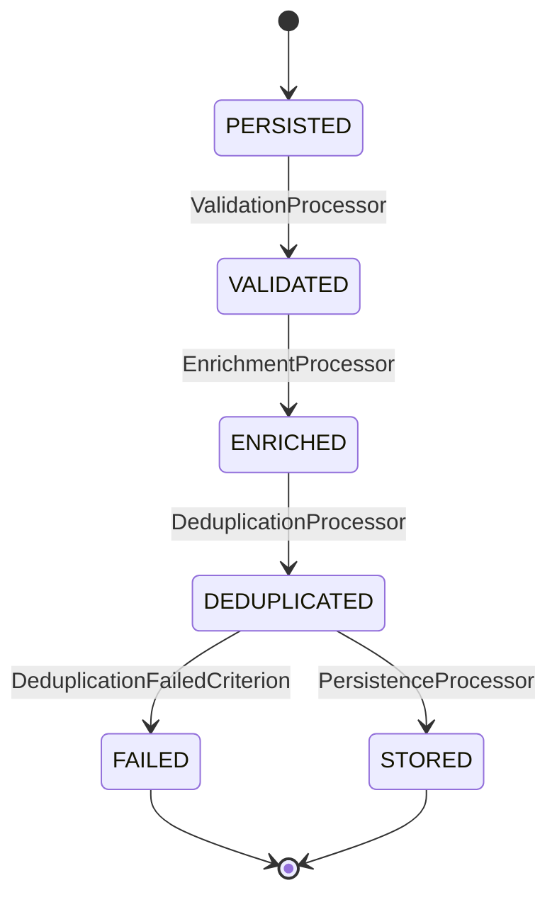
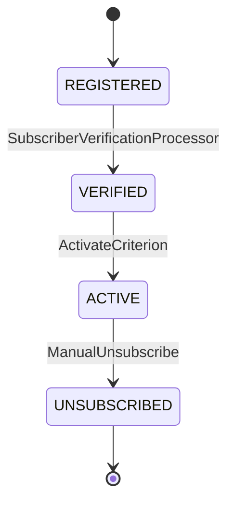

### 1. Entity Definitions
```
Job:
- id: String (source id from client, optional)
- schedule: String (cron or one-off schedule description)
- sourceUrl: String (API endpoint to ingest)
- state: String (SCHEDULED, INGESTING, SUCCEEDED, FAILED, NOTIFIED_SUBSCRIBERS)
- runTimestamp: String (when job started)
- completedTimestamp: String (when job ended)
- summary: Object (ingestedCount, failedCount, errors[])
- createdBy: String (user who created job)

Laureate:
- id: Integer (source id from API)
- firstname: String (given name)
- surname: String (family name)
- gender: String (gender)
- born: String (birth date)
- died: String (death date or null)
- borncountry: String (country name)
- borncountrycode: String (country code)
- borncity: String (city)
- year: String (award year)
- category: String (award category)
- motivation: String (award motivation)
- affiliation_name: String (affiliation)
- affiliation_city: String (affiliation city)
- affiliation_country: String (affiliation country)
- derived_ageAtAward: Integer (calculated)
- normalizedCountryCode: String (standardized)

Subscriber:
- id: String (subscriber id)
- contactType: String (email or webhook)
- contactDetail: String (email address or webhook URL)
- active: Boolean (active subscription)
- filters: Object (optional category/year filters)
- createdAt: String
```

### 2. Entity workflows

Job workflow:
1. Initial State: Job persisted (SCHEDULED) → Cyoda starts Job process automatically.
2. Start Ingestion: INGESTING (automatic) — fetch from sourceUrl.
3. Process Records: run ValidationProcessor and EnrichmentProcessor on each Laureate (automatic).
4. Persist Results: update summary and set SUCCEEDED or FAILED (automatic).
5. Notify Subscribers: NOTIFIED_SUBSCRIBERS (automatic) — send summary to active Subscribers.
6. Terminal: end.


```mermaid
stateDiagram-v2
    [*] --> SCHEDULED
    SCHEDULED --> INGESTING : StartIngestionProcessor
    INGESTING --> SUCCEEDED : IngestionCompleteCriterion
    INGESTING --> FAILED : IngestionFailedCriterion
    SUCCEEDED --> NOTIFIED_SUBSCRIBERS : NotifySubscribersProcessor
    FAILED --> NOTIFIED_SUBSCRIBERS : NotifySubscribersProcessor
    NOTIFIED_SUBSCRIBERS --> [*]
```

Laureate workflow:
1. Persisted by Job process (PERSISTED) — entity persistence triggers processing.
2. VALIDATION: ValidationProcessor checks required fields.
3. ENRICHMENT: EnrichmentProcessor computes ageAtAward and normalizes country codes.
4. DEDUPLICATION: DeduplicationProcessor checks existing store to decide NEW or UPDATE.
5. STORED: persisted to final store or FAILED.


```mermaid
stateDiagram-v2
    [*] --> PERSISTED
    PERSISTED --> VALIDATED : ValidationProcessor
    VALIDATED --> ENRICHED : EnrichmentProcessor
    ENRICHED --> DEDUPLICATED : DeduplicationProcessor
    DEDUPLICATED --> STORED : PersistenceProcessor
    DEDUPLICATED --> FAILED : DeduplicationFailedCriterion
    FAILED --> [*]
    STORED --> [*]
```

Subscriber workflow:
1. REGISTERED (created by admin or import) - automatic start triggers verification step if needed.
2. VERIFICATION: SubscriberVerificationProcessor (manual email/webhook verification allowed).
3. ACTIVE: subscriber receives notifications.
4. UNSUBSCRIBED: manual unsubscribe.


```mermaid
stateDiagram-v2
    [*] --> REGISTERED
    REGISTERED --> VERIFIED : SubscriberVerificationProcessor
    VERIFIED --> ACTIVE : ActivateCriterion
    ACTIVE --> UNSUBSCRIBED : ManualUnsubscribe
    UNSUBSCRIBED --> [*]
```

Processors and Criteria needed (per entity)

Job
- Processors: StartIngestionProcessor, JobIngestionProcessor, JobSummaryProcessor, NotifySubscribersProcessor
- Criteria: IngestionCompleteCriterion, IngestionFailedCriterion

Laureate
- Processors: ValidationProcessor, EnrichmentProcessor, DeduplicationProcessor, PersistenceProcessor
- Criteria: ValidationPassedCriterion, DeduplicationRequiredCriterion

Subscriber
- Processors: SubscriberVerificationProcessor, ActivateSubscriberProcessor, UnsubscribeProcessor
- Criteria: VerificationPassedCriterion

### 3. Pseudo code for processor classes (sketch)

StartIngestionProcessor.process(job):
```
fetch records from job.sourceUrl
emit Laureate entities into Cyoda (persist each -> triggers Laureate workflow)
collect per-record results
set job.summary and transition job state accordingly
```

ValidationProcessor.process(laureate):
```
if la.id == null or la.firstname == null or la.year == null or la.category == null:
    mark la state FAILED and add error
else:
    mark la VALIDATED
```

EnrichmentProcessor.process(laureate):
```
compute ageAtAward = year - birthYear if born present
normalize country code if missing
set normalized fields
```

DeduplicationProcessor.process(laureate):
```
if existing record with same id:
    mark as UPDATE
else:
    mark as NEW
```

NotifySubscribersProcessor.process(job):
```
load active subscribers matching job filters
for each subscriber:
    send summary (asynchronous)
    record delivery attempt
update job.state to NOTIFIED_SUBSCRIBERS
```

### 4. API Endpoints Design Rules

- POST /jobs — create Job (triggers Cyoda Job workflow). Response MUST contain only technicalId.
Request:
```json
{
  "schedule": "cron expression or one-off",
  "sourceUrl": "https://public.opendatasoft.com/api/.../records",
  "createdBy": "admin@example.com"
}
```
Response:
```json
{ "technicalId": "job-0001" }
```

- GET /jobs/{technicalId} — retrieve stored Job result
Response example:
```json
{
  "technicalId": "job-0001",
  "schedule":"...",
  "state":"NOTIFIED_SUBSCRIBERS",
  "runTimestamp":"2025-08-01T10:00:00Z",
  "completedTimestamp":"2025-08-01T10:00:45Z",
  "summary": {"ingestedCount":10,"failedCount":0,"errors":[]}
}
```

- GET /laureates/{technicalId} — retrieve stored Laureate by technicalId (read-only)
Response sample:
```json
{
  "technicalId":"laureate-0853",
  "id":853,
  "firstname":"Akira",
  "surname":"Suzuki",
  "year":"2010",
  "category":"Chemistry",
  "derived_ageAtAward":80
}
```

- GET /subscribers/{technicalId} — retrieve subscriber record
Response sample:
```json
{
  "technicalId":"sub-123",
  "contactType":"email",
  "contactDetail":"notify@example.com",
  "active":true
}
```

Notes
- Every entity persist is an event: creating Job or persisting Laureate/Subscriber triggers Cyoda workflows automatically.
- POST endpoints only for orchestration entity (Job). All POST responses return only technicalId.
- GET endpoints are read-only retrievals as shown.
- Provide retry and error logging in processors (specified in Job summary).