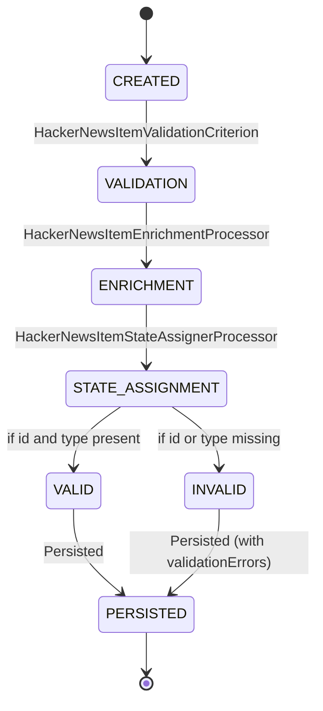
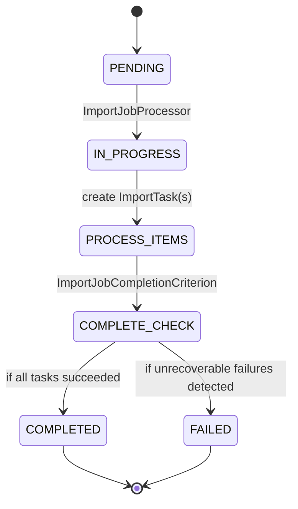
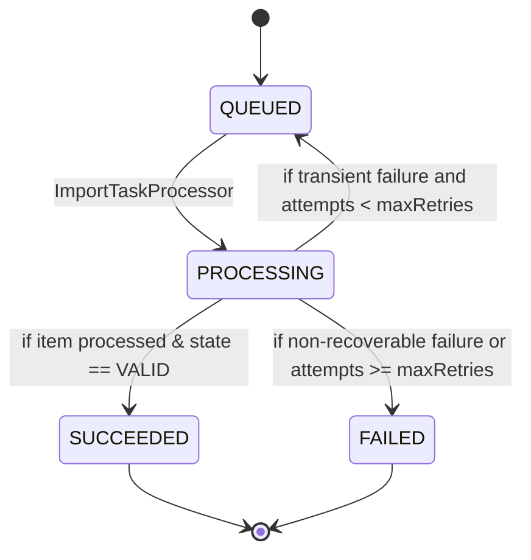

# Functional Requirements — Hacker News Import Service

This document specifies the functional requirements, entities, workflows, API surface, business rules, and implementation notes for the Hacker News import service. It also reconciles and clarifies previous ambiguities (technicalId presence, payload storage format, separation of validation vs processing lifecycle, and retry semantics).

---

## 1. Summary of key guarantees

- Every incoming Firebase-format Hacker News JSON payload is stored exactly as received (originalJson) and is assigned a separate import timestamp during enrichment.
- Validation is strictly the presence of the two fields `id` and `type` inside the original JSON.
- Each stored HackerNews item is assigned a validity state: `VALID` if both `id` and `type` are present, otherwise `INVALID`. Validation errors are recorded.
- Import processing is asynchronous: creating an ImportJob persists the job (returns its technical id) and triggers background processing using ImportTask(s).
- The service provides retrieval of ImportJob status (by technical id) and HackerNews item by HackerNews `id` (the id contained in the original JSON).

---

## 2. Entity definitions (canonical)

Note: All timestamps are ISO-8601 instants (UTC) unless otherwise stated.

- HackerNewsItem
  - technicalId: String (datastore technical id / primary key — optional depending on persistence model; useful for internal references)
  - originalJson: String (the original Firebase-format Hacker News JSON exactly as received; stored verbatim as a string)
  - id: Long|null (the Hacker News item id extracted from originalJson, if present; this field is indexed and used for lookup via GET /hn-items/{id})
  - type: String|null (the Hacker News item type extracted from originalJson, if present)
  - importTimestamp: Instant|null (timestamp assigned when the item is enriched; separate from createdAt)
  - state: String (VALID or INVALID) — indicates domain validity, not processing status
  - validationErrors: String|null (optional short message describing why state = INVALID)
  - createdAt: Instant (when this entity record was created in the datastore)

- ImportJob
  - technicalId: String (datastore technical id / primary key; returned by POST /import-jobs)
  - jobName: String (human-friendly name for the job)
  - source: String|null (optional identifier of where the payload originated)
  - payload: String (the raw Firebase-format Hacker News JSON provided for this job, stored verbatim as a string)
  - status: String (PENDING, IN_PROGRESS, COMPLETED, FAILED)
  - itemsCreatedCount: Integer (number of HackerNewsItem entities created/updated as part of this job)
  - createdAt: Instant (when the job was persisted)
  - completedAt: Instant|null (when the job finished processing, if applicable)

- ImportTask
  - technicalId: String (datastore technical id / primary key for the task)
  - jobTechnicalId: String (reference to the ImportJob.technicalId that created this task)
  - hnItemTechnicalId: String|null (reference to the HackerNewsItem.technicalId created for this task; optional if only hnItem.id is known)
  - hnItemId: Long|null (the Hacker News id parsed from the payload if available)
  - status: String (QUEUED, PROCESSING, SUCCEEDED, FAILED)
  - attempts: Integer (number of processing attempts performed; default 0)
  - errorMessage: String|null (short description if processing failed)
  - createdAt: Instant
  - lastUpdatedAt: Instant

Notes on entity fields
- technicalId fields are required for API responses that return a single identifier (POST /import-jobs returns ImportJob.technicalId). If your persistence layer uses a different primary key, map accordingly but expose `technicalId` in the API.
- The service accepts payloads as JSON objects in API requests but persists them as verbatim JSON strings in `payload` / `originalJson` to guarantee round-trip fidelity.

---

## 3. Clarified responsibilities and what state fields mean

- HackerNewsItem.state (VALID / INVALID)
  - This field represents domain-level validation of the content of the original JSON (presence of `id` and `type`).
  - It is not a processing lifecycle state. Processing lifecycle (Queued/Processing/Done/Failed) is tracked at the ImportTask and ImportJob levels.

- Processing lifecycle
  - ImportJob.status and ImportTask.status capture asynchronous processing progression, retries, and failures.

---

## 4. Workflows

### 4.1 HackerNewsItem creation & finalization (per item)

High-level steps (as implemented by processors/criteria):
1. Creation: ImportJobProcessor (or a task producer) persists a HackerNewsItem with `originalJson` set and `createdAt` populated. `importTimestamp`, `id`, `type`, `state` and `validationErrors` may be null at this point.
2. Processing (asynchronous): ImportTaskProcessor picks up the associated ImportTask and performs the following in sequence:
   - Validation: HackerNewsItemValidationCriterion checks presence of `id` and `type` inside the original JSON.
   - Enrichment: HackerNewsItemEnrichmentProcessor sets `importTimestamp = now()` and extracts `id` and `type` (when present) into the entity fields.
   - State assignment: HackerNewsItemStateAssignerProcessor sets `state = VALID` if both `id` and `type` were extracted, otherwise `state = INVALID` and sets `validationErrors` with a concise reason.
   - Persist: Persist the updated HackerNewsItem record.
3. Result: The ImportTask status is updated to SUCCEEDED if the item `state == VALID`; otherwise the task either fails (and may be retried according to retry policy) or is marked FAILED.

Mermaid (conceptual) — HackerNewsItem content lifecycle (domain validity):

```mermaid
stateDiagram-v2
    [*] --> CREATED
    CREATED --> VALIDATION : HackerNewsItemValidationCriterion
    VALIDATION --> ENRICHMENT : HackerNewsItemEnrichmentProcessor
    ENRICHMENT --> STATE_ASSIGNMENT : HackerNewsItemStateAssignerProcessor
    STATE_ASSIGNMENT --> VALID : if id and type present
    STATE_ASSIGNMENT --> INVALID : if id or type missing
    VALID --> PERSISTED : Persisted
    INVALID --> PERSISTED : Persisted (with validationErrors)
    PERSISTED --> [*]
```

Processor responsibilities (pseudocode sketches):
- HackerNewsItemValidationCriterion
  - Responsibility: Check presence of `id` and `type` inside `originalJson` (without mutating the entity).
  - Pseudocode:
    - parsed = parse(originalJson)
    - return parsed.has("id") and parsed.has("type")

- HackerNewsItemEnrichmentProcessor
  - Responsibility: Populate `importTimestamp` and extract `id`/`type` into fields on the entity.
  - Pseudocode:
    - parsed = parse(originalJson)
    - entity.importTimestamp = Instant.now()
    - if parsed.has("id") -> entity.id = parsed.getLong("id")
    - if parsed.has("type") -> entity.type = parsed.getString("type")

- HackerNewsItemStateAssignerProcessor
  - Responsibility: Set `state = "VALID"` or `"INVALID"`; if invalid set `validationErrors`.
  - Pseudocode:
    - if entity.id != null and entity.type != null then entity.state = "VALID" else entity.state = "INVALID"; if invalid set validationErrors = "missing id and/or type"

- PersistStateProcessor
  - Responsibility: Persist / update the HackerNewsItem record in datastore.

### 4.2 ImportJob workflow

1. Creation: POST /import-jobs persists an ImportJob with `status = PENDING`, `payload = <stringified JSON>`, `createdAt` set and returns `technicalId` to the caller.
2. Processing: Background ImportJobProcessor picks up PENDING jobs and sets `status = IN_PROGRESS`.
3. Item creation: For each input payload (this service currently models one payload per job), the ImportJobProcessor creates:
   - a HackerNewsItem (with `originalJson = job.payload`) and
   - an ImportTask that references the job and the created item.
   - The ImportTask initial status is `QUEUED`.
4. ImportTask processing and monitoring occurs as described below. ImportJobProcessor observes task outcomes.
5. Completion: When all tasks related to the job are SUCCEEDED (or there are unrecoverable failures), ImportJobProcessor sets `itemsCreatedCount`, `completedAt`, and sets job `status` to `COMPLETED` or `FAILED` accordingly.

Mermaid (conceptual) — ImportJob lifecycle:

```mermaid
stateDiagram-v2
    [*] --> PENDING
    PENDING --> IN_PROGRESS : ImportJobProcessor
    IN_PROGRESS --> PROCESS_ITEMS : create ImportTask(s)
    PROCESS_ITEMS --> COMPLETE_CHECK : ImportJobCompletionCriterion
    COMPLETE_CHECK --> COMPLETED : if all tasks succeeded
    COMPLETE_CHECK --> FAILED : if unrecoverable failures detected
    COMPLETED --> [*]
    FAILED --> [*]
```

Processor/Criterion responsibilities:
- ImportJobProcessor
  - Responsibility: Trigger creation of ImportTask(s), persist HackerNewsItem(s) (with `originalJson`) and update job `status` as it executes.
  - Pseudocode (illustrative):
    - job.status = IN_PROGRESS; persist
    - hnItem = persist HackerNewsItem(originalJson = job.payload, createdAt = now())
    - task = persist ImportTask(jobTechnicalId = job.technicalId, hnItemTechnicalId = hnItem.technicalId, hnItemId = parsedIdIfPresent, status = QUEUED)
    - enqueue task for processing

- ImportJobCompletionCriterion
  - Responsibility: Determine whether all tasks for the job succeeded or if the job should be marked FAILED.

### 4.3 ImportTask workflow (per item)

1. Initial State: `QUEUED` (created by ImportJobProcessor).
2. Processing: ImportTaskProcessor picks `QUEUED` tasks, sets `status = PROCESSING` and increments `attempts` as needed.
3. Execution steps (strongly ordered): validation -> enrichment -> state assignment -> persist HackerNewsItem.
4. Outcome handling:
   - If HackerNewsItem.state == VALID -> set ImportTask.status = SUCCEEDED and persist.
   - If HackerNewsItem.state == INVALID -> set ImportTask.status = FAILED (or FAILED after retry policy exhausted).
   - On transient processing error (e.g., datastore timeout): increment `attempts`; if `attempts < maxRetries` then requeue (status = QUEUED); else mark FINALLY as FAILED.
5. Update: ImportJob's counters and final status are updated by the job processor once tasks reach terminal states.

Mermaid (conceptual) — ImportTask lifecycle:

```mermaid
stateDiagram-v2
    [*] --> QUEUED
    QUEUED --> PROCESSING : ImportTaskProcessor
    PROCESSING --> SUCCEEDED : if item processed & state == VALID
    PROCESSING --> QUEUED : if transient failure and attempts < maxRetries
    PROCESSING --> FAILED : if non-recoverable failure or attempts >= maxRetries
    SUCCEEDED --> [*]
    FAILED --> [*]
```

Processor responsibilities:
- ImportTaskProcessor
  - Responsibility: Orchestrate processing of a single item: call validation criterion, enrichment processor, state assigner, persist HackerNewsItem; update task status and handle retries.
  - Pseudocode (illustrative):
    - set task.status = PROCESSING; task.attempts += 1; persist
    - retrieve HackerNewsItem by hnItemTechnicalId (or by job reference)
    - run HackerNewsItemValidationCriterion on HackerNewsItem
    - run HackerNewsItemEnrichmentProcessor
    - run HackerNewsItemStateAssignerProcessor
    - persist HackerNewsItem
    - if HackerNewsItem.state == VALID then task.status = SUCCEEDED else task.status = FAILED
    - persist task

- Retry policy (recommended default)
  - maxRetries: configurable integer (default 3)
  - Retry decision: retry on transient errors (e.g., IO / datastore unavailable). Do NOT retry purely because the item is INVALID (invalid content is a terminal, business-level failure).

---

## 5. API Endpoints (behavioral rules)

All request/response bodies are JSON. The API accepts the incoming Hacker News payload as a JSON object but persists it as a string in `payload` / `originalJson`.

- POST /import-jobs
  - Purpose: Create an ImportJob for a single Hacker News JSON payload and trigger asynchronous processing.
  - Request JSON (example):
    {
      "jobName": "import-single-item",
      "source": "manual-api",
      "payload": { ... <Firebase-format HN JSON object> ... }
    }
  - Behavior:
    - Validate request payload shape (e.g., jobName non-empty, payload present). Do not validate business `id`/`type` here — that happens during item validation.
    - Persist ImportJob with `payload` saved as a string (stringified JSON), `status = PENDING`, and `createdAt` set.
    - Return HTTP 201 Created with body: { "technicalId": "<ImportJob.technicalId>" }
    - Processing of the job runs asynchronously after the response returns.

- GET /import-jobs/{technicalId}
  - Purpose: Retrieve job status and metrics.
  - Response JSON (example):
    {
      "technicalId": "job_0001",
      "jobName": "import-single-item",
      "source": "manual-api",
      "status": "COMPLETED",
      "itemsCreatedCount": 1,
      "createdAt": "2025-08-15T12:34:56Z",
      "completedAt": "2025-08-15T12:35:00Z"
    }

- GET /hn-items/{id}
  - Purpose: Retrieve a stored Hacker News item by its Hacker News `id` (the numeric `id` field inside the original JSON).
  - Notes:
    - The path parameter `{id}` refers to the Hacker News item id (Long), not the datastore `technicalId`.
    - The system must provide an index to query HackerNewsItem by `id`.
  - Response JSON (example):
    {
      "originalJson": { ... original firebase JSON object ... },
      "id": 12345,
      "type": "story",
      "importTimestamp": "2025-08-15T12:34:56Z",
      "state": "VALID",
      "validationErrors": null,
      "createdAt": "2025-08-15T12:34:56Z"
    }

API rules summary
- POST endpoints return only the entity technical id (ImportJob.technicalId) in responses.
- GET /hn-items/{id} must return the original JSON parsed as an object in the response body even though it is stored as a string.
- No bulk GET endpoints are required by default unless requested.

---

## 6. Important Business Rules & Behavior (restated & clarified)

- Validation rule (authoritative): When saving an item, it must validate that the fields `id` and `type` are present in the original JSON. If missing, the item is recorded with `state = INVALID` and `validationErrors` describing the deficiency.
- Enrichment rule: Each item is enriched with an `importTimestamp`, kept separate from the `originalJson` field.
- Storage fidelity: The original Firebase-format Hacker News JSON must be stored exactly as received (stringified verbatim) in `originalJson` (HackerNewsItem) and `payload` (ImportJob).
- Retrieval: The service must allow retrieval of an item by its HackerNews `id`, returning the original JSON together with its state and import timestamp.
- Processing state vs. domain state: `state` on HackerNewsItem is the domain validity (VALID/INVALID). Processing state and lifecycle are tracked via ImportTask.status and ImportJob.status.
- POST endpoints return only an entity technical id (e.g., ImportJob.technicalId).

---

## 7. Implementation notes and recommendations

- Persist the raw JSON payloads (`payload` and `originalJson`) as verbatim strings so the exact incoming JSON is preserved. When returning via API parse that string back to JSON object.
- Indexing: ensure there is an index on HackerNewsItem.id to serve GET /hn-items/{id} efficiently. id is the Hacker News id inside the payload, not the datastore technical id.
- Concurrency: multiple ImportJobs could create or update the same HackerNewsItem (same Hacker News id). Define upsert semantics for your persistence layer (e.g., overwrite or merge). If deduplication behavior is required, add an explicit rule.
- Retries: implement a configurable maxRetries (recommended default = 3) for transient processing errors. Do NOT retry items that are `INVALID` due to missing `id` or `type` — they are business-level invalid.
- Observability: persist meaningful errorMessage values on ImportTask when a failure occurs and set validationErrors on HackerNewsItem for validation failures.
- Idempotency: POST /import-jobs should be idempotent by client-supplied idempotency keys if desired; otherwise repeated posts create new jobs.

---

## 8. Changes & clarifications applied compared to the previous draft

- Explicitly added `technicalId` fields for ImportJob, ImportTask and (optionally) HackerNewsItem to align with the requirement that POST endpoints return a technical id.
- Clarified that API accepts JSON objects but stores payloads/originalJson as verbatim strings.
- Clarified separation between HackerNewsItem.domain state (VALID/INVALID) and processing lifecycle (ImportTask / ImportJob statuses). The earlier workflow mixed these concepts; this document separates them explicitly.
- Added explicit retry policy recommendation and default.
- Explained that invalid content (missing id/type) is a terminal business failure and should not be retried.

---

If you want, I can also:
- add example JSON request/response payloads for edge cases;
- produce sequence diagrams showing asynchronous job / task handling including retries;
- propose a persistence schema (DDL or entity classes) aligned to these requirements.

Please confirm if these updated requirements reflect the desired logic. If you want any additional changes (for example: different field names, upsert vs create-only behavior, or stronger validation rules), tell me what to change and I will update the document accordingly.
