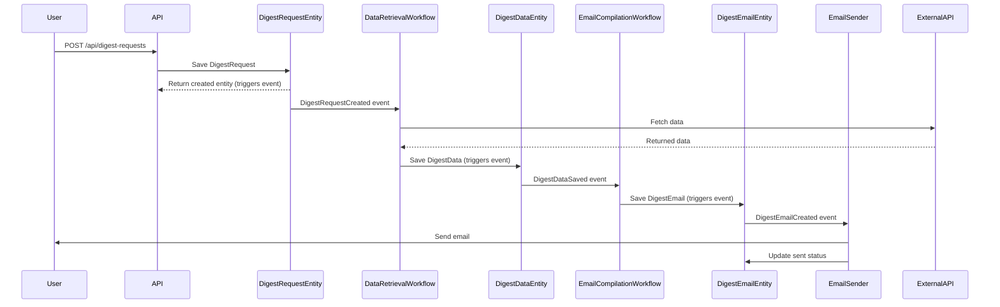
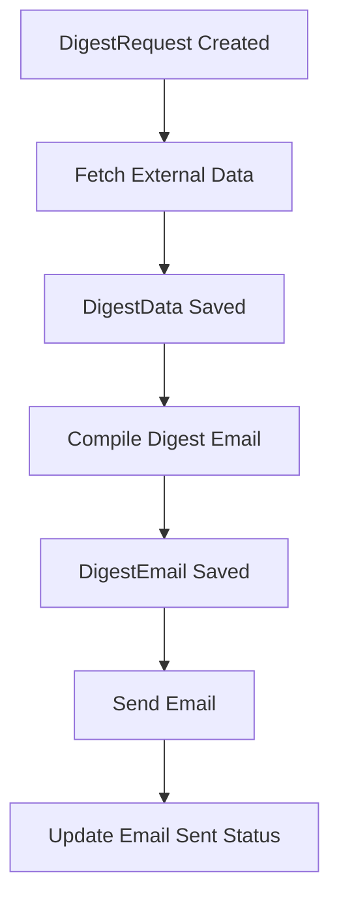

# Functional Requirements Using Event-Driven Architecture (EDA)

## 1. Business Entities

- **DigestRequest**
  - Fields: `id`, `email`, `metadata` (map or JSON), `status`, `createdAt`, `updatedAt`
  - Purpose: Represents the incoming digest request event.

- **DigestData**
  - Fields: `id`, `digestRequestId`, `dataPayload` (raw JSON or parsed), `retrievedAt`
  - Purpose: Stores data fetched from external API relevant to a DigestRequest.

- **DigestEmail**
  - Fields: `id`, `digestRequestId`, `emailContent` (HTML/plain text), `sentStatus`, `sentAt`
  - Purpose: Represents the compiled digest email ready to be sent.

## 2. API Endpoints

### POST Endpoints (Add/Update Entities & Trigger Events)

- `POST /api/digest-requests`
  - Input: 
    ```json
    {
      "email": "user@example.com",
      "metadata": {
        "endpoint": "/pet/findByStatus",
        "params": {
          "status": "available"
        }
      }
    }
    ```
  - Output:
    ```json
    {
      "id": "uuid-1234",
      "status": "CREATED"
    }
    ```
  - Action: Creates a new DigestRequest entity → triggers event to start data retrieval workflow.

- `POST /api/digest-emails/{digestRequestId}/send`
  - Input: None
  - Output:
    ```json
    {
      "sentStatus": "SENT"
    }
    ```
  - Action: Update DigestEmail as sent (optional manual trigger if needed).

### GET Endpoints (Retrieve Application Results)

- `GET /api/digest-requests/{id}`
  - Output:
    ```json
    {
      "id": "uuid-1234",
      "email": "user@example.com",
      "metadata": {
        "endpoint": "/pet/findByStatus",
        "params": {
          "status": "available"
        }
      },
      "status": "DATA_RETRIEVED",
      "createdAt": "2024-06-01T12:00:00Z"
    }
    ```

- `GET /api/digest-emails/{digestRequestId}`
  - Output:
    ```json
    {
      "digestRequestId": "uuid-1234",
      "emailContent": "<html>...</html>",
      "sentStatus": "SENT",
      "sentAt": "2024-06-01T12:10:00Z"
    }
    ```

## 3. Event Processing Workflows

- **On DigestRequest Created:**
  - Event: `DigestRequestCreated`
  - Workflow:
    1. Fetch data from external API based on `metadata` or defaults.
    2. Save retrieved data as DigestData entity → triggers `DigestDataSaved` event.

- **On DigestDataSaved:**
  - Workflow:
    1. Compile digest email content from DigestData.
    2. Save DigestEmail entity → triggers `DigestEmailCreated` event.

- **On DigestEmailCreated:**
  - Workflow:
    1. Send email to user using stored email content.
    2. Update DigestEmail sent status accordingly.

## 4. Mermaid Diagrams

### User Interaction & Event-Driven Processing Sequence


```mermaid
sequenceDiagram
  participant User
  participant API
  participant DigestRequestEntity
  participant DataRetrievalWorkflow
  participant DigestDataEntity
  participant EmailCompilationWorkflow
  participant DigestEmailEntity
  participant EmailSender

  User->>API: POST /api/digest-requests
  API->>DigestRequestEntity: Save DigestRequest
  DigestRequestEntity-->>API: Return created entity (triggers event)
  DigestRequestEntity->>DataRetrievalWorkflow: DigestRequestCreated event
  DataRetrievalWorkflow->>ExternalAPI: Fetch data
  ExternalAPI-->>DataRetrievalWorkflow: Returned data
  DataRetrievalWorkflow->>DigestDataEntity: Save DigestData (triggers event)
  DigestDataEntity->>EmailCompilationWorkflow: DigestDataSaved event
  EmailCompilationWorkflow->>DigestEmailEntity: Save DigestEmail (triggers event)
  DigestEmailEntity->>EmailSender: DigestEmailCreated event
  EmailSender->>User: Send email
  EmailSender->>DigestEmailEntity: Update sent status
```

### Entity Creation and Event Chain Flow


```mermaid
graph TD
  A[DigestRequest Created] --> B[Fetch External Data]
  B --> C[DigestData Saved]
  C --> D[Compile Digest Email]
  D --> E[DigestEmail Saved]
  E --> F[Send Email]
  F --> G[Update Email Sent Status]
```