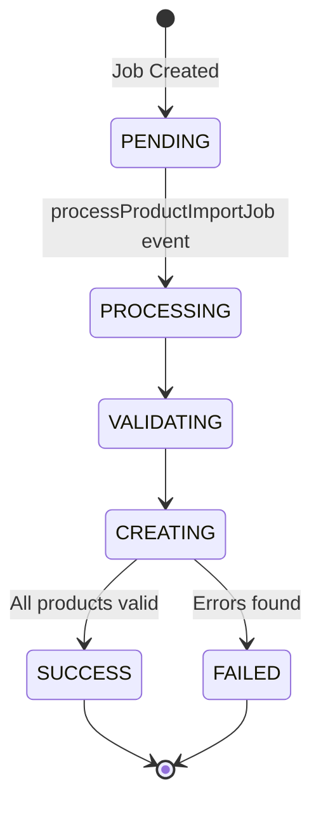
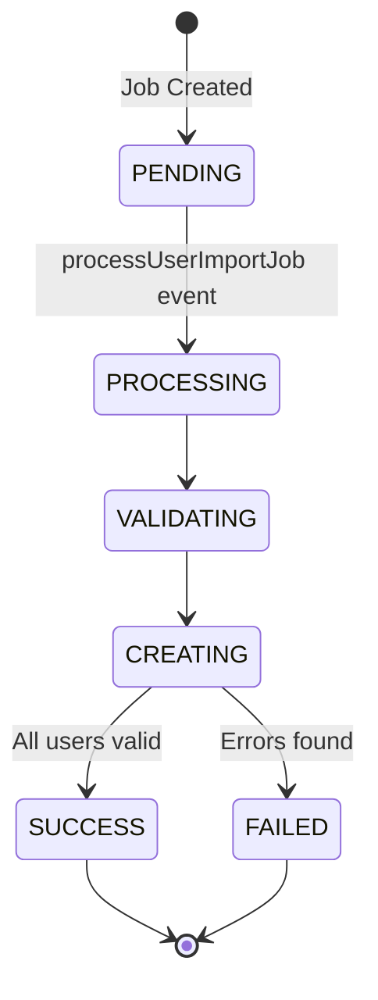
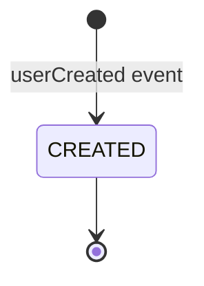
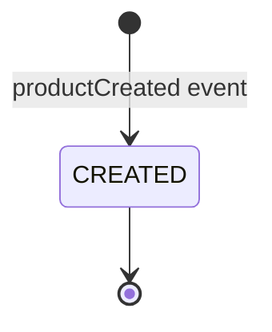
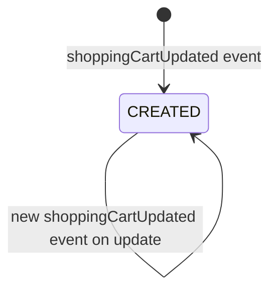
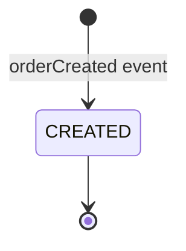
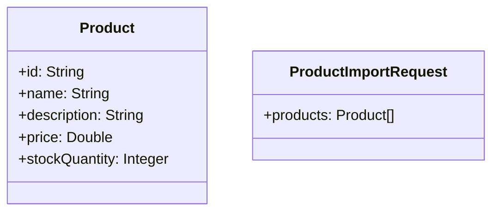
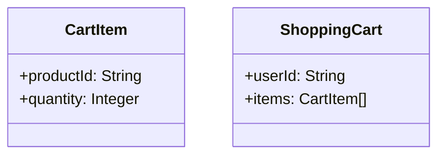
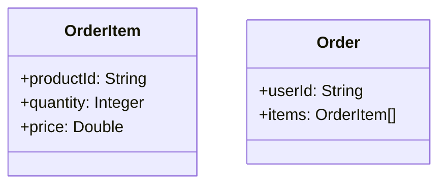

# Functional Requirements for Order Management System (Event-Driven Architecture)

---

## 1. Entity Definitions

```
ProductImportJob:
- id: String (unique identifier for the import job)
- status: String (job status: PENDING, SUCCESS, FAILED)
- errorMessages: String (details of errors if any)

UserImportJob:
- id: String (unique identifier for the import job)
- status: String (job status: PENDING, SUCCESS, FAILED)
- errorMessages: String (details of errors if any)

User:
- id: String (unique user identifier)
- name: String (user's full name)
- email: String (user's email address)
- password: String (hashed password)
- role: String (user role, e.g., Admin or Customer)

Product:
- id: String (unique product identifier)
- name: String (product name)
- description: String (product description)
- price: Double (product price)
- stockQuantity: Integer (available stock quantity)

ShoppingCart:
- id: String (unique shopping cart identifier)
- userId: String (reference to User id)
- items: List<CartItem> (list of products and quantities)

CartItem:
- productId: String (reference to Product id)
- quantity: Integer (number of units)

Order:
- id: String (unique order identifier)
- userId: String (reference to User id)
- orderDate: String (ISO 8601 date-time)
- totalAmount: Double (total price for the order)
- items: List<OrderItem> (products and ordered quantities)

OrderItem:
- productId: String (reference to Product id)
- quantity: Integer (number of units)
- price: Double (price per unit at order time)
```

---

## 2. Entity Workflows

### ProductImportJob workflow

```
1. Initial State: ProductImportJob created with status PENDING
2. Processing: System ingests product data from bulk JSON
3. Validation: Check product data validity
4. Creation: Create Product entities for valid entries
5. Completion: Update ProductImportJob status to SUCCESS or FAILED
6. Notification: Store errorMessages if any failures occurred
```


```mermaid
stateDiagram-v2
    [*] --> PENDING: Job Created
    PENDING --> PROCESSING: processProductImportJob event
    PROCESSING --> VALIDATING
    VALIDATING --> CREATING
    CREATING --> SUCCESS: All products valid
    CREATING --> FAILED: Errors found
    SUCCESS --> [*]
    FAILED --> [*]
```

---

### UserImportJob workflow

```
1. Initial State: UserImportJob created with status PENDING
2. Processing: System ingests user data from bulk JSON
3. Validation: Check user data validity
4. Creation: Create User entities for valid entries
5. Completion: Update UserImportJob status to SUCCESS or FAILED
6. Notification: Store errorMessages if any failures occurred
```


```mermaid
stateDiagram-v2
    [*] --> PENDING: Job Created
    PENDING --> PROCESSING: processUserImportJob event
    PROCESSING --> VALIDATING
    VALIDATING --> CREATING
    CREATING --> SUCCESS: All users valid
    CREATING --> FAILED: Errors found
    SUCCESS --> [*]
    FAILED --> [*]
```

---

### User workflow

```
1. Creation: User created upon processing UserImportJob
2. No further state changes (immutable for MVP)
```


```mermaid
stateDiagram-v2
    [*] --> CREATED: userCreated event
    CREATED --> [*]
```

---

### Product workflow

```
1. Creation: Product created upon processing ProductImportJob
2. No further state changes (immutable for MVP)
```


```mermaid
stateDiagram-v2
    [*] --> CREATED: productCreated event
    CREATED --> [*]
```

---

### ShoppingCart workflow

```
1. Creation: ShoppingCart entity created or updated on add/remove product actions (immutable)
2. Update: Each add/remove operation creates a new ShoppingCart entity reflecting current state
3. No deletion or direct update
```


```mermaid
stateDiagram-v2
    [*] --> CREATED: shoppingCartUpdated event
    CREATED --> CREATED: new shoppingCartUpdated event on update
```

---

### Order workflow

```
1. Creation: Order entity created upon customer checkout
2. Processing: Order processed for fulfillment (outside MVP scope)
3. No updates or deletes in MVP
```


```mermaid
stateDiagram-v2
    [*] --> CREATED: orderCreated event
    CREATED --> [*]
```

---

## 3. API Endpoints

| Method | Endpoint                  | Description                                  | Request Body Entity          | Response                       |
|--------|---------------------------|----------------------------------------------|-----------------------------|-------------------------------|
| POST   | /import/products           | Create ProductImportJob to bulk import products | JSON array of products       | `{ "technicalId": "string" }` |
| GET    | /import/products/{id}      | Retrieve ProductImportJob status and errors   | None                        | ProductImportJob details       |
| POST   | /import/users              | Create UserImportJob to bulk import users       | JSON array of users          | `{ "technicalId": "string" }` |
| GET    | /import/users/{id}         | Retrieve UserImportJob status and errors        | None                        | UserImportJob details          |
| GET    | /products                  | Retrieve list of all products                    | None                        | List of Product entities       |
| GET    | /products/{id}             | Retrieve Product by id                            | None                        | Product entity                 |
| GET    | /users                     | Retrieve list of all users                        | None                        | List of User entities          |
| GET    | /users/{id}                | Retrieve User by id                               | None                        | User entity                   |
| POST   | /cart/update               | Create new ShoppingCart entity (add/remove products) | ShoppingCart JSON            | `{ "technicalId": "string" }` |
| GET    | /cart/{userId}             | Retrieve latest ShoppingCart for user             | None                        | ShoppingCart entity            |
| POST   | /cart/checkout             | Create Order entity for user checkout               | Order checkout details       | `{ "technicalId": "string" }` |
| GET    | /orders/{userId}           | Retrieve all orders for a user                      | None                        | List of Order entities         |
| GET    | /orders/{orderId}          | Retrieve Order by id                                | None                        | Order entity                  |

---

## 4. Request/Response Formats

### POST /import/products Request Example


```mermaid
classDiagram
class Product {
  +id: String
  +name: String
  +description: String
  +price: Double
  +stockQuantity: Integer
}

class ProductImportRequest {
  +products: Product[]
}
```

---

### POST /cart/update Request Example


```mermaid
classDiagram
class CartItem {
  +productId: String
  +quantity: Integer
}

class ShoppingCart {
  +userId: String
  +items: CartItem[]
}
```

---

### POST /cart/checkout Request Example


```mermaid
classDiagram
class OrderItem {
  +productId: String
  +quantity: Integer
  +price: Double
}

class Order {
  +userId: String
  +items: OrderItem[]
}
```

---

You may use this finalized functional requirements document for implementation and further documentation.

Please click **Approve** if this meets your expectations and you are ready to proceed.