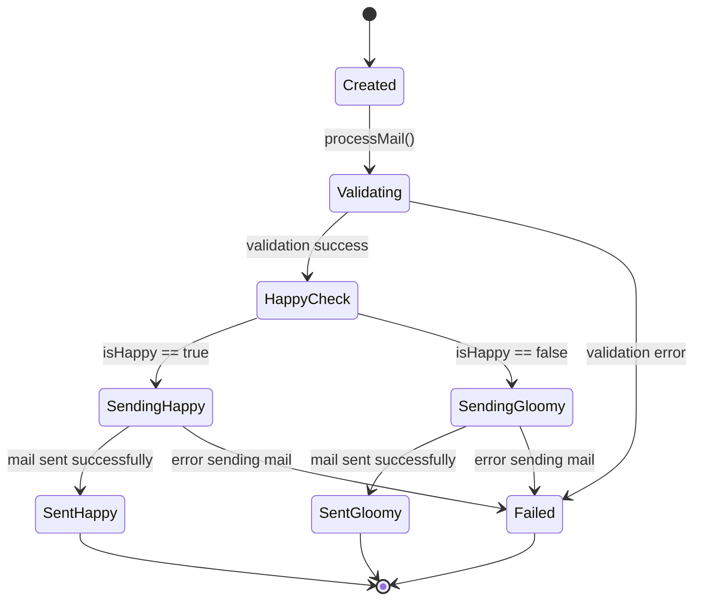
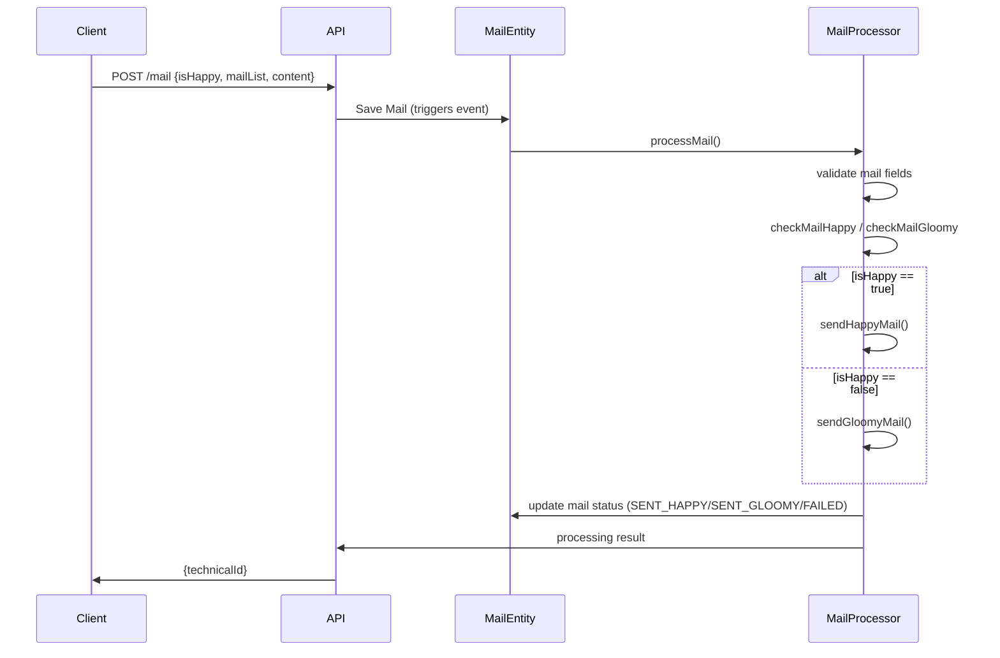
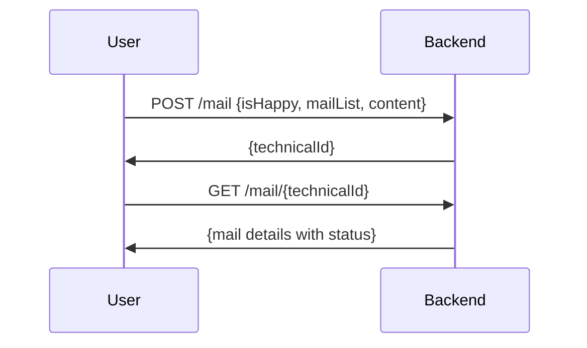

### 1. Entity Definitions

``` 
Mail:
- isHappy: Boolean (Indicates if the mail content is happy or gloomy)
- mailList: List<String> (List of recipient email addresses)
- content: String (Mail body text to be sent)
- status: String (Represents current mail process state, e.g., CREATED, SENT_HAPPY, SENT_GLOOMY, FAILED)
```

---

### 2. Process Method Flows

```
processMail() Flow:
1. Initial State: Mail entity is created with status = "CREATED"
2. Validation: Validate mail fields (mailList not empty, content present)
3. Criteria Check: Use checkMailHappy() and checkMailGloomy() to determine mail type based on isHappy boolean
4. Processing:
   - If isHappy == true → trigger sendHappyMail processor → send emails to mailList
   - If isHappy == false → trigger sendGloomyMail processor → send emails to mailList
5. Completion: Update mail status to SENT_HAPPY or SENT_GLOOMY based on processor outcome, or FAILED if error occurs
6. Notification: (Optional) Log or publish event indicating mail sending result
```

---

### 3. API Endpoints Design

| Method | Endpoint          | Description                                          | Request Body             | Response            |
|--------|-------------------|------------------------------------------------------|--------------------------|---------------------|
| POST   | /mail             | Create new Mail entity and trigger processing        | { isHappy, mailList, content } | { technicalId }     |
| GET    | /mail/{technicalId} | Retrieve saved Mail entity by technicalId           | N/A                      | { isHappy, mailList, content, status } |
| GET    | /mail             | (Optional) Retrieve mail entities by condition (e.g., isHappy) - only if explicitly required | Query params (e.g., isHappy=true) | List of mail entities |

---

### 4. Request/Response Formats

**POST /mail**

_Request Body:_

```json
{
  "isHappy": true,
  "mailList": ["user1@example.com", "user2@example.com"],
  "content": "Hello! Wishing you a wonderful day!"
}
```

_Response Body:_

```json
{
  "technicalId": "123e4567-e89b-12d3-a456-426614174000"
}
```

**GET /mail/{technicalId}**

_Response Body:_

```json
{
  "isHappy": true,
  "mailList": ["user1@example.com", "user2@example.com"],
  "content": "Hello! Wishing you a wonderful day!",
  "status": "SENT_HAPPY"
}
```

**GET /mail?isHappy=true** (Optional)

_Response Body:_

```json
[
  {
    "isHappy": true,
    "mailList": ["user1@example.com"],
    "content": "Happy mail content",
    "status": "SENT_HAPPY"
  },
  {
    "isHappy": true,
    "mailList": ["user2@example.com"],
    "content": "Another happy mail",
    "status": "SENT_HAPPY"
  }
]
```

---

### 5. Mermaid Diagrams

**Entity Lifecycle State Diagram**


```mermaid
stateDiagram-v2
    [*] --> Created
    Created --> Validating : processMail()
    Validating --> HappyCheck : validation success
    Validating --> Failed : validation error
    HappyCheck --> SendingHappy : isHappy == true
    HappyCheck --> SendingGloomy : isHappy == false
    SendingHappy --> SentHappy : mail sent successfully
    SendingHappy --> Failed : error sending mail
    SendingGloomy --> SentGloomy : mail sent successfully
    SendingGloomy --> Failed : error sending mail
    SentHappy --> [*]
    SentGloomy --> [*]
    Failed --> [*]
```

---

**Event-Driven Processing Chain**


```mermaid
sequenceDiagram
    participant Client
    participant API
    participant MailEntity
    participant MailProcessor

    Client->>API: POST /mail {isHappy, mailList, content}
    API->>MailEntity: Save Mail (triggers event)
    MailEntity->>MailProcessor: processMail()
    MailProcessor->>MailProcessor: validate mail fields
    MailProcessor->>MailProcessor: checkMailHappy / checkMailGloomy
    alt isHappy == true
        MailProcessor->>MailProcessor: sendHappyMail()
    else isHappy == false
        MailProcessor->>MailProcessor: sendGloomyMail()
    end
    MailProcessor->>MailEntity: update mail status (SENT_HAPPY/SENT_GLOOMY/FAILED)
    MailProcessor->>API: processing result
    API->>Client: {technicalId}
```

---

**User Interaction Sequence Flow**


```mermaid
sequenceDiagram
    participant User
    participant Backend

    User->>Backend: POST /mail {isHappy, mailList, content}
    Backend->>User: {technicalId}

    User->>Backend: GET /mail/{technicalId}
    Backend->>User: {mail details with status}
```

---

This concludes the confirmed functional requirements for your happy mail sending application using Event-Driven Architecture principles on Cyoda platform.  
Please let me know if you need any further clarifications or additions!