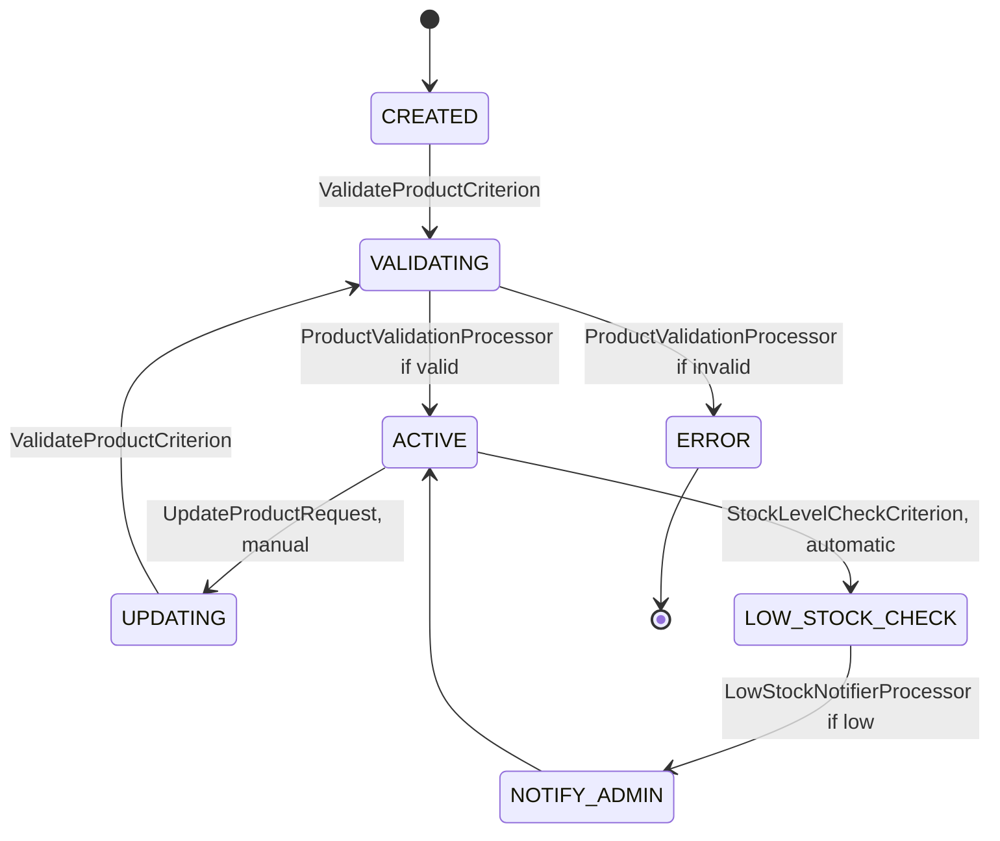
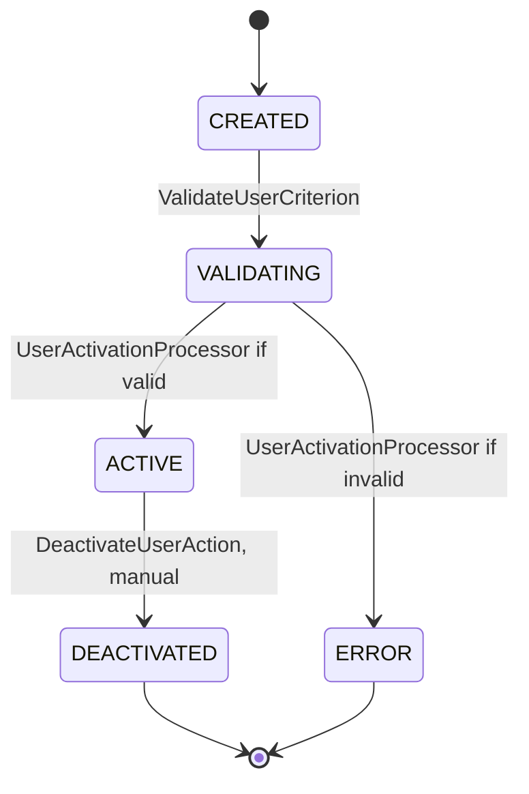
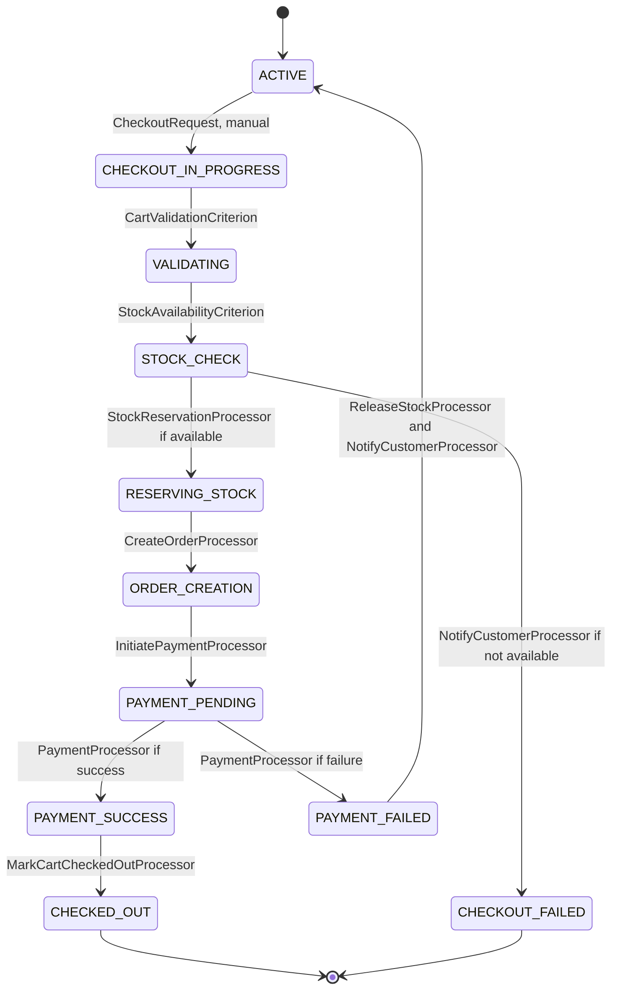
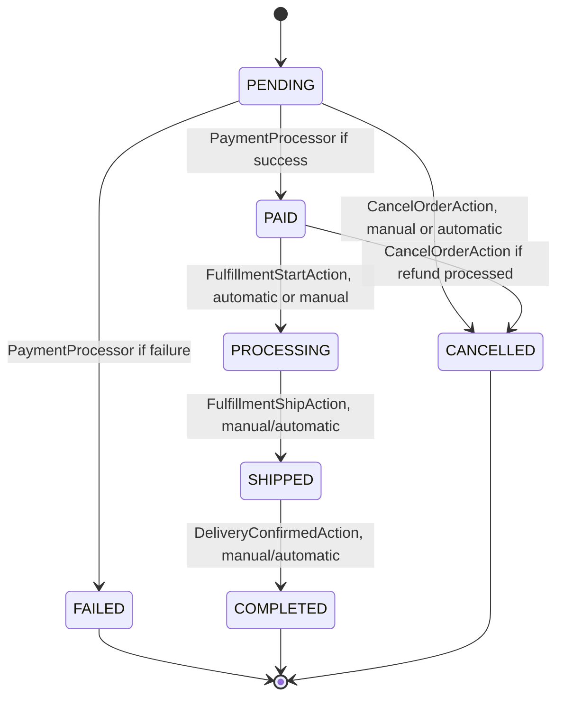
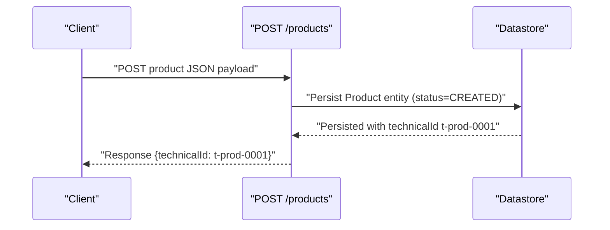
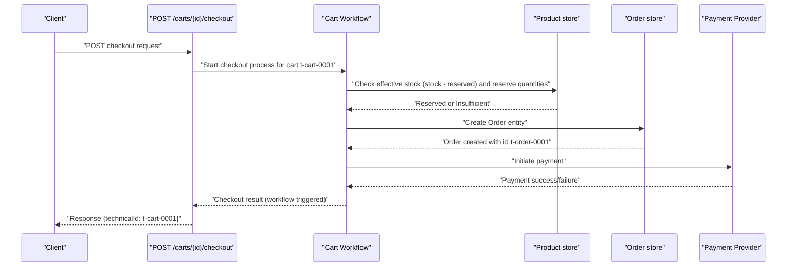
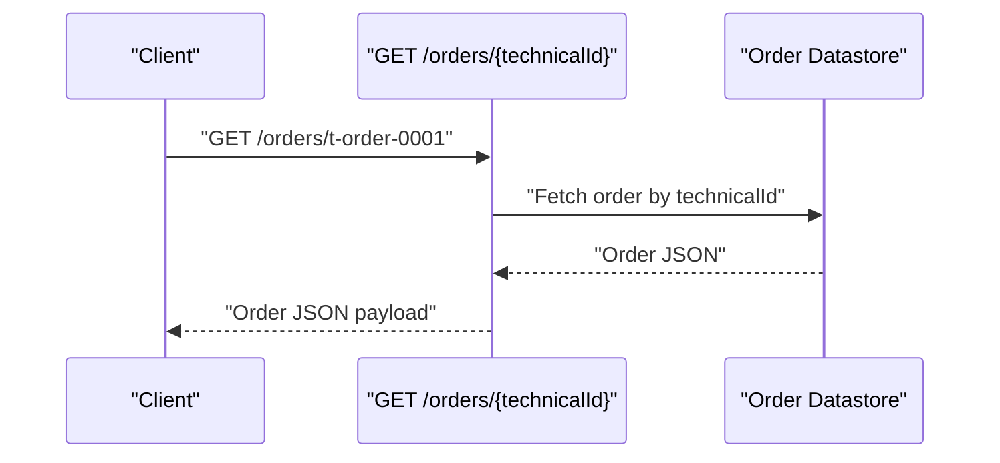

# Functional Requirements (Finalized)

Max entities considered: 4 (as specified by the user).
Do not add any additional entities.

> Summary
>
> This document defines the up-to-date functional requirements for the prototype application. It describes the four domain entities, their fields (including technical datastore id and workflow statuses), the event-driven workflows that run on entity persistence, API design rules and examples, required Criterion and Processor classes, and processor pseudo code. The logic has been updated to ensure consistency between entity definitions and workflows (notably: inclusion of status and technicalId fields, handling of stock reservations, and clear responsibilities for processors).

---

## 1. Entity Definitions

All timestamps use ISO8601 format (e.g., 2025-08-01T12:00:00Z). Status fields are string values (do NOT use enum types - not supported temporarily). Each entity persisted to the datastore has two identifiers:
- id: business identifier (optional or required per entity) used in business payloads (e.g., SKU, user id, order number)
- technicalId: datastore-specific identifier returned by POST responses and used for GET-by-technicalId endpoints

```
Product:
- technicalId: String (datastore id returned in POST responses)
- id: String (business identifier, e.g., SKU or external id)
- status: String (e.g., CREATED, ACTIVE, ERROR)     <-- included because workflows depend on status
- name: String (product display name)
- description: String (long description)
- price: Decimal (unit price)
- currency: String (ISO currency code for price)
- stockQuantity: Integer (available quantity for sale, available stock)
- reservedQuantity: Integer (quantity currently reserved for in-progress checkouts)  <-- added to support reservation model and avoid races
- category: String (product category or taxonomy)
- imageUrl: String (URL to product image)
- importedFrom: String (optional source of import, e.g., filename or system)
- importedAt: String (ISO8601 timestamp when product was imported)
- createdByUserId: String (id of user who created/imported the product)
- errors: Array[String] (optional; validation or processing error messages)
- createdAt: String (ISO8601 timestamp)
- updatedAt: String (ISO8601 timestamp)

User:
- technicalId: String (datastore id returned in POST responses)
- id: String (business id for the user)
- status: String (e.g., CREATED, ACTIVE, DEACTIVATED, ERROR)
- role: String (Admin or Customer)
- name: String (full name)
- email: String (unique email)
- passwordHash: String (stored password hash; hashing happens during activation)
- phone: String (optional phone number)
- profile: Object (optional; customer profile placeholders such as addresses)
- errors: Array[String] (optional; validation or processing error messages)
- createdAt: String (ISO8601 timestamp)
- updatedAt: String (ISO8601 timestamp)

ShoppingCart:
- technicalId: String (datastore id returned in POST responses)
- id: String (business cart id, optional)
- customerId: String (user.id of the owning customer)
- items: Array of objects (cart line items)
  - productId: String (reference to Product.id or SKU)
  - quantity: Integer (requested quantity)
  - priceAtAdd: Decimal (product price at time of adding)
- status: String (e.g., ACTIVE, CHECKOUT_IN_PROGRESS, CHECKED_OUT, CHECKOUT_FAILED, CANCELLED)
- metadata: Object (optional; e.g., shippingAddress, paymentMethodId for checkout request)
- createdAt: String (ISO8601 timestamp)
- updatedAt: String (ISO8601 timestamp)

Order:
- technicalId: String (datastore id returned in POST responses)
- id: String (business order id, e.g., ORD-2025-0001)
- customerId: String (user.id of the customer)
- items: Array of objects (order line items)
  - productId: String (reference to Product.id or SKU)
  - quantity: Integer
  - unitPrice: Decimal (unit price used for this order)
- subtotal: Decimal
- tax: Decimal
- shipping: Decimal
- total: Decimal
- status: String (e.g., PENDING, PAID, PROCESSING, SHIPPED, COMPLETED, CANCELLED, FAILED)
- paymentReference: String (provider transaction id or reference)
- errors: Array[String] (optional; processing or payment errors)
- createdAt: String (ISO8601 timestamp)
- updatedAt: String (ISO8601 timestamp)
```

Notes on identifiers and GET behavior:
- POST endpoints MUST return only { "technicalId": "<id>" } on success.
- All GET endpoints are by technicalId (GET /entities/{technicalId}) and will include both technicalId and business fields (including status and any errors).

---

## 2. Entity Workflows (Event-Driven)

Note: In this Event-Driven Architecture each entity persistence (POST that creates or updates an entity) triggers its workflow automatically (via asynchronous processors). Below each workflow we list required Criterion and Processor building blocks and updated pseudo code.

### Product workflow

1. Initial State: Product persisted with status=CREATED when POST /products executes (persist returns technicalId).
2. Validation (automatic): ProductValidationCriterion checks required fields (id or sku, name, price, currency, stockQuantity >= 0).
3. Activation (automatic): ProductValidationProcessor sets status=ACTIVE, sets createdAt/updatedAt and clears errors if validation passes.
4. Error (automatic): If validation fails, set status=ERROR and populate errors[].
5. Update (manual/automatic): On product update, run validation again and set updatedAt.
6. Low Stock Notification (automatic): If (stockQuantity - reservedQuantity) falls below a configured threshold, emit LowStock event to notify Admins.

Rationale for reservedQuantity:
- To avoid race conditions during concurrent checkouts, the system uses reservedQuantity to indicate amounts reserved for in-progress checkouts. stockQuantity represents the physical available stock; the effective free stock is (stockQuantity - reservedQuantity). Reservation is increased during checkout reservation and decreased on release or finalization.

State diagram (high-level):


```mermaid
stateDiagram-v2
    [*] --> CREATED
    CREATED --> VALIDATING : ValidateProductCriterion
    VALIDATING --> ACTIVE : ProductValidationProcessor if valid
    VALIDATING --> ERROR : ProductValidationProcessor if invalid
    ACTIVE --> UPDATING : UpdateProductRequest, manual
    UPDATING --> VALIDATING : ValidateProductCriterion
    ACTIVE --> LOW_STOCK_CHECK : StockLevelCheckCriterion, automatic
    LOW_STOCK_CHECK --> NOTIFY_ADMIN : LowStockNotifierProcessor if low
    NOTIFY_ADMIN --> ACTIVE
    ERROR --> [*]
```

Criterion and Processor classes needed (Product):
- ProductValidationCriterion (checks required fields, price non-negative, currency format)
- ProductValidationProcessor
  - Pseudo:
    - load product by technicalId
    - errors = []
    - if product.id missing or empty -> errors.add("id required")
    - if product.name missing -> errors.add("name required")
    - if product.price is null or < 0 -> errors.add("invalid price")
    - if product.currency invalid format -> errors.add("invalid currency")
    - if product.stockQuantity < 0 -> errors.add("stockQuantity must be >= 0")
    - if errors not empty -> set product.status = "ERROR", product.errors = errors, persist
    - else -> set product.status = "ACTIVE", clear errors, set createdAt/updatedAt if missing, persist
- StockLevelCheckCriterion (checks if (stockQuantity - reservedQuantity) < threshold)
- LowStockNotifierProcessor (sends notification to admins, logs)

---

### User workflow (Applies to both Admin and Customer)

1. Initial State: User created with status=CREATED (via POST /users).
2. Validation (automatic): ValidateUserCriterion validates email format and uniqueness and required fields.
3. Profile Setup (automatic): If role == Customer, CustomerProfileInitializerProcessor creates initial customer profile placeholders (addresses empty) as part of activation.
4. Activation (automatic): If validation passes, UserActivationProcessor sets status=ACTIVE, hashes password if needed, sets createdAt/updatedAt.
5. Deactivation (manual): Admin can set status=DEACTIVATED via an administrative action (update request triggers corresponding processors).

State diagram (high-level):


```mermaid
stateDiagram-v2
    [*] --> CREATED
    CREATED --> VALIDATING : ValidateUserCriterion
    VALIDATING --> ACTIVE : UserActivationProcessor if valid
    VALIDATING --> ERROR : UserActivationProcessor if invalid
    ACTIVE --> DEACTIVATED : DeactivateUserAction, manual
    DEACTIVATED --> [*]
    ERROR --> [*]
```

Criterion and Processor classes needed (User):
- ValidateUserCriterion (validates required fields, email format and uniqueness)
- UserActivationProcessor
  - Pseudo:
    - load user by technicalId
    - errors = []
    - if email missing or invalid format -> errors.add("invalid email")
    - if another user exists with same email -> errors.add("email already exists")
    - if errors not empty -> set status = "ERROR", set errors, persist
    - else -> if passwordHash not provided assume password plaintext was supplied and hash it (ensure password hashing performed only inside processor), set status = "ACTIVE", set createdAt/updatedAt, persist
- CustomerProfileInitializerProcessor (executed as part of UserActivationProcessor when role == "Customer")

Notes:
- Email uniqueness check must use datastore index and be atomic/transactional where possible to avoid race conditions creating duplicate emails.

---

### ShoppingCart workflow

1. Initial State: Cart created with status=ACTIVE (via POST /carts).
2. Add/Update Items (manual via API endpoints): Changing items updates cart.updatedAt and triggers CartChanged event.
3. Checkout Initiated (manual via POST /carts/{id}/checkout): change cart.status to CHECKOUT_IN_PROGRESS (atomically during checkout start) and store checkout metadata (e.g., shippingAddress, paymentMethodId) to cart.metadata.
4. Checkout Processing (automatic): Validate cart contents (CartValidationCriterion), ensure effective available product quantities for each item (StockAvailabilityCriterion using (stockQuantity - reservedQuantity)).
5. Reserve Stock (automatic): Reserve product quantities by increasing Product.reservedQuantity atomically for all items in the cart (all-or-nothing). If reservation fails due to insufficient effective stock, set cart.status = CHECKOUT_FAILED and notify customer.
6. Create Order (automatic): Create Order entity from cart items and persist Order with status=PENDING.
7. Payment (automatic): Trigger PaymentProcessor (synchronous or asynchronous). On payment success set Order.status=PAID, set cart.status=CHECKED_OUT and finalize product stock by decrementing stockQuantity and reducing reservedQuantity accordingly (finalize reservation). On payment failure set Order.status=FAILED, set cart.status either back to ACTIVE or to CHECKOUT_FAILED per policy and release reservedQuantity.
8. Completion: When Order transitions to PROCESSING/SHIPPED/COMPLETED due to fulfillment updates, notify customer and update statuses.

Rationale for reservation then finalize:
- This approach minimizes double-selling by reserving quantities early and only decrementing physical stock on payment completion (or fulfillment finalization) while allowing release on failure.

State diagram (high-level):


```mermaid
stateDiagram-v2
    [*] --> ACTIVE
    ACTIVE --> CHECKOUT_IN_PROGRESS : CheckoutRequest, manual
    CHECKOUT_IN_PROGRESS --> VALIDATING : CartValidationCriterion
    VALIDATING --> STOCK_CHECK : StockAvailabilityCriterion
    STOCK_CHECK --> RESERVING_STOCK : StockReservationProcessor if available
    STOCK_CHECK --> CHECKOUT_FAILED : NotifyCustomerProcessor if not available
    RESERVING_STOCK --> ORDER_CREATION : CreateOrderProcessor
    ORDER_CREATION --> PAYMENT_PENDING : InitiatePaymentProcessor
    PAYMENT_PENDING --> PAYMENT_SUCCESS : PaymentProcessor if success
    PAYMENT_PENDING --> PAYMENT_FAILED : PaymentProcessor if failure
    PAYMENT_SUCCESS --> CHECKED_OUT : MarkCartCheckedOutProcessor
    PAYMENT_FAILED --> ACTIVE : ReleaseStockProcessor and NotifyCustomerProcessor
    CHECKED_OUT --> [*]
    CHECKOUT_FAILED --> [*]
```

Criterion and Processor classes needed (Cart):
- CartValidationCriterion (ensure cart has items, quantities > 0, prices present)
- StockAvailabilityCriterion (for each item check effective available = product.stockQuantity - product.reservedQuantity >= requested)
- StockReservationProcessor
  - Pseudo:
    - begin transaction
    - for each item in cart:
      - load Product
      - effectiveAvailable = product.stockQuantity - product.reservedQuantity
      - if effectiveAvailable < item.quantity -> rollback -> throw InsufficientStockException
      - product.reservedQuantity += item.quantity
      - persist product
    - commit transaction
- CreateOrderProcessor
  - Pseudo:
    - map cart items to order items with unitPrice = priceAtAdd
    - compute subtotal, tax, shipping, total
    - persist order with status = "PENDING"
    - return order.technicalId
- InitiatePaymentProcessor
  - Pseudo:
    - call payment gateway adapter (synchronous or enqueue async job)
    - attach paymentReference to Order
- PaymentProcessor
  - Pseudo:
    - on success: set Order.status = "PAID", persist, emit PaymentSucceededEvent
      - then finalize reservation: decrement product.stockQuantity by reserved amount for order items and decrement product.reservedQuantity accordingly (in a transaction per product)
    - on failure: set Order.status = "FAILED", persist, emit PaymentFailedEvent
      - then ReleaseStockProcessor to subtract reservations (product.reservedQuantity -= reserved) and persist
- ReleaseStockProcessor (restore product.reservedQuantity on payment failure or cart cancel)
- NotifyCustomerProcessor (send emails/notifications)

Notes:
- Reservation and finalization should be transactional per-product or use optimistic concurrency (versioning) to avoid lost updates.
- The policy whether to cancel cart or return to ACTIVE on payment failure must be configurable; by default the cart returns to ACTIVE and reservedQuantity is released.

---

### Order workflow

1. Initial State: Order persisted with status=PENDING (created by CreateOrderProcessor during checkout).
2. Payment Processing (automatic): PaymentProcessor moves status to PAID or FAILED based on payment provider outcome.
3. Fulfillment (manual/automatic): On PAID, fulfillment system may set PROCESSING then SHIPPED then COMPLETED.
4. Cancellation (manual/automatic): Orders may be CANCELLED (e.g., stock/fulfillment issues or customer cancellation). If cancelled after reservation/finalization, appropriate stock adjustments (restore or restock) and refund flows must run.

State diagram (high-level):


```mermaid
stateDiagram-v2
    [*] --> PENDING
    PENDING --> PAID : PaymentProcessor if success
    PENDING --> FAILED : PaymentProcessor if failure
    PAID --> PROCESSING : FulfillmentStartAction, automatic or manual
    PROCESSING --> SHIPPED : FulfillmentShipAction, manual/automatic
    SHIPPED --> COMPLETED : DeliveryConfirmedAction, manual/automatic
    PENDING --> CANCELLED : CancelOrderAction, manual or automatic
    PAID --> CANCELLED : CancelOrderAction if refund processed
    FAILED --> [*]
    COMPLETED --> [*]
    CANCELLED --> [*]
```

Criterion and Processor classes needed (Order):
- PaymentCompletionCriterion (observes payment provider callbacks)
- PaymentCompletionProcessor
  - Pseudo:
    - on provider callback:
      - find Order by paymentReference
      - if provider status success -> set Order.status = "PAID", persist, emit PaymentSucceededEvent
      - else -> set Order.status = "FAILED", persist, emit PaymentFailedEvent
- FulfillmentProcessor (receives external fulfillment updates and advances Order.status)
- OrderCancellationProcessor (handles cancellation and potential refunds and stock adjustments)

---

## 3. API Endpoints Design (rules applied)

Rules applied (enforced):
- POST endpoints create entities and trigger their workflows. POST responses MUST return only { "technicalId": "<id>" }.
- GET endpoints for retrieving stored results by technicalId are available for each entity that can be created via POST.
- No GET-by-condition (search by fields) endpoints are provided (unless explicitly requested later).
- GET all endpoints are optional; a products listing endpoint is included for convenience.

Endpoints list (behavior summary):

- POST /products
  - Description: Create a Product (triggers Product workflow).
  - Request: product payload (see JSON examples below).
  - Response: { "technicalId": "<id>" } only.

- GET /products/{technicalId}
  - Description: Retrieve stored Product by technicalId (response includes status and reservedQuantity).

- GET /products
  - Description: Optional listing of products (pagination omitted for brevity).

- POST /users
  - Description: Create a User (Admin or Customer). Triggers User workflow.
  - Request: user payload.
  - Response: { "technicalId": "<id>" } only.

- GET /users/{technicalId}
  - Description: Retrieve stored User by technicalId.

- POST /carts
  - Description: Create a ShoppingCart for a customer. Triggers ShoppingCart workflow.
  - Request: cart payload (customerId and optional initial items).
  - Response: { "technicalId": "<cart-id>" } only.

- GET /carts/{technicalId}
  - Description: Retrieve stored ShoppingCart by technicalId.

- POST /carts/{technicalId}/items
  - Description: Add or update items in the cart. This is a POST that mutates the ShoppingCart entity and triggers CartChanged event/workflow.
  - Request: item payload (productId, quantity, optional priceAtAdd). Response: { "technicalId": "<cart-id>" } only.

- PATCH /carts/{technicalId}/items
  - Description: Update item quantities in cart. Returns { "technicalId": "<cart-id>" } only.

- DELETE /carts/{technicalId}/items
  - Description: Remove an item from cart. Returns { "technicalId": "<cart-id>" } only.

- POST /carts/{technicalId}/checkout
  - Description: Initiate checkout (changes cart to CHECKOUT_IN_PROGRESS and triggers checkout processors creating Order). Returns { "technicalId": "<cart-id>" } only.

- GET /orders/{technicalId}
  - Description: Retrieve Order by technicalId (orders are created by CreateOrderProcessor as part of checkout).

Notes:
- No POST /orders endpoint is provided; orders are created by the ShoppingCart checkout process only.
- All POST responses must return only the technicalId field in the successful response body.

---

## 4. Request / Response Formats (examples)

Note: All POST endpoints return JSON with only the technicalId field in successful response bodies. GET by technicalId returns full resource including technicalId and status.

- POST /products
  - Request JSON:
    {
      "id": "SKU-12345",
      "name": "Widget",
      "description": "A sample widget",
      "price": 9.99,
      "currency": "USD",
      "stockQuantity": 100,
      "category": "Gadgets",
      "imageUrl": "https://example.com/widget.png",
      "importedFrom": "csv_upload",
      "createdByUserId": "admin-1"
    }
  - Response JSON:
    {
      "technicalId": "t-prod-0001"
    }

- GET /products/{technicalId}
  - Response JSON:
    {
      "technicalId": "t-prod-0001",
      "id": "SKU-12345",
      "status": "ACTIVE",
      "name": "Widget",
      "description": "A sample widget",
      "price": 9.99,
      "currency": "USD",
      "stockQuantity": 100,
      "reservedQuantity": 5,
      "category": "Gadgets",
      "imageUrl": "https://example.com/widget.png",
      "importedFrom": "csv_upload",
      "importedAt": "2025-08-01T12:00:00Z",
      "createdByUserId": "admin-1",
      "createdAt": "2025-08-01T12:00:00Z",
      "updatedAt": "2025-08-02T09:00:00Z"
    }

- POST /users
  - Request JSON:
    {
      "id": "user-100",
      "role": "Customer",
      "name": "Alice Example",
      "email": "alice@example.com",
      "passwordHash": "<bcrypt-hash>",    // or plaintext password will be hashed by activation processor
      "phone": "+15551234567"
    }
  - Response JSON:
    {
      "technicalId": "t-user-0001"
    }

- POST /carts
  - Request JSON:
    {
      "customerId": "user-100",
      "items": [
        { "productId": "SKU-12345", "quantity": 2, "priceAtAdd": 9.99 }
      ]
    }
  - Response JSON:
    {
      "technicalId": "t-cart-0001"
    }

- POST /carts/{technicalId}/checkout
  - Request JSON:
    {
      "paymentMethodId": "pm-visa-01",
      "shippingAddress": {
        "line1": "123 Main St",
        "city": "Exampleville",
        "state": "EX",
        "postalCode": "12345",
        "country": "US"
      }
    }
  - Response JSON:
    {
      "technicalId": "t-cart-0001"
    }

- GET /orders/{technicalId}
  - Response JSON:
    {
      "technicalId": "t-order-0001",
      "id": "ORD-2025-0001",
      "customerId": "user-100",
      "items": [
        { "productId": "SKU-12345", "quantity": 2, "unitPrice": 9.99 }
      ],
      "subtotal": 19.98,
      "tax": 1.50,
      "shipping": 5.00,
      "total": 26.48,
      "status": "PAID",
      "paymentReference": "payprov-98765",
      "createdAt": "2025-08-02T10:00:00Z",
      "updatedAt": "2025-08-02T10:01:00Z"
    }

---

## 5. Mermaid Visualizations for Request / Response flows

Note: Each code block below contains only valid Mermaid code.

POST /products request -> server -> response (technicalId):


```mermaid
sequenceDiagram
    participant Client as "Client"
    participant API as "POST /products"
    participant Store as "Datastore"
    Client->>API: "POST product JSON payload"
    API->>Store: "Persist Product entity (status=CREATED)"
    Store-->>API: "Persisted with technicalId t-prod-0001"
    API-->>Client: "Response {technicalId: t-prod-0001}"
```

POST /carts checkout flow (high-level):


```mermaid
sequenceDiagram
    participant Client as "Client"
    participant API as "POST /carts/{id}/checkout"
    participant CartSvc as "Cart Workflow"
    participant ProductSvc as "Product store"
    participant OrderSvc as "Order store"
    participant Payment as "Payment Provider"
    Client->>API: "POST checkout request"
    API->>CartSvc: "Start checkout process for cart t-cart-0001"
    CartSvc->>ProductSvc: "Check effective stock (stock - reserved) and reserve quantities"
    ProductSvc-->>CartSvc: "Reserved or Insufficient"
    CartSvc->>OrderSvc: "Create Order entity"
    OrderSvc-->>CartSvc: "Order created with id t-order-0001"
    CartSvc->>Payment: "Initiate payment"
    Payment-->>CartSvc: "Payment success/failure"
    CartSvc-->>API: "Checkout result (workflow triggered)"
    API-->>Client: "Response {technicalId: t-cart-0001}"
```

GET /orders/{technicalId} retrieval:


```mermaid
sequenceDiagram
    participant Client as "Client"
    participant API as "GET /orders/{technicalId}"
    participant OrderStore as "Order Datastore"
    Client->>API: "GET /orders/t-order-0001"
    API->>OrderStore: "Fetch order by technicalId"
    OrderStore-->>API: "Order JSON"
    API-->>Client: "Order JSON payload"
```

---

## 6. Required Criterion and Processor Class Summary (for implementation planning)

- ProductValidationCriterion
- ProductValidationProcessor
- StockLevelCheckCriterion
- LowStockNotifierProcessor

- ValidateUserCriterion
- UserActivationProcessor
- CustomerProfileInitializerProcessor

- CartValidationCriterion
- StockAvailabilityCriterion
- StockReservationProcessor
- CreateOrderProcessor
- InitiatePaymentProcessor
- PaymentProcessor
- ReleaseStockProcessor
- NotifyCustomerProcessor

- PaymentCompletionCriterion
- PaymentCompletionProcessor
- FulfillmentProcessor
- OrderCancellationProcessor

Each Processor pseudo code example (high-level) — updated to align with the reservation model:

- ProductValidationProcessor pseudo:
  - load product
  - if product.name empty or price < 0 or currency empty -> set status ERROR, persist errors
  - else set status ACTIVE, set timestamps, persist

- StockReservationProcessor pseudo:
  - begin transaction
  - for each item in cart:
    - load Product (with current reservedQuantity and stockQuantity)
    - effectiveAvailable = product.stockQuantity - product.reservedQuantity
    - if effectiveAvailable < item.quantity -> rollback transaction -> throw InsufficientStock
    - product.reservedQuantity += item.quantity
    - persist product
  - commit transaction

- CreateOrderProcessor pseudo:
  - map cart items to order items with unitPrice = priceAtAdd
  - compute subtotal, tax, shipping, total
  - persist order with status PENDING
  - return order.technicalId

- PaymentProcessor pseudo:
  - call payment adapter / gateway
  - if success -> set order.status = PAID, persist, emit PaymentSucceededEvent
    - then finalize reservation: in transaction for each order item: product.stockQuantity -= item.quantity; product.reservedQuantity -= item.quantity; persist
  - else -> set order.status = FAILED, persist, emit PaymentFailedEvent
    - then release reservation: product.reservedQuantity -= reserved for the order; persist

---

If you want changes to any of the statuses, field names, or the reservation strategy (for example, to decrement stockQuantity immediately instead of using reservedQuantity), tell me which approach you prefer and I will update the requirements accordingly.

**End of functional requirements (updated).**
