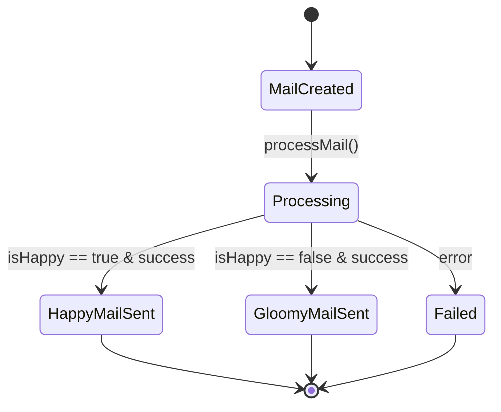
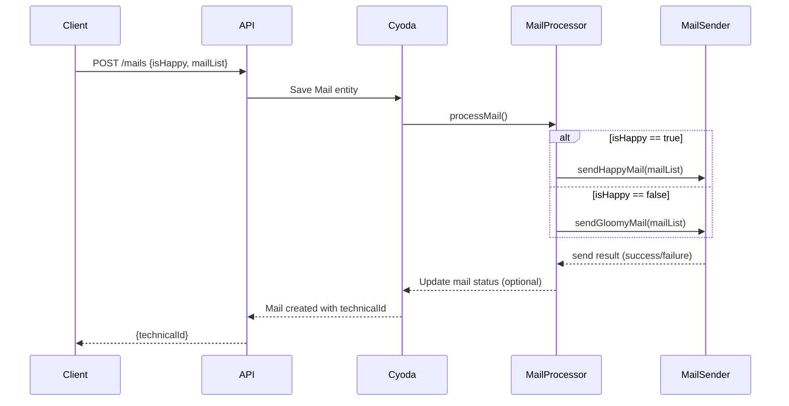

### 1. Entity Definitions

```
Mail:
- isHappy: Boolean (indicates if the mail is happy or gloomy)
- mailList: List<String> (list of recipient email addresses)
```

### 2. Process Method Flows

```
processMail() Flow:
1. Initial State: Mail entity created with isHappy flag and mailList
2. Validation: (optional) Validate mailList is not empty and emails are valid (can define checkMailValid if needed)
3. Processing:
   - If isHappy == true, trigger sendHappyMail processor internally
   - If isHappy == false, trigger sendGloomyMail processor internally
4. Sending:
   - sendHappyMail: Compose and send happy content to all recipients in mailList
   - sendGloomyMail: Compose and send gloomy content to all recipients in mailList
5. Completion: Mark mail as SENT or FAILED internally (if desired, can be part of event state)
6. Notification: Optionally notify system/log about mail send status
```

### 3. API Endpoints Design

- **POST /mails**  
  Request body:  
  ```json
  {
    "isHappy": true,
    "mailList": ["email1@example.com", "email2@example.com"]
  }
  ```  
  Response body:  
  ```json
  {
    "technicalId": "string"
  }
  ```  
  - Creates a new Mail entity, triggers `processMail()`, which decides sending logic.

- **GET /mails/{technicalId}**  
  Response body:  
  ```json
  {
    "isHappy": true,
    "mailList": ["email1@example.com", "email2@example.com"],
    "status": "SENT" // optional, if you want to expose processing status
  }
  ```  

- **GET /mails?isHappy=true** (Optional, only if explicitly asked)  
  Response body:  
  ```json
  [
    {
      "technicalId": "string",
      "isHappy": true,
      "mailList": ["email1@example.com"]
    }
  ]
  ```

---

### 4. Mermaid Diagrams

**Mail Entity Lifecycle State Diagram**


```mermaid
stateDiagram-v2
    [*] --> MailCreated
    MailCreated --> Processing : processMail()
    Processing --> HappyMailSent : isHappy == true & success
    Processing --> GloomyMailSent : isHappy == false & success
    Processing --> Failed : error
    HappyMailSent --> [*]
    GloomyMailSent --> [*]
    Failed --> [*]
```

**Event-Driven Processing Chain**


```mermaid
sequenceDiagram
    participant Client
    participant API
    participant Cyoda
    participant MailProcessor
    participant MailSender

    Client->>API: POST /mails {isHappy, mailList}
    API->>Cyoda: Save Mail entity
    Cyoda->>MailProcessor: processMail()
    alt isHappy == true
        MailProcessor->>MailSender: sendHappyMail(mailList)
    else isHappy == false
        MailProcessor->>MailSender: sendGloomyMail(mailList)
    end
    MailSender-->>MailProcessor: send result (success/failure)
    MailProcessor-->>Cyoda: Update mail status (optional)
    Cyoda-->>API: Mail created with technicalId
    API-->>Client: {technicalId}
```

---

No update or delete endpoints will be provided to ensure immutable event history, in line with the EDA principles.

If you want, we can add explicit validation criteria or expose processing status in GET responses later.

Thank you!