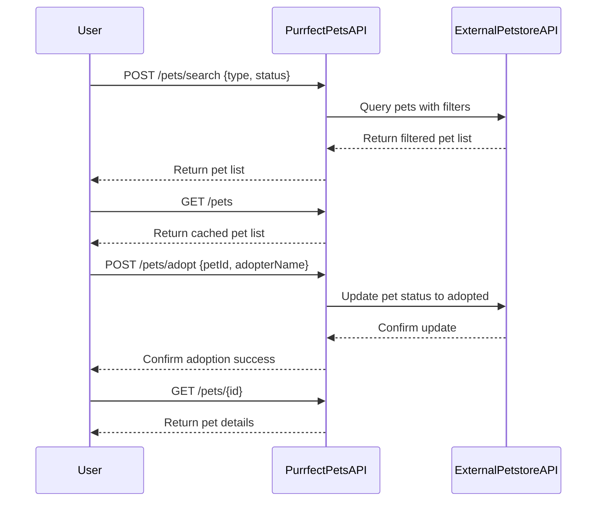

# Purrfect Pets API - Functional Requirements

## API Endpoints

### 1. POST /pets/search  
- **Description:** Query pets from Petstore API, filter or process data (e.g., filter by type, status)  
- **Request:**  
```json
{
  "type": "string",        // optional: e.g., "dog", "cat"
  "status": "string"       // optional: e.g., "available", "sold"
}
```  
- **Response:**  
```json
[
  {
    "id": 123,
    "name": "Fluffy",
    "type": "dog",
    "status": "available",
    "tags": ["friendly", "small"]
  },
  ...
]
```

### 2. GET /pets  
- **Description:** Retrieve cached or last searched pets (results from POST /pets/search)  
- **Response:**  
```json
[
  {
    "id": 123,
    "name": "Fluffy",
    "type": "dog",
    "status": "available",
    "tags": ["friendly", "small"]
  },
  ...
]
```

### 3. POST /pets/adopt  
- **Description:** Adopt a pet (business logic to update status, confirm availability)  
- **Request:**  
```json
{
  "petId": 123,
  "adopterName": "John Doe"
}
```  
- **Response:**  
```json
{
  "success": true,
  "message": "Pet adopted successfully",
  "petId": 123
}
```

### 4. GET /pets/{id}  
- **Description:** Retrieve details of a single pet by ID (from cached or internal data)  
- **Response:**  
```json
{
  "id": 123,
  "name": "Fluffy",
  "type": "dog",
  "status": "adopted",
  "adopterName": "John Doe",
  "tags": ["friendly", "small"]
}
```

---

## User-App Interaction Sequence Diagram


```mermaid
sequenceDiagram
    participant User
    participant PurrfectPetsAPI
    participant ExternalPetstoreAPI

    User->>PurrfectPetsAPI: POST /pets/search {type, status}
    PurrfectPetsAPI->>ExternalPetstoreAPI: Query pets with filters
    ExternalPetstoreAPI-->>PurrfectPetsAPI: Return filtered pet list
    PurrfectPetsAPI-->>User: Return pet list

    User->>PurrfectPetsAPI: GET /pets
    PurrfectPetsAPI-->>User: Return cached pet list

    User->>PurrfectPetsAPI: POST /pets/adopt {petId, adopterName}
    PurrfectPetsAPI->>ExternalPetstoreAPI: Update pet status to adopted
    ExternalPetstoreAPI-->>PurrfectPetsAPI: Confirm update
    PurrfectPetsAPI-->>User: Confirm adoption success

    User->>PurrfectPetsAPI: GET /pets/{id}
    PurrfectPetsAPI-->>User: Return pet details
```