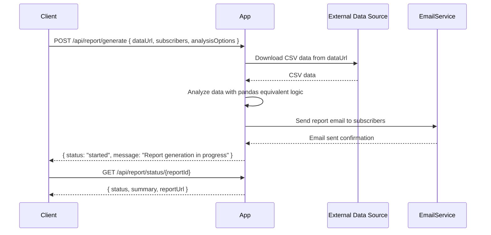
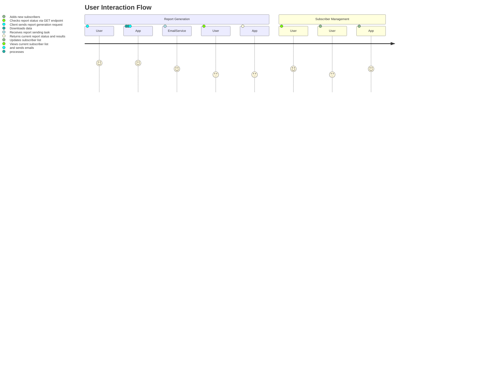

# Functional Requirements and API Design

## API Endpoints

### 1. POST /api/report/generate  
**Description:** Trigger the process to download data from the given URL, analyze it, and send the report to subscribers.  
**Request:**  
```json
{
  "dataUrl": "string",          // URL to download the CSV data
  "subscribers": ["string"],    // List of subscriber email addresses
  "analysisOptions": {          // Optional parameters for analysis (e.g., metrics)
    "summary": true,
    "customMetrics": ["string"]
  }
}
```  
**Response:**  
```json
{
  "status": "string",           // e.g., "started", "failed"
  "message": "string"           // Additional info (e.g., error messages)
}
```

---

### 2. GET /api/report/status/{reportId}  
**Description:** Retrieve the status and results of a previously generated report.  
**Response:**  
```json
{
  "reportId": "string",
  "status": "string",           // e.g., "pending", "completed", "failed"
  "generatedAt": "string",      // Timestamp
  "summary": {                  // Summary or analysis results (if completed)
    "metrics": {                
      "averagePrice": 123456,
      "count": 100
      // Other calculated metrics
    },
    "reportUrl": "string"       // URL to download the full report (optional)
  }
}
```

---

### 3. GET /api/subscribers  
**Description:** Retrieve the list of current subscribers.  
**Response:**  
```json
{
  "subscribers": ["string"]     // List of subscriber emails
}
```

---

### 4. POST /api/subscribers  
**Description:** Add new subscribers to the mailing list.  
**Request:**  
```json
{
  "subscribers": ["string"]     // List of emails to add
}
```
**Response:**  
```json
{
  "added": ["string"],          // Emails successfully added
  "failed": ["string"]          // Emails failed to add (e.g., invalid format)
}
```

---

# Mermaid Sequence Diagram


```mermaid
sequenceDiagram
    participant Client
    participant App
    participant ExternalData as External Data Source
    participant EmailService

    Client->>App: POST /api/report/generate { dataUrl, subscribers, analysisOptions }
    App->>ExternalData: Download CSV data from dataUrl
    ExternalData-->>App: CSV data
    App->>App: Analyze data with pandas equivalent logic
    App->>EmailService: Send report email to subscribers
    EmailService-->>App: Email sent confirmation
    App-->>Client: { status: "started", message: "Report generation in progress" }

    Client->>App: GET /api/report/status/{reportId}
    App-->>Client: { status, summary, reportUrl }
```

---

# Mermaid Journey Diagram (User Interaction)


```mermaid
journey
    title User Interaction Flow
    section Report Generation
      User: 5: Client sends report generation request
      App: 5: Downloads data, processes, and sends emails
      EmailService: 4: Receives report sending task
      User: 3: Checks report status via GET endpoint
      App: 3: Returns current report status and results
    section Subscriber Management
      User: 4: Views current subscriber list
      User: 3: Adds new subscribers
      App: 4: Updates subscriber list
```