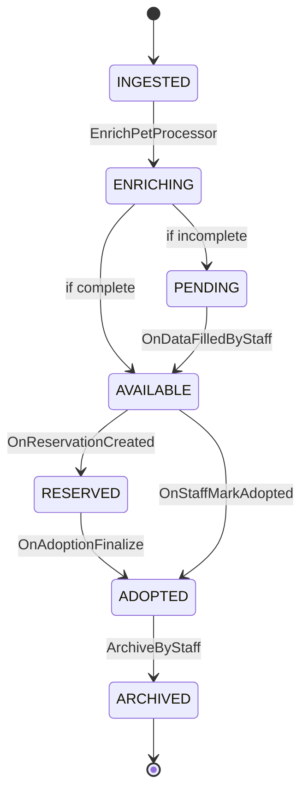
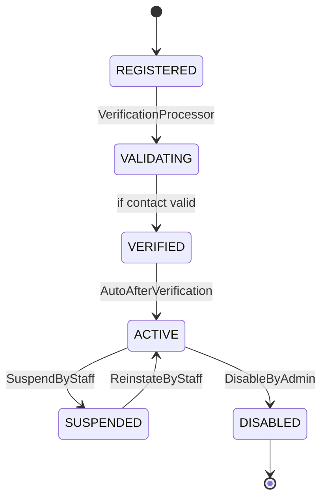
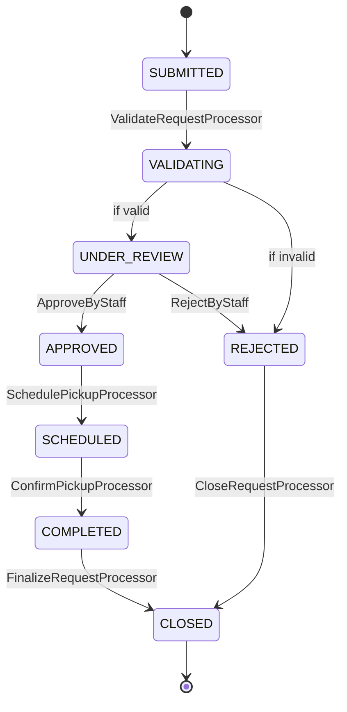

# Functional Requirements

This document defines the current, up-to-date functional requirements for the Pet Adoption prototype. It contains entity definitions, allowed state machines (workflows), processor behavior (pseudo-code), API rules and endpoint contracts, events emitted, and operational constraints (concurrency, idempotency).

All timestamps use ISO 8601 (UTC) unless explicitly noted. All processors are asynchronous (message/event-driven) unless noted otherwise and must be idempotent and resilient to retries.

---

## 1. Entity Definitions

All entities have both a businessId and a technicalId when applicable.
- businessId: stable id derived from 3rd-party source (e.g., Petstore) or business-generated id; used in domain references.
- technicalId: datastore/creation id returned by POST endpoints to the caller (opaque, e.g., tx_user_123). GET endpoints exposing persisted objects include both ids.

Common fields added to support concurrency and auditing:
- version: Number (optimistic concurrency token, incremented on each update)
- createdAt: String (ISO timestamp)
- updatedAt: String (ISO timestamp)

Note on casing and enums: status/role enum values in this document are uppercase for readability; persisted values should be normalized (e.g., lowercase) consistently across services. The precise serialised values must match the API contracts.

### Pet

Fields:
- technicalId: String (returned by POST, internal id)
- businessId: String | null (original Petstore id if available)
- name: String
- species: String (dog, cat, etc.)
- breed: String | null
- age: Number | null (years, fractional allowed for months)
- status: Enum {INGESTED, ENRICHING, PENDING, AVAILABLE, RESERVED, ADOPTED, ARCHIVED}
- photos: Array of Photo objects (see Photo schema)
- description: String | null
- healthNotes: String | null
- source: Object | null (metadata about ingestion: {sourceName, sourceId, importedAt})
- isArchived: Boolean (denormalisation of status==ARCHIVED)
- version: Number
- createdAt: String (ISO timestamp)
- updatedAt: String (ISO timestamp)

Photo object schema:
- url: String
- width: Number | null
- height: Number | null
- sourceUrl: String | null
- metadata: Object | null (e.g., dominantColor, license)

Notes:
- A Pet created via ingestion must go through ENRICHING automatically.
- PENDING indicates missing critical information preventing full availability.

### User

Fields:
- technicalId: String
- businessId: String | null
- fullName: String
- contactInfo: Object {email: String, phone: String | null}
- role: Enum {PUBLIC, STAFF, ADMIN}
- status: Enum {REGISTERED, VERIFIED, ACTIVE, SUSPENDED, DISABLED}
- favorites: Array of Pet.technicalId (or businessId depending on implementation choice — store one consistent id type)
- version: Number
- createdAt: String
- updatedAt: String

Notes:
- Verification updates status to VERIFIED; staff/admin can set SUSPENDED or DISABLED.
- A suspended/disabled user cannot create new adoption requests or approve requests.

### AdoptionRequest

Fields:
- technicalId: String
- businessId: String | null
- petTechnicalId: String (link to Pet.technicalId) — prefer technical linking internally
- userTechnicalId: String (link to User.technicalId)
- status: Enum {SUBMITTED, VALIDATING, UNDER_REVIEW, SCHEDULED, APPROVED, REJECTED, COMPLETED, CLOSED}
- submittedAt: String (ISO timestamp)
- scheduledPickupAt: String | null
- reviewNotes: String | null (staff notes)
- reservationId: String | null (id of the reservation/lock on the pet)
- version: Number
- createdAt: String
- updatedAt: String

Notes:
- The lifecycle uses VALIDATING and UNDER_REVIEW to separate system checks from staff review.
- APPROVED is a staff decision meaning the request is authorized to schedule; SCHEDULED indicates a pickup time reserved.

---

## 2. Workflows & State Transitions

All state diagrams use uppercase status names. Processors that cause transitions must emit events describing transitions (e.g., PetEnriched, AdoptionRequestValidated, PetReserved, PetAdopted).

### Pet Workflow (detailed)

States and transitions:
- INGESTED -> ENRICHING : EnrichPetProcessor triggered by ingestion event
- ENRICHING -> AVAILABLE : If required fields present and no issues
- ENRICHING -> PENDING : If critical fields missing
- PENDING -> AVAILABLE : On staff/manual data fill or successful enrichment
- AVAILABLE -> RESERVED : When SchedulePickupProcessor reserves the pet for an approved request
- RESERVED -> ADOPTED : When FinalizeRequestProcessor confirms pickup/completion
- AVAILABLE -> ADOPTED : (Edge case) If staff marks adopted without reservation
- ADOPTED -> ARCHIVED : ArchiveByStaff or automated archival job
- Any -> ARCHIVED : Manual archive by staff

Important rules:
- RESERVED: The pet is still not adopted but is unavailable for other approvals; the reservation has an expiration timestamp and is tied to a reservationId.
- Only one reservation may exist at a time. Attempts to reserve when already RESERVED should fail.
- When a reservation expires, pet status returns to AVAILABLE automatically.
- Pet.status must be updated atomically with version checks to avoid race conditions.

Mermaid-compatible (canonical) state diagram (statuses above):


```mermaid
stateDiagram-v2
    [*] --> INGESTED
    INGESTED --> ENRICHING : EnrichPetProcessor
    ENRICHING --> AVAILABLE : if complete
    ENRICHING --> PENDING : if incomplete
    PENDING --> AVAILABLE : OnDataFilledByStaff
    AVAILABLE --> RESERVED : OnReservationCreated
    RESERVED --> ADOPTED : OnAdoptionFinalize
    AVAILABLE --> ADOPTED : OnStaffMarkAdopted
    ADOPTED --> ARCHIVED : ArchiveByStaff
    ARCHIVED --> [*]
```

Processors / criteria summary:
- EnrichPetProcessor:
  - Fetch images and metadata by sourceId
  - Normalize breed/species
  - Validate required fields (name, species, at least one photo or description if required by shelter rules)
  - Mark entity.data.complete and transition state accordingly
  - Emit PetEnriched or PetMarkedPending event
  - Must be idempotent and detect previously-enriched items

- Reservation semantics (SchedulePickupProcessor):
  - Create reservation record with reservationId, expiry (e.g., 48 hours or configured window), and lock the pet by setting status to RESERVED
  - Emit PetReserved event
  - If reservation creation fails due to concurrent reservation, return conflict and do not change request status to SCHEDULED

- FinalizeRequestProcessor:
  - Verify reservation exists and belongs to the request
  - On pickup confirmation, set pet.status = ADOPTED, clear reservation, set request.status = COMPLETED
  - Emit PetAdopted and AdoptionRequestCompleted

Concurrency and consistency:
- All processors making state changes must use optimistic concurrency (version check) or a transactional lock to avoid lost updates.
- Processors must be idempotent and safe for retries.

### User Workflow

States and transitions:
- REGISTERED -> VALIDATED : VerificationProcessor performs contact checks
- VALIDATED -> VERIFIED : On successful verification (or merge these two steps if not needed)
- VERIFIED -> ACTIVE : After any business checks, user may be marked ACTIVE
- ACTIVE -> SUSPENDED : SuspendByStaff
- SUSPENDED -> ACTIVE : ReinstateByStaff
- Any -> DISABLED : Admin action

Mermaid:


```mermaid
stateDiagram-v2
    [*] --> REGISTERED
    REGISTERED --> VALIDATING : VerificationProcessor
    VALIDATING --> VERIFIED : if contact valid
    VERIFIED --> ACTIVE : AutoAfterVerification
    ACTIVE --> SUSPENDED : SuspendByStaff
    SUSPENDED --> ACTIVE : ReinstateByStaff
    ACTIVE --> DISABLED : DisableByAdmin
    DISABLED --> [*]
```

Processor notes:
- VerificationProcessor: send verification email/SMS, check contactInfo; on success mark user verified. Must emit UserVerified event.
- Role changes (e.g., STAFF) require admin action.

### AdoptionRequest Workflow (detailed)

States and transitions:
- SUBMITTED -> VALIDATING : ValidateRequestProcessor runs automatically on creation
- VALIDATING -> UNDER_REVIEW : If basic validations pass
- VALIDATING -> REJECTED : If basic validations fail
- UNDER_REVIEW -> APPROVED : Staff approves
- UNDER_REVIEW -> REJECTED : Staff rejects
- APPROVED -> SCHEDULED : SchedulePickupProcessor reserves the pet and proposes pickup time(s)
- SCHEDULED -> COMPLETED : ConfirmPickupProcessor completes the adoption on pickup
- COMPLETED -> CLOSED : FinalizeRequestProcessor closes the request and updates pet
- REJECTED -> CLOSED : CloseRequestProcessor closes the request

Mermaid:


```mermaid
stateDiagram-v2
    [*] --> SUBMITTED
    SUBMITTED --> VALIDATING : ValidateRequestProcessor
    VALIDATING --> UNDER_REVIEW : if valid
    VALIDATING --> REJECTED : if invalid
    UNDER_REVIEW --> APPROVED : ApproveByStaff
    UNDER_REVIEW --> REJECTED : RejectByStaff
    APPROVED --> SCHEDULED : SchedulePickupProcessor
    SCHEDULED --> COMPLETED : ConfirmPickupProcessor
    COMPLETED --> CLOSED : FinalizeRequestProcessor
    REJECTED --> CLOSED : CloseRequestProcessor
    CLOSED --> [*]
```

Key validation rules (ValidateRequestProcessor):
- Load pet by petTechnicalId and check pet.status == AVAILABLE (or a policy allowing staff override)
- Load user and ensure user.status == ACTIVE and user.role != DISABLED
- Check user has no disqualifying flags (e.g., pending background checks if shelter requires)
- If validation fails: set request.status = REJECTED and include reviewNotes
- If validation passes: set request.status = UNDER_REVIEW and emit AdoptionRequestValidated event

Scheduling and reservation (SchedulePickupProcessor):
- Only run after APPROVED by staff (or approver action that sets APPROVED)
- Create reservation record atomically and set pet.status = RESERVED
- Attach reservationId to AdoptionRequest and persist scheduledPickupAt (if provided)
- Emit PetReserved and AdoptionRequestScheduled events

Finalization (ConfirmPickupProcessor / FinalizeRequestProcessor):
- Validate reservation still valid and belongs to request
- Mark pet.status = ADOPTED, set request.status = COMPLETED
- Persist and emit PetAdopted and AdoptionRequestCompleted
- If pickup did not happen and reservation expires, revert pet to AVAILABLE and update request accordingly

Edge cases and concurrency:
- Multiple concurrent submissions for the same pet: validation must allow multiple SUBMITTED requests but only one APPROVED/SCHEDULED/reservation. Use reservation locking to prevent double-booking.
- Approving a request must fail if pet.status != AVAILABLE (unless staff forces override and explicitly creates a reservation).

---

## 3. Processor Pseudocode (updated)

Notes: all processors must be idempotent, use version checks and emit events. They should catch transient failures and requeue.

Example: EnrichPetProcessor

```
class EnrichPetProcessor:
  process(petTechnicalId):
    pet = loadPet(petTechnicalId)
    if pet.status not in [INGESTED, ENRICHING, PENDING]:
      return  // already processed or archived
    images = imageService.fetchBySource(pet.source)
    normalizeBreed(pet)
    pet.photos = mergeUnique(pet.photos, images)
    pet.version = pet.version + 1
    if requiredFieldsPresent(pet):
      pet.status = AVAILABLE
      emit Event(PetEnriched, pet.technicalId)
    else:
      pet.status = PENDING
      emit Event(PetMarkedPending, pet.technicalId)
    persistWithVersionCheck(pet)
```

Example: ValidateRequestProcessor

```
class ValidateRequestProcessor:
  process(requestTechnicalId):
    req = loadRequest(requestTechnicalId)
    if req.status != SUBMITTED:
      return
    pet = loadPet(req.petTechnicalId)
    user = loadUser(req.userTechnicalId)
    if pet == null or user == null:
      req.status = REJECTED
      req.reviewNotes = 'Pet or user not found'
    else if pet.status != AVAILABLE or user.status != ACTIVE:
      req.status = REJECTED
      req.reviewNotes = 'Pet not available or user not eligible'
    else:
      req.status = UNDER_REVIEW
    persistWithVersionCheck(req)
    emit Event(AdoptionRequestValidated, req.technicalId, req.status)
```

Example: SchedulePickupProcessor (creates reservation)

```
class SchedulePickupProcessor:
  process(requestTechnicalId, proposedPickupAt):
    req = loadRequest(requestTechnicalId)
    if req.status != APPROVED:
      return error
    // Attempt to create reservation atomically
    success, reservationId = reservationService.createReservation(req.petTechnicalId, req.technicalId, expiry)
    if not success:
      return conflict 'Pet already reserved'
    // Update pet and request atomically
    pet = loadPet(req.petTechnicalId)
    pet.status = RESERVED
    req.reservationId = reservationId
    req.scheduledPickupAt = proposedPickupAt
    req.status = SCHEDULED
    persistWithVersionCheck(pet)
    persistWithVersionCheck(req)
    emit Event(PetReserved, pet.technicalId, reservationId)
    emit Event(AdoptionRequestScheduled, req.technicalId)
```

Example: FinalizeRequestProcessor / ConfirmPickupProcessor

```
class FinalizeRequestProcessor:
  process(requestTechnicalId):
    req = loadRequest(requestTechnicalId)
    if req.status not in [SCHEDULED]:
      return
    pet = loadPet(req.petTechnicalId)
    // verify reservation
    if not reservationService.validateReservation(req.reservationId, req.technicalId):
      req.status = REJECTED
      req.reviewNotes = 'Reservation invalid'
      persistWithVersionCheck(req)
      return
    pet.status = ADOPTED
    req.status = COMPLETED
    persistWithVersionCheck(pet)
    persistWithVersionCheck(req)
    reservationService.clearReservation(req.reservationId)
    emit Event(PetAdopted, pet.technicalId)
    emit Event(AdoptionRequestCompleted, req.technicalId)
```

All processors should:
- Persist using optimistic locking (version)
- Emit events for other services and jobs
- Be idempotent by checking current state before applying changes

---

## 4. API Endpoint Contracts and Rules

General rules:
- POST endpoints that create entities return only the technicalId in the response body (per product rule).
- GET endpoints return the full persisted representation including technicalId and businessId where available.
- Unless stated, endpoints are JSON over HTTPS and must support 4xx/5xx semantics and idempotency where appropriate.
- POST endpoints are expected to be asynchronous-friendly: caller receives technicalId and can poll GET /{resource}/{technicalId}.

Endpoints (current minimum set):

1) POST /users
- Request JSON:
  { "fullName": "...", "contactInfo": {"email":"...","phone":"..."}, "role":"PUBLIC" }
- Response:
  { "technicalId": "tx_user_123" }
- Behavior: create user with status REGISTERED and emit UserCreated; a background VerificationProcessor will run.

2) GET /users/{technicalId}
- Response: full persisted User object.

3) POST /pets (ingestion or manual add)
- Request JSON (manual add):
  { "name":"...", "species":"...", "breed":"...", "age": 2, "source": { "sourceName":"manual" } }
- Response:
  { "technicalId": "tx_pet_123" }
- Behavior: pets created via ingestion must trigger EnrichPetProcessor automatically.

4) GET /pets
- Response: list of Pet objects (pagination required for large sets)
- Note: only basic filtering parameters are in scope by default (pagination). Add filters (species, breed, age) on request.

5) GET /pets/{technicalId}
- Response: single Pet object

6) POST /adoptionRequests
- Request JSON:
  { "petTechnicalId":"tx_pet_123", "userTechnicalId":"tx_user_456", "submittedAt":"2025-08-18T12:00:00Z" }
- Response:
  { "technicalId": "tx_req_789" }
- Behavior: create request with status SUBMITTED and emit AdoptionRequestCreated; ValidateRequestProcessor triggered.

7) GET /adoptionRequests/{technicalId}
- Response: full AdoptionRequest object persisted.

8) POST /adoptionRequests/{technicalId}/approve (staff action)
- Request: staff credentials required
- Behavior: set request.status = APPROVED (if currently UNDER_REVIEW) and emit AdoptionRequestApproved event. Does not reserve pet; scheduling is a separate action.

9) POST /adoptionRequests/{technicalId}/schedule
- Request JSON: { "proposedPickupAt": "2025-08-20T14:00:00Z" }
- Response: 200 OK or 409 Conflict if pet already reserved
- Behavior: creates reservation and sets request.status = SCHEDULED if successful; emits PetReserved.

10) POST /adoptionRequests/{technicalId}/confirm-pickup
- Behavior: confirms pickup, runs FinalizeRequestProcessor, marks pet ADOPTED and request COMPLETED, emits PetAdopted.

Notes about POST responses and ids:
- POST returns only {technicalId: "..."} per rule, except scheduling and confirm-pickup endpoints which return 200/409 and a minimal body (error details or success).

Security and roles:
- Only STAFF or ADMIN may approve, schedule (depending on policy) or archive pets. Public users may create SUBMITTED adoptionRequests and view pets.

---

## 5. Events Emitted

Canonical events (examples):
- PetCreated (technicalId, businessId?)
- PetEnriched
- PetMarkedPending
- PetReserved (petTechnicalId, reservationId)
- PetAdopted
- AdoptionRequestCreated
- AdoptionRequestValidated
- AdoptionRequestApproved
- AdoptionRequestScheduled
- AdoptionRequestCompleted
- UserCreated
- UserVerified

Events should be well-versioned, include entity ids, timestamps and minimal payload required for downstream services.

---

## 6. Operational Constraints & Non-functional Requirements

- Idempotency: processors and endpoints must handle retries. Create endpoints should detect duplicate creation attempts (e.g., multiple identical POSTs) when feasible and de-duplicate based on idempotency keys.
- Concurrency: use optimistic locking via version field; reservation creation must be atomic.
- Timezones: store timestamps in UTC. UI can convert as needed.
- Auditing: store createdBy/updatedBy in entities when actions are performed by staff; include audit logs for manual status changes.
- Retry & DLQ: background processors must retry transient failures and route problematic messages to a dead-letter queue for manual inspection.

---

## 7. Open Items / Optional Enhancements

- Search/filter API for pets (by species/breed/age/status) — suggested to add as GET /pets?species=dog&breed=Beagle
- Background job entity for scheduled Petstore syncs (if you want to model explicit orchestration)
- Background expiry job for reservations
- Cross-check of businessId vs technicalId mapping strategy (which id is the canonical external reference?)

If you want, I can add the OpenAPI specs for the endpoints and example request/response bodies.

---

Revision: This file supersedes earlier drafts. It contains harmonised enums, clarified reservation semantics, concurrency rules, additional fields (version, createdAt, updatedAt), and explicit API actions for approve/schedule/confirm-pickup to reflect the latest operational logic.
