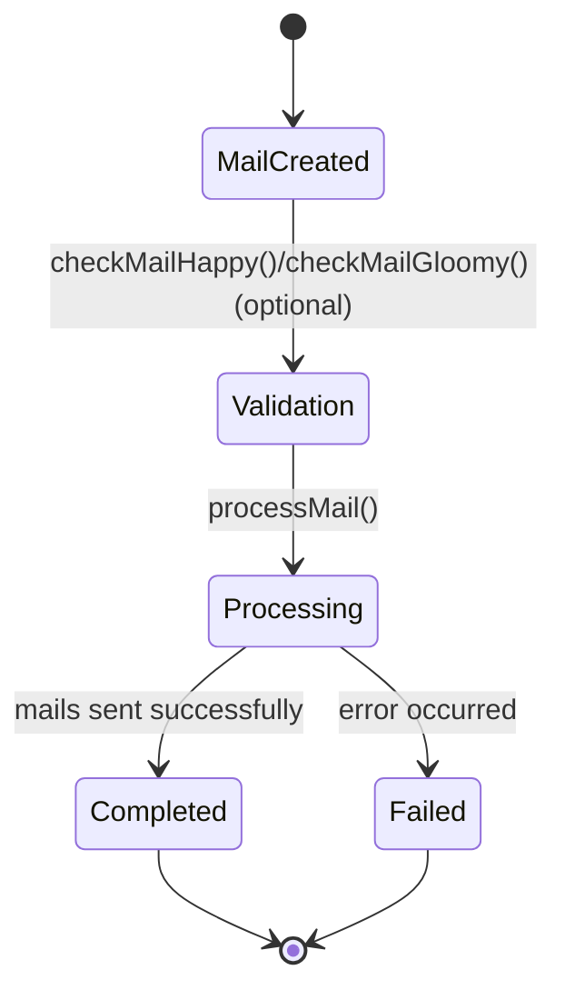
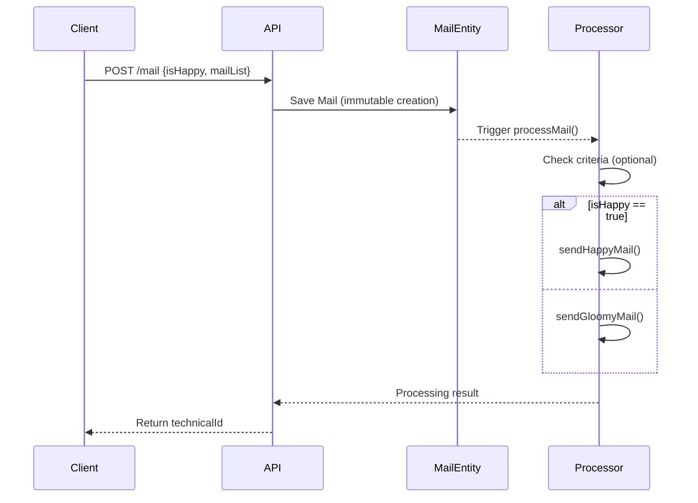
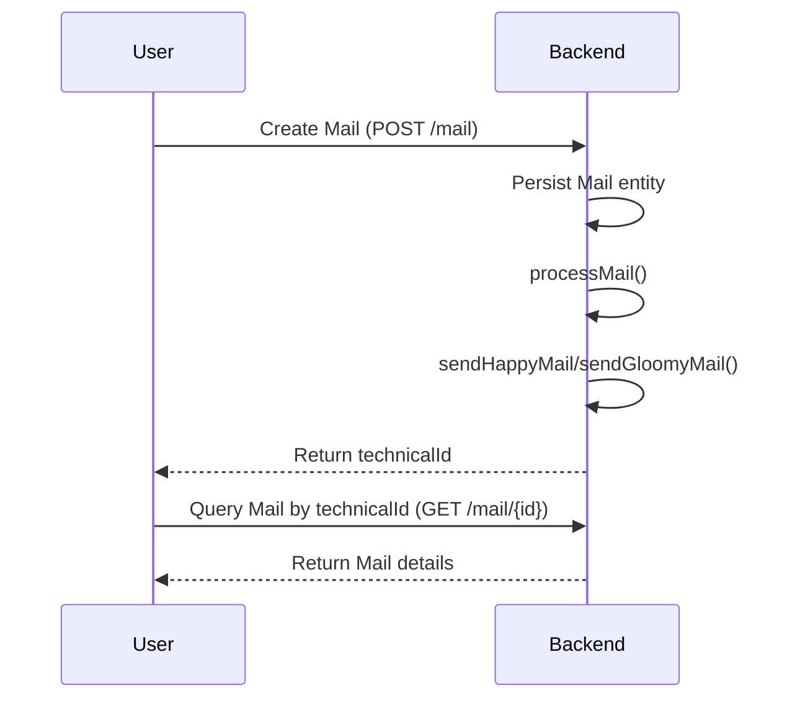

### 1. Entity Definitions

``` 
Mail: 
- isHappy: Boolean (indicates if the mail is happy or gloomy)
- mailList: List<String> (list of recipient email addresses)
```

### 2. Process Method Flows

```
processMail() Flow:
1. Initial State: Mail entity is created and persisted (immutable creation).
2. Criteria Validation:
   - If explicitly requested, perform checkMailHappy() and/or checkMailGloomy() validations to verify criteria.
3. Processing:
   - If isHappy == true, trigger sendHappyMail() processor to prepare the happy mail content and send mails to all addresses in mailList.
   - If isHappy == false, trigger sendGloomyMail() processor to prepare the gloomy mail content and send mails to all addresses in mailList.
4. Completion: Process ends after mails are sent. No update/delete on Mail entity (immutable).
5. Notification/Logging: Log send status per recipient (internal, no API exposure).
```

---

### 3. API Endpoints Design

| Method | Endpoint          | Purpose                               | Request Body                         | Response Body           |
|--------|-------------------|-------------------------------------|------------------------------------|------------------------|
| POST   | /mail             | Create a Mail entity (triggers events) | `{ "isHappy": true/false, "mailList": ["email1", "email2"] }` | `{ "technicalId": "uuid" }`   |
| GET    | /mail/{technicalId}| Retrieve Mail entity by technicalId | N/A                                | `{ "isHappy": ..., "mailList": [...] }` |
| GET    | /mail             | *Optional:* Retrieve mails by criteria (only if explicitly requested) | Query parameters (e.g., isHappy=true) | List of matching mails |

- Only POST and GET endpoints are provided.
- No update or delete endpoints; entity creation is immutable.
- POST `/mail` triggers `processMail()` event automatically.

---

### 4. Request / Response Formats

**POST /mail Request Body**

```json
{
  "isHappy": true,
  "mailList": ["alice@example.com", "bob@example.com"]
}
```

**POST /mail Response Body**

```json
{
  "technicalId": "123e4567-e89b-12d3-a456-426614174000"
}
```

**GET /mail/{technicalId} Response Body**

```json
{
  "isHappy": true,
  "mailList": ["alice@example.com", "bob@example.com"]
}
```

**GET /mail?isHappy=true Response Body (optional)**

```json
[
  {
    "isHappy": true,
    "mailList": ["alice@example.com", "bob@example.com"]
  },
  {
    "isHappy": true,
    "mailList": ["charlie@example.com"]
  }
]
```

---

### 5. Mermaid Diagrams

#### Mail Entity Lifecycle State Diagram


```mermaid
stateDiagram-v2
    [*] --> MailCreated
    MailCreated --> Validation : checkMailHappy()/checkMailGloomy() (optional)
    Validation --> Processing : processMail()
    Processing --> Completed : mails sent successfully
    Processing --> Failed : error occurred
    Completed --> [*]
    Failed --> [*]
```

#### Event-Driven Processing Chain


```mermaid
sequenceDiagram
    participant Client
    participant API
    participant MailEntity
    participant Processor

    Client->>API: POST /mail {isHappy, mailList}
    API->>MailEntity: Save Mail (immutable creation)
    MailEntity-->>Processor: Trigger processMail()
    Processor->>Processor: Check criteria (optional)
    alt isHappy == true
        Processor->>Processor: sendHappyMail()
    else
        Processor->>Processor: sendGloomyMail()
    end
    Processor-->>API: Processing result
    API-->>Client: Return technicalId
```

#### User Interaction Sequence Flow


```mermaid
sequenceDiagram
    participant User
    participant Backend

    User->>Backend: Create Mail (POST /mail)
    Backend->>Backend: Persist Mail entity
    Backend->>Backend: processMail()
    Backend->>Backend: sendHappyMail/sendGloomyMail()
    Backend-->>User: Return technicalId
    User->>Backend: Query Mail by technicalId (GET /mail/{id})
    Backend-->>User: Return Mail details
```

---

This completes the functional requirements for the Happy Mail backend application using Event-Driven Architecture on Cyoda platform.