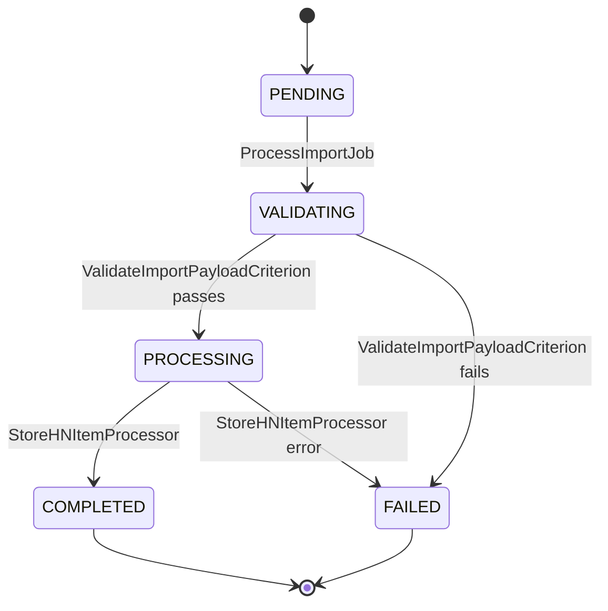
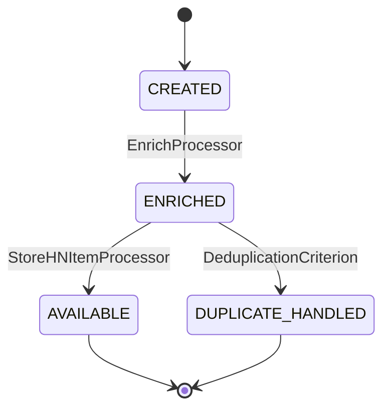
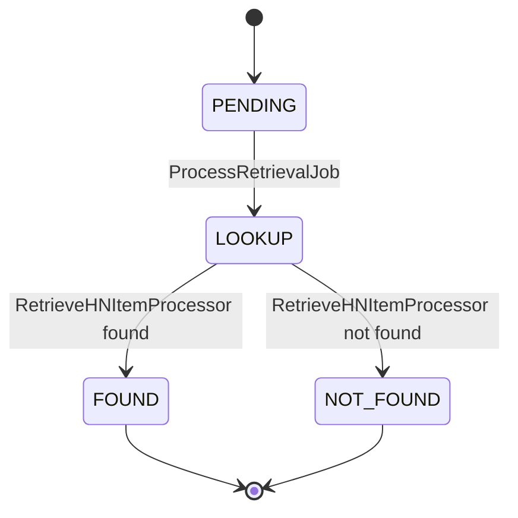
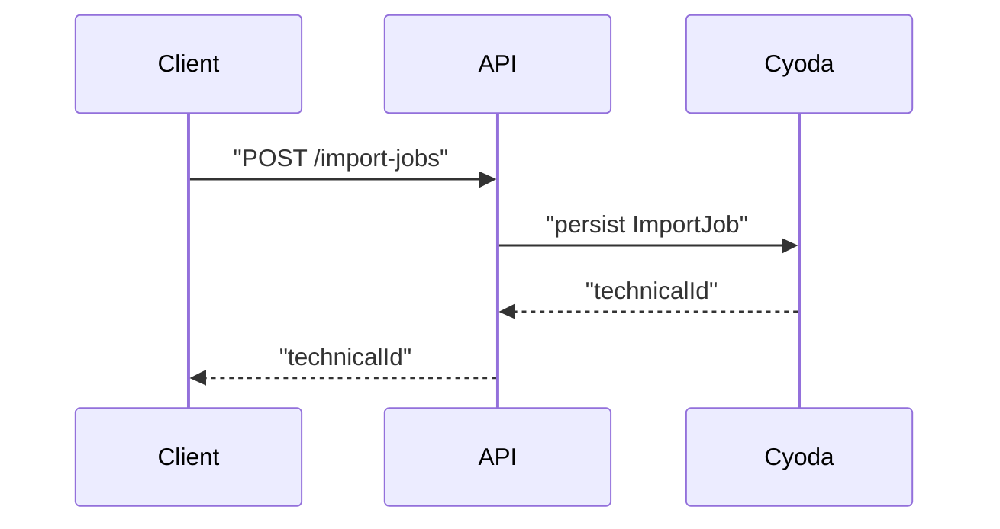
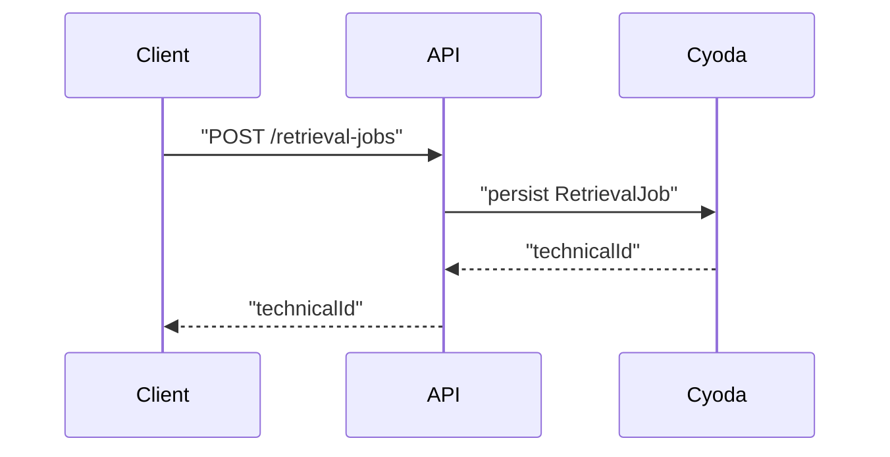
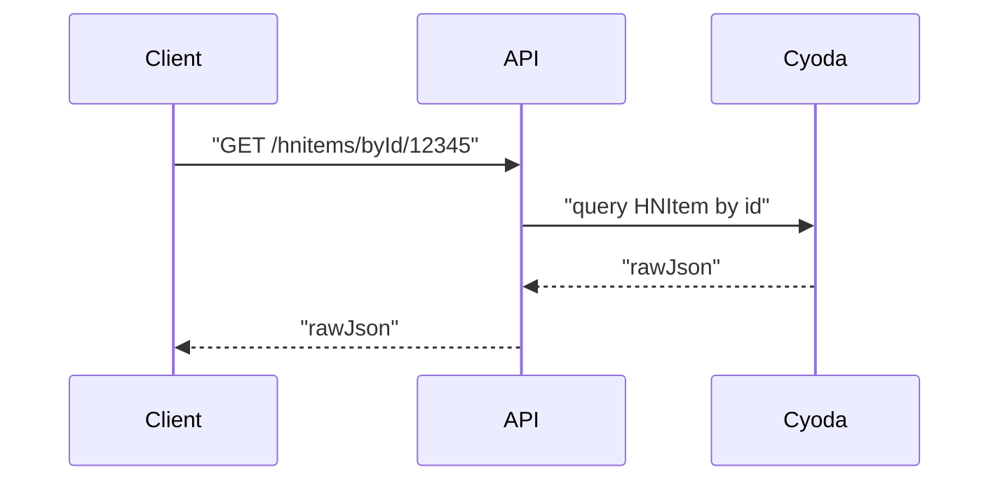

### 1. Entity Definitions
```
HNItem:
- id: Number (Hacker News id field, required for validation)
- type: String (Hacker News type field, required for validation)
- rawJson: Object (the original JSON payload as received, preserved exactly)
- importTimestamp: String (ISO timestamp added when persisted)
- metadata: Object (optional, e.g., validation notes, source)

ImportJob:
- payload: Object (the JSON payload to ingest; can contain one item or an array)
- source: String (optional source/origin information)
- createdAt: String (ISO timestamp job created)
- status: String (PENDING / VALIDATING / PROCESSING / COMPLETED / FAILED)
- itemsCreatedCount: Number (how many HNItem persisted)
- errorMessage: String (failure reason if any)

RetrievalJob:
- itemId: Number (HN item id requested)
- createdAt: String (ISO timestamp)
- status: String (PENDING / LOOKUP / FOUND / NOT_FOUND / FAILED)
- result: Object (when FOUND, contains rawJson returned)
- errorMessage: String
```

### 2. Entity workflows

ImportJob workflow:
1. Initial State: PENDING (created via POST)
2. Validation: AUTOMATIC ValidateImportPayloadCriterion checks presence of id and type (per item)
3. Processing: AUTOMATIC EnrichProcessor adds importTimestamp then StoreHNItemProcessor persists HNItem(s)
4. Completion: Update status to COMPLETED with itemsCreatedCount or FAILED with errorMessage
5. Notification/Audit: AUTOMATIC log job result (optional)

Entity state diagram

```mermaid
stateDiagram-v2
    [*] --> PENDING
    PENDING --> VALIDATING : ProcessImportJob
    VALIDATING --> PROCESSING : ValidateImportPayloadCriterion passes
    VALIDATING --> FAILED : ValidateImportPayloadCriterion fails
    PROCESSING --> COMPLETED : StoreHNItemProcessor
    PROCESSING --> FAILED : StoreHNItemProcessor error
    COMPLETED --> [*]
    FAILED --> [*]
```

Processors / criteria needed for ImportJob:
- ValidateImportPayloadCriterion: ensure each payload item has id and type.
- EnrichProcessor: add importTimestamp to payload item(s).
- StoreHNItemProcessor: create or update HNItem entities and set itemsCreatedCount.
- UpdateImportJobProcessor: set final status and errorMessage.

HNItem workflow:
1. Initial State: CREATED (persist triggered by StoreHNItemProcessor)
2. Enrichment: AUTOMATIC (importTimestamp present)
3. Availability: AUTOMATIC mark AVAILABLE (queryable)
4. Duplicate handling: AUTOMATIC check dedupe, either MERGED or IGNORED (reflected in metadata)

Entity state diagram

```mermaid
stateDiagram-v2
    [*] --> CREATED
    CREATED --> ENRICHED : EnrichProcessor
    ENRICHED --> AVAILABLE : StoreHNItemProcessor
    ENRICHED --> DUPLICATE_HANDLED : DeduplicationCriterion
    AVAILABLE --> [*]
    DUPLICATE_HANDLED --> [*]
```

Processors / criteria for HNItem:
- DeduplicationCriterion: check existing HNItem by id
- EnrichProcessor: attach importTimestamp
- StoreHNItemProcessor: persist HNItem with rawJson preserved

RetrievalJob workflow:
1. Initial State: PENDING (created via POST retrieval request) or implicit GET triggers lookup
2. Lookup: AUTOMATIC RetrieveHNItemProcessor searches HNItem by id
3. Found: set status FOUND and attach result.rawJson
4. Not found: set status NOT_FOUND
5. Completion: AVAILABLE for GET-by-technicalId

Entity state diagram

```mermaid
stateDiagram-v2
    [*] --> PENDING
    PENDING --> LOOKUP : ProcessRetrievalJob
    LOOKUP --> FOUND : RetrieveHNItemProcessor found
    LOOKUP --> NOT_FOUND : RetrieveHNItemProcessor not found
    FOUND --> [*]
    NOT_FOUND --> [*]
```

Processors / criteria for RetrievalJob:
- RetrieveHNItemProcessor: find HNItem by id and populate result.rawJson
- RetrievalAuthorizationCriterion (optional): check caller permissions for retrieval

### 3. Pseudo code for processor classes

ValidateImportPayloadCriterion
```
boolean check(ImportJob job) {
  for each item in job.payload:
    if item.id is missing or item.type is missing:
      job.errorMessage = "missing id or type"
      return false
  return true
}
```

EnrichProcessor
```
void process(ImportJob job) {
  for each item in job.payload:
    item.importTimestamp = nowIso()
}
```

StoreHNItemProcessor
```
void process(ImportJob job) {
  count = 0
  for each item in job.payload:
    existing = findHNItemById(item.id)
    if existing == null:
      create HNItem with rawJson = itemOriginalJson, importTimestamp = item.importTimestamp
      count++
    else:
      merge update rawJson if desired and update metadata
  job.itemsCreatedCount = count
}
```

RetrieveHNItemProcessor
```
void process(RetrievalJob job) {
  hn = findHNItemById(job.itemId)
  if hn != null:
    job.status = FOUND
    job.result = hn.rawJson
  else
    job.status = NOT_FOUND
}
```

### 4. API Endpoints Design Rules & Request/Response formats

Rules applied:
- POST endpoints create orchestration entities and return only technicalId.
- GET endpoints return stored results.
- GET by non-technical field (hn id) provided because user explicitly requested retrieval by id.

Endpoints:

1) POST /import-jobs
- Request JSON:
```json
{ "payload": { /* single HN item JSON or array of items */ }, "source": "optional" }
```
- Response:
```json
{ "technicalId": "importjob-xxxxxxxx" }
```

Mermaid sequence for POST import

```mermaid
sequenceDiagram
    Client->>API: "POST /import-jobs"
    API->>Cyoda: "persist ImportJob"
    Cyoda-->>API: "technicalId"
    API-->>Client: "technicalId"
```

2) GET /import-jobs/{technicalId}
- Response JSON: full persisted ImportJob object (status, itemsCreatedCount, errorMessage)

3) POST /retrieval-jobs
- Request JSON:
```json
{ "itemId": 12345 }
```
- Response:
```json
{ "technicalId": "retrievaljob-xxxxxxxx" }
```

Mermaid sequence for POST retrieval

```mermaid
sequenceDiagram
    Client->>API: "POST /retrieval-jobs"
    API->>Cyoda: "persist RetrievalJob"
    Cyoda-->>API: "technicalId"
    API-->>Client: "technicalId"
```

4) GET /retrieval-jobs/{technicalId}
- Response JSON: RetrievalJob object including status and result when FOUND

5) GET /hnitems/byId/{id}
- Response JSON (when found): the original JSON exactly as received (rawJson)
Example:
```json
{ /* original HN JSON exactly as submitted, does not include importTimestamp */ }
```
Mermaid sequence for GET HNItem

```mermaid
sequenceDiagram
    Client->>API: "GET /hnitems/byId/12345"
    API->>Cyoda: "query HNItem by id"
    Cyoda-->>API: "rawJson"
    API-->>Client: "rawJson"
```

Notes / clarifying choices
- POST endpoints return only technicalId per rule. Job orchestration handles business persistence (HNItem) automatically when ImportJob is processed.
- RetrievalJob provides an auditable event for lookups and supports GET by technicalId for job tracking. Direct GET /hnitems/byId/{id} exists because user explicitly requested retrieval by id.
- On retrieval we return the preserved rawJson (the original payload). importTimestamp is stored on HNItem as a separate field and is not injected into rawJson; it is available in HNItem records and in job audit results if needed.

If you want, we can:
- switch to bulk-only ingest vs single-item only,
- define dedupe behavior (overwrite / ignore / version),
- decide whether importTimestamp should be visible in returned HNItem responses.

Which of those choices should we fix next?