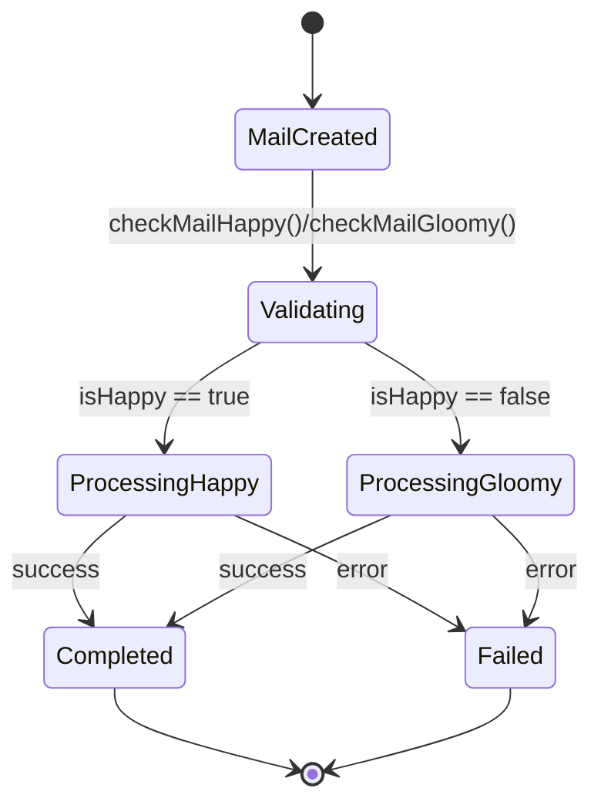
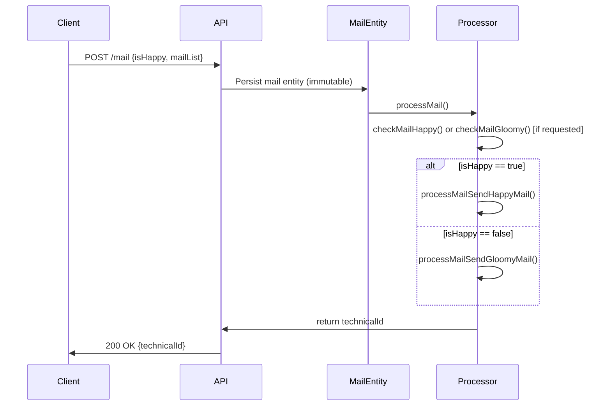
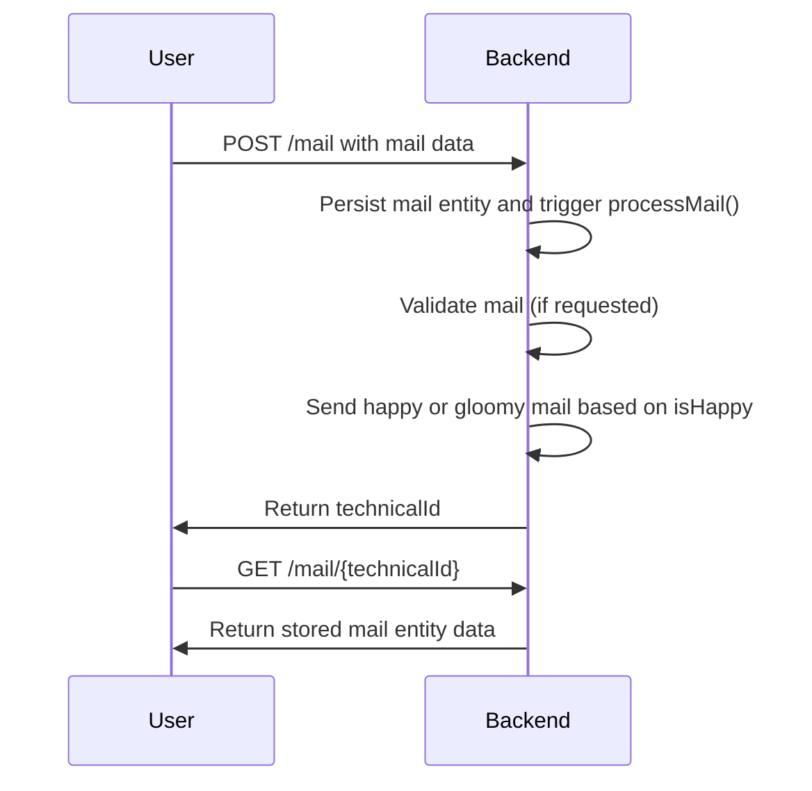

### 1. Entity Definitions

``` 
Mail: 
- isHappy: Boolean (Indicates if the mail is happy or gloomy)
- mailList: List<String> (List of recipient email addresses)
```

### 2. Process Method Flows

```
processMail() Flow:
1. Initial State: Mail entity is created and persisted (immutable creation).
2. Validation: If explicitly requested, checkMailHappy() or checkMailGloomy() criteria validate the mail.
3. Routing:
   - If isHappy == true → processMailSendHappyMail()
   - If isHappy == false → processMailSendGloomyMail()
4. Processing:
   - processMailSendHappyMail(): Compose and send happy mail to all addresses in mailList.
   - processMailSendGloomyMail(): Compose and send gloomy mail to all addresses in mailList.
5. Completion: Mail sending is logged, no updates to mail entity (event history preserved).
```

### 3. API Endpoints Design

| Endpoint                     | Method | Description                                                     | Request Body                          | Response Body              |
|------------------------------|--------|-----------------------------------------------------------------|-------------------------------------|----------------------------|
| `/mail`                      | POST   | Create a new Mail entity (triggers event-driven process)        | `{ "isHappy": boolean, "mailList": [string] }` | `{ "technicalId": string }` |
| `/mail/{technicalId}`        | GET    | Retrieve stored mail entity results by technicalId              | N/A                                 | `{ "isHappy": boolean, "mailList": [string] }` |

- No update or delete endpoints as per EDA immutable principle.
- Criteria validation endpoints (e.g. checks) can be triggered internally or explicitly if needed.

### 4. Request/Response Formats

**POST /mail Request**

```json
{
  "isHappy": true,
  "mailList": [
    "user1@example.com",
    "user2@example.com"
  ]
}
```

**POST /mail Response**

```json
{
  "technicalId": "uuid-generated-id"
}
```

**GET /mail/{technicalId} Response**

```json
{
  "isHappy": true,
  "mailList": [
    "user1@example.com",
    "user2@example.com"
  ]
}
```

---

### Mermaid Diagrams

**Entity Lifecycle State Diagram**


```mermaid
stateDiagram-v2
    [*] --> MailCreated
    MailCreated --> Validating : checkMailHappy()/checkMailGloomy()
    Validating --> ProcessingHappy : isHappy == true
    Validating --> ProcessingGloomy : isHappy == false
    ProcessingHappy --> Completed : success
    ProcessingGloomy --> Completed : success
    ProcessingHappy --> Failed : error
    ProcessingGloomy --> Failed : error
    Completed --> [*]
    Failed --> [*]
```

**Event-Driven Processing Chain**


```mermaid
sequenceDiagram
    participant Client
    participant API
    participant MailEntity
    participant Processor

    Client->>API: POST /mail {isHappy, mailList}
    API->>MailEntity: Persist mail entity (immutable)
    MailEntity->>Processor: processMail()
    Processor->>Processor: checkMailHappy() or checkMailGloomy() [if requested]
    alt isHappy == true
        Processor->>Processor: processMailSendHappyMail()
    else isHappy == false
        Processor->>Processor: processMailSendGloomyMail()
    end
    Processor->>API: return technicalId
    API->>Client: 200 OK {technicalId}
```

**User Interaction Sequence Flow**


```mermaid
sequenceDiagram
    participant User
    participant Backend

    User->>Backend: POST /mail with mail data
    Backend->>Backend: Persist mail entity and trigger processMail()
    Backend->>Backend: Validate mail (if requested)
    Backend->>Backend: Send happy or gloomy mail based on isHappy
    Backend->>User: Return technicalId
    User->>Backend: GET /mail/{technicalId}
    Backend->>User: Return stored mail entity data
```

---

This completes the final functional requirements using Event-Driven Architecture for your happy mail sending application on Cyoda platform.