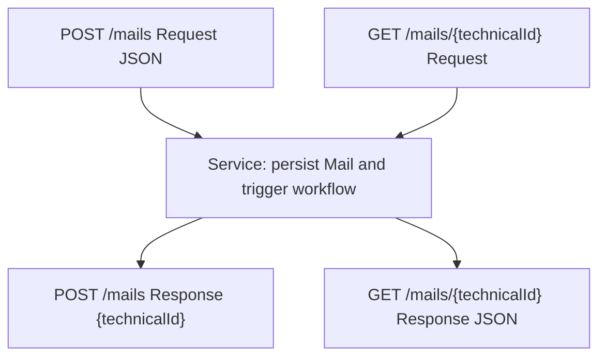

# Entity Definitions

```
Mail:
- isHappy: boolean (indicates whether the mail is classified as happy; may be set by criteria during processing)
- mailList: List<String> (list of recipient email addresses)
 Do not use enum - not supported temporarily.
```

Note: Only the explicitly specified entity Mail is considered.

---

# Entity Workflows

Mail workflow:
1. Initial State: Mail persisted (event: Mail entity created) → State CREATED
2. Evaluation: Automatic evaluation via two criteria to determine if the Mail is happy or gloomy → State EVALUATED
3. Sending: Based on evaluation:
   - If evaluated as happy → run processor sendHappyMail → State SENDING_HAPPY
   - If evaluated as gloomy → run processor sendGloomyMail → State SENDING_GLOOMY
4. Delivery outcome:
   - On success → State SENT
   - On failure → State FAILED
5. Retry / Manual intervention:
   - Manual action or automated retry can move FAILED → RETRY → back to appropriate SENDING state
6. Terminal: SENT or permanently FAILED

Entity state diagrams

```mermaid
stateDiagram-v2
    [*] --> "CREATED"
    "CREATED" --> "EVALUATED" : EvaluateCriteriaProcessor, automatic
    "EVALUATED" --> "SENDING_HAPPY" : isHappyCriterion, sendHappyMail, automatic
    "EVALUATED" --> "SENDING_GLOOMY" : isGloomyCriterion, sendGloomyMail, automatic
    "SENDING_HAPPY" --> "SENT" : sendHappyMailSuccess
    "SENDING_GLOOMY" --> "SENT" : sendGloomyMailSuccess
    "SENDING_HAPPY" --> "FAILED" : sendFailure
    "SENDING_GLOOMY" --> "FAILED" : sendFailure
    "FAILED" --> "RETRY" : RetryProcessor, manual
    "RETRY" --> "SENDING_HAPPY" : isHappyCriterion, sendHappyMail, automatic
    "RETRY" --> "SENDING_GLOOMY" : isGloomyCriterion, sendGloomyMail, automatic
    "SENT" --> [*]
    "FAILED" --> [*]
```

Processors and Criteria required for Mail:
- Processors:
  - EvaluateCriteriaProcessor (automatic processor invoked after persistence to evaluate criteria and set isHappy)
  - sendHappyMail (processor that sends mails classified as happy)
  - sendGloomyMail (processor that sends mails classified as gloomy)
  - RetryProcessor (manual or automated processor to retry sending)
- Criteria:
  - isHappyCriterion (criterion that returns true if Mail should be considered happy)
  - isGloomyCriterion (criterion that returns true if Mail should be considered gloomy)

Pseudo code (Java) for processors and criteria

- EvaluateCriteriaProcessor (pseudo Java)
```java
public class EvaluateCriteriaProcessor {
    private IsHappyCriterion isHappyCriterion;
    private IsGloomyCriterion isGloomyCriterion;

    public void process(Mail mail) {
        // Evaluate happy first (order as required by business logic)
        if (isHappyCriterion.evaluate(mail)) {
            mail.setIsHappy(true);
            // trigger sendHappyMail processor (system calls process method)
            new SendHappyMail().process(mail);
        } else if (isGloomyCriterion.evaluate(mail)) {
            mail.setIsHappy(false);
            // trigger sendGloomyMail processor
            new SendGloomyMail().process(mail);
        } else {
            // Default behavior: mark not happy and trigger gloomy processor
            mail.setIsHappy(false);
            new SendGloomyMail().process(mail);
        }
        // Persist updated mail state as required by platform
    }
}
```

- SendHappyMail processor (pseudo Java)
```java
public class SendHappyMail {
    public void process(Mail mail) {
        // Implementation in Java (use provided Java runtime and libraries as needed)
        // Steps:
        // 1. Build happy template message
        // 2. Iterate mail.getMailList() and send to recipients
        // 3. Record delivery status
        // 4. On success set state to SENT; on failure set state to FAILED
    }
}
```

- SendGloomyMail processor (pseudo Java)
```java
public class SendGloomyMail {
    public void process(Mail mail) {
        // Implementation in Java
        // Steps:
        // 1. Build gloomy template message
        // 2. Iterate mail.getMailList() and send to recipients
        // 3. Record delivery status
        // 4. On success set state to SENT; on failure set state to FAILED
    }
}
```

- RetryProcessor (pseudo Java)
```java
public class RetryProcessor {
    public void process(Mail mail) {
        // Manual or automated retry logic
        // e.g., check retry count, re-evaluate criteria or reuse mail.isHappy
        // If mail.isHappy true -> call SendHappyMail.process(mail)
        // else -> call SendGloomyMail.process(mail)
    }
}
```

- IsHappyCriterion (pseudo Java)
```java
public class IsHappyCriterion {
    public boolean evaluate(Mail mail) {
        // Implement business logic to determine happy vs gloomy
        // Example logic placeholder:
        // return mail.getMailList() != null && mail.getMailList().size() > 0 && someOtherCondition;
        // Exact logic must be implemented according to business rules
        return false;
    }
}
```

- IsGloomyCriterion (pseudo Java)
```java
public class IsGloomyCriterion {
    public boolean evaluate(Mail mail) {
        // Implement complementary logic to IsHappyCriterion or explicit gloom rules
        return !new IsHappyCriterion().evaluate(mail);
    }
}
```

Implementation note:
- Use java for implementation as requested.
- All processors and criteria are invoked by the platform/workflow when the Mail entity is persisted (entity add operation is an EVENT).
- The process method of the EvaluateCriteriaProcessor is the key entry point after persistence.

---

# API Endpoints Design

Rules applied:
- POST endpoint for creating Mail triggers entity persistence event and starts the workflow.
- POST response returns only technicalId (datastore-imitation specific field) and nothing else.
- GET by technicalId returns stored application results for the Mail entity.
- No additional POST endpoints or extra entities were added.

Endpoints:

1) Create Mail
- POST /mails
- Request: Mail payload (fields as defined in entity)
- Response: { "technicalId": "string" } (only technicalId)

2) Retrieve Mail by technicalId
- GET /mails/{technicalId}
- Response: Stored Mail representation including fields isHappy and mailList and optionally internal state and delivery status

JSON structures

POST /mails request JSON
```json
{
  "isHappy": false,
  "mailList": [
    "recipient1@example.com",
    "recipient2@example.com"
  ]
}
```

POST /mails response JSON
```json
{
  "technicalId": "generated-unique-id"
}
```

GET /mails/{technicalId} response JSON
```json
{
  "technicalId": "generated-unique-id",
  "isHappy": false,
  "mailList": [
    "recipient1@example.com",
    "recipient2@example.com"
  ],
  "state": "EVALUATED",
  "deliveryStatus": {
    "lastAttempt": "2025-01-15T12:34:56Z",
    "status": "FAILED",
    "attempts": 1
  }
}
```

Visualize request/response formats using Mermaid diagrams


```mermaid
flowchart TD
    POST_Request["POST /mails Request JSON"]
    Service["Service: persist Mail and trigger workflow"]
    POST_Response["POST /mails Response {technicalId}"]
    GET_Request["GET /mails/{technicalId} Request"]
    GET_Response["GET /mails/{technicalId} Response JSON"]

    POST_Request --> Service
    Service --> POST_Response
    GET_Request --> Service
    Service --> GET_Response
```

Notes:
- POST returns only technicalId (no other fields).
- GET by technicalId returns the stored Mail and workflow-related metadata.

---

# Required Classes Summary (to be implemented in Java)

- Entities:
  - Mail (fields: isHappy:boolean, mailList:List<String>)
- Processors:
  - EvaluateCriteriaProcessor
  - SendHappyMail
  - SendGloomyMail
  - RetryProcessor
- Criteria:
  - IsHappyCriterion
  - IsGloomyCriterion
- API controllers/handlers:
  - POST /mails (returns technicalId)
  - GET /mails/{technicalId} (returns stored Mail)

---

**Please review the generated entities and workflows. If you need any changes, please let me know. Feel free to click Approve if this requirement meets your expectations or if you are ready to proceed.**