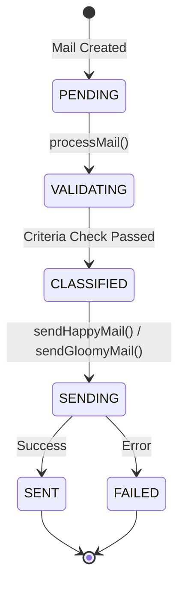
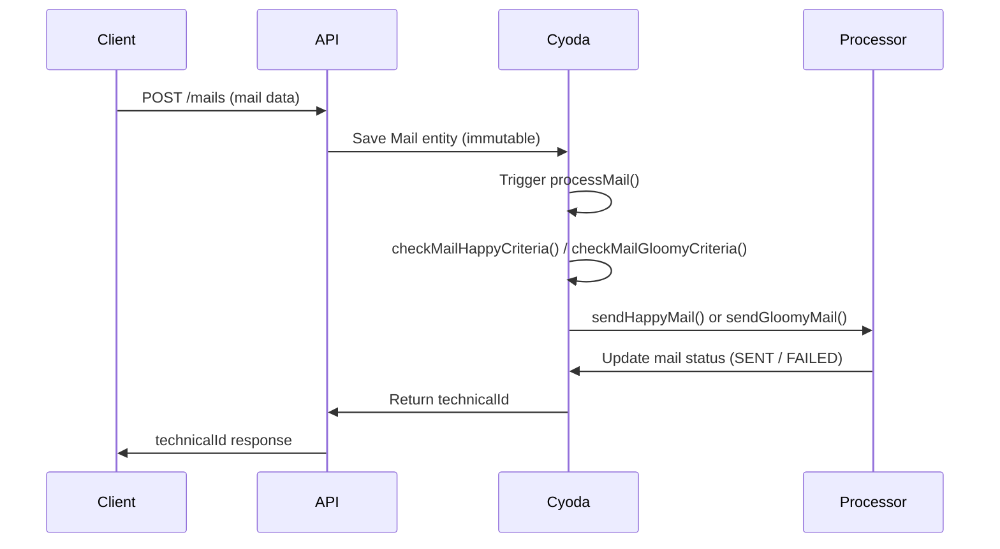
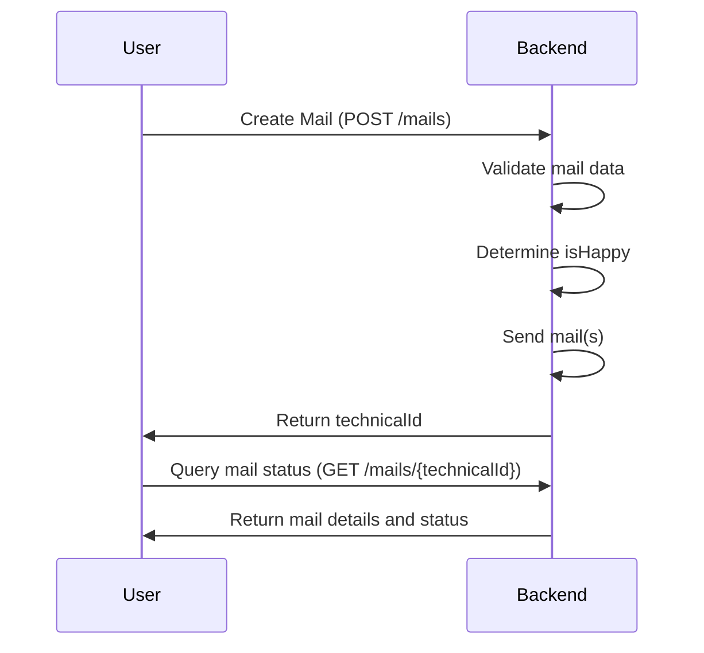

### 1. Entity Definitions

```
Mail:
- isHappy: Boolean (Indicates if the mail is happy (true) or gloomy (false))
- mailList: List<String> (List of recipient email addresses)
- subject: String (Subject line of the mail)
- content: String (The body/content of the mail)
- status: String (Lifecycle status of the mail, e.g., PENDING, SENT, FAILED)
```

---

### 2. Process Method Flows

```
processMail() Flow:
1. Initial State: Mail entity is created with status = PENDING
2. Validation: Validate mailList (email format), subject, and content via checkMailHappyCriteria() or checkMailGloomyCriteria()
3. Classification: Determine isHappy value based on criteria (happy or gloomy)
4. Processing:
   - If isHappy == true → sendHappyMail() processor invoked internally
   - If isHappy == false → sendGloomyMail() processor invoked internally
5. Sending: Compose and send email(s) to all recipients in mailList
6. Completion: Update mail status to SENT on success or FAILED on error
7. Notification: Optionally trigger events or logs for delivery confirmation or errors
```

---

### 3. API Endpoints Design

- **POST /mails**  
  - Purpose: Create a new Mail entity → triggers `processMail()` event  
  - Request payload:  
    ```json
    {
      "mailList": ["recipient1@example.com", "recipient2@example.com"],
      "subject": "Happy News!",
      "content": "Wishing you a wonderful day!"
    }
    ```
  - Response:  
    ```json
    {
      "technicalId": "generated-id-string"
    }
    ```

- **GET /mails/{technicalId}**  
  - Purpose: Retrieve the mail entity by technicalId  
  - Response example:  
    ```json
    {
      "technicalId": "generated-id-string",
      "isHappy": true,
      "mailList": ["recipient1@example.com", "recipient2@example.com"],
      "subject": "Happy News!",
      "content": "Wishing you a wonderful day!",
      "status": "SENT"
    }
    ```

- **Optional GET /mails?isHappy=true|false**  
  - Purpose: Retrieve mails filtered by happy/gloomy status (only if explicitly requested)

---

### 4. Event-Driven Processing Workflows

- Upon POST `/mails`, Cyoda platform saves a new immutable Mail entity → triggers `processMail()` event.
- `processMail()` workflow validates inputs, runs criteria checks (`checkMailHappyCriteria()`, `checkMailGloomyCriteria()`).
- Based on criteria, `isHappy` is set.
- Depending on `isHappy`, either `sendHappyMail()` or `sendGloomyMail()` processor sends the mails.
- Status updated accordingly to SENT or FAILED.

---

### 5. Mermaid Diagrams

**Entity Lifecycle State Diagram for Mail:**


```mermaid
stateDiagram-v2
    [*] --> PENDING : Mail Created
    PENDING --> VALIDATING : processMail()
    VALIDATING --> CLASSIFIED : Criteria Check Passed
    CLASSIFIED --> SENDING : sendHappyMail() / sendGloomyMail()
    SENDING --> SENT : Success
    SENDING --> FAILED : Error
    SENT --> [*]
    FAILED --> [*]
```

**Event-Driven Processing Chain:**


```mermaid
sequenceDiagram
    participant Client
    participant API
    participant Cyoda
    participant Processor

    Client->>API: POST /mails (mail data)
    API->>Cyoda: Save Mail entity (immutable)
    Cyoda->>Cyoda: Trigger processMail()
    Cyoda->>Cyoda: checkMailHappyCriteria() / checkMailGloomyCriteria()
    Cyoda->>Processor: sendHappyMail() or sendGloomyMail()
    Processor->>Cyoda: Update mail status (SENT / FAILED)
    Cyoda->>API: Return technicalId
    API->>Client: technicalId response
```

**User Interaction Sequence Flow:**


```mermaid
sequenceDiagram
    participant User
    participant Backend

    User->>Backend: Create Mail (POST /mails)
    Backend->>Backend: Validate mail data
    Backend->>Backend: Determine isHappy
    Backend->>Backend: Send mail(s)
    Backend->>User: Return technicalId
    User->>Backend: Query mail status (GET /mails/{technicalId})
    Backend->>User: Return mail details and status
```

---

This completes the finalized functional requirements for your Happy Mail Sender backend application following an Event-Driven Architecture approach on the Cyoda platform.  
Please let me know if you need any further clarifications or additions!