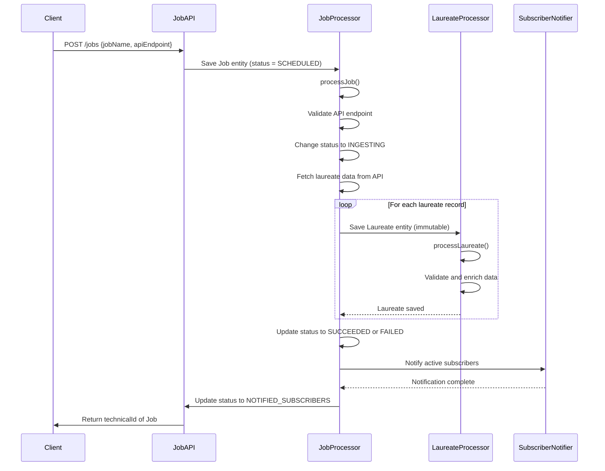
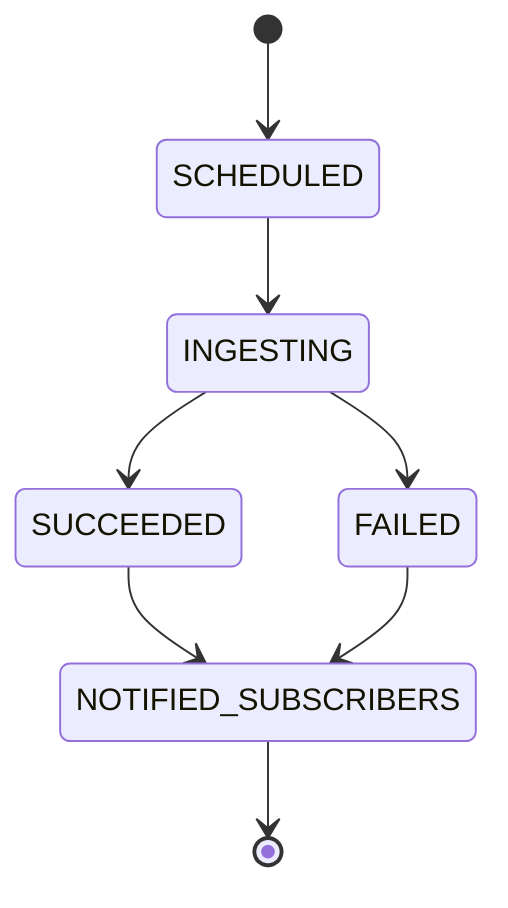

# Functional Requirements: Nobel Laureates Data Ingestion Backend Application

---

## 1. Entity Definitions

```
Job:
- jobName: String (Name or identifier of the ingestion job)
- status: String (Current job status, e.g., SCHEDULED, INGESTING, SUCCEEDED, FAILED, NOTIFIED_SUBSCRIBERS)
- createdAt: String (Timestamp of job creation)
- apiEndpoint: String (API URL to ingest Nobel laureates data)
- resultSummary: String (Summary of ingestion results or error details)

Laureate:
- laureateId: Integer (Unique Nobel laureate identifier)
- firstname: String (Laureate's first name)
- surname: String (Laureate's last name)
- gender: String (Gender of laureate)
- born: String (Birth date in ISO format)
- died: String (Date of death or null)
- borncountry: String (Country where laureate was born)
- borncountrycode: String (Country code of birth country)
- borncity: String (City where laureate was born)
- year: String (Year laureate received Nobel Prize)
- category: String (Category of Nobel Prize)
- motivation: String (Reason for award)
- affiliationName: String (Affiliated institution name)
- affiliationCity: String (Affiliated institution city)
- affiliationCountry: String (Affiliated institution country)
- ageAtAward: Integer (Enriched field: calculated age when awarded)

Subscriber:
- subscriberId: Integer (Unique identifier for subscriber)
- contactType: String (Type of contact, e.g., email, webhook)
- contactDetails: String (Email address or webhook URL)
- active: Boolean (Subscriber active status)
```

---

## 2. Process Method Flows

### processJob() Flow:
1. Initial State: Job created with status = SCHEDULED  
2. Validation: Verify apiEndpoint is reachable and parameters are valid  
3. Processing:  
   - Change status to INGESTING  
   - Fetch Nobel laureates data from OpenDataSoft API  
   - For each laureate record, create immutable Laureate entity (trigger processLaureate())  
4. Completion:  
   - Set status to SUCCEEDED if ingestion completes successfully, else FAILED  
5. Notification:  
   - Trigger notification to all active Subscribers by creating notification events (not an explicit entity here)  
   - Update status to NOTIFIED_SUBSCRIBERS  

### processLaureate() Flow:
1. Validation: Run checks for mandatory fields and correct formats using checkLaureateCriteria()  
2. Enrichment: Calculate ageAtAward (year - birth year) if birth date is available  
3. Persistence: Save enriched Laureate as an immutable record  
4. No direct notification or further orchestration from Laureate processing  

### processSubscriber() Flow:
1. Validation: Verify contactDetails format based on contactType  
2. Persistence: Save Subscriber as immutable entity  
3. No automatic notifications triggered upon subscriber creation  

---

## 3. API Endpoints Design

### POST /jobs  
- Description: Create a new Job entity to trigger ingestion  
- Request Body:  
  ```json
  {
    "jobName": "string",
    "apiEndpoint": "string"
  }
  ```  
- Response:  
  ```json
  {
    "technicalId": "string"
  }
  ```

### GET /jobs/{technicalId}  
- Description: Retrieve Job entity by technicalId  
- Response:  
  ```json
  {
    "jobName": "string",
    "status": "string",
    "createdAt": "string",
    "apiEndpoint": "string",
    "resultSummary": "string"
  }
  ```

### POST /subscribers  
- Description: Create new Subscriber  
- Request Body:  
  ```json
  {
    "contactType": "string",
    "contactDetails": "string",
    "active": true
  }
  ```  
- Response:  
  ```json
  {
    "technicalId": "string"
  }
  ```

### GET /subscribers/{technicalId}  
- Description: Retrieve Subscriber by technicalId  
- Response:  
  ```json
  {
    "contactType": "string",
    "contactDetails": "string",
    "active": true
  }
  ```

### GET /laureates/{technicalId}  
- Description: Retrieve Laureate entity by technicalId  
- Response:  
  ```json
  {
    "laureateId": 0,
    "firstname": "string",
    "surname": "string",
    "gender": "string",
    "born": "string",
    "died": "string",
    "borncountry": "string",
    "borncountrycode": "string",
    "borncity": "string",
    "year": "string",
    "category": "string",
    "motivation": "string",
    "affiliationName": "string",
    "affiliationCity": "string",
    "affiliationCountry": "string",
    "ageAtAward": 0
  }
  ```

---

## 4. Mermaid Diagrams


```mermaid
sequenceDiagram
    participant Client
    participant JobAPI
    participant JobProcessor
    participant LaureateProcessor
    participant SubscriberNotifier

    Client->>JobAPI: POST /jobs {jobName, apiEndpoint}
    JobAPI->>JobProcessor: Save Job entity (status = SCHEDULED)
    JobProcessor->>JobProcessor: processJob()
    JobProcessor->>JobProcessor: Validate API endpoint
    JobProcessor->>JobProcessor: Change status to INGESTING
    JobProcessor->>JobProcessor: Fetch laureate data from API
    loop For each laureate record
        JobProcessor->>LaureateProcessor: Save Laureate entity (immutable)
        LaureateProcessor->>LaureateProcessor: processLaureate()
        LaureateProcessor->>LaureateProcessor: Validate and enrich data
        LaureateProcessor-->>JobProcessor: Laureate saved
    end
    JobProcessor->>JobProcessor: Update status to SUCCEEDED or FAILED
    JobProcessor->>SubscriberNotifier: Notify active subscribers
    SubscriberNotifier-->>JobProcessor: Notification complete
    JobProcessor->>JobAPI: Update status to NOTIFIED_SUBSCRIBERS
    JobAPI->>Client: Return technicalId of Job
```


```mermaid
stateDiagram-v2
    [*] --> SCHEDULED
    SCHEDULED --> INGESTING
    INGESTING --> SUCCEEDED
    INGESTING --> FAILED
    SUCCEEDED --> NOTIFIED_SUBSCRIBERS
    FAILED --> NOTIFIED_SUBSCRIBERS
    NOTIFIED_SUBSCRIBERS --> [*]
```

---

## Summary

- The application uses three entities: **Job** (orchestration), **Laureate** (business), and **Subscriber** (business).  
- Creation of a **Job** triggers `processJob()` which ingests laureate data and creates immutable **Laureate** entities.  
- **Laureate** processing includes validation and enrichment (calculation of age at award).  
- **Subscribers** are created independently and notified after each **Job** completes.  
- All entities are immutable; updates create new records if needed.  
- POST endpoints exist to create **Job** and **Subscriber** entities, returning only the `technicalId`.  
- GET endpoints exist for retrieving **Job**, **Laureate**, and **Subscriber** entities by their `technicalId`.