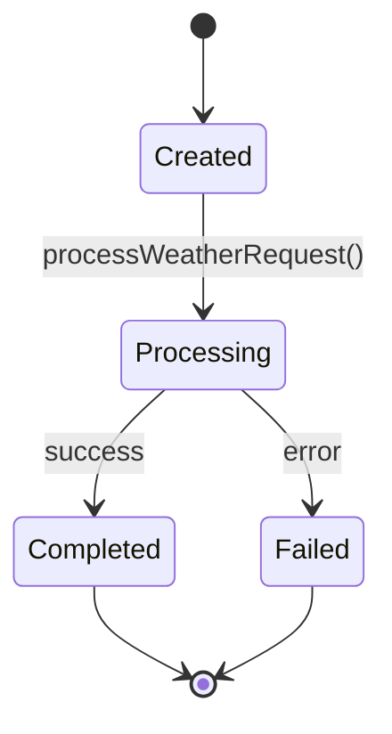
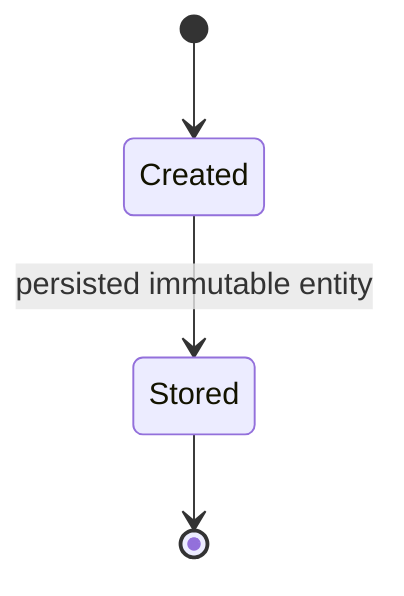
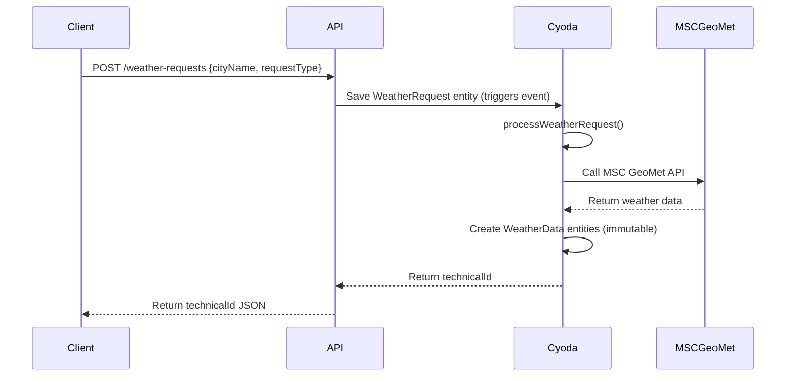
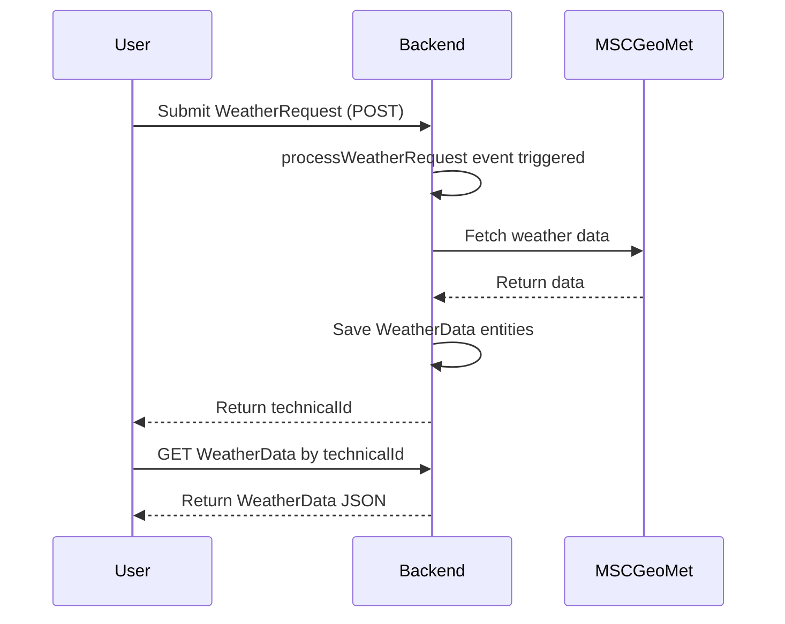

### 1. Entity Definitions
```
WeatherRequest:
- cityName: String (Name of the city to query weather for)
- latitude: Double (Latitude coordinate for location-based query)
- longitude: Double (Longitude coordinate for location-based query)
- requestType: String (Indicates 'CURRENT' or 'FORECAST')
- requestTimestamp: Instant (Timestamp when request was created)

WeatherData:
- weatherRequestId: String (Reference to originating WeatherRequest entity)
- dataType: String (Indicates 'CURRENT' or 'FORECAST')
- temperature: Double (Temperature value in Celsius)
- humidity: Double (Humidity percentage)
- windSpeed: Double (Wind speed in m/s)
- precipitation: Double (Precipitation volume in mm)
- observationTime: Instant (Timestamp of the weather observation)
```

---

### 2. Process Method Flows

```
processWeatherRequest() Flow:
1. Initial State: WeatherRequest entity is created (immutable) with PENDING status
2. Validation: Optional validations on request parameters (e.g., coordinates or cityName present)
3. Processing:
   - Call MSC GeoMet API using parameters in WeatherRequest
   - Parse response to extract weather data (current and/or forecast)
   - For each weather data point, create immutable WeatherData entities linked to the WeatherRequest
4. Completion: Mark WeatherRequest as COMPLETED or FAILED based on success
5. Notification: (Optional) Trigger notifications or downstream workflows if needed
```

---

### 3. API Endpoints Design

| Method | Endpoint                 | Purpose                             | Request Body                | Response             |
|--------|--------------------------|-----------------------------------|----------------------------|----------------------|
| POST   | `/weather-requests`      | Create new WeatherRequest entity, triggers processing | WeatherRequest JSON (cityName or latitude+longitude, requestType) | `{ "technicalId": "uuid" }` |
| GET    | `/weather-requests/{id}` | Retrieve saved WeatherRequest by technicalId | N/A                        | WeatherRequest JSON   |
| GET    | `/weather-data/{id}`     | Retrieve specific WeatherData by technicalId | N/A                        | WeatherData JSON      |
| GET    | `/weather-data`          | (Optional) Retrieve weather data filtered by requestId or other fields | Query params (e.g., requestId) | Array of WeatherData JSON |

---

### 4. Request/Response Formats

**POST /weather-requests**

```json
{
  "cityName": "Paris",
  "requestType": "CURRENT"
}
```

or

```json
{
  "latitude": 48.8566,
  "longitude": 2.3522,
  "requestType": "FORECAST"
}
```

Response:

```json
{
  "technicalId": "uuid-string"
}
```

---

**GET /weather-requests/{id}**

Response:

```json
{
  "cityName": "Paris",
  "latitude": null,
  "longitude": null,
  "requestType": "CURRENT",
  "requestTimestamp": "2024-06-01T12:00:00Z"
}
```

---

**GET /weather-data/{id}**

Response:

```json
{
  "weatherRequestId": "uuid-string",
  "dataType": "CURRENT",
  "temperature": 18.5,
  "humidity": 60,
  "windSpeed": 5.2,
  "precipitation": 0,
  "observationTime": "2024-06-01T11:45:00Z"
}
```

---

### 5. Mermaid Diagrams

**Entity Lifecycle State Diagram for WeatherRequest**


```mermaid
stateDiagram-v2
    [*] --> Created
    Created --> Processing : processWeatherRequest()
    Processing --> Completed : success
    Processing --> Failed : error
    Completed --> [*]
    Failed --> [*]
```

---

**Entity Lifecycle State Diagram for WeatherData**


```mermaid
stateDiagram-v2
    [*] --> Created
    Created --> Stored : persisted immutable entity
    Stored --> [*]
```

---

**Event-Driven Processing Chain**


```mermaid
sequenceDiagram
    participant Client
    participant API
    participant Cyoda
    participant MSCGeoMet

    Client->>API: POST /weather-requests {cityName, requestType}
    API->>Cyoda: Save WeatherRequest entity (triggers event)
    Cyoda->>Cyoda: processWeatherRequest()
    Cyoda->>MSCGeoMet: Call MSC GeoMet API
    MSCGeoMet-->>Cyoda: Return weather data
    Cyoda->>Cyoda: Create WeatherData entities (immutable)
    Cyoda-->>API: Return technicalId
    API-->>Client: Return technicalId JSON
```

---

**User Interaction Sequence Flow**


```mermaid
sequenceDiagram
    participant User
    participant Backend

    User->>Backend: Submit WeatherRequest (POST)
    Backend->>Backend: processWeatherRequest event triggered
    Backend->>MSCGeoMet: Fetch weather data
    MSCGeoMet-->>Backend: Return data
    Backend->>Backend: Save WeatherData entities
    Backend-->>User: Return technicalId

    User->>Backend: GET WeatherData by technicalId
    Backend-->>User: Return WeatherData JSON
```

---

Thank you!