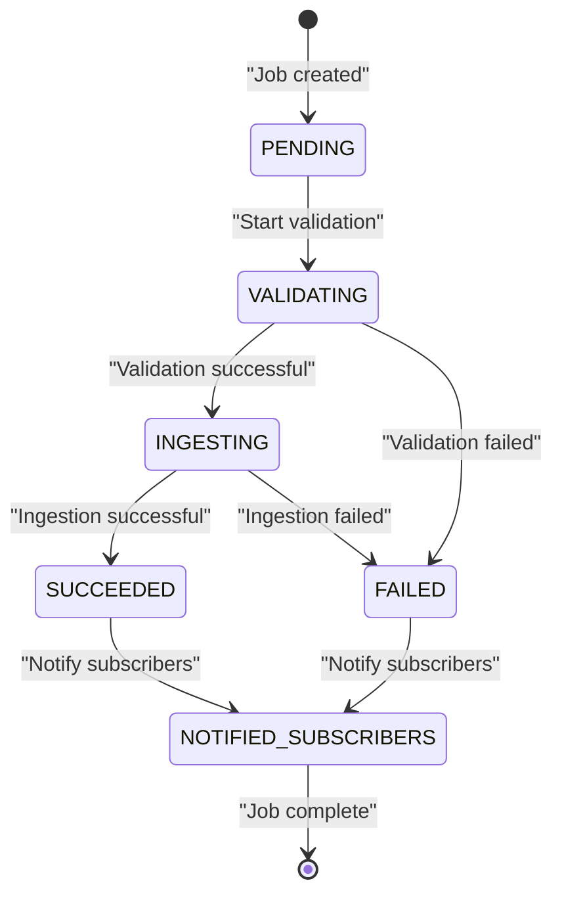
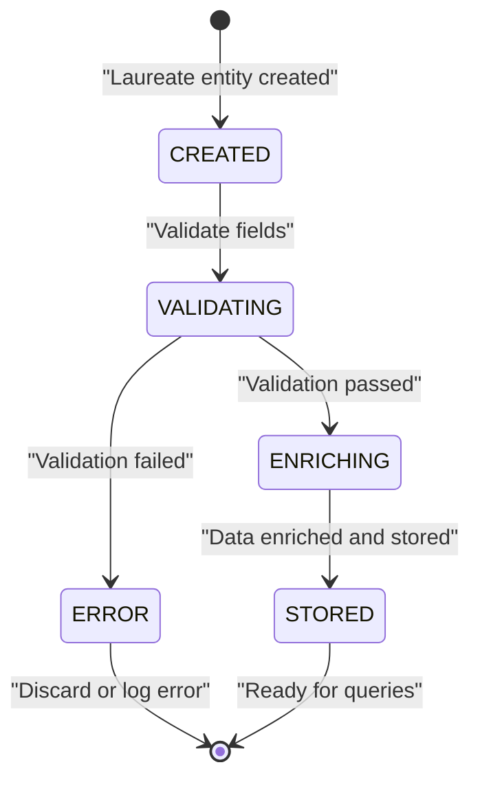
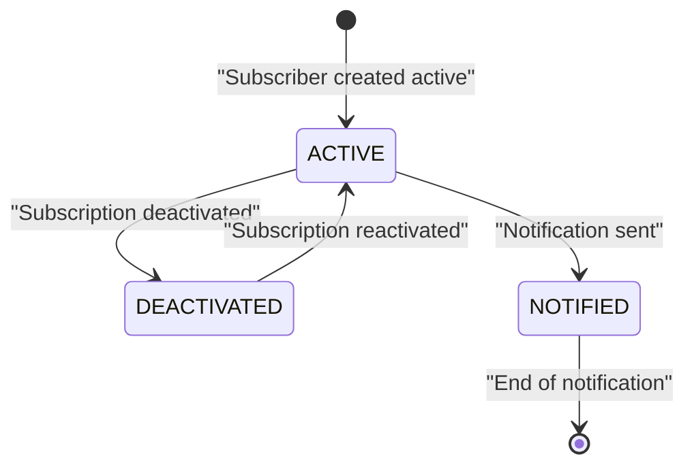
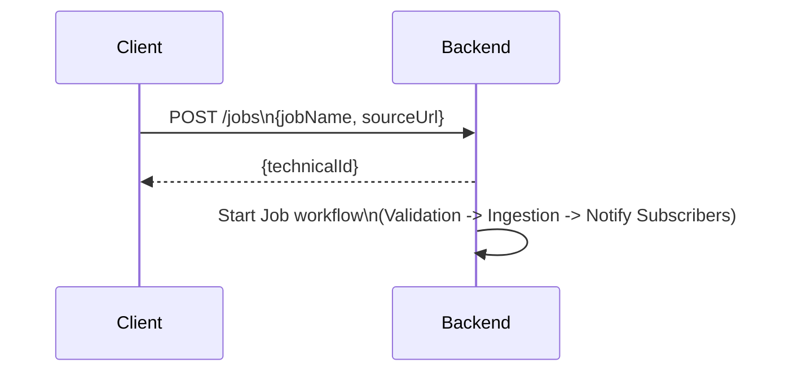
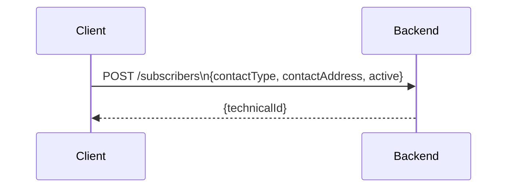
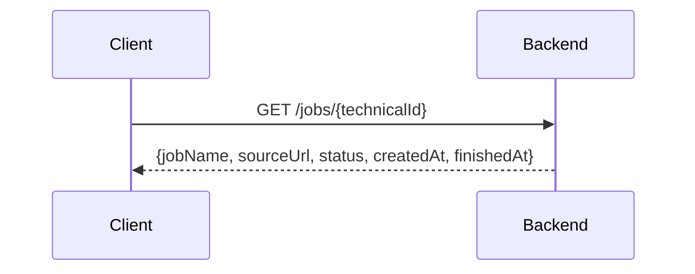
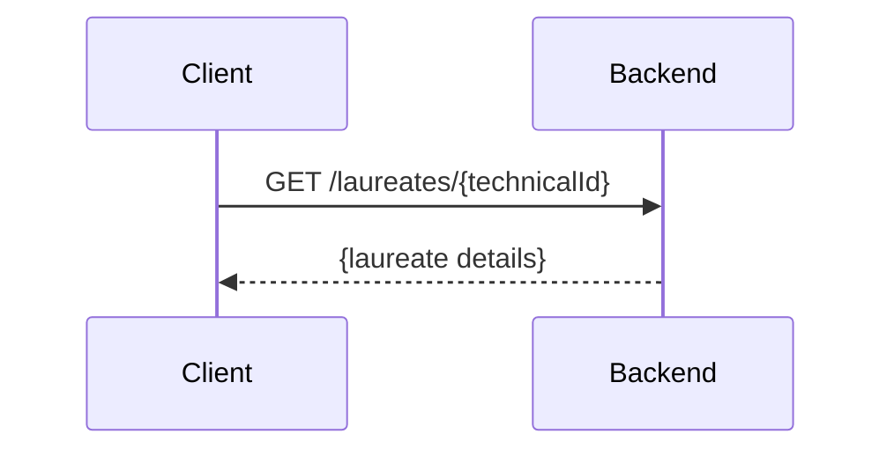
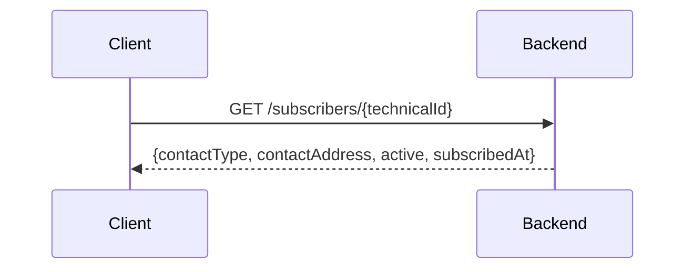

# Functional Requirements

## 1. Entity Definitions

### Job
- jobName: String (Name/identifier of the ingestion job)
- sourceUrl: String (URL of the OpenDataSoft API endpoint)
- status: String (Current job status, e.g., PENDING, INGESTING, SUCCEEDED, FAILED, NOTIFIED_SUBSCRIBERS)
- createdAt: DateTime (Timestamp when the job was created)
- finishedAt: DateTime (Timestamp when the job finished processing)

### Laureate
- laureateId: String (Unique identifier from the source)
- firstname: String (First name of the laureate)
- surname: String (Surname of the laureate)
- born: String (Date of birth, ISO format)
- died: String (Date of death, ISO format or null)
- borncountry: String (Country of birth)
- borncountrycode: String (Country code of birth, e.g., JP)
- borncity: String (City of birth)
- gender: String (Gender of the laureate)
- year: String (Year awarded)
- category: String (Award category, e.g., Chemistry)
- motivation: String (Award motivation text)
- affiliationName: String (Name of affiliated institution)
- affiliationCity: String (City of affiliation)
- affiliationCountry: String (Country of affiliation)
- ingestedAt: DateTime (Timestamp when the laureate was ingested)

### Subscriber
- contactType: String (Type of contact: email, webhook, etc.)
- contactAddress: String (Email address or webhook URL)
- active: Boolean (Subscriber active status)
- subscribedAt: DateTime (Timestamp when subscription was created)

---

## 2. Entity Workflows

### Job Workflow
1. Initial State: Job created with status = PENDING
2. Validation: Validate sourceUrl and jobName presence and format
3. Processing:
   - Fetch laureates data from sourceUrl
   - For each record, create Laureate entity events
4. Completion: Update job status to SUCCEEDED or FAILED depending on ingestion result
5. Notification: Trigger notifications to all active Subscribers
6. Final State: Update job status to NOTIFIED_SUBSCRIBERS


```mermaid
stateDiagram-v2
    [*] --> PENDING : "Job created"
    PENDING --> VALIDATING : "Start validation"
    VALIDATING --> INGESTING : "Validation successful"
    VALIDATING --> FAILED : "Validation failed"
    INGESTING --> SUCCEEDED : "Ingestion successful"
    INGESTING --> FAILED : "Ingestion failed"
    SUCCEEDED --> NOTIFIED_SUBSCRIBERS : "Notify subscribers"
    FAILED --> NOTIFIED_SUBSCRIBERS : "Notify subscribers"
    NOTIFIED_SUBSCRIBERS --> [*] : "Job complete"
```

### Laureate Workflow
1. Initial State: Laureate entity created upon ingestion
2. Validation: Check required fields and formats
3. Enrichment: Normalize fields (e.g., country codes, calculate derived data)
4. Persistence: Store enriched Laureate data for later retrieval
5. End State: Laureate data stored and ready for query


```mermaid
stateDiagram-v2
    [*] --> CREATED : "Laureate entity created"
    CREATED --> VALIDATING : "Validate fields"
    VALIDATING --> ENRICHING : "Validation passed"
    VALIDATING --> ERROR : "Validation failed"
    ENRICHING --> STORED : "Data enriched and stored"
    ERROR --> [*] : "Discard or log error"
    STORED --> [*] : "Ready for queries"
```

### Subscriber Workflow
1. Initial State: Subscriber entity created (active by default)
2. Subscription Management: (Optional) Activate/deactivate subscription via new entity creation
3. Notification: Receive notifications triggered by Job completion events
4. End State: Subscriber notified or subscription updated


```mermaid
stateDiagram-v2
    [*] --> ACTIVE : "Subscriber created active"
    ACTIVE --> DEACTIVATED : "Subscription deactivated" 
    DEACTIVATED --> ACTIVE : "Subscription reactivated"
    ACTIVE --> NOTIFIED : "Notification sent"
    NOTIFIED --> [*] : "End of notification"
```

---

## 3. API Endpoints

### Job
- `POST /jobs`  
  Request:  
  ```json
  {
    "jobName": "Nobel Laureates Ingestion April 2024",
    "sourceUrl": "https://public.opendatasoft.com/api/explore/v2.1/catalog/datasets/nobel-prize-laureates/records"
  }
  ```  
  Response:  
  ```json
  {
    "technicalId": "string"
  }
  ```
- `GET /jobs/{technicalId}`  
  Response:  
  ```json
  {
    "jobName": "Nobel Laureates Ingestion April 2024",
    "sourceUrl": "https://public.opendatasoft.com/api/explore/v2.1/catalog/datasets/nobel-prize-laureates/records",
    "status": "NOTIFIED_SUBSCRIBERS",
    "createdAt": "2024-06-01T10:00:00Z",
    "finishedAt": "2024-06-01T10:15:00Z"
  }
  ```

### Laureate  
*Note: Laureates are created as part of the Job ingestion workflow (no separate POST endpoint)*  
- `GET /laureates/{technicalId}`  
  Response:  
  ```json
  {
    "laureateId": "853",
    "firstname": "Akira",
    "surname": "Suzuki",
    "born": "1930-09-12",
    "died": null,
    "borncountry": "Japan",
    "borncountrycode": "JP",
    "borncity": "Mukawa",
    "gender": "male",
    "year": "2010",
    "category": "Chemistry",
    "motivation": "\"for palladium-catalyzed cross couplings in organic synthesis\"",
    "affiliationName": "Hokkaido University",
    "affiliationCity": "Sapporo",
    "affiliationCountry": "Japan",
    "ingestedAt": "2024-06-01T10:10:00Z"
  }
  ```

### Subscriber
- `POST /subscribers`  
  Request:  
  ```json
  {
    "contactType": "email",
    "contactAddress": "user@example.com",
    "active": true
  }
  ```  
  Response:  
  ```json
  {
    "technicalId": "string"
  }
  ```
- `GET /subscribers/{technicalId}`  
  Response:  
  ```json
  {
    "contactType": "email",
    "contactAddress": "user@example.com",
    "active": true,
    "subscribedAt": "2024-06-01T09:00:00Z"
  }
  ```

---

## 4. Request/Response Flow Diagrams


```mermaid
sequenceDiagram
    participant Client
    participant Backend
    Client->>Backend: POST /jobs\n{jobName, sourceUrl}
    Backend-->>Client: {technicalId}
    Backend->>Backend: Start Job workflow\n(Validation -> Ingestion -> Notify Subscribers)
```


```mermaid
sequenceDiagram
    participant Client
    participant Backend
    Client->>Backend: POST /subscribers\n{contactType, contactAddress, active}
    Backend-->>Client: {technicalId}
```


```mermaid
sequenceDiagram
    participant Client
    participant Backend
    Client->>Backend: GET /jobs/{technicalId}
    Backend-->>Client: {jobName, sourceUrl, status, createdAt, finishedAt}
```


```mermaid
sequenceDiagram
    participant Client
    participant Backend
    Client->>Backend: GET /laureates/{technicalId}
    Backend-->>Client: {laureate details}
```


```mermaid
sequenceDiagram
    participant Client
    participant Backend
    Client->>Backend: GET /subscribers/{technicalId}
    Backend-->>Client: {contactType, contactAddress, active, subscribedAt}
```
