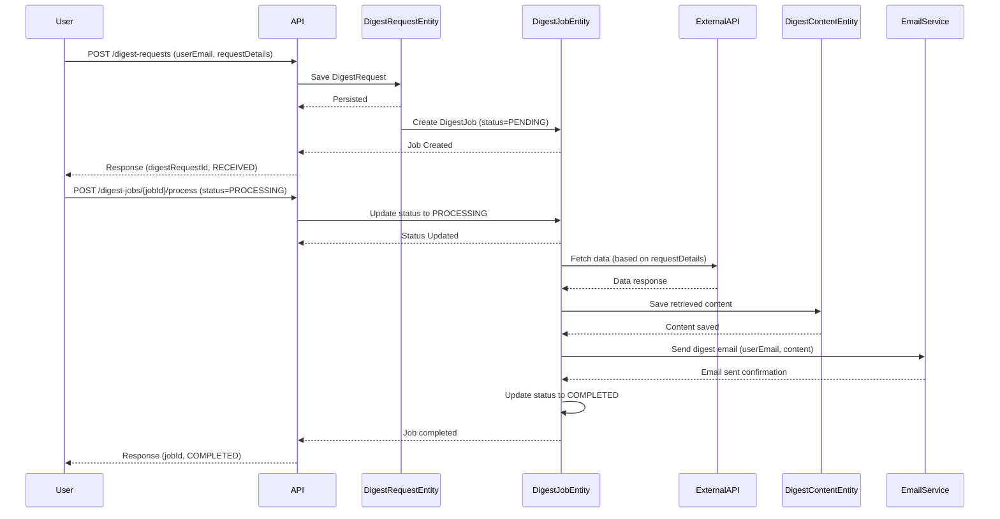

# Functional Requirements – Event-Driven Architecture Approach

## 1. Entities to be Persisted

**Orchestration Entity:**

- **DigestJob**  
  Represents a digest processing job triggered by a new digest request event.  
  Fields:  
  - id (UUID)  
  - userEmail (String)  
  - requestMetadata (JSON or Map)  
  - status (e.g. PENDING, PROCESSING, COMPLETED, FAILED)  
  - createdAt, updatedAt (timestamps)

**Business Domain Entities:**

- **DigestRequest**  
  Represents the incoming digest request event details.  
  Fields:  
  - id (UUID)  
  - userEmail (String)  
  - requestDetails (JSON or Map)  
  - receivedAt (timestamp)

- **DigestContent**  
  Stores the data retrieved from the external API for the digest.  
  Fields:  
  - id (UUID)  
  - digestJobId (foreign key to DigestJob)  
  - content (text/blob)  
  - format (e.g. PLAIN_TEXT, HTML, ATTACHMENT)  
  - createdAt (timestamp)


## 2. API Endpoints

### POST /digest-requests  
- Description: Add or update a DigestRequest entity; triggers creation of DigestJob.  
- Request Body:  
  ```json
  {
    "userEmail": "user@example.com",
    "requestDetails": { "param1": "value1", "...": "..." }
  }
  ```  
- Response:  
  ```json
  {
    "digestRequestId": "UUID",
    "status": "RECEIVED"
  }
  ```

### POST /digest-jobs/{jobId}/process  
- Description: Update DigestJob status (e.g., start processing) and trigger downstream workflows (data retrieval, email dispatch).  
- Request Body:  
  ```json
  {
    "status": "PROCESSING"
  }
  ```  
- Response:  
  ```json
  {
    "jobId": "UUID",
    "status": "PROCESSING"
  }
  ```

### GET /digest-jobs/{jobId}/status  
- Description: Retrieve the current status and results of a DigestJob.  
- Response:  
  ```json
  {
    "jobId": "UUID",
    "status": "COMPLETED",
    "emailSent": true,
    "contentFormat": "HTML"
  }
  ```


## 3. Event Processing Workflows

- **When DigestRequest is persisted:**  
  - Trigger creation of a new DigestJob with status `PENDING`

- **When DigestJob status changes to `PROCESSING`:**  
  - Trigger Data Retrieval from external API based on DigestRequest details  
  - Save retrieved data as DigestContent entity  
  - Trigger Email Dispatch with compiled digest content  
  - Update DigestJob status to `COMPLETED` or `FAILED` accordingly


## 4. Request/Response Formats

Refer to the API endpoints section above for JSON formats. All requests and responses use JSON.

---

## Mermaid Diagram: User-App Interaction & Event-Driven Flow


```mermaid
sequenceDiagram
    participant User
    participant API
    participant DigestRequestEntity
    participant DigestJobEntity
    participant ExternalAPI
    participant DigestContentEntity
    participant EmailService

    User->>API: POST /digest-requests (userEmail, requestDetails)
    API->>DigestRequestEntity: Save DigestRequest
    DigestRequestEntity-->>API: Persisted
    DigestRequestEntity->>DigestJobEntity: Create DigestJob (status=PENDING)
    DigestJobEntity-->>API: Job Created
    API-->>User: Response (digestRequestId, RECEIVED)

    User->>API: POST /digest-jobs/{jobId}/process (status=PROCESSING)
    API->>DigestJobEntity: Update status to PROCESSING
    DigestJobEntity-->>API: Status Updated

    DigestJobEntity->>ExternalAPI: Fetch data (based on requestDetails)
    ExternalAPI-->>DigestJobEntity: Data response

    DigestJobEntity->>DigestContentEntity: Save retrieved content
    DigestContentEntity-->>DigestJobEntity: Content saved

    DigestJobEntity->>EmailService: Send digest email (userEmail, content)
    EmailService-->>DigestJobEntity: Email sent confirmation

    DigestJobEntity->>DigestJobEntity: Update status to COMPLETED
    DigestJobEntity-->>API: Job completed

    API-->>User: Response (jobId, COMPLETED)
```

---

If you have no further changes, this can serve as the finalized functional requirements for your project. Please let me know if you'd like me to help with next steps!