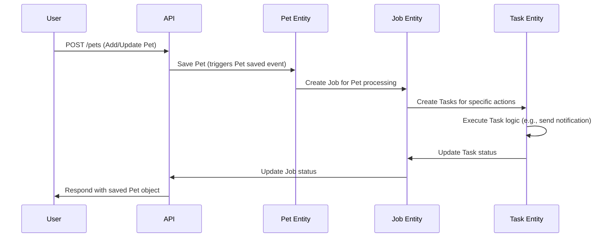
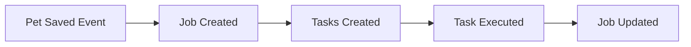
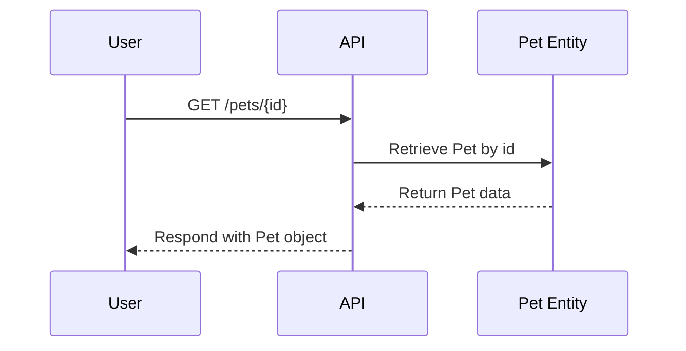

# Purrfect Pets API - Functional Requirements (Event-Driven Architecture)

## 1. Business Entities

- **Job** (Orchestration entity)  
  Represents background processing tasks triggered by pet data changes (e.g., notifications, analytics).

- **Pet** (Business domain entity)  
  Represents the animal in the system with attributes like id, name, type, status, age, etc.

- **Task** (Orchestration entity)  
  Represents smaller units of work within a Job, e.g., sending adoption confirmation or updating pet availability.

---

## 2. API Endpoints

### POST /pets  
- Adds or updates a Pet entity (triggers Pet saved event)  
- Request: Pet data (id for updates, name, type, status, age, etc.)  
- Response: Saved Pet object with assigned id

### POST /jobs  
- Adds or updates a Job entity (triggers Job saved event)  
- Request: Job details (type, status, parameters)  
- Response: Saved Job object with id and current status

### POST /tasks  
- Adds or updates a Task entity (triggers Task saved event)  
- Request: Task details (jobId, type, status, result)  
- Response: Saved Task object with id and status

### GET /pets/{id}  
- Retrieves Pet details by id  
- Response: Pet object

### GET /jobs/{id}  
- Retrieves Job details by id  
- Response: Job object

### GET /tasks/{id}  
- Retrieves Task details by id  
- Response: Task object

---

## 3. Event Processing Workflows

- **Pet saved event** → triggers processing to:  
  - Create a Job to handle pet-related background work (e.g., updating availability)  
  - Create Tasks under the Job for specific actions (notifications, analytics)

- **Job saved event** → triggers orchestration of associated Tasks execution

- **Task saved event** → triggers execution of the specific task logic (e.g., sending emails)

---

## 4. Request/Response Formats

### Example: POST /pets request  
```json
{
  "id": "optional-for-update",
  "name": "Whiskers",
  "type": "Cat",
  "status": "Available",
  "age": 3
}
```

### Example: POST /pets response  
```json
{
  "id": "12345",
  "name": "Whiskers",
  "type": "Cat",
  "status": "Available",
  "age": 3
}
```

---

## Mermaid Diagrams

### User Interaction and Entity Creation Flow


```mermaid
sequenceDiagram
  User->>API: POST /pets (Add/Update Pet)
  API->>Pet Entity: Save Pet (triggers Pet saved event)
  Pet Entity->>Job Entity: Create Job for Pet processing
  Job Entity->>Task Entity: Create Tasks for specific actions
  Task Entity->>Task Entity: Execute Task logic (e.g., send notification)
  Task Entity->>Job Entity: Update Task status
  Job Entity->>API: Update Job status
  API->>User: Respond with saved Pet object
```

### Event-Driven Processing Chain


```mermaid
flowchart LR
  PetSavedEvent["Pet Saved Event"]
  JobCreated["Job Created"]
  TasksCreated["Tasks Created"]
  TaskExecuted["Task Executed"]
  JobUpdated["Job Updated"]
  
  PetSavedEvent --> JobCreated --> TasksCreated --> TaskExecuted --> JobUpdated
```

### User Querying Data


```mermaid
sequenceDiagram
  User->>API: GET /pets/{id}
  API->>Pet Entity: Retrieve Pet by id
  Pet Entity-->>API: Return Pet data
  API-->>User: Respond with Pet object
```

---

If you want to start quickly, you can use:

```
I want to manage Pets as the main business entity, with Jobs and Tasks as orchestration entities for background processing. I prefer POST endpoints for create/update triggering events and GET endpoints for retrieving Pet, Job, and Task details.
```